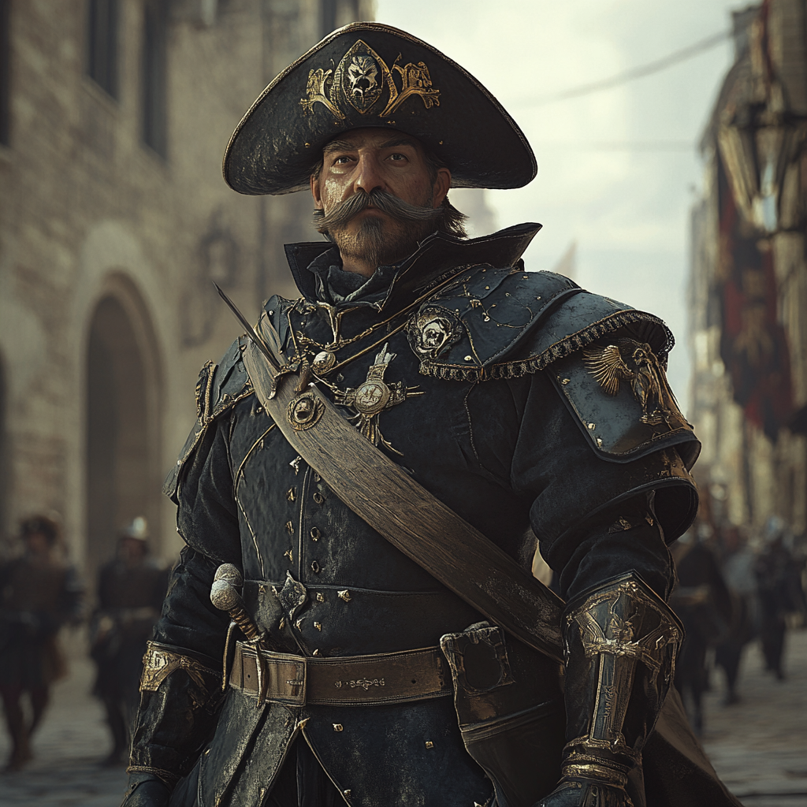
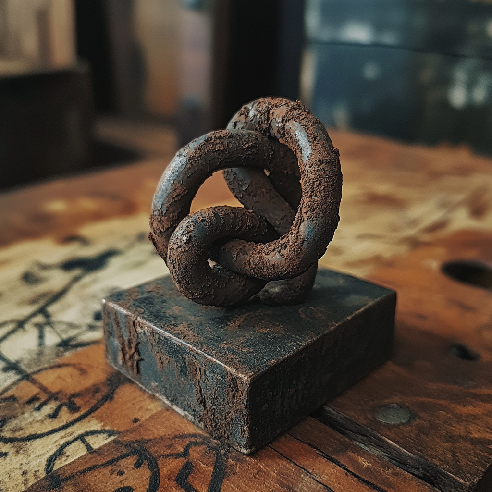

# Prológus

## Session \#1 - \#2: A kiképzés

**10037 a Táncoló medve éve, május eleje**

A party minden tagja ilyen-vagy-olyan okból jelentkezik a Griff-házba. Mindenkit felvesznek (plusz egy Hans nevű harcost (?) és egy Rogen nevű rogue-ot). Egy hónapon keresztül megy a kiképzés. Közben a hercegség készül **Panorea hercegnő**, a herceg lánya és **Bonafir “Bonaz” Omathyr**, a Fóka-sziget shareni származású uralkodójának fiának esküvőjére. Ami évközép napján van (ami egy extra nap június és július között). Harm vs Alex: Alex rácsap Harm seggére, aki megfenyegeti, hogy legközelebb eltöri a kezét. Alex nem ijed meg, flegmán kezeli, a végén a monk visszavonul.

**június 6.**

A kiképzés után a veteránok próbára teszik a csapatot. Hajnalban kifutnak a **Szárny** nevű hajóval és észak felé veszik az irányt. Közben kiszúrunk a távolban egy hajót, ami a **Démonhát** felé tart.

A célunk a **Szellem-sziget** volt, ahol megkapjuk a feladatot: keressük meg a romokat, derítsük fel és találjunk meg benne “valamit”.

A part mellett közvetlenül erdő fekszik, de Ryel megtalálja a veteránok nyomait (**Kozma** és **Aeden** kivételével előre mentek), azokat követve megtalálunk egy romos kisebb erődöt. Óvatosan bemerészkedünk, kicsit két részre osztva a partit, de nem elég figyelmesen: farkaspókok lepnek meg minket, csúnyán lesebezve Harmot és Ulrichet is.

## Session \#3: A beavatás

- A pókok és darazsak legyőzése utána kinyitottuk a csapóajtót, ami után elvileg egy halálos csapda aktiválódott, ami semmit nem csinált. Négyen lementünk és találtunk egy puzzle-t, amit Arachis megfejtett. Ezzel a próbát teljesítettük is, a veteránok elégedettek voltak velünk. Visszafelé úton megláttuk a hajót, ami odafelé a **Démonhát** felé tartott, most viszont már előttünk volt és haladt Hűvöskő felé. A veteránok szorgalmi feladatként feltettek egy kérdés, hogy hogy derítenénk fel a hajó miféle és hova tart. Itt több ötlet volt, Ulrich ötletei tetszettek nekik a legjobban, illetve Arachis és Alex ötleteire bólogattak még. A kikötőben **Kozma** elvitte Harmot és Arachist **Ordo**hoz, a kikötőmesterhez, ahol Arachis jól kommunikálva kiderítette, hogy a hajó ide már nem érkezett meg, és nem is haladt el - északabbra köthetett ki, valószínű **Razzidoc**-ban. Utána néhányan megünnepelték a sikeres próbát (van aki kicsit túlságosan is, khm Alex).

  **június 7.**

  Másnap délután volt a beavatás, itt volt mandanéz mazsolapezsgőzés, lelki beszéd, illetve megjelent **Orion**, a herceg legkisebb fia, aki meglepetésünkre réz fokozatú Griff-ház tag. Évek óta nem járt otthon, most a nővére esküvőjére jött haza hivatalosan.

- A Griff-ház létezése három pilléren áll:

  1.  összetartás

  2.  lokálpatriotizmus (politikától függetlenül)

  3.  együttműködés a hatalommal, törvények betartása (még ha nem is értünk vele egyet)

- **Tori Sandro** utána egy rituáléval beavat, elmondjuk az esküt, miszerint **hűségesek leszünk a Griff-házhoz és a bajtársainkhoz benne. És megőrizzük a ház titkait.** Kapunk egy acél griff érmét is, ezzel már beléphetünk a titkos föld alatti központba, bár csak az első részébe. Itt is egy csomó tudás van, Arachist és Ulrichot el is veszítjük itt. Egy gourmet vacsora és némi szocializálódás után alvás van (Harm nem alszik a többiekkel, egyszer csak már nincs ott). Azt is megtudjuk, hogy úgy lehet feljebb lépni a rangsorban, ha:

  \- három azonos szintű tag hajtja végre a rituáliét, aki **azon a szinten van**, ahova a jelölt fel akar lépni

  \- egy olyan szintű tag hajtja végre a rituálét, aki **azon szint feletti szintű**, ahova a jelölt fel akar lépni (pl. ha réz szintre akar fellépni a jelölt, akkor legalább bronz szintű)

  \- az nem tiszta, hogy ha nincs magasabb szintű tag, akkor hogy lehetne feljebb lépni (erre **Orion** sem tudta a választ)

**június 8.**

- Másnap reggel **Wilder** első feladatnak azt mondja látogassuk meg **Borges Mattus** kapitányt, a tengerész gyalogosok vezetőjét és osszuk meg vele amit megtudtunk a hajóról. Ezt megtesszük, a kapitány figyelmesen meghallgat minket, majd hívja **Motta** tizedest, és megkérdezni csilingelnek-e a harangjai ezt hallva. Motta elmondja, hogy az utóbbi időben a kikötőben érdeklődnek arról, hogy mostanában volt-e a **Démonhát**nál hajótörés és voltak-e túlélők. Erre Alex megrendülten előadja, hogy ő ott szenvedett hajótörést. Viharba kerültek, majd eltévedtek. A navigátoruk sem állhatott a helyzet magaslatán, nekiment egy szirtnek és elsüllyedtek. Azt nem tudja mit szállítottak a hajón. Szegény srácot nagyon megviselte még az emlékképek felidézése is.

# Chapter 1

- 

## Session \#4: Mezuppi nyomában

- Több ötletünk volt hogy kit keressünk meg azzal kapcsolatban, hogy ki keresheti az **Orion** hajóroncsát és a túlélőket. Harm csak egy személyleírást kapott egy idősebb, egyik lábára sánta, közepesen jól öltözött figuráról. Ararchis ügyesebb volt, beszélt **Ordo**-val és megtudta a nevét: **Mezuppi**. Valószínű egy ügyeskedő middle-man. A többség ellátogatott a **Részeges sügér**be is, de egyelőre **Guzman**, a halász aki megmentette Alexet nem volt ott. Hazafelé a vámház oldalát éppen sikálták segédmunkások a városőrök felügyelete mellett, mert valami garázda alakok felfestették rá, hogy *"Shareniek menjetek haza!"*. Ebéd, kis szuszó és koraeste visszatérés a **Részeges sügér**be. Megtaláljuk **Guzman**-t, akit Alex alaposan megizzaszt, ki is szedi belőle, hogy már elmondta **Mezuppi**nak amit tudott Alexről (ami a személyleírása, amúgy hamis nevet ismer). Annyit megtudunk róla, hogy **Alsórákos**ban lakik (ami a szegény rákhalászoknak a lakhelye - szokatlan választásnak tűnik). Rövid vita után három részre szakadunk, Ryel megfigyeli a Sügért, de nincs szerencséje, nem jár arra **Mezuppi**. Arachis és Ulrich visszamennek a HQ-ra, beszélnek Aedennel. A dalnok ismeri a nevet, tudja hogy valami kisebb shady figura, de ennél többet nem tud. Közben Alex, Harm és Joli elmennek alsórákosra, Alex beszél egy halásszal, megtudjuk hogy a sor végén lakik egy nagyobb házban, családja nincs, viszont vannak "munkásai" bármit is jelentsen ez. Úgy tűnt üres a ház, egy ideig tanakodtunk, hogy betörjünk-e, de aztán úgy döntöttünk az első napon még nem csinálunk ilyet. Összefoglalva úgy tűnik **Mezuppi** valaki megbízását teljesíti, tudja Alex személyleírását és vannak emberei.

## Helgior verse

- 

<table>
<colgroup>
<col style="width: 100%" />
</colgroup>
<thead>
<tr>
<th><ul>
<li>
From the island, where the gods gnash their teeth

And storms roar down on unforgiving seas,

Helgior the Barbarian, the warrior bold,

Sailed through mists on waves harsh and cold.

His was an axe, forged from ancient stars,

Runes carved deep by long-dead sires,

A weapon that cleaved both spirit and bone—

It thirsted for battles yet unknown.

Then came a whisper on the roaring wind:

A tale of Hűvöskő, cursed and pinned

Beneath shadows that choked the light of day,

Demons roamed, turning all to decay.

So to the island Helgior sailed,

Through storm and rain, his courage prevailed.

Upon Hűvöskő’s shores, with fury he stepped,

And the people cheered, their fears swept.

The House of Gryphon, heroes renowned,

Had fought for years, yet gain little ground,

Against the demons from the abyssal deep,

A twisted horde that none could keep.

Helgior took up his mighty axe,

And joined their ranks with no looking back.

With each demon slain, his legend grew,

As shadows fled and morning dew

Bathed the stones in dawn’s red light,

By the House of Gryphon he stood to fight.

When the Demon Lord rose with fire and shriek,

Helgior struck him down in the deadliest peak.

Now, in Hűvöskő’s hall, his name is revered,

A tale of strength, his path cleared.

With the House of Gryphon he chose to remain,

Helgior the hero, in valor and fame.​
</li>
</ul></th>
</tr>
</thead>
<tbody>
</tbody>
</table>

- 

## Session \#5: Alex és a Véres Oltár

**június 9.**

- Alex coming outja, elmondja mindenkinek a teljes igazságot. Hajótörése után egy zátonyszigetre ki tudott úszni, ahol a vihar elől egy barlangban próbálta meghúzni magát. Sokként érte, hogy a barlangban ott találta a kapitányt és az első tisztet vérbe fagyva holtan egy oltár-szerű képződmény előtt. Vélhetően egymással harcoltak és halálosan megsebesítették egymást. Alex megpróbálta megmenteni a kapitányt, de már halott volt. A keze viszont véres lett a művelet során, és a borzalomtól hátra tántorodva az oltárnak támaszkodva próbálta egyensúlyát megőrizni. Abban a pillanatban szörnyű víziók törtek rá rémséges túlvilági szörnyekkel és eszméletét vesztette. A tengerben sodródva ébredt tudatára, ott találkozott szerencsésen a **Korall Királynő**vel és kapitányával, **Guzman**nal, akik megmentették. Később Alex felfedezte, hogy különös képességei lettek. A party viszonylag jól fogadta, Arachis tudományos kíváncsiságát keltette fel. Ryel megnyugtatja, hogy segítenek kiűzni belőle a démont, ha szükséges. Harm azon gondolkozott, hogy az eskü amit tettünk vajon erre is vonatkozik-e. Alex frászt hozza Harmra amikor a fejében szólal meg a hangján. Megegyezünk abban, hogy ezt titokban tartjuk.

  Ezután áttérünk a tervezésre, némi vita után abban maradunk, hogy Alex itt marad a HQ-n biztonságban, a Arachis, Ulrich és Joli elmegy találkozni **Mezuppi**val a **Részeges sügér**ben (az üzenetet egy utcagyerekkel küldtük el, akinek a neve **Capelló**. Rövidlátó, de jó a memóriája). Ryel és Harm is ott lesz, de külön. A találkozó este van, addig Joli beszél Brentulis-szal, aki elmondja, hogy ha elérnek Arachis-szal egy szintet, akkor csatlakozniuk kell a varázskamarához. Ami viszont kapcsolatokat és erőforrásokat is jelent számukra. Harm már megint külön utakon jár, de ő is beszél valamiről Wilderrel és Brentulis-szal.

  Többiek olvasgatnak és találnak egy két érdekes összefüggést. 180 éve volt egy kb. évtizedes időszak, amikor a hercegséget egy démonidéző elfoglalta. A volt Griff-szigeten áldoztak foglyokat a démonoknak, ezek tértek vissza szellemként és tették azt Szellem-szigetté (ami a mai formája). A Griff-ház sokat vesztett akkor, mind feljegyzései, mind relikviái közül rengeteg eltűnt (ezért nem teljesen ismert a céh múltja). Ekkor tűnt el **Helgior** baltája is (amit Ulrich keres), vélhetően **Emilio "Az Arany" Hariri**, a démonidéző egyik alvezére vitte el amikor a vereséget már látva lelépett a kincstárral.

  Este eljön a találkozó, Arachis megint ügyesen forgatja a szavakat és meggyőzi **Mezuppi**-t (aki nem tűnik nem erre számított, hanem valami pitiáner alkura), hogy cserébe olyan információkért, amiket úgy tudunk amúgy is tud (Alex személyleírása) elmondja, hogy **Jingo Loba**, egy zömök, Hulk Hogan bajszos, széles fejű fickó bízta meg. Mikor távoznak Ryel kiszúrja, hogy két fickó feláll az asztaltól és követi őket. Gyorsan úgy döntenek Harm figyelmezteti a többieket míg Ryel marad figyelni **Mezuppi**-t.

  **Mezuppi** némileg vitatkozik az embereivel, aztán úgy döntenek majd mesélnek **Jingo Loba**-nak a találkozóról ha legközelebb találkoznak.

  Közben a többiek Harm figyelmeztetése után inkább egy kocsmába mennek, a **Tékozló Bivaly**ba. Joli itt álcázza magát egy törpe kocsmárosnak, kimegy és sikeresen eltereli a két fickó figyelmét (mondván hogy segítsenek sört pakolni neki 1 ezüsttért). Közben a többiek megpróbálnak kilopózni, de hát nem nagyon ügyesek benne. Joli egy altatás varázslattal megmenti a helyzetet, ami után hősiesen ki is raboljuk a szerencsétlen rákhalászokat.

  Estére mindenki visszatér a Griff-házba és megosztjuk egymással a történteket és új tervet kovácsolunk.

## Session \#6: Joli a mi betörőnk

**június 10.**

Infó több forrásból, hogy a **Yanney** shareni család egy nagy hajóval kikötött **Razzidoc**-ban, hogy új szerződést kössön a város uralkodójával. Ami nyilván 30 évre előre lefoglalja a hüvöskő exportot, fillérekért eladják természeti kincseinket 😠

Ryel az Ezír templomba megy (kötelezettségei vannak ott), de megígéri, hogy utána néz a démoni inváziónak ott is.

Ulrich, Alex, Arachis és Harm elmennek **Motta** tizedeshez, hátha ő tud valamit **Jingo Lobá**ról, és tényleg tud. Homályos emlékei vannak, hogy a Portán pár éve gyilkossági ügybe keveredett, illetve Caputelben meg talán vérdíj is van a fején. Megígéri, hogy küld levelet Caputelbe, és ad egy contactot a Portába: **Bartosz** őrmestert, aki többet tud majd mondani. De ő most küldetésen van 3-4 nap múlva tudjuk meglátogatni csak. Visszatérünk a HQ-ra, Harm megint tesz egy kitérőt valahova.

Közben Joli magán akcióba kezd, *Disguise self*-el álcázza magát, és odamegy Mezuppi házához megfigyelni. Némi nehézségek árán bár, de sikerül az őrkutya és az őr figyelmét is elterelnie és oda settenkedni a házhoz. Itt **Mezuppi**t alvás közben találja, és meglát egy köpenyt, amit *Mage hand*del magához hoz és talál benne egy kulcsot. A köpenyt visszarakja oda, ahonnan elvette. Azt is látja, hogy van bent egy láda, és a kulcs minden bizonnyal bele való. Azonban nem kísérti tovább a szerencséjét és visszatér a HQ-ra ő is.

Elhatározzuk, hogy sötétedés után visszamegyünk mindannyian és megpróbálunk bejutni, kinyitni a ládát és megnézni mit találunk benne.

Arachis ehhez szerez csónakot, mindenki szerez olyan ruhát, aminek van csuklyája, hogy elrejtsük a kilétünket, ha meglátnának.

## Session \#7: Kalóz halála

Nem megy flottul a terv. Ryel előre megy felderíteni, de **Kalóz** a kutya kiszúrja. Előjön két ember is. Ryel fényekkel elcsalja őket, közben a többiek türelmetlenkednek és közelebb jönnek. Jolit valahol elhagyjuk a sötétben. Még egy ember előjön. Alex magánakcióba kezd és a thugok fejében kezd turkálni.

*Flashback: Harm elmegy Wilderrel a város szélére, ahol Wilder pókot idéz, Harm hagyja magát megharapni és felébred benne a ki. Flashback vége.*

Azok megijednek és visszavonulnak a házba, ahol Joli is járt. Előrébb jövünk, Ryel egészen előre, Alex és Arachis kicsit lemaradva, Harm felmászik a tetőre. Kijön egy nagyobb darab fickó egy bunkósbottal a kezében. A helyzet gyorsan eszkalálódik, Ryel és Arachis is megsorozza, de jól bírja. Ryelt több találat éri és összecsuklik. Harm a tetőről leugorva kiüti a nagydarab fickót. **Kalóz** elkezdni megrágni Arachis csizmáját, Alex egy *Eldrich Blast*tal megöli 😢 Ezt látva a minionok menekülőre fogják. Ezután egy elég kaotikus jelenet jött, ahol Harm stabilizálja Ryelt és ordibál a többieknek hogy segítsenek cipelni, Alex megy a ládáért (talál benne egy csapdát, egy egyelőre ismeretlen tartalmú csomagot és egy potion-nek látszó tárgyat), Arachis követni kezdi a menekülőket és talál a házban egy paravánt, ami mögött egy barlang van a hegy oldalában. Joli megjelenik a csata végével. Tanácstalanul nézünk egymásra, hogy mi legyen a folytatás.

## Session \#8: Egy Csomó rejtély

Némi döntésképtelenség után nem megy be senki a paraván mögé, hanem visszavonulunk a HQ-ba. Aiden, Wilder, Hans és Rogen ott vannak. Érdeklődve kérdezik mi történt. Harm vs Alex: Harm mérges **Kalóz**, a kutya halála miatt. Alex pökhendi módon kezeli. A többiek többé-kevésbé semlegesek, a veteránok csak azt kérdezik embert öltek-e meg, és miután azt nem, ezért megnyugodnak. Sokkal jobban érdekli őket, hogy találtunk-e valamit. Alex megpróbálja titokban tartani a csomagot, de Harm elárulja. Ezután előkerül a csomag és a figyelem arra irányul. A fókabőr csomagolásra Harm megjegyzi, hogy biztos “mocskos” sharenieké volt, azok vadásznak fókákra. Mindenki izgatottan lesi az asztal körül, ahogy Harm kinyitja a csomagot. Van benne egy térkép:

![[partylog-session-8-egy-csomo-rejtely-1.png]]

A térkép mellett egy papírba csomagolt tárgy. A tárgy egy lánc-szerű rozsdás fémtárgy:

![[partylog-session-8-egy-csomo-rejtely-2.png]]

A papír csomagolásra olvashatóan oda van írva, hogy “padlás”. Alex felismeri a térképet, hogy a kapitánya kezében látta! Aiden megvizsgálja a láncot, megszagolja, kénes szaga van. Beugrott neki a következő történet: a démonidézőnek volt egy rejtekhelye, ami nem ezen a világon van és a neve “**Az Abbys-i csomó**”. Ez egy börtön és egy kincstár is egyben, ott lehetnek a Griff-háztól csákmányolt tárgyak is. A lánc szemei fájdalmasan és kaotikusan fonódnak össze, legalábbis ezt az érzést keltik bennünk (a továbbiakban “**Csomó**”). **Jingo Loba** adta **Mezuppi**nak a csomagot, amiben ez volt. Megjön Kozma, ad egy csókot Harmnak (úgy látszik ez már official). A **Csomó**t nem ismeri fel. Viszont elkezdi nézni a térképet… Amit Alex is néz és abban a pillanatban újra átéli a hajótörés azon részét, amikor egy hordóba kapaszkodva a viharban egy szigetzátonyra próbált kievickélni. A villámok fényében meglátta pont ugyanazt a két hegycsúcsot, ami a térképen is szerepel.

Megérkezik Brentulis is, aggódva nézi a **Csomó**t. Megerősíti Aiden gyanúját. Gyorsan kimond egy detect magicet, a potion, amit találtunk *water breathing*, a **Csomó** viszont nem mágikus. Viszont Brentulis érez rajta egy hatást, hogy valamikor érintette mágia. Talán egy kulcs lehet valami mágikus ajtóhoz? Régebbi lehet mint a démonidéző ideje, 1000-1500 éves.

Aiden azon kezd el gondolkozni, hogy hogyan kerülhetett egy ilyen ikonikus tárgy **Mezuppi**hoz? Furcsa.

Alex elmondja, hogy a térképen szereplő szigeten szenvedett hajótörést.

Közben Ulrich vezetésével megpróbáljuk kiolvasni a térképen lévő szöveget. Ez a legjobb tipp:

Vizsla két hegycsúcs, távolról pókcsáp…

Romok a szigeten…

Barlang a romok alatt…

Szentély a barlang végén…

X….

A … a szentélyben…

Az éle… vérét a…

**június 11.**

Ulrich talál utalást a könyvében az “**Abbysi csomó**ról”, hogy oda vitték a foglyokat és a zsákmányt. Közösen megtalálják a szigetet, ami a **Vizsla** néven ismert. Egy un. Vizsladémonról lett elnevezve, aki egy félelmetes pókszerű démon. A információk alapján ott lehet a bejárat az **Abbysi csomó**ba és a **Csomó** a kulcs hozzá.

Innen gyorsan eszkalálódnak a dolgok, a Hercegség megbízást ad a Griff háznak, hogy felderítse a helyet. Az összes jelenlévő tag (veteránok + újoncok) mennek másnap, még hajnal előtt kifutunk a tengerre.

Addig

- Harm reggel hazamegy, de estére visszatér és még elmegy a **Pelikán**ba, ahol találkozott **Gallo**val, aki elmondta, hogy megkereste egy DKSZ-i fickó egy érdekes ajánlattal. Ha Harm nyitott rá, ha elég elkötelezett az ügyért ahhoz, hogy valami nagyobb akcióban is részt vegyen. Harm rábólint, hogy persze!

- Alex be van zsongva, alig várja, hogy odaérjen. De azért este elmegy egy kocsmába és berúg.

- Joli és Arachis tanul Brentulistól

- Ryel meditál, lelkileg felkészül

- Ulrich tovább olvas és próbálja megfejteni a térképet

**június 12.**

Kifutunk a tengerre.

## Session \#9: Vizsla armageddon

Beszélgetés a hajón: ez most egy kisebb megbízás, 200 arany a jutalom, ezt egyenlően osztjuk el egymás között. Óvatosan navigál a Szárny a szirtek között, de biztonságban odaérünk és lehorgonyozzuk a hajót. Csónakba szállunk, Kozma és Rogen maradnak a hajón. Az egyik csónakba Hans megy a veteránokkal, a másikba a party. Még mielőtt kikötnénk az egyik szirtről egy madár raj száll fel… egy részük a veteránok felé indul, három madár meg felénk. Jobban megnézve nem is madarak, hanem denevér szárnyas emberi fejek 😱 Sikító hangjuk megbénítja Arachist és Harmot is, de szerencsésen legyőzzük őket sebesülés nélkül. Harm mantrája (de közben elcsuklik a hangja): *“O supreme lord, free me from unreal and lead me to reality, keep me away from darkness and lead me to light, lead me away from fear to enlightenment, may there be peace, peace, peace.”* (commonul mondja, csak magyarul bénán hangzik).

Veteránok is legyőzik a démoni teremtményeket, Hans megsebesül, de nem vészesen. Elmondják, hogy ezek ismert démoni lények, veszélyes a sikolyuk, ami megbéníthat és utána a “csókjuk” halálos tud lenni, és az áldozatot hasonló lénnyé alakítja át.

Kikötünk a csónakokkal, látjuk is a barlang bejáratát. A veteránok elmondják, hogy ők bemennek a barlangba, mi meg maradjunk kint őrködni. Bemennek. Alex azonban nem bír maradni, elindul a barlang felé, hogy jobban megismerhesse mi is történt vele. Ulrich megy vele. Némi vitatkozás és habozás után némileg lemaradva Harm is elindul. Hans és Arachis marad a csónaknál. Ryel és Joli feljebb másznak hogy jobban belássák a környéket. Meg is látják a hajóról feléjük integető Kozmát, aki aztán beugrik a vízbe és elkezd a part felé úszni. Joli meglátja, hogy ekkor **Rogen** éppen kiszáll a vízből a parton. Valamiért kiúszott… Vajon milyen hátsó szándéka volt eddig? Harm elindul, hogy eléje vágjon. Alex visszafordul és csatlakozik Joliékhoz. Ulrich csatlakozik Arachishez. Ekkor az egész sziget megremeg, csontvázak másznak ki a föld alól Arachis mellett és támadnak! Meg is lepik a csapatot, Arachis és Hans azonnal elesnek. Nehezen bár, de legyőzzük őket. Ulrich és Harm is sérüléseket szenved. Ryel meggyógyítja annyira Arachist, hogy talpra tudjon állni. Hansot bekötözi Ulrich. Közben Kozma is kiúszik a partra, Joli küld neki egy message-et kérdezve mi történik. Kozma azt mondja **Rogen** egyszer csak beugrott a vízbe. Áruló lenne? Ekkor újra megremeg a sziget, de most még sokkal erősebben. A két hegycsúcs leomlik, a sziget közepe pedig beomlik! És … cliffhanger.

# Chapter 2

## Session \#10: Fussatok bolondok!

Armageddon! Az egész sziget megrázkódik, a hegyek leomlanak, a közepe beomlik, az egész sziget elkezd süllyedni. Közben elkezd kitörni egy vihar, esni kezd ami a felszálló porral egyeledve sáresőt okoz. A látótávolság erősen lecsökken. Alex észreveszi, hogy a sziget közepéről két tucat szárnyas-emberfejű-démon száll fel. Szerencsére azok is menekülnek, elszállnak felettünk. Hans bepánikol.

Menekülőre fogjuk, mindenki elindul a csónakok felé. Kivéve Harmot, aki valamiért mintha lefagyott volna. Ryel segíteni próbál neki. Először Harm ellöki, de aztán összeszedi magát. Közben Alex már majdnem a csónakhoz ér, amikor az iszapból egy kéz nyúlik ki és legnagyobb rémületére megfogja a lábát! Egy zombi mászik ki az iszapból és támad. Alex felismeri benne az egyik matróztársát… Kicsit arrébb Jolit lepi meg egy másik zombi. Ryel imádkozik Ezírhez, a szent szimbólumából fény kezd el áradni, amit a zombik nem bírnak. Arachis tovább támadja Joli zombiját, aki ennek hatására leküzdi a félelmét. Joli úgy tűnik megöli, de amikor odalép, akkor kiderül a zombi még mozog. Végül sikerül megsemmisíteni, Alex zombija pedig elmenekül Ezír fénye elől. Beszállunk mind a csónakokba. Az egyik csónakban Ulrich és Alex evez és küzd az elemekkel a másikban Harm egyedül. Ennek ellenére mindkét csónak sikeresen elér a hajóra, mindenki épségben átszáll. A csónakokat itt hagyjuk.

De még nem menekültünk meg, közben kitör a vihar és a hajóval ki kell navigálni a zátonyok között úgy, hogy csak 7 emberünk van a normálisan 12 fős legénység helyett.

Alex megragadja a kormányrudat és a kapitányi posztot is (telepatikus képességeinek az üvöltő viharban jó hasznát veszi). Joli az orrba megy és figyeli a zátonyokat. Ryel és Hans felhúzzák a horgonyt. Ulrich és Arachis bontják ki az oldalvitorlákat. Harm teljesen elkészült az erejével, de pár perc alatt eléggé öszeszedi magát ahhoz, hogy Arachisnak segítsen a kötelekkel. A csapat a halál árnyékában nagyon fókuszált, sikerül a zátonyok között kihajózni.

Utána viszont elfáradnak, talán kicsit túlságosan is megnyugodnak és elkezdenek hibázni. Alex elkezd bizonytalankodni. Arachist és Ryel is sérüléseket szenved a viharban. Joli elnéz egyet az utolsó zátonyok közül és a hajó sérülést szenved, elkezd beömleni a víz.

Mindenki összeszedi az utolsó erejét, Ryel és Hans úgy-ahogy befoltozzák a hajótest sérülését, a többiek kezelik az árbócot, Alex összeszedi magát. Kijutunk a viharból.

Visszanézve a **Vizsla**-szigetnek már nincs semmi nyoma.

Joli keres és talál egy jóféle rumot, amit szétosztunk egymás között.

A hazaút is fárasztó, folyamatosan merni kell a vizet ki a hajóból, csak lassan tudunk haladni. A Hüvöskőt körbevevő zátonyokat szerencsére Alex jól megfigyelte (kétszer is elhaladtunk egy ponton), keresztül tud navigálni.

**június 13.**

Így is csak hajnalra érünk vissza a Callindali kikötőbe.

A túlélés öröme mellett valahogy rossz érzésünk van. Lehet valami nagy baj történt a szigeten? Alexnek megmagyarázhatatlan hiányérzete volt a **Vizsla**-szigettel kapcsolatban. Mintha valami nem lett volna most már ott, ami a hajótörésnél még ott volt…

## Session \#11: Apokalipszis után

Megsebesülve és teljesen kimerülve az alvás nélküli folyamatos munkától megérkezünk az éppen ébredő Callindalba. A halászok már árulják a portékájukat, a városlakók munkába indulnak. A csapat egy része még mindig nem tudja elhinni, hogy mi történt. Némi vitatkozás után három csapatra oszlunk.

Alex és Joli foglalkoznak a hajóval. Megtalálják **Florakis**t, akit már látásból ismernek és megegyeznek vele, hogy kb. 100 aranyért kijavíttatják a hajót vele. Kér előleget, amit nem tudnak kifizetni, de Alex meggyőzi, hogy ne kelljen mégsem. Alex visszafelé elmondja Jolinak, hogy a zombik akikkel küzdöttünk a szigeten a volt matróztársai voltak. Joli odaadja a **Szárny** hajónaplóját Alexnek.

Ryel és Arachis megpróbálják elérni **Orion**t, mint az egyetlen magasabb rangú Griff-ház tagot. Sajnos mint kiderül nincs a városban. De az őrök megígérik, hogy amint visszatért szólnak neki, hogy keressen meg minket a bázison. Arachis a fáradtság ellenére hazamegy aludni.

Ulrich, Hans és Harm visszamennek azonnal a bázisra pihenni. Harm vészjósló tekintettel odaveti Hansnak, hogy pihenés után beszélnünk kell.

Késő délután van, mire felkelünk.

Harm vs Hans + Alex: Harm kifakad Hansra amiért pánikba esett: “gondolkozz el azon, hogy neked való-e ez a munka” meg ilyeneket mond. Hans hebeg-habog, bocsánatot kér, motyogja, hogy “élőhalott fóbiája” van, láthatóan megfélemlítve. Alex közbeveti, hogy Harm is lefagyott amikor az Armageddon megkezdődött, aki ezt tagadja (de közben elvörösödött a feje). Alex odaveti Hansnak, hogy takarítson ki. Nem jó hangulatban kezdődik a megbeszélés. Alex elmondja most már mindenkinek, hogy a zombik a szigeten a matróz társai voltak. Végül arra jutunk **Borges Mattus**-hoz elmegyünk elmondani mi történt. Ulrich marad átkutatni a könyveket.

A százados szerencsére nincs épp máshol, tudunk vele beszélni. Valamiért Harm kerül az előtérbe aki némileg zavartan, aztán a többiek segítségével, de végül kicsit szépítve de elmondjuk az igazságot. Sokkolja a hír, és szomorúnak tűnik. Megkérjük, hogy segítsen nekünk. De abban nem tud segíteni nekünk, hogy ő küldjön oda embereket, hiszen pont azért fogadnak fel kalandozó céhet, mert túl veszélyes a katonáknak odamenni. De megszán minket, és felajánlja, hogy fenntartja a szerződést a küldetésről, sőt ad 150gp előleget (ebből legalább a hajót ki tudjuk fizetni). Azt is megígéri, hogy próbál szerezni legénységet a hajóhoz. Hazafelé Alex és Harm megint összeszólalkoznak (a viharban a fedélzeten történeken).

Utána elmegyünk a **Florakis**hez megnézni a hajót, ahol egy rossz ízű alkudozás következik, a végén senki nem boldog. Lehet többet nem fog nekünk dolgozni.

Ekkor már este van, visszamegyünk a bázisra. Ulrich közben olvasgatott és a következő információkat szedte össze:

- évközép napjára a veteránok a “Griff-szigeten” (most már Szellem-sziget ugye) “szokásos” tisztogatást terveztek

- talál két megbízást “elküldjük az újoncokat?” cetlivel gemkapcsozva. Az első a Pelikán-szírt nevű helyen lévő faluból jött, hivatalos megfogalmazásban, Tori Sandronak címezve. A bányában gyanús hangokat hallottak. Még nem történt semmi, de felkérnek a kivizsgálására. Aláírás **Elrani**.

- a másik közvetlenebb levél Wilder-nek címezve. Feladója Wilder hittársa, **Dushku**, a Kailano-szigetről. Nem részletezett szörny probléma.

- egy említés, hogy megtalálták a kincses térképet **Félszarvú Gonzó** kincséhez! A térkép persze nincs a bejegyzés mellett. Mint kaland lehetőség van megemlítve. De már 1 éves, talán messze van?

- **Wasco** és csapata (a középső csapat a Griff-házban) a “zöld misszióra” ment el, ami a **Zöld könyv**ben van részletezve. A könyvet az alagsor következő részében látjuk, de az általunk el nem érhető részen. Hasonlóan több a céh történetét tartalmazó krónikás könyvvel, amiket Ulrich eddig is hiányolt.

Joli megvizsgálja a mágikus gátat, és megállapítja, hogy az egy *Wall of force*. Semmi nem hatol át rajta, de normális esetben teleportálni át lehet rajta. Találunk még acél griff medálokat, szóval elvileg tudunk új tagokat toborozni. Bár sokat aludtunk, de így is nagyon fáradt mindenki. Lefekszünk aludni. Harm sokáig fekszik ébren a franciaágy bal felén, mozdulatlanul bámulva az üres oldalt mellette.

**június 14.**

Következő programokban egyeztünk meg:

- a társaság egy része elmegy a Portára megkeresni **Bartosz** őrmestert, információkat szerezni **Jingo Lobá**ról

- másik része megpróbál utána nyomozni **Rogen**nek. Felkeresni a barátnőjét, akiről annyit hencegett. Hans lehet egy kiindulási alap.

- átkutatni a veteránok lakrészét (itt meg lett előlegezve, hogy 200gp-t és 2 *healing potion*-t találunk- könyvelve).

## Session \#12: Hol vagytok kurvák, csempészek?

A csapat tagjai változatos módon kezelik az átélt traumát. Hansot láthatóan megrázta. Harm tagadásban van. Arachis kudarcnak tartja ami történt, de praktikusan áll hozzá, a jövőre koncentrálva. Ryel is fókuszált próbál maradni, kicsit előbbre tolva a hűvösebb elf énjét. Joli bukásnak éli meg és frusztráltan érzi magát. Alexet érintette meg legkevésbé, sőt őt feldobja, hogy tényleg valami nagy dolog volt a szigeten, és ő ennek a részese. Ulrichról semmit nem tudunk leolvasni.

Némi egyeztetés után abban egyezünk meg, hogy három csapatra oszlunk: az egyik elmegy a Portára **Bartosz** őrmesterhez, a másik utána nyomoz **Rogen**nek, a harmadik pedig marad a bázison kutatni.

El is indulnánk, mikor belefutunk a szomszédunkba, **Peppo Bolton**-ba. Aggódva kérdezi, hogy igaz-e a pletyka, hogy a veteránok eltűntek. Ararchis (meggyőződésével szemben) azt mondja neki, hogy ne aggódjon, túlzók a pletykák.

**Joli & Harm:** irány a Porta. Szerencsésen belefutnak **Twigetti**-be, aki a helyi gnóm kisebbség egyik tagja, Joli ismeri. Szívesen elvisz minket a Portára ingyen és vissza is hoz. Az utazás alatt Harm beszélgetést kezdeményez Jolival. A Portára érve az erődbe mennek azt tippelve (helyesen), hogy **Bartosz** őrmester ott lesz. Meg is találják, sikerül vele szót váltani.

![[partylog-session-12-hol-vagytok-kurvak-csempeszek-1.png]]

Először lenéz rájuk (egy gnóm és egy nő), de aztán hamar sikerül elérni, hogy komolyan vegye őket. Emlékszik **Jingo Lobá**ra, másfél-két éve egy piti orgyilkos halála miatt merült fel a neve egy nyomozásba, amibe az őrmestert is bevonták. A nevére nem emlékszik, talán Görény vagy Patkány volt? Nem biztos benne, hogy meg akarták ölni, inkább úgy tűnt csak megfenyíteni. Voltak szemtanúk, akik látták őket együtt inni. A városőrség el is akarta fogni, de nem találták meg. Keresték a hajót, amivel érkezett és távozott, de nem találták meg. Már többször járt a Portán előtte is, valamennyire ismert alak volt. **Bartosz** tippje az, hogy egy illegális hűvöskő csempész tagja, akik a nagy sziget déli felén lévő barlangokban rejtőznek. Úgy tűnik az őrmester jobban élvezi a kihallgatást, mint kéne. Harmot is méregeti. A lányt kicsit ki is rázza a hideg tőle. Az erődöt elhagyva több kocsmában is megfordulva megpróbálják kideríteni az orgazda nevét, Joli sikerrel jár, **Patkány Coster**-nek hívták.

**Arachis & Alex**: Arachis fel tudta idézni (más nem nagyon figyelt **Rogen**re), hogy a csajának neve **Rebenna** és **Rogen** sokszor aludt nála. Emlékezett a helyre is: az **Éneklő hold** nevű kocsma-bordélyban dolgozik a lány. Arachis beszéde Alexhez: “a suttyóságból vegyünk vissza”, mármint amikor az **Éneklő Hold**ba mennek. Korán mennek oda, még nincs nagy élet. Arachis beszél a kidobóval, először csak azt látja rajta, hogy komor lesz **Rebenna** nevét hallva, köntörfalazni kezd, hogy “nem lehet vele pár napja beszélni”. De Arachis ügyesen kikövetkezteti, hogy **Rogen** miatt szomorú a lány. Felmutatja a kidobónak a Griff-ház szimbólumot, megtudják hol keressék **Rebenná**t. Arra is utal a kidobó, hogy lehet már nem lesz teljesen józan. Arachis-ék vesznek egy is üveg édes bort hátha segít. Megtalálják Rebennát a közelben egy padon ül és a tengert bámulja, kisírt szemekkel és egy üveg félig üres borral.

![[partylog-session-12-hol-vagytok-kurvak-csempeszek-2.png]]

Fiatalabb a vártnál, csak kb. 16-17 éves. Alex előadja, hogy ő volt Rogen legjobb barátja, és (hamis) reményt próbál táplálni a lányba, aki nem igazán hisz neki. Amit **Rebenna** elmond, abból számukra összeáll, hogy **Rogen**t megihlette Alex története, és ő maga is az oltár nyomában volt. Hatalmat akart, és kalóz kapitány akart lenni. Kérdezte **Rebenná**t, hogy jönne-e vele. Meg is ígérte neki, hogy elveszi. Amit elmond, az alapján úgy tűnik inkább, hogy Rogen azért szerette a lányt (bár talán kevésbé mint fordítva), és előttünk csak előadta magát. Nem nagyon sikerül megvigasztalni, és ha már így alakult a bort is megtartják Alexék. Mikor már elindulnának Rebenna utánuk szól: “**Soto**”. Mikor kérdően ránéznek hozzáteszi, hogy “a kalóz kapitány, akit **Rogen** mindig emlegetett”.

**Ulrich & Ryel**: kutatás, Ryel találja meg a pénzt és a *healing potion*-öket. Ulrich tovább olvas. Az elmúlt 100 évből sok minden van az elérhető könyvekben, de vannak hézagok. Különböző krónikások változó stílusban jegyzeteltek, van aki nagyon vázlatosan. Aki nagyon hasznos, az **Gustovo** aki nagyon részletesen jegyzetelt. Több utalás van az ő jegyzeteiben a múltra.

Jobban utánanéz a kaland lehetőségeknek is:

- a Pelikán-szírtnél nem fognak sokat tudni fizetni

- a Kaliano-sziget küldetést még az esős időszak előtt meg kell oldani

Ulrich keres könyvelést is, de nincs igazán rendes könyvelés. Csak a kalandok díja és a nagyobb kiadások. Mint kiderült mi takarítottunk eddig.

Akik kimentek az utcára érzik, hogy sajnálkozóan, szomorúan megnézik őket az utcán.

## Session \#13: Visszatérés a Vizsla-szigetre

Este még megosztjuk egymással az információkat. Harm azonosítja a **Soto** nevet **Soto Durant** hírhedt kalóz kapitánnyal, aki a démonokkal lepaktálva tett szert mágikus hatalomra, amit kalózkodásra használ. Félelmetes, gonosz figura.

**június 15.**

Ryel és Arachis megnézik hogy halad a **Szárny** javítása. Elkészült, minden rendben van. Harm még korán reggel elmegy, meglátogatja a mesterét, aki új fogásokat tanít neki.

Rajta kívül mindenki más együtt elmegy **Borges Mattus**hoz. Szerzett nekünk embereket:

- **Alto Orec**: navigátor, Kozma barátja. Láthatóan neheztel ránk.

- **Niary**: palotaőr a szigeten, Tori Sandro volt a mestere, azért is jött.

- **Christer Hennix**: volt őr, most szabadúszó ács (de sok mindent elvállal). Van 2 kis gyereke, Wilder gyógyította meg őket egyszer, mikor nagyon megbetegedtek, azóta lekötelezettje. Azzor követő.

- **Aunder** és **Aduran Dalibor**: testvérpár, ők a pénzért vannak itt.

20 gp / fő díjban egyezünk meg. Ryel javít valamit a csapat megítélésén **Alto Orec** szemében.

**június 16.**

Hajnalban elindulunk a Démonhát felé. Az út hosszú, és bár folyamatosan dolgozni kell mindenkinek, van lehetősége közben beszélget. Alex **Alto Orec**-cel próbál szocializálódni, de nem igazán sikerül a hangot megtalálni vele. Kicsit vissza is rontja a csapat renoméját az eredeti szintre. Harm és Ryel Ezírről beszélgetnek meg Délkapuról és a DKSZ-ről. Kiderül Ryel azért jött el onnan, mert túl sok kompromisszumot kellett kötnie, nem érezte, hogy a gonosz elleni harcnak az a módja neki való. Elmondja, hogy ott igazi vadkapitalizmus van, minden csak a pénzről szól. Harm hozzáteszi, hogy itt is egyre inkább ez történik, majd szídni kezdi a kereskedő államokat (Sharent és a DKSZ-t). Később Alex és Harm megint veszekedni kezdenek, Ryel próbálja csillapítani őket.

Végül megérkezünk a Vizsla-szigethez, amit elég nehezen találunk meg, mivel az egész szigetből egy 20-30 méter átmérőjű szikladarab maradt. A víz alatt valamennyire látni a többi részét is, de nagyjából teljesen elsüllyedt az eredetileg 1 km átmérőjű kis sziget. A csónakokat keressük, de csak fadarabokat látunk, amik lehetnek hajóroncsokból is. A csapat beszáll az egy szem csónakba és odamegy. A szikla teljesen üresnek és kihaltnak tűnik, látszik, hogy frissen alakult, növényzet még nincs rajta. Harm felhajtja a *potion of water breathing*-et és a vízbe veti magát. Arachis és Joli is érzik, hogy a mágikus szövet fel van bolydulva itt, kényelmetlen érzésük van. El is kezdik vizsgálni a mágikus teret. Alex megint azt érzi mint legutóbb, hogy valami ami első alkalommal itt volt az már nincs itt, bármi is legyen az. Ryel nyomokat keres és talál: emberi méretű nyomok, de mintha egy láb méretű kéz lenne, úszóhártyával. Valami kijött a vízből fél-egy napja majd visszament. Nem is egy, hanem több valami. A nyomok alapján Alex sahugain-okra tippel, azonnal riadóztatja a többieket, hogy ideje lelépni innen.

Közben Harm megtapasztalja, hogy a *water breathing* nem egy kellemes élmény, át kell élnie, hogy a víz a tüdejébe megy. Elkezd körbe úszni a sziget körül. A sziget maradványai a víz alatt szétnyúltak, de még nem “álltak be”, mozognak a sziklák kicsit. Nem talál semmit nyomot a veteránokról. Viszont meglát a látóhatára szélén egy emberszerű alakot a vízben. Vagyis nem is egy, hanem kettő. Közeledni kezdenek… Harm pánikszerűen kimászik a vízből, görcsös köhögéssel szabadul meg a tüdejében lévő víztől mire nagy nehezen sikerül kinyögnie, hogy valami van a vízben és készüljön mindenki. Közben a többiek már a csónaknál vannak.

## Session \#14: Uszonyatos csata

Hamar eszkalálódik a helyzet, a sahuaginok, körbe-körbe úsznak a sziget körül, cserkésznek be minket. Aztán egy pillanatban támadtak, több oldalról, taktikusan. Ryelt sajnos meglepik, közelharcba keveredik kettővel, és bár az egyiket súlyosan megsebesíti a túlerő végül legyőzi. Túl közel volt a parhoz, jobb lett volna, ha amennyire lehet magaslati pontot foglalt volna el. A hosszúkard túl nehéz volt neki, talán hatékonyabb lenne egy könnyebb és fürgébb penge a kezébe. Ulrich sokkal jobban állta a sarat, megvetette a lábát és három ellenféllel szemben is bírta a csapásokat és osztotta is rendesen, nem sikerült megtörni. Arachis szerencsésen elkerülte az első támadást (kellemetlen lett volna ha megszigonyozzák), aztán próbált középre tömörülni a többi varázshasználóval és ontotta magából a sebző varázslatokat. Joli hasonló taktikát folytatott, őt jobban kipécézte magának az ellenség, hálót dobtak rá, kapott a halember-warlock (halrock) varázslatából is. Jó ötlet volt az illúzió a halrock ellen, kár, hogy addigra már elmenekült. Ő eléggé megkeserítette az életünket, előbukkant a vízből, idézett egy nagyon hasonló varázslatot, mint amit Alex szokott. Majd visszacsobbant a vízbe. Elmenekült mikor látta hogy legyűrtük őket. Alex átkozódott (*hex*) és tolta az blastokat is, a végén különösen jól sikerült az egyik, szinte felrobbantotta az egyik szigonyost vele. A halrock ellen nem volt fegyvere viszont, saját fegyverével ütötték ki. Harm próbálta védeni a varázshasználókat, ami nagyjából sikerült is, látványosan elkapta a levegőben az egyik rádobott szigonyt is, aztán Ryelbe töltött egy *healing potion*t, mikor az összeesett. Az utolsó sahuagint azután is ütötte, hogy az már meghalt. Ryel meggyógyította Alex-et. Vajon mennyire egyezett a halrock varázslata Alex-szével? A szigetet is át lehetne még vizsgálni mágikus szempontból.

## Session \#15: Lesújtó lelet

Azt hittük már vége a csatának, de Joli még kiszúrja, hogy a halrock nem ment el, Ryel közelebb megy, két nyílvesszőt is beleállít, aztán Harm belevágja a zsákmányolt szigonyt, a partra húzza és kiüti. Még egy sahuagin életbe maradt, teljesen ésszerűtlenül blood frenzyben egyedül támad és Ryelt megint eszméletlenre harapja, Ulrich végzi ki. Joli és Alex közben csak próbálnak kikászálódni a hálóból. Arachis ezalatt rituális mágiával egy *detect magic*-et varázsol. A sziget körül csak azt érzékeli, hogy a mágia szövete itt különbözik a szokásostól (de nem azt jelenti, hogy sugárzik itt a mágia, csak egyszerűen más). Mágiát nem talál, kivéve Ulrichnál, mintha a könyve amit lapozgatni szokott, az mágikus lenne. Aztán elkezd a szigeten körbe menni, és a víz alatt pár méter mélyen valami mágikusat talál. Harm teljesen elkészült az erejével a csata alatt, de mostanra kissé összeszedi magát és oda úszik (még a *potion of water breathing* hatása él). Talán egy vízi növényekbe csomagolt tárgyakat, amiket odaad a többieknek, és tovább kutat a víz alatt. A csomag tartalmaz egy mágikus amulettet egy fél kagylóból hullámok vannak belevésve, 2 potiont, egy gyöngyöt és néhány értéktárgyat, és egy… pisztolyt, amiben Alex felismeri az **Orion** hajó kapitányának fegyverét. A halrocknál volt egy furcsa démon medál ismeretlen szimbólummal.

Harm nem talál semmi mást a víz alatt, viszont amikor lejár a potion és visszatér meglátja az amulettet, először lesokkolódik, majd szó nélkül komoran érte nyúl és a nyakába akasztja (Kozmáé volt, aki sosem vette le). Ezután elvonul egy sziklára magányosan.

A többiek Alex telepatikus képességének hála ki tudják vallatni a halrockot. A tárgyakat a vízben találták már, nem tudja mi történt igazából a veteránokkal, se élve, se holtan nem látta őket. Mégis azt mondja, hogy az emberek olyan erőkkel játszadoztak, amit nem tudtak uralni, és ennek következménye volt a Vizsla-armageddon. Ulrich kivégzi végül.

Beszállunk a csónakba és elindulunk visszafelé. Arachis észrevesz 3-4 uszonyt a vízben, amik felénk tartanak. Felpörgetjük a csapásszámot az evezésben és visszajutunk a hajóra. Úgy tűnik nagytestű cápák, a viselkedésük szokatlan, még a **Szárny** körül is ott maradnak, egy darabig követnek minket. Valószínű a sahugainok irányítják azokat. Végül leszakadnak. Ryel, bár nagyon fáradt, de kíváncsisága erősebb, újra előveszi a medált, és most már egyértelműen megállapítja, hogy kaotikus a mintája, démoni eredetű. További vizsgálat még kideríthet többet róla. Harm érdeklődése **Alto Orec**-től Kozma esetleges képességeiről, ami megmenthette volna. Mindenki szomorú. **Alto Orec**-nek a **Fekete Hattyú**-ban lehet üzenetet hagyni.

Estére érünk vissza a bázisra, Ryelt támogatni kell. Ott vár egy tengerész, bemutatkozik, a neve **Barakat**, részvétet nyilvánít. Majd közli, hogy egy üzenetet hozott **Razzidoc**-ból. Fizetünk neki 6 ezüstöt és átvesszük (összehajtogatott papír vízhatlan borításban). A kimerült és sebesült Ryelt és Alexet a kényelmes francia ágyba fektetjük Harm szobájában. Harm elvonul aludni Ryel fekhelyére. A két varázsló és Ulrich kibontják a levelet, ami nyilvánvalóan titkosírással van írva. Még egy ideig próbálkoznak a feltöréssel, de nem egyszerű a kódja, mindenki fáradt, végül ők is lefekszenek aludni.

## Session \#16: Hogyan tovább?

**június 17.**

Harm harapós hangulatban ébred. Többeknek csak most esik le, hogy Hans nem fog már visszajönni. Ryel, Arachis és Harm elmennek **Borgus Mattus**hoz, elmondják neki mi történt, ő is szomorú. Kifizeti a 100gp-t, ami a díjból hátravan. Visszaindulnak, de Harm és Ryel is külön utakra megy.

😠 *Harm gyászfeldolgozása*

Elmegy az **Éneklő Hold**ba **Rebenná**t keresve, meg is találja. Leül mellé és megfogja a kezét: elmondja neki, hogy a **Démonhát** egyik szigetére mentek felderíteni, és a sziget elsüllyedt amikor Rogen rajta volt. Elmondja neki, hogy milyen bátor volt **Rogen**, hogy a szigeten a vízbe vetette magát, és egyedül elindult az álmait követve. Elmondja azt is neki, hogy ez nagyon buta is volt, amit keresett nem volt ott, ha a hajón maradt volna megmenekül. Elmondja neki, hogy talán nem is buta volt, csak nem tudott ellenállni a hatalom igézetének. Elmondja neki, hogy indiszkrét volt, kéretlenül és részletesen beszámolt nekünk az intim együttlétekről vele. Elmondja, hogy **Soto Durant**, akit említett egy démonokkal lepaktált hírhedt kalóz, aki rémtetteiről híres. Ha ő volt a példaképe, akkor **Rogen** minden bizonnyal amorális, és bárkit és bármit feláldoz a céljai eléréséhez, ahogy egy jó ember így is odaveszett miatta (együttérzőből egyre inkább vádaskodóvá válik a monológ, közben öntudatlanul, de egyre jobban szorítja a kezét). *“Szóval szárítsd fel a könnyeidet, mert **Rogen** halála napja a te szerencsenapod volt. Ha sikerrel jár, és elmentél volna vele, eldobott volna téged, feláldoz vagy odaadott volna a matrózainak.”* - erre **Rebenna** elsírja magát, ami felébreszti Harmot, elengedi a kezét, feláll, zavartan elköszön és menekülésszerűen távozik. Már hazafelé mardosni kezdte a bűntudat (és túllép a gyász dühös fázisán, jöhet az alkudozás).

😇 *Ryel felfegyverkezik*

Először felkeresi **Torri Hatto**-t, a törpe fegyverkovácsot a **Kirogi** negyedben. Megmutatja neki a pisztolyt, de a törpe csak csóválja a fejét. Utána **Gazza**-t a hadsereg fegyverkovácsát kérdezi meg. De ő sem ért a lőfegyverekhez. Rapírja sem volt egyiknek sem. A gnómokhoz küldik el, azok értenek az ilyen műszaki dolgokhoz. Visszamegy a bázisra, megkéri Jolit hogy segítsen neki. Együtt mennek el az **Északi Pont vendéglő**be. Ez egy gnóm fogadó. Szerencsésen ott találják **Flibbidus Starriwynckles**-t, aki a **Elevátor** karbantartója (ez egy lift a vízszint és az város északi része között, nem messze a fogadótól). **Flibbidus** mágus és mérnök is. Ugyan nem képzett a lőfegyverekben, de érdeklődve nézi, és elvállalja a kitisztítását, megpróbál hozzá szerezni lőport és lövedéket is. Joli is jól elbeszélget vele. Visszafelé eszébe jut, hogy a vegyesboltban is megpróbálhatna rapírt keresni, közel a bázishoz a kikötőben. Ennek tulajdonosa **Doxiátus Fiala** mandanéz származású világpolgár (kulturálisan DKSZ-i inkább), az egyik láda alján talál egy rapírt, ami nem szép, de működik, megköttetik az üzlet.

✉️ *Kódfejtés*

Eközben a többiek megpróbálják megfejteni a kapott levelet. Egyelőre nem sikerül, aztán megjön Harm, és felfedezi, hogy az asztalon van egy könyv, amire senki nem nagyon figyelt (**Nabuno Pharan** “A XIV. légió pusztulása” c. drámája, Nagy Császársági, nagyon régi, nagyon pozitívan állítja be a latinokat, mindenki más benne barbár. Azóta van több átirata, ami ezt árnyalja, de ez az eredeti). Lapozgat benne és kiszúrja, hogy az egyik oldalon nyílik ki magától a könyv. El is kezdi mondogatni, hogy a könyvnek valami köze lehet a kódfejtéshez. Alex beleköt, hogy ugyan miért is lenne, elkezdenek veszekedni. Harm közben lerakja a könyvet, Arachis-nak pedig mégiscsak szöget üt a fejében. Ki is próbálja, és úgy tűnik a levél elején egy olyan kód van, ami megad a könyv adott oldala alapján egy betűhelyettesítő kulcsot. Amíg a többiek veszekednek egyszer csak Arachis bejelenti, hogy megfejtette a levelet:

*“*

*Tisztelt Sandro Mester!*

*Megpróbáltam utánanézni a kéréseinek, és a következőket sikerült megtudnom: a hajó ami az adott napon elhagyta a kikötőt észak felé, majd még aznap este visszatért, valószínűleg a **Hullamcsók** nevű naszád volt. Ez az **Arvanxik** birtokában van, de a kérdéses időpontban amikor kifutott a kikötőből, a szemtanúk sharenieket láttak a fedélzetén, és láttak egy olyan férfit is, akire ráillik a személyleírás amit küldtél.*

*Baráti üdvözlettel*

*Chicaro*

*”*

A személyleírás minden bizonnyal **Jingo Lobá**ra vonatkozhat.

🧱 *Erőfal*

Ezután megpróbálnak a varázstudók bejutni a lezárt részbe. Arachis és Joli is megpróbálkoznak egy *Misty step*-pel, semmi hatása nincsen. Joli a lépcsőt is kicsit kibontja, de az lesz a konklúzió, hogy *Wall of force* védi gömb alakban és a helyváltoztató varázslatok ellen is védve van. **Orion** ma sem jelent meg a bázison. Este megbeszélés, felmerül, hogy van-e aki ki akar lépni mint Hans, de nincs ilyen. Utána némi vitatkozás mi történjen, végül úgy döntenek az “Átkutatni a bányát a Pelikán-szirtnél” küldetést másnap megnézik, az itt van a szigeten, nem is nagyon messze.

🍷*Harm bocsánatkérése*

Harm utána este megint távozik, előtte megkéri Ryel-t, hogy menjen el bocsánatot kérni **Rebenná**tól a nevében. Egy üveg bort is küld fájdalomdíjként. Ryel beleegyezik, de visszakérdez, hogy nem akar-e Harm személyesen elnézést kérni, de persze nem tud (egyelőre) szembenézni **Rebenná**val.

## Session \#17: “Megdöglesz!”

Este Alex elmegy kibérelni egy bárkát, elég ügyesen is alkuszik, első nap 5gp, minden további nap 3gp díjért talál. Nekünk már azt mondja 5gp minden nap, a különbözetet azonnal el is issza. **Villogó Szatír** a hajó neve.

**június 18.**

Reggel Joli korán kel, hogy kisüsse a *find familiar* varázslatát, egy cuki kis lilás-rózsaszínes enyhén átlátszó baglyot idéz. Palinak nevezi el. Harm kagylót szed reggel. Elindulunk, Alex kicsit be van lökve, Harm össze is szólalkozik vele. De azért biztonságban elvezeti a hajót. Harm intelmei a csatákról útközben, a harc három alapszabálya: “*Elsőnek támadj, keményen üss, nincs kegyelem!*”. Megérkezünk a Pelikán szirthez.

Az egész falu kíváncsian összegyűlik a parton mikor érkezünk. Találkozunk **Simut**tal, aki a levelet küldte. Arachis beszél vele, “a Griff-ház vezetése ismeretlen helyen tartózkodik” mondja, ami után **Simut** aggódni kezd. Meginvitál minket a faluházba. Hoznak nekünk enni-inni, közben elmondják mi a problémájuk.

Év elején kezdődtek a problémák, kisebb vadállatok szétvágott-hasított holttestét találták meg rendszeresen (de úgy tűnik a gyilkos nem ette meg azokat). Akik odamentek, azok ijesztő hangokat, démoni kacajt, időnként érthető beszédet is “Meg fogsz halni!” vagy hasonló értelemmel. Ezzel többen is szembesültek a faluból:

- **Arnaldo** elmeséli, hogy a démoni kacaj után rovarfelhő támadt rá, és rendesen összecsipkedték

- **Jacin** egy fa támadta meg, ágaival elkapta és bedobta egy hangyabolyba

- **Ratimir** gyümölcsöt szedett éppen, amikor egy óriási varanggyal találkozott, aminek rosszindulatú intelligencia csillogott a szemében, rettentően megrettent.

- **Tamsim** egy hűvöskőásó a környéken, aki rendszeresen megfordult a faluban, de már hónapok óta nem látták, eltűnt

Némi győzködés után **Arnaldo** elvállalja, hogy odavezet minket a területre, ahol ezt tapasztalták. Mikor odaérünk azonban visszafordul. Ekkor már késő délután van, átkutatjuk a környéket amíg világos van, de csak egy dolgot találunk: egy fára demonstratíven fel van tűzve egy kis fadarabbal egy kis oposszum. Már rohad, de látszik még, hogy szét lett hasítva, felnyitva. Amennyire meg lehet állapítani nem hiányzik belső szerve. Ulrich talál egy nagyon jó táborhelyet, tüzet gyújtunk és lefekszünk aludni. Első őrségben Ryel felmászik egy fára, Harm marad a tűznél. Látszólag nem történik semmi. Utána jön Ulrich és Arachis, persze könyvekről beszélgetnek, ezúttal a túlélésről. Ulrich mondja, hogy azért ez elég gyakorlati tudás, de tud ajánlani pár könyvet. Egyszer csak Arachis meglátja, hogy mintha az egyik bokorban valami mozgolódna. Aztán meghallanak egy ijesztő hangot, mintha körmöt húzna végig valaki egy táblán, de érthetően azt mondja, hogy “Elpusztulsz!”. Arachis rámutat a bokorra Ulrich pedig odamegy és odavág a bokorra a baltájával. Bár nem talál, de valami nem túl nagy méretű élőlény megijed ott és elszalad. Ulrich megpróbálja utolérni, de esélytelen, túl kicsi és gyors és talán láthatatlan is. Nyomokat sem hagy. Arachis mindenkit felkelt, de mivel a lény(ek) eltűnt(ek), ezért visszafekszünk.

**június 19.**

Reggel felkeléskor Ryel közli, hogy eltűnt a pénze. Világosban jobban megvizsgáljuk a nyomokat, és egy általános menekülés irányt tudunk összesen megállapítani.

## Session \#18: Becsapdázva

Követjük a nyomokat órákon keresztül, ami végül elvezet egy kis lyukhoz egy sziklában. Ehhez végig kell menni egy peremen, ahol csak 1 ember fér el egyszerre. Ulrich megy elől, Alex mögötte. Sajnos nem veszik észre, hogy egy nagyon jól álcázott csapda van a földön, ami elfedi, hogy egy jó 3 méter széles, 4 méter mély rész hiányzik a peremből. Ulrich bele is esik, Alex éppen hogy megússza. Ráadásul a barbár földet éréskor egy dohos-gombás területre érkezik, és mérgező spórafelhőt ver fel. Szerencsére vissza tudja tartani a levegőt, és aztán a többiek segítségével sikerült kimásznia. Ulrich megiszik egy healing potion-t. Valahogy át kell jutni azonban. Harmra kötelet kötnek, ami nem bizonyul jó ötletnek, mert a levegőben visszarántják, és éppen hogy sikerül csak megkapaszkodnia egy kiálló gyökérben és nagy nehezen átjutni. Alex ellenben egy nagyon szép ugrással, tökéletes landolással érkezik meg. Jolit majdnem átdobja Ulrich, de aztán inkább mégis átugrik magától. Arachis nem kockáztat, hanem át teleportál, a többiek sikerrel ugranak át. Amikor megérkezünk a résnél egy mágikus száj jelenik meg és azt mondja “Ha beléptek mind meghaltok!”. Ez mágikus félelmet kelt többekben a csapaton belül. Harm megtanítja Ulrichnak a mantráját, úgy tűnik használ is, amíg kiszélesítik a járatot addig Ulrich és Alex félelme elmúlik. Joli nem hisz benne, ő visszafordulna. A többiek viszont bemennek, a gnóm is kénytelen velük tartani. Fáklyákat gyújtunk, Alex az egyiket fel is erősíti *Thaumaturgy*-vel. Most már jobban figyelünk a csapdákra, kis is szúrunk farkascsapdákat, mielőtt belelépnénk. Egy darabig véletlenszerűen megyünk, aztán arra jutunk, hogy nem egyre mélyebbre kéne menni a dohos szag irányába, hanem a frissebb tengeri levegőt követni:

![[partylog-session-18-becsapdazva-1.png]]

Végül kiszélesedik a járat, de a végét egy deszkákból álló fal állja, amin látszik, hogy el lehet mozgatni. Megint megjelenik egy mágikus száj, ezúttal már senkit nem ijeszt meg. Ulrich már nagyon ideges nekimegy a falnak és kidönti. Arachis előre küld táncoló fényeket (*Dancing lights*). Előttünk egy új van, jobb és bal oldalt is pár méter magasabban fekvő terület hegyes fákból épített védművel. Jobb oldalon valami épület is mintha lenne. Mozgást is észlelünk, valami emberi méretű humanoid lények lehetnek. Ulrich feldobja a jobb oldalra a fáklyát, hogy lássuk ott mi van.

## Session \#19: A csempészek barlangjában

Alex előrelép és véletlenül belenyúl a falra felfutó indákra, amik mint kiderült mérgezőek és bénulást okoznak. Ulrich odalép, hogy segítsen neki de ő is hasonlóan jár. Harm és Joli próbálnak egyezkedni, vagy legalább húzni az időd. Joli bevet egy kis illúziót is az ügy érdekében, egyelőre elég sikerrel ahhoz, hogy a konfliktus ne eszkalálódjon. Bal oldalon meglátunk egy emberi alakot. Jobbról parancsokat hallunk mély torokhangon. Utána viszont szemből egy magasabb hangot, ami azt mondja: *“Nincs itt semmi! Illúzió!”* aztán meg *“Hatan vannak csak és kettőt elkaptak az indák!”*. Joli *Breath weapon*-t varázsol a bagoly familiárisára. A bal oldali fickóban Arachis némi meglepetésre felismeri Mezuppi egyik emberét. A jobb oldalon is meglátunk egy alakot, narancssárgás-szürkés bőre van, valamilyen nagyobb darab goblinoid. Harm vele próbál egyezkedni. Ott tart éppen a tárgyalás, hogy már megkérdezi, hogy *“Mit akartok?”*, amikor Joli baglya pozícióba kerül, de közben többen is kiszúrják, ezért a gnóm elsüti a varázslatot. Pali (a bagoly) szája kinyílik és tűz ömlik ki belőle, telibe kapja az egyik kalózszerű alakot és megperzseli a goblinoid vezetőt is. Meglátjuk **Mezuppi**-t is, *“Ők azok! Követtek minket!”* - kiáltja. Kitör a harc. Ryel körül a semmiből egy bogárfelhő jelenik meg, megcsipkedik rendesen. Szemben a semmiből megjelenik egy kicsi vízköpő-szerű lény (eddig láthatatlan volt), aztán gyorsan el is menekül. Arachis *Grease*-t varázsol a jobb oldali részre, többen el is csúsznak rajta. Harm előbb hátrébb húzza Alex-et majd megitat vele egy adag antitoxin-t. A hobgoblin egy gerelyt állít a warlock-ba, aki végre leküzdi a paralízist. Ulrich sajnos továbbra is meg van bénulva, de Harm őt is hátrébb húzta. Ryel több lövése talál, Arachis meg egy jól sikerült *Burning hands*-el alaposan elbánik a bal oldalon a két lövésszel, az egyikük menekülőre is fogja. Harm butaságot csinál, elveszti a türelmét és felugrik egyedül a függőhídra, lelök egy fickót onnan majd bátran odaáll **Mezuppi** és az idősebb kalózszerű alak elé. Aki mint kiderült egy tapasztalt harcos, Harm kap a pofájába. Közben újabb alakok tűnnek fel, egy nagydarab kövér fickó sörös kupával a kezében az alsó szinten csörtet Ryel felé, míg fent egy kiműveltebbnek tűnő fickó jelenik meg valamilyen szimbólummal a nyakában. Ulrich még mindig le van bénulva, Harm és Ryel már eléggé le vannak sebezve, Ulrich és Alex is kaptak már sebeket míg az ellenfélből mindenki áll. Nem áll jól a csapat szénája!

## Session \#20: “Bocsáss meg! A kurva anyád!”

Alex miután legyőzte a bénító mérget felhoppanált a bal oldalra a két sérült lövészhez és *Eldrich blast*okkal gyorsan elintézte őket. A varázslóval szemben túl pökhendi volt, telibe kapott egy tűzsugarat, nem sikerült leterítenie sem cserébe.

Arachisnak nem volt sok szerencséje, a tűznyilai rendre célt tévesztettek, viszont a kis impet szétszedte egy *Magic missile*-al. A *Grease* varázslata viszont hasznosnak bizonyult, a hobgoblin pofára esett amikor át akart kelni rajta.

Ryel előbb belesebzett a nagydarab fickóba, aztán bekapott egy nagyon súlyos jobbhorgot tőle, ami ki is ütötte. Miután Joli felszedte Ulrich oldalán harcolt, előbb gyógyított rajta, majd egy *Guiding bolt*tal kivégezte **Luigi**-t, akinek utolsó szavait a session címben lehet olvasni. Utána meggyógyította Harmot is.

Joli is hasonlóan járt mint Arachis, tűznyilai mellémentek, a *Magic missile*-lal megsebezte a varázslót aztán a végén a botjával ütötte le. Ami fontos volt, mert a varázsló megidézett egy repülő démon fejet, hasonlatosat ahhoz, amikkel a Vizsla-szigeten is találkoztunk. A lény eltűnt amikor a varázsló meghalt, viszont ha sorra került volna megbéníthatta volna a sikolyával a fél csapatot. Közben az ájult Ryelbe beletöltötte az utolsó healing potiont.

Harm eredménytelen küzdelem után előbb visszavonult a többiekhez, majd miután Ulrichal és Ryellel együtt leküzdötték a kövér kocsmai bunyóst megint bután előrerohant, kapott is a hátába egy tőrt az addig rejtőzködő csempésztől. A vérveszteségtől összeesett, és csak miután már a többiek legyőzték vagy megfutamították az ellenfeleket gyógyította fel Ryel.

Ulrich miután leküzdötte a bénító mérget elkezdte a darálást: előbb a nagydarab fickót kínálta meg egy baltával, később a varázslót a szigonnyal lerántotta a felsőbb szintről, komoly sebet okozva. Utána a Harmot hátbaszúró csempészt is megkínálta rendesen, alig bírt elmenekülni. Közben folyamatosan állta a minden irányból rázúduló csapásokat. Az idősebb kampókezű kalózt is ő végezte ki.

A végére az ellenfél többsége elesett (a kövér fickó nem halt meg, csak elájult). **Mezuppi**, a sebesült rogue, a hobgoblin gerelyhajító és egy kis Joli méretű alak akit csak a háttérben láttunk mind menekülnek.

## Session \#21: Győzelem a csempészek felett

A hobgoblint Ulrich lerántja a szigonnyal, többen elhibázzák végül Alex öli meg. Mindenki szalad Mezuppi után, távolra ható varázslattokkal Joli, Arachis és Alex megölik végül. Kis intermezzo közben, Ulrich szerette volna, ha Harm utána úszik a menekülő csónaknak, ad is neki egy *potion of swimming*et, de a lány képtelen volt rá. Ulrich a vízben úszva megy a menekülő csónak után, elkapja a rogue-ot és hiába könyörög kegyelemért, kegyetlenül kivégzi. Ryel közben az alsó járaton keresztül kijut a partra, ahol látja ahogy egy csónakkal többen sikeresen elmenekültek a csempész bandából. Vége a csatának.

Ryel megkér mindenkit, hogy fogjuk meg egymás kezét és Ezír erejével mindenkin gyógyít. A kövér brawlert megkötözzük. Felfedezzük a területet, ami érdekes, az egy régi (50-100 éves) hajóroncs, ami valahogy bekerült a barlangon belülre. Helyi készítésűnek tűnik. Találunk egy csomó értéket több száz arany értékben. Alex eltesz magának némi aranyat, amit Mezuppinál talált (2 aranyat vall be, 5 arany 15 ezüstöt tesz el). Amit érdemes kiemelni a zsákmányból:

- **Mezuppi**nál is van egy démon-medál! Olyan, amit a halembereknél találunk.

- Egy kis ládányi hűvöskövet

- 5 bála selymet, amit a Mantill családtól loptak el még hónapokkal ezelőtt (Arachis családja)

- 8 csomag brandy, amit meg egy másik kereskedő családtól (Elcior)

- A varázsló cuccai között volt mégegy démon-medál, egy lámpás és mellé egy kódrendszer, valami morze-szerű kóddal talán? Egyelőre nem sikerült rájönni.

- Egy mágikus tőrt és egy mágikus scale mailt, 3 scrollt.

- Ryel felismer néhány növényt, méreg és drog persze, szándékosan termesztették.

## Session \#22: Hogyan barátkozzunk kalózzal

Kihallgatjuk a kövér bunyóst, akinek a neve **Gorazon**. **Szilaj Qewick** hajóján, a Vérnászon szolgált előtte (tehát kalóz volt). Elmesélt egy történetet, amiben átvettek a tengeren egy csomagot annyira titokban, hogy még a legénységet is leküldték a fedélközbe, hogy ne lássanak semmit. Valami volt az átvételben vagy a csomagban, amitől a kapitány kiborult, durván inni kezdett. Aztán **Torrmyno** szigetén találkoztak **Jingo Lobá**val és egy fekete csuklyás fekete figurával. **Qewick** csatak részeg volt és összeszólalkozott velük. Kicsit később a hajójuk felgyulladt és elsűllyedt, a kapitány pedig eltűnt. A legénységet **Jingo Loba** felbérelte egy feladatra, így került a barlangba **Gorazon**. Nem mondtak neki sok mindent, csak hogy egyelőre várjon. 3 hónapja van itt, azóta annyit látott, hogy kb. hetente jön egy hajó, és érkezik vagy megy áru (szóval zajlik a csempészés). **Mezuppi**ék nemrég érkeztek (menekültek, vélhetően a **Csomó** eltűnése miatt). **Grater** a kampókezű fickó a matróztársa volt. A varázsló neve **Sanbalet** volt. **Jingo Loba** utoljára pár hete volt itt, mindig egyedül érkezett és csak úgy megjelent (ez gondolom azt jelenti, hogy nem hajóval vagy csónakkal jött).

Abban maradtunk várunk 1-2 napot hátha feltűnik egy csempész hajó. A könyveket sikerül jobban megnézni, a varázskönyv mellett egy navigációs könyv a környékről plusz egy **Piskaro** nevű kis szigetről (valójában egy város) délre Hűvöskőtől (ami segít a zátonyokat elkerülni). Ezt Alex teszi magáévá. A harmadik könyv egy pajzán költeményekkel és illusztrációkkal teli könyv, ennek a lapjai kicsit ragadnak valamiért. Ezt Ulrich teszi el. A kódkönyvet továbbra sem sikerül megfejteni, túlságosan kaotikus. Ott alszunk a barlangban, éjszaka van őrség de nem történik semmi. Harm elmondja Ryelnek, hogy a Fóka-szigeten született, amit azóta maffia módszerekkel a shareniek elfoglaltak, a családjának el kellett hagyniuk. Alex piálni kezd, Joli újra megidézi a familiárisát.

**június 20.**

Joli és Harm visszamennek a faluba beszámolni a fejleményekről. Ulrich és Arachis tovább fejtik a kódot, részsikerekkel, de még mindig nem nagyon áll össze, nagyon kaotikusan van leírva. Alex folytatja a piálást.

**június 21.**

Alex és Arachis visszatérnek a faluba szintén. Közben Ulrich összehaverkodik **Gorazon**nal, részben ekkor mondja el az elhangzottakat. Ad neki 5 aranyat előlegként. A csempész hálásnak tűnik. **Mezuppi**ról elmondja, hogy régen **Soto Durant** legénységébe tartozott, és csempész volt. Hajnalban jön egy csempészhajó, a “Fókabőrű” a jelzések alapján (minden hajónak más hívószava van a kódban). Ryel éles elf szeme kiszúrja, kis hajó, 4-5 ember el tudja kormányozni, de több is elfér rajta. Ulrich a megfejtett kód segítségével kommunikál vele, várja az árut. Ryel, Ulrich és **Gorazon** elindulnak egy csónakkal üres ládákkal lefedve viaszosvászonnal, csuklyában a hajó felé…

## Session \#22.5: A tenger szelleme (Ulrich & Ryel spinoff)

A hajóra szállva megpróbálták kicsit átverni, kicsit megfélemlíteni a legénységet, egyik sem volt fényes siker, kitört a harc. Hiába voltak kevesebben, a támadó hármas tapasztalatban felülmúlta az ellenfeleiket, hárommal is végeztek, mielőtt a többiek megadták magukat. A kapitány halálakor megjelent egy szellemszerű lény, amit Ryel egy jól sikerült *Guiding bolt*tal látványosan elűzött.

**Punketa** - kereskedők hajóval - nem érti miért bántjuk - odaad mindent, csak hagyjuk meg az életét 5 ezüst rúd -\> fizető eszköz a tengeren itt ott - 5 aranyat ér / rúd, korzinai zöld üveges alkohol -\> kapitány itala, citromos likőr limoncello koszos papír a ládában: írás, pecsét: kikötői engedély, Fóka-szigetre - a hajó jogosult kikötni, és elhagyhatja a kikötőt. **Rezmar Birk** néven pecsételve. Cél: ide jöttek áruért. Hoztak cserébe a kapitánynál: viaszos vászonba burkolt kis púdertartó szelence, nem díszes. Nem tudják mit vittek volna el. Selyem bálák, alkohol -\> csempészáru. Nem kibeszélős téma, de a kapitányról úgy tudták, hogy el van átkozva, soha nem látták, hogy elhagyta volna a hajót. A hajó neve: **A tenger szelleme**.

## Session \#23: Vissza Callindalba

Még előző este a faluban: Vacsora után Harm és Alex már megint összeszólalkoznak, Harm elviharzik a végén (Hansot akarta megkérni Alexszel együtt, hogy jöjjön vissza, de le lett pattintva). **Simut** kifizet minket (28 gp-t ad főleg rézben és ezüstben). Majd azt mondja **Obrevon** (a tenger isten) hálás volt hozzájuk és partra sodort kincseket, úgy gondolják most ezt megosztják velünk. Választhatunk 2 potion közül, az egyikben sárga folyadékban egy szem van, a másikban pedig egy kis vörös pont kitágul meg összemegy. Varázslók megállapítják, hogy *Clairvoyance* és *Diminution potion*. Az utóbbit választjuk. Kicsit kínos kezd lenni a szituáció, amit némi közös italozás sem igazán old fel.

**június 22.**

Reggel a faluban lévő csapat elindul (hálájuk jeléül a falusiak saját készítésű nyakláncokat és egyéb bizsukat adnak kagylóból meg halpikkelyekből), megint nem sikerült tökéletesen a navigálás, csak késő délután egyesül a csapat. Alex és Joli megvizsgálják a **Tenger szellemé**t, és Alex talál egy medált, amin egy tizenéves fiú képe van. Megfogja, és hirtelen természetellenes hideget érez, ami fájdalmasan belé mar. És úgy érzi szerencse, hogy nappal érintette meg, mert még rosszabbul is járhatott volna. Joli *mage hand*del emeli fel, így rakja be a csónakba. Onnan egy ládába rakjuk azzal a céllal, hogy Ryel elviszi az **Ezír** templomba hogy a bele zárt lelket megszabadítsák. Arachis megnézi *detect magic*kel, de mágia nincs benne. Jön viszont a szelencéből, amit hoztak a csempészárukért cserébe, *dust of disappearance*. Arachis el is süti a poént, hogy “Óriási szelencénk van ezzel a tárggyal”.

Némi vitatkozás után úgy dönt a csapat, hogy **Gorazon**t megteszik a **Tengeri szellem** kapitányának, és **Punketa** és harmadik felejthetetlen figura vele tart. Egy hónap múlva (azaz július 22-én) találkozót beszéltük meg velül az **Álmos Macská**ban, a **Hasumi-zátony**nál (**Callindal** mellett van nem messze). Kitalálunk neki egy fedősztorit, ha bárki kérdezné, hogy mi történt (azt fogja mondani ami történt addig amíg fel nem ébredt a csata után, de azt mondja már nem voltunk sehol, a **Tengeri szellem** vette fel majd ő megölte a kapitányt és átvette a hajó irányítását).

Kérdezgetjük még őket, és a következők derülnek ki:

- **Piscaro** egy város a **Kortax**-szigeten, itt bűnözők is kiköthetnek, kalózok, csempészek menedéke (egy hét hajózás délre **Callindal**tól). A navigációs könyvben van egy útmutató az ottani zátonyokról.

- A **Fóka-sziget**i engedély (**Rezmar Birk** nevére szólón): az illető egy shareni middle man, ő adott engedélyt. Bianco, szóval nincs rajta hogy kinek vagy milyen hajóra szól. Ezt eltesszük. Nem csak enélkül lehet ott kikötni, de ez segít abban, hogy ne legyen probléma a kikötésnél (ne kutassák át a hajót, ne kelljen megkenni valakit, stb.). Harm begőzöl amikor ez felmerül, belerúg **Punketá**ba.

**június 23.**

Másnap vissza Callindalba. Mire odaérünk azt látjuk, hogy nagy a forgalom, sok a hajó, sok az ember az utcán, több bárd, zenész van, stb. látszik hogy az esküvő közeledik. Úgy szervezzük, hogy a selymet és a brandy-t elviszi Arachis családja, a többi zsákmányt visszavisszük a bázisra. Alex, Ryel és Arachis visszaviszik a hajót, ahol Arachis kifizeti a 17 aranyat, ami a hajó 5 napi díja volt. Arachis nem is tér vissza a bázisra utána, hanem hazamegy. A többiek visszaérnek. Ryel már majdnem elindul az **Ezír** templomban a ládával (benne az átkozott medállal), mikor szembe találkozik egy hercegi színekbe (kék-sárga) öltözött küldöttségbe, akit egy dagadt piperkőc figura vezet. Miután beinvitáljuk **Oromán Clestéra** néven mutatkozik be mint a herceg ceremónia mestere. Az esküvő miatti díszsorfal van itt, és nagyon örül, hogy végre itt talált minket, mivel már így is kimaradtunk egy próbából. Kérésünkre elmondja mi lesz a program: a hercegi palotából indul a pár az **Óvárosi út**on végig egészen a **Hatalmas tér**re, ahol a **Sarada Batoris** azaz Batar Katedrálisa áll - itt lesz a szertartás. **Batar** (a conti főisten) a hercegi család vallása. De mivel a sziget lakói közül nagyon sokat **Obrevon**t is tisztelik, ezért utána átmennek **Obrevon** templomába is, ami kicsit északkeletre van a tértől, és ott is lesz egy szertartás. Visszafelé is meg fogják tenni ugyanazt az utat vissza a palotába, ahol az esti ünnepség lesz. A csapatnak az **Óvárosi út**on kell állnia nagyjából az út ⅔-ánál (ez egy privilégium elvileg). A ceremóniamester említést tesz az ajándékról is, amit a házaspárnak adunk. Kis kínos jelenet, ahol megkérdezzük, hogy mi is volna az, de **Oromán** - bár úgy tűnik tudja mi az - nem árulja el mi az ajándék. Június 29-én lesz egy főpróba, ahol ott kell lennünk, bár nem kell hogy mindenki ott legyen. Közben próbáljuk többször kitalálni a szándékait, érzéseit, gondolatait, de nagyon profin titkolja, nem tudunk meg semmit. Végül távozik.

**Orion** is megjelenik, aggódó arccal. Elmondja, hogy nagyon szomorú ő is a történtek miatt, de további rossz hírei vannak: merénylet készül a hercegnő ellen!

## Session \#24: Búcsú a mentoroktól

Beszélgetés **Orion**nal. Az mondja még nem tud semmi biztosat, egy kapcsolatának kapcsolatától származik az információ. Néhány napon belül érkezik ide és akkor többet fognak tudni. Addig is megkér minket, hogy hagyjuk nyitva a fülünket. Joli megfigyeli, hogy őszintén aggódik, de kicsit azért bizalmatlan velünk szemben. Harm megkérdezi **Panorea** hercegnő örül-e a házasságnak, amire annyit mond, hogy a nemesi családokban ez normális, a fiatalok már ismerik egymást, és persze hogy örül, stb. propaganda szöveg. Joli kiszúrja, hogy nem mondja őszintén. Kérdezzük arról is, hogy mi van a Griff-házas promócióval. Látszólag megrekedtünk, egyelőre **Orion** a legmagasabb rangú, és ő is csak réz, nem lehet feljebb lépni. A **Wasco** féle csapatban is csak ezüst meg bronz szintű tagok vannak. Hogy lehetne ennél feljebb lépni? Van-e valami kiskapu? Ezen ő is elgondolkozik. Konkrétat nem tud, de annyit igen, hogy az ezüst szint felett amúgy sem lehet csak valami speciális módon feljebb lépni. Azt is mondja, hogy vannak még Griff-ház tagok, akik nem aktívak, de ettől még nem vesztették el a medált. Mesél egy kirogi vagy uminovai tagról aki 10-20 éve volt aktív. Illetve még valakiről, aki híres ember lett aztán a kontinensen. Azt mondja a krónikás könyvekben ez mind dokumentálva van. Megkérdezzük az ajándékról is, azt mondta annyit tud, hogy **Brentulis** készít egy mágikus erejű tárgyat, de nem tudja mit. Viszont megígérte, hogy utána érdeklődik.

Kérésünkre bemegy a védett részbe (csak a következő részbe tud bemenni), kihozza a krónikás könyveket, közte a Zöld könyvet, egy térképet a környező szigetekről és egy sakk-készletet. Ulrich azonnal ráveti magát. A Zöld könyvet **Lorainne,** a fél-elf varázslónő írta. Elég kaotikus, tele van összeesküvés-elméletekkel. A végén az van, hogy a folytatás a következő kötetben (ez vélhetőleg náluk van), illetve hogy **Borges Mattus**nak elmondták egy elméletüket, aki azt mondta hogy képzelődnek, és nem adott nekik megbízást rá.

Felveti **Orion**, hogy ideje volna egy gyász szertartásnak a veteránoknak, **Harm** vállalja a szervezést vele.

**június 24-25.**

Mindenki a saját dolgait megy el intézni:

📚 Ulrich és Alex

Olvas, most már lesz rendszer mögötte. Minden napi olvasgatásra jár egy investigation dobás (ha valaki segít, akkor advantage). Kétféle lehet: processzálás és céltudatos keresés.

- ha processzálás van, akkor DC10 dobás és a 10 fölötti rész kumulatívan növel egy számlálót, ami ha eléri a 100-at, akkor lesz valami nagyobb felfedezés. Ha tiszta 20 dobás van, akkor lesz valami speciális felfedezés.

- ha céltudatos keresés van, akkor a DC változó lehet attól függően mit keresünk. Ilyenkor is nőhet a processzálás is, de csak kisebb mértékben: kettőt kell mindenképp dobni és a kisebb dobás használható processzálásra.

Eddig 5 napnyi (kettőben advantage-et adott Arachis) processzálás volt, a Quest logban van nyilvántartva az állás. június 24.-én próbált Ulrich további Griff-ház tagokat találni, de nem sikerült. Június 25-én a zöld könyvet olvasgatta, de nagyon kaotikus, nehéz értelmezni. Annyi jött le, hogy alapvetően valami szörnyek + kalózok összefüggésben nyomoznak, és a Griff-ház eltűnt artifactjaiból remélnek megtalálni valamennyit talán? Legalábbis erre célozgatnak.

😇 Ryel

Elviszi az átkozott talizmánt az Ezír templomba. Találkozik **Pater Notas**szal a mentorával. Évközép napján letelik az 1 év “gyakornoki” idő, ekkor lesz egy “egy éves felszentelési szertartás”, amikor Ryelt feljebb szentelik. A Páter megnézi a talizmánt, de egyelőre nem tud róla semmit mondani, de majd még vizsgálgatják. Ryel megmutatja a démon-szimbólumot is, azt is megnézi, de csak annyit mond, amire mi is rájöttünk már, hogy Abyssi rúnák vannak rajta. Az is ott marad, azt is vizsgálják. Utána elmegy a gnóm mérnökhöz **Flibbidus Starriwynckles**höz, és megkapja a pisztoly megjavítva + 10 töltényt.

👢 Arachis

Selyembálák és a brandy visszaadása a **Mantill** és az **Elcior**-családnak. Nem pénzt kér sem az apjától, sem a másik családtól, hanem “kapcsolati tőkét”. Cserébe egyszer majd pl. adnak kölcsön egy hajót vagy összehoznak egy találkozót egy fontos emberrel, stb. A tárgyalás jól sikerül az apjával, büszke is a fiára. Az **Elcior** család prémium ital kereskedéssel foglalkozik (DKSZ) és jó kapcsolata van az **Oberigo** családhoz, akik a 3. legfontosabb család a szigeten (bányáik vannak). Apja kérdezi Arachist mik a tervei ezzel a kalandozócéhes hóborttal; a fiú azt mondja utazás és tágítja a világnézetét. Apja egyszerre büszke és neheztel rá, nem tetszik neki, hogy kockáztatja az életét az egyetlen örököse, szeretné ha jobban belefolyna a család ügyeibe és idővel átvenné az üzlet irányítását. Egyelőre nyitva marad ez a téma. A csizmája sajnos tönkrement a kalandban, újat kell csináltatni.

🧙 Joli

Arachisszal elmegy a varázsló kamarába. A kamara céhként működik, csak tagként lehet bérmágiát végezni. Éves tagsági díj van. De ez egy elit klub is, és ad szolgáltatásokat is. Kalandozók is varázsolhatnak, pl. nekünk a Griff-ház miatt van “varázslási licenszünk”. Bejutnak a kamara kapuján. Az udvarán ghost-fű van (ez kicsit áttetsző, nagyon erős anyagú növény), az út mellett jáde-rózsák (ez is ritka). Az udvart uralja egy nagyon nagyra nőtt fluoreszkáló gyümölcsű fa. Két szobor szerű jáde katona (gólem) kíséri őket be. Természetesen egy nagy varázslótorony is van az épületben. Amikor belépnek a fogadóterembe a ruhájuk/csizmájukat valami varázslat megtisztítja. Egy kb. 65 éves mágus fogadja őket. Elég elitista, felsőbbrendű attitűdje van. **Cretai magiszter**ként mutatkozik be. Joli kér segítséget a Griff-ház alagsorában lévő erőtéren való belépéshez, de nem segítenek. Annyit mondanak, hogy azt nem **Brentulis** hozta létre, hanem sokkal régebbi a mágia. **Brentulis** a kamarán belüli dolgait még fel kell dolgozniuk, ha valami olyat találnak, akkor azt el fogják juttatni a Griff-háznak. Joli és Arachis most formálisan is jelentkeznek a kamarába, majd lesz egy felmérés hol tartanak a varázserővel. Arachis ügyesen hízeleg a magiszternél, sikerül megkedveltetnie magát. Alex mágiáján élcelődnek visszafelé.

🪦 Harm

Június 24-én szervezett Orionnal aztán este elment a **Pelikán**ba **Gallo**hoz, akivel együtt átment a **Lépcsős** privát szobájába, ahol már várta vélhetően a **Mirren**-ház képviselője. Előadták, hogy egy olyan “szubsztanciát” szeretnének applikálni az ifjú páron, ami “megrontja a személyes kapcsolatokat”. Ideális esetben mindkét házasodóra, de ha csak az egyikre, az is siker. Két kis szilánkot készítettek elő a “szubsztanciával”, amit ragasztóval kell felerősíteni a fejdíszre és úgy átadni. Harm megpróbálkozott néhány keresztkérdéssel, de nem igazán sikerült megtudnia semmit, a fickó profin kezelte. Elvállalta a feladatot. A szilánkokat most nem adták oda, csak majd közvetlen előtte fogják eljuttatni. Utána **Gallo**val beszélgetés, azt mondta, hogy ez nagyon jó lehetőség, és fel fogja arra használni, hogy a DKSZ-t mártsa majd be vele, így “két legyet ütünk egy csapásra”. Harm viszont bizonytalanságba maradt. Abba biztos volt, hogy nem fogja mindkét szilánkot applikálni, csak a shareniét. De a lelke mélyén érzi, hogy ez nem helyes, és a hercegnőre ez akkor is nagyon rossz hatással lesz, ha ő nem is kapja meg a “szubsztanciát”.

Június 25-én egész nap festette a veteránok “graffitijét” a Griff-ház falára. Az esti szertartást az újonnan festett fal előtt tartották. Sokan eljöttek, **Rebenna**, **Niary**, **Alto Orec**, **Christer Hennix, Borges Mattus, Motta tizedes, Peppo Bolton** és még sokan mások.

A nap már lebukott a háztetők mögött, és a sikátor falán sápadtan dereng a frissen festett kép: öt alak áll egymás mellett, színek és árnyékok játékában, mintha még mindig együtt lennének. Alattuk gyertyák sora lobog – egyesek már leégtek, másokat most gyújtják meg halk pattanással. A levegőben füst, friss festékszag és viasz illata keveredik. Az emberek csendben állnak, némelyik kezében mécses, másoké ökölbe szorul. A falra szegezett tekintetekben van, aki csak emlékezik, van, aki bűntudattal gondol arra, hogy ő túlélte. Egy gyermek rászorít anyja kezére. Valaki egy régi, megtépett zászlót hozott, és a fal mellé támasztotta.

Harm elővesz egy papírt, aztán mégis összegyűri és eldobja, majd beszélni kezd:

“Ma itt a Griff-ház veteránjaira emlékezünk, barátainkra, harcostársainkra és példaképeinkre.

Emlékezzünk **Brentulis**ra, Joli, Arachis és még sok ifjú varázsló mentorára. Ő volt a gondolat és az irány. Bölcsessége és türelme hidat vert még a forrófejűek felé is.

Emlékezzünk **Tori Sandro**ra, Niary és még sokak mesterére. Nem ismert félelmet, kardja mögé mindig befért még egy társ, akit megvéd.

Emlékezzünk **Wilder**ra, Azzor papjára. Jobban hitt a cselekedetben, mint a prédikációban. Christer Hennix gyerekeit és még sokakat meggyógyító keze és a rekedt nevetése egyformán hiányozni fog.

Emlékezzünk **Aeden Haert**ra, “A Kocsma Kulcslyuka” és több más népszerű dal szerzőjére (apró mosoly Harmtól, szórványos nevetés a tömegből). Éneke nemcsak megnyugtatott, hanem csatákat is eldöntött.

Emlékezzünk **Kozmá**ra… (elcsuklik a hangja) aki egy jó ember volt.

(pár másodperc szünet, amíg összeszedi magát)

Így álltak együtt szemben Shurnekával, a Féregnyelvű démonnal, aki vérrel írta át az álmot a valóságra. És együtt győzték le — nem erőből, hanem egymásba vetett hitből.

És ott volt a mélység: amikor a Hétkarú Marazonth kiemelkedett a Nartheai-öbölből, és mindenki futott — de ők maradtak és győztek.

(Harm meglátja **Rebenna** is eljött) Emlékezzünk **Rogen**re, az ő ambíciójára, vakmerőségére és szerelmére.

Nem voltak tökéletesek. De együtt hősök voltak.

Ők elmentek. De amit hátrahagytak, az élni fog – bennem, benned, mindannyiunkban, akik láttuk őket együtt lélegezni, harcolni, nevetni.

*Fulgere quam vivere. Vita brevis, memoria aeterna.* (ezt néhányan megismétlik a résztvevőkből)

Aki szeretne pár szót mondani, akkor most itt megvan rá a lehetősége.”

**Orion** és még néhányan mondanak egy rövid beszédet.

Harm a szertartás utáni estén szokatlanul viselkedik, nem szólogat be, halkan beszél, szokatlanul komor. Mintha időnként könny csillanna a szemében? Ha valaki megkérdezi, akkor annyit mond, hogy belement a festék. Van is az arcán egy csík fehér festék, ami akkor kerülhetett oda, amikor festékes kézzel megtörölte az arcát. Az emberek egy része ott marad még egy darabig, többekhez odamegy váltani pár szót, van akit megölel ami tőle szokatlan, **Rebenná**val kifejezetten hosszan, miután személyesen is bocsánatot kér és kap tőle.

## Session \#25: Nászra várva

**június 26-28**

🙏 *Ezír útján*

**Ryel** június 26-án elmegy Ezír templomába és beszélget **Notas** főpappal. Együtt készülnek az egy éves felszentelési szertartásra. A felszentelés után Ryelnek nem lesznek kötelezettségei egyetlen egyházközség felé sem. Ő egyébként is a hittérítők útját járná szíve s hite szerint és ez jellemzően úgysem templomi szolgálattal jár.

A templomi teendők ellátása közben Ryel futólag találkozik **Sir Bartolo**-val, egy nyugalmazott Ezír paladinnal. Sir Bartolo kötelességtudó, talán kicsit atyáskodó személyiség. Szellemi adottságain már kezd megmutatkozni a kora. Nagyon precízen és körültekintően látja el a templom körüli feladatait. Felesége korábban meghalt már, fia elutazott, lánya valahol a városban él.

**Notas** egy a lovag királyságokból érkezett levelet is mutat Ryelnek, amelyben arról értesítik a főpapot, hogy egy újabb Ezír tanítvány érkezik majd a szigetre.

📿*A talizmánok*

Megbeszélik a korábban a templomra bízott talizmánokat is. A gyermek képét ábrázoló medálról megállapították, hogy valóban egy elátkozott tárgy. A korábban benne lakozó lélek már elhagyta a talizmánt, de rajta hagyta a lenyomatát. Majd a szertartáson felajánlják Ezírnek, hogy tisztítsa meg.

A másik medálon található rúnáról kiderül, hogy abbysi, tehát démoni írásjel. Egy másik főpap ismerte ezt fel és egy kiselőadást is tartott róla. Démoni lévén rendszertelen a jel. Bár, ránézésre szimmetrikus vonalak alkotják, de jobban megvizsgálva látható, hogy a vonalak valójában elég kaotikusak. Nehezen lefordítható emberi nyelvre, de a jelentése talán a gondoskodáshoz, odafigyeléshez áll a legközelebb. Persze mivel démoni jel, nem az emberi értelemben vett gondoskodásra kell gondolni. Ryel ezt a talizmánt visszakéri.

🪄 *A mágia útján*

Június 26-án üzenet érkezik **Joli**nak es **Arachis**nak a varázsló kamarából. Brentulis munkásságának és hagyatékának feldolgozása közben meglelték a hercegnőnek szánt nászajándékot. Még nincs kész, de a mágusok segítenek befejezni. Valamint 28-án délután 4 órára várják a mágiahasználóinkat egy felvételire.

A felvételin 5+1 díszes ruhába öltözött, trónszerű székeken ülő mágus fogadja egy - a kamara kertjéhez hasonlóan színpompás - teremben Jolit és Arachist. A városban nyolc mágus tevékenykedik összesen, ebből ketten, **Verack** es **Arawa** most nincsenek jelen. **Ishemyr**, a főmágus vezeti a felvételi elbeszélgetést. Isemyr még Arachis számára is nagyon drágának tűnő, lenyűgöző kidolgozottságú köpenyt visel. Lerí róla, hogy nagyon szigorú, számonkérő stílusú személyiség. Kevesen vennék a bátorságot, hogy a szemébe is mondják, de az a hír járja, hogy törtető és hajlamos az ellenfeleit besározni és fúrni. Tanítványokat nem vállal.

A még jelenlévő 5 mágus közt van **Cretai** is, akivel korábban Joli és Arachis már találkoztak. Ő általában a kamara nyilvános szóvivője és külkapcsolati megbízottja. A mágusok mind emberek és egyetlen nő van köztük.

Arachist és Jolit megkérik, hogy mutassanak be valamilyen varázslatot (bár, ez talán parancsnak, de mindenképp kisebb próbatételnek érződik). Arachis megjelenésében, viselkedésében és a varászlatával is inkább visszafogott, de meggyőző szeretne lenni, így egy *misty step*-et mutat be. Szóban hozzáteszi, hogy hogyan használta ezt egy kaland során és hogy a mágia gyakorlatias, az egyén és a társadalom számára is hasznos oldala érdekli. Joli egy jóval lenyűgözőbb familiáris illúziót mutat be. Bár, illúziót természetesen már láttak a kamara tagjai, de ilyen neműt még keveset, így visszafogott elismerést vált ki a familiáris.

Összességében nem volt lehengerlő mágiahasználóink szereplése, de jól helyt álltak mindketten. Néhányan a mágusok közül még visszafogottan gratulálnak is. Joli és Arachis felvételt nyernek a kamarába. Mostantól hivatalosan is használhatnak mágiát, akár bérmágiát is. Hozzáférést kapnak a kamarai tudástárhoz, (később) lehetőségük lesz akár mágikus tárgyakat is készíteni. A kamarai tagsági díj évi 10 arany. Ezt kalandozóink be is fizetik az első évre. Kapnak egy kamarai tagságot jelképező láncot is.

Arachis naponta be-beugrik a kamarai könyvtárba. Próbál beleszokni a tagságba, kicsit ismerős arccá válni a varázslótorony folyosóin és kiismerni magát a rengeteg fellelhető tudás között. Később még jól jöhetnek ezek.

👑 *A nászajándék*

A mágusok átadják a hercegnőnek szánt nászajándékot is, egy magic protection női hajpántot. Ennek elkészítéséért majd később kérnek egy szívességet.

📚 *A krónikák titkai*

**Ulrich** olvas és olvas, rendületlenül kutat három napon keresztül a Griff ház krónikáiban. Bár, Orion minden kötetet segített kihozni a lezárt, de számára még elérhető termekből, a hiányzó tagokról csak elejtett megjegyzéseket találni itt-ott.

Említik **Feng** és **Soun-jeetha** nevét, ők a ház egy-egy férfi és női tagja voltak. Volt valamiféle összegabalyodás is köztük. De "a \[10 évvel ezelőtti\] sajnálatos incidens óta nincsenek itt".

A fentiektől függetlenül felbukkan még egy név: **Adamo**. Ő 15-20 évvel ezelőtt volt tag, majd a kontinensen csatlakozott egy neves kalandozó csapathoz.

Éppen azok a krónikás kötetek, amelyekben vélhetően több információ is található, hiányoznak… valószínűleg a még jobban elzárt termekben találhatóak. De vajon miért?

📬 *Meghívó vendégségbe*

Az **Elcior** háztól kapunk egy köszönő levelet, amiben kifejezik hálájukat, amiért visszajuttattuk az elrabolt árujukat és az ünnepségek után szeretnének vendégül látni minket.

🍻 *“Eljárunk kocsmázni, hátha valakinek eljár a szája is”*

**Joli** és **Alex** ellátogatnak a gnóm kocsmákba, hátha valaki elkottyint valamit az Orion által említett hercegnő elleni merényletről. Joli ismerősen mozog ezekben a körökben. Alex esetleges kezdeti félszegsége is hamar, alkoholban oldódik.

Nem célirányosan, inkább terelve a szót próbálnak az esküvőről érdeklődni. Politikailag megoszlanak a vélemények. A vőlegény a Fóka szigetről jön, ez a Morton-ok gyarmata, a shareniek outpostja. Hogy ez Hűvöskőnek jó lesz-e vagy sem, az véleményes. A gnómok eleve kicsit kívülállóként tekintenek az egészre. Vannak, akik gyakorlatiasan néznek rá és hasznosnak tartják, mert jó politikai-kereskedelmi kapcsolatokat hozhat létre a frigy. Mások nem tartják túl jó iránynak: lehet, hogy Hűvöskő ezzel elköteleződik Sharen felé. Ez utóbbi véleményt többen osztják a szigeten és rosszallóan tekintenek az esküvőre. Nyílt tiltakozásról nem hallani, de például a Sharen ellenes falfirkák megszaporodtak a városban.

Ezután átmennek a Sügérbe. Közben a környéken falfirkákat keresnek és találnak is. Látszik, hogy a városi őrség már helyszínelt ezeknél. Annyi derül ki, hogy a festék ugyanolyan, mint amivel a Griff háznál található falfestmény készült.

A Sügérben megnőtt a közönség, az esküvőre sok idegen érkezett. Drágább (és vizezettebb) is lett az ital. Kalandozóink a pletykákról lassan, nem feltűnően átterelik a témát az esküvőre. Itt felületesebbek, kicsit vegyesebbek, de nagyjából ugyanazok a vélemények, mint a gnóm közösségben.

Alex mesteri húzással a lerészegedés taktikáját választja, de a szokványos kocsmai kiszólásoknál többet nem sikerül kiprovokálni a tisztes és tisztességtelen közönségből. Az általános közhangulat alapján itt többen vannak talán a Sharen pártiak, de szélsőséges, tettrekész utálattal nem találkozni.

Két nap távollét után felbukkan **Harm** is. Alex elég feltűnően terelve kérdezi meg tőle, honnan vette a festéket. Harm könnyedén leleplezi a hazugságát. Így Alexnek muszáj elmondania az érdeklődés tényleges okát. Harm végül elmondja, hogy egy ismerőse keveri a festékeket és, hogy “mi festettük fel a falfirkákat”, majd "valamit tennünk kell! nem hagyhatjuk, hogy ugyanaz játszódjon le itt is, mint a Fóka szigeten!" - bukik ki belőle. Alex lerészegedési taktikája remekül megakadályozza, hogy bármi értelmeset levonjon a beszélgetésből.

🐲 *A tündöklő királynő*

Városszerte kiabálásokat hallani az utcáról. Nyugati irányból a lenyugvó napot eltakarva egy smaragd színű elegáns sárkány leír néhány kört a levegőben, majd valahol a távolban leszáll.

Harm és Arachis mindketten hallottak már róla, Arachis gyerekkorában rajongott is érte. Ő **Esmerandanna**, a tündöklő királynő. A környék sárkánya (környék = a környező szigetcsoport, de nem tudni, mekkora is a területe pontosan). A mi életünkben nem járt még erre egészen mostanáig. Arachis tudja, hogy ez egy smaragd ékkő sárkány. Több száz, akár ezer éve is itt élhet a környéken. Introvertált személyiség, visszavonult életet él, nem keres az emberekkel kapcsolatot, nem avatkozik a helyiek ügyeibe. Sok a mítosz, a legenda és mendemonda körülötte persze. Sokakban felmerül a kérdés, hogy miért is bukkanhatott fel most. Arachis azt is tudja, hogy a smaragd sárkányok érdeklődő, tudásvágyó lények.

## Session \#26: Leviatán eljövetele előtti este

⚖️ *Kereskedelem és politika*

Beszélgetés Arachis és Harm között arról, hogy mi történne, ha valaki elő tudna állítani *hűvöskövet*. Arachis azt mondja valószínű Sharen én DKSz kevésbé érdeklődne Hűvöskő iránt, de sokan elvesztenék a megélhetésüket és ez “tüntetéshez” vezetne (ami egyfajta lázadás). Harm azt mondja hosszú távon ez mégis jó lenne, mert a sziget melegedik az öregek szerint, és a hűvöskő bányászatot okolják ezért, valamint a kereskedő államok befolyása a helyiek érdeke ellen dolgozik.

👊 *Feng mester*

Harm nagyon meglepődik, mikor Ulrich a **Feng** nevet említi. Kérdezi, hogy **Feng Liang** a teljes név? Ez nem derül ki. De nagyon valószínű, hogy ő Harm mestere. A másik név nem ismerős neki. Bosszankodik, hogy az a “vén fasz” egy szót sem szólt neki erről, pedig Harm említette neki a Griff-házat.

**június 29.**

👰 *A nászmenet próbálja*

Odamegyünk, csak nagyjából tudjuk hova kéne állni. Vagy másfél órán keresztül kell várakozni (Harm látványosan szenved, pont megjött neki) mire megjönnek a ceremóniamesterek és meghatározzák kinek hol kell majd állnia. Céh képviselők, gazdagabb polgárok állnak errefelé. Ryel megállapítja, hogy a legalacsonyabb rangúak között állunk, akik még jogosultak egyáltalán arra, hogy sorfalat álljanak. Ez alól kivétel az **Ötvösök céh**ének képviselete, akik tőlünk jobbra fognak állni, mivel nekik a mögöttünk lévő udvarban van a központja. Tőlünk balra a kisnemesi **Dillmurat** család (Razzidocból). A legbefolyásosabbak a Hatalmas terén fognak várakozni. Arachis családja attól kicsit fentebb (a két templom között). A hercegi testőrök is megjelennek, nézik biztonsági szempontból a helyszínt, az arcokat. Van velük egy nő fém álarcban, fekete ruhában - elkapott beszélgetés alapján ő a vőlegény testőre.

🐲 *A tündöklő királynő*

Arachis elmegy a Varázs Kamarában **Esmerandanna** után olvasni. Könyvekből nem tudott meg semmit, de találkozik **Cretai** magiszterrel, aki tud újat mondani: az a tippje van, hogy a sárkány el fog bújni emberi alakban a tömegben és részt vesz az esküvői ünnepségen.

📚 *A krónikák titkai*

Ulrichnak eszébe jut, hogy mintha lenne valami a sárkányról a könyvében. Amikor kinyitotta látomása támadt: sós levegő, hajó inog a lába alatt, ázott kutya (szőr) szagot érez. Mindez rossz érzéssel vegyül. A könyvben megjelenik egy új vers (ez egy varázslatos könyv, történnek ilyenek):

## Második vers

<table>
<colgroup>
<col style="width: 100%" />
</colgroup>
<thead>
<tr>
<th>
I sail the seas with tooth and claw,

My crew obeys with fear and awe.

My voice is gravel, low and grim,

My eyes aglow on moonlight's whim.

One swing can cleave both mast and mast,

A gift from the stars since the ancient past.

Its edge is red, it hums with might—

It roars in fight and sings at night.

My skin is fur, my heart is flame,

I earn respect, not given name.

What am I, who walks as blight,

With axe in hand and none in sight?
</th>
</tr>
</thead>
<tbody>
</tbody>
</table>

🗡️ *Aggasztó információk*

**Orion** este beállít egy üveg borral és aggasztó hírekkel. Megjött az informátora **Caputel**ről. **Caputel** gazdag, mert a **Démonhát** nyugati felén van, ezért mindenki kiköt ott. Három befolyásos család van ott: a hercegi (ez független), a **Mirren** családot a DKSz támogatja, a **Guea** családot Sharen. A **Mirren** család az, aki nem örül a házasságnak. Valakinek megbízást adott, hogy akadályozza meg a házasságot (nem tudni kinek). Azt is megtudták, hogy a **Mirren** család egy megbízottja járt **Corsiná**n és felvette a kapcsolatot a fejvadászokkal. **Corsiná**ról azt kell tudni, hogy a keleti felén vallási diktatúra (**Batar**), a nyugati felén a hegyekben a klánok uralkodnak. Ezek egymással is harcolnak folyamatosan és **Darklan**, a vér, a bosszú és a vérbosszú istenének hite elterjedt. Híres a fejvadászairól, akik fogadnak külső megbízásokat is. **Orion** élt **Corsiná**n is, üzent oda is, és megtudta, hogy a megbízott nem fogadott fel bérgyilkost, viszont valamilyen mérget vásárolt. Nem tudni milyen és kinek szánják. De biztosan valami speciális, erős méreg, **Corsina** ezekről is híres, **Darklan** vérmágiáját gyakran használják ezek készítésekor. Már akár 2 hete itt lehet a méreg. Jelezte a családnak, de azok nem nagyon vették komolyan, bíznak a biztonsági intézkedésekben.

## Session \#27: Az esküvő

Harm tovább faggatózik, kérdezi hogy tud-e valamit **Orion** a corsinai szubsztanciákról, ha már ott élt sok évig, de nem sokat tudott mondani. Annyit tudott, hogy mivel alapvetően **Darklan** vérmágiája, valószínű sokféle formája van. Kérdezte a vőlegényről is, de **Orion** itt eléggé bezárkózott, nem nagyon akart erről a témáról beszélni. Viszont az lejött, hogy aggódik nagyon a hugáért, de igazából nem tudja biztosan, hogy ő a célpont. Harm megnyugtatja, hogy biztos nem akarná senki **Panorea** hercegnő vesztét, tuti, hogy a shareni a célpont. Alexnek gyanús Harm, de egyelőre nem szól semmit.

**június 30.**

🚶*Downtime*

Ulrich elmegy felméri a terepet mégegyszer, már erősödik a városőrök jelenléte. Arachis elmegy a Varázs Kamarába mondva, hogy a merénylettel kapcsolatos információk után fog kutatni, de valójában **Esmerandanna**, a sárkány után olvasott végig.

🗣️ Szociális intermezzók

Harm egyre jobban szorong a közelgő esküvő miatt, ezért önigazolást keresve vagy okot arra, hogy elálljon a merénylettől faggatni kezdi a csaparttársait.

Ulrichot arról kérdezi, hogy meg szokta-e bánni amiket harci lázban tesz (Harm fél attól, hogy meg fogja bánni ha végrehajtja a merényletet). A barbár nem is nagyon érti a kérdést, Harm meg nem érti mit nem ért, szóval ez a beszélgetés elég kínosra sikeredik. Annyi kiderül viszont, hogy Ulrichnak mostanában rage közben megjelennek az ősök szellemei, és ez kicsit aggasztja.

Arachist arról kérdezi, hogy mit tenne ha birtokába jutna a hűvöskő készítés receptje (Harm itt önigazolást keres). Arachis hosszasan válaszol valami olyasmit, hogy megkérdezne valakit, akinek nagyobb a rálátása, mivel a recept kétélű fegyver és hát a birtoklása veszélyeket is rejt magában. Végül nem ad egyértelmű választ (legalábbis Harm így éli meg). Joli is megjelenik és bekapcsolódik a beszélgetésbe. Harm felajánlja, hogy segít Jolinak (elsősorban a kapcsolataival tudhat), ha Jolinak vannak ilyen ambíciói. Figyelmezteti mindkettőjüket, hogy már a szándékot is tartsák titokban.

Ryelt meg arról kérdezi, hogy sokat gyötrődött-e azon a döntésen hogy otthagyja Délkaput (reflektálva a saját gyötrődésére). Az Ezír-pap azt válaszolta, hogy nem igazán, egy nap úgy érezte elég, összepakolt és másnap már el is indult.

Este összegyűlik a csapat és átbeszélik mi legyen. Alex felveti, hogy ne adják oda a fejdíszt, attól fél, hogy abban van a méreg. Ryel, Arachis és Joli is megvizsgálják, de nem találnak semmit. Alex tovább erősködik, mire Harm felveszi a fejdíszt. Nem történik semmi. A procedúra szerint valakinek át kell adni a házaspárnak személyesen az ajándékot, ez egy protokoll esemény, nem nagyon lehet kikerülni arcvesztés nélkül. Harm elvállalja a feladatot. Továbbra is megy a vita, majd a szerzeteslány váratlanul bejelenti, hogy ja, amúgy meghívta a családját ide, hogy itt aludhassanak, ugye nem baj? A többséget nem zavarja, egyedül Arachis súgja oda neki, hogy ez nem egy jótékonysági létesítmény, és legközelebb előbb szóljon és kérjen előre engedélyt.

Ebben a pillanatban kopognak is, és meg is érkezik Harm családja: **River Stardust** az apja, **Rainbow Dreamer**, az anyja, és a kis **Juniper**. **River** olyan 50 körül lehet, jókedvű, türelmes, fiatalos, a feleségével irritálóan negédes a kapcsolata. **Rainbow** valamivel fiatalabb, mosolygós, felnéz a férjére, nem beszél sokat. **Juniper** 4-5 éves lehet és nincs benne semmi szégyenlősség, gátlástalanul elkezd azonnal rohangálni a bázison. Mikor meglátja a nővérét boldog “*Harmony!*” kiáltással veti magát a nyakába. Harm fülig elvörösödik amikor elhangzik az igazi keresztneve. Kérdezik Harmot, hogy hol fog állni másnap, de a lány azt mondja a szüleinek inkább menjenek a **Hatalmas tér**re. A család nem sok vizet zavar egyébként, hamarosan elvonulnak Harm szobájába.

Még lefekvés előtt Harm meginvitálja Ryelt másnap délelőtt egy “előadásra”. Joli is meghallja és ő is azt mondja csatlakozik.

**évközép napja**

**🕺***Mindenre nyitott vagyok, még a néptáncra is*

Ryel és Joli mennek el az “eseményre”. Ennek keretében a **Hatalmas tér**re fél 11-kor bevonul egy kis együttes (helyi lanttal, hegedűkkel, dobokkal) és játszani kezdenek, majd bevonul egy csoport helyi népviseletbe öltözött fiatal és előadnak egy táncot, amiben a nők és a férfiak is összekapaszkodva táncolnak (mint a görög néptánc). Majd mindkét csoportból kiválik egy-egy táncos (Harm marad a háttértáncosok között) és lassan kibontakozik egy jelenet, aminek lényege, hogy a nő nem akar a férfival menni, de a nők is visszalökik a férfi karjaiba meg a férfiak is oda húzzák - nem túl leplezetten próbál arra utalni, hogy a hercegnő nem kívánja ezt a házasságot. Van akinek ez nem tetszik a nézők közül, szólnak a városőröknek akik nem durván de elküldik a fiatalokat, akik szétszélednek a környékbeli utcákban.

🙏 *Ezír útján*

Ryel felszentelése, délben megkapja az úti áldást, ezzel hivatalosan is letelt az egy év szolgálata. A szertartás közben az átkozott medál is megtisztításra kerül (ez Ryel áldozata). **Ezír** elfogadja az áldozatot.

🫅 *A nászmenet*

Mindenki legszebb ruhájába öltözve odaáll a sorfalba. Elvonul a hercegi pár előttünk integetve, ezután van 2,5 óra szünet amíg a két szertartás lefut és vissza is érnek ide (az ajándékozás csak visszafelé úton történik meg). Addig nem áll mindenki persze a díszsorfalba, el-el mennek mosdóba, vagy csak kicsit leülni, stb:

- Jolit megtalálja egy 10 év körüli srác, aki lyukat beszél a hasába, folyton kérdezget, Joli nem bírja lerázni csak nehezen

- Alexszel nem történik semmi

- Ulrich kiszúr egy huszonéves srácot, aki Harmot figyeli (**Gallo** az)

- Ryel kiszúr két figurát, az egyikük egyértelműen sharedni (a vonások, ruha stílus alapján). Van rajta egy címer: arany keretben egy fekete párduc csápokkal. Ez valami shareni címer, **Yanney** családé.

- Harm egész nap nagyon feszültnek tűnik, itt is összetűzésbe kerül egy öreg fickóval, aki előre akar furakodni. Közben az a kezébe nyom egy csomagot benne két szilánkkal és egy csipesszel. Megszólal a fejében egy hang: *"Két kis apró szilánk becsomagolva. Nehogy hozzájuk érj! Ott van mellettük egy kis csipesz, azzal fogd csak meg azokat. Van kis tigrisenyv a végükön, hogy ragadjanak... ez pár órán belül elpárolog.".* Harm elmegy mosdóba és felrakja csak az egyik szilánkot a fejdíszre. A másik szilánkot a csipesszel együtt elrakja.

- Arachis erszényét megmetszik (-10 arany).

Végül visszatér az ifjú pár, Harm az etikettnek megfelelően átnyújtja a fejdíszt **Bonafir Omathyr**nak: *“A Griff-ház ajándéka a hercegi párnak ez a mágikus fejdísz, védelmezze ez a hercegnőt minden ártalomtól!”* valami ilyesmit mond. A pár kicsit már gépiesen veszi át a 142. ajándékot, a protokollnak megfelelően megköszönik és haladnak tovább.

A tömeg kezd feloszlani, de persze mindenhol folytatódik az ünnepség. Alex felveti, hogy legyen buli, Ryel és Arachis nem nyitottak rá a többiek igen. Harm eddig nem nagyon bulizott a csapattal, most viszont nagyon lelkesen csatlakozik, alaposan fel is önt a garatra, sokat táncol, énekel, egy ponton verekedni is akar Alexszal (nem komolyból, csak “szórakozásból”). A társaság hajnalban ér vissza a bázisra eléggé elázva.

**július 1.**

😵 *Cliffhangover*

Harm családja hajnalban távozik. Nem sokkal később dörömbölnek az ajtón, csak Ryel van ébren. Ő nyit ajtót, és ott látja a palotaőrséget **Aldyck** varázsló vezetésével. **Orion**t keresik. Ryel elmondja az igazat, hogy nem láttuk már két napja, és hisznek neki (segít, hogy **Ezír** papja). Ha látjuk szóljunk nekik.

Arachis otthon aludt, és fél füllel hallotta, ahogy a szolgálók pletykálkodnak. Sajnos nem figyelt eléggé, csak annyit hallott, hogy a nászéjszakán történt valami váratlan. Ryel elmegy az **Ezír** templomba, ahol elmondják, hogy **Orion** herceg megpróbálta megölni a vőlegényt!

## Session \#28: Harm done

Felkel a másnapos banda egy része (Joli, Alex és Harm). Ryel visszatér a templomból, elmondja mit hallott majd távozik. A többiek beszélgetnek az eseményekről, Alex viccből felveti, hogy Harm még mindig gyanús neki, aki furcsán reagál, és a többiek levágják, hogy tud valamit a merényletről. Némi nyomásgyakorlás után Harm megtörik és bevallja, hogy ő volt a merénylő.

A történet amit elmesél 40 évvel ezelőtt kezdődik, amikor a **Fóka-sziget**en megjelentek idegenek és jó áron elkezdték először jó áron felvásárolni birtokokat, házakat. Amikor már elegen lettek, akkor megszaporodtak a bűncselekmények a környéken, és a következő hullám már olcsóbban jutott az ingatlanokhoz. Aztán a betelepülők elkezdtek beépülni az adminisztrációba, és így tovább míg a végén már erőszakkal szerezték meg amit akartak. A háttérben a shareniek álltak, akik megölték Harm nagybátyját **Shady Grove**-ot is, aki a későn alakult helyi ellenállás tagja volt. A családja ekkor menekül **Hűvöskő**re. Harm utalást tesz arról, hogy sokan menekültek át hasonlóan, és közülük többen is vannak, akik azóta is dühösek (ők készítették a Sharen ellenes falfirkákat is).

Teljesen bizonyos benne, hogy a házasság egy következő lépése Sharennek abban a tervben, hogy **Hűvöskő**re is rátegye a kezét. A **Fóka-sziget**en szerinte nincs semmi (már fókák sem, mert a shareniek sportból levadászták őket), ami ennyi fáradozást megérne, csak az hogy egy előretolt bázis legyen a **Hűvöskő** elfoglalása irányába.

Néhány nappal ezelőtt felkereste őt egy illető, aki vélhetően a **Mirren**-házból származik, és egy ajánlatot tett: ad egy speciális “szubsztanciát”, ami “megrontja a szociális kapcsolatokat”, és arra kérte Harmot, hogy azt applikálja a fejdíszen, amikor odaadja a párnak. Harm állítása szerint sokat gyötrődött, hogy elmondja ezt valakinek, de végül nem tette, és mivel más akadály sem merült fel, ezért a merénylet megvalósult.

Harm azt hozta fel érvnek, hogy esküt tett a céhbe való csatlakozáskor, hogy politikától függetlenül a helyi érdekeket veszi figyelembe, és ez felülírta nála állítása szerint a harmadik pontot (ami a törvények betartása). Persze átsiklott az első ponton, ami az összetartás lett volna.

A többiek természetesen az egészet árulásnak érezték, és elítélték Harmot (Ulrich tartózkodott egyedül), jogosan felróva neki, hogy mindezt elhallgatta a többiek előtt. Harm azzal érvelt, hogy szinte biztosan megakadályozták volna a merényletet ha elárulja, amit a többiek nagyjából el is fogadtak, de az álláspontjuk ettől nem változott.

Felmerült az is, hogy esetleg Harm eleve ezért csatlakozott a Griff-házhoz? Harm ezt tagadta. Arra a kérdésre, hogy akkor miért csatlakozott a Griff-házhoz eleve azt a szánalmas választ adta, hogy mert “fel akartam bosszantani az apámat”.

Végül a jelen lévők közül Joli, Alex és Arachis úgy döntöttek, hogy Harmnak nincs maradása. Ulrich tartózkodott. Harm könyörgésre fogta, de nem volt apelláta, rezignáltan letépte a nyakából az acél szimbólumot és Ulrich kezébe nyomta. Amikor kifelé ment Alex még megkérdezte: “*Most mondd meg, megérte?*” - a lány azt válaszolta: “*Ha ez segít megmenteni **Hűvöskő**t akkor igen*”. Dacosan próbálta mondani, de mintha csak önmagát próbálta volna meggyőzni.

🧙 *Ararchis reakciója*

Elég rosszul, elárulva érzi magát. Éppen nemrég hozta fel az apja a csaladi biznic vs. kalandozás dolgot. Akkor is - ugyan nem örökre, de egyelőre határozatlan időre - a Griff-ház mellett tette le a voksát Arachis. Az apja nem volt ettől elragadtatva, Arachis mégis fontosnak érezte, hogy megerősítse, most a Griff-házhoz tartozik, ide köti az eskü és a kötelesség. Talán elsősorban szemelyes érdeklődéstől fűtve, de a varázs kamarában is sokat dolgozott - tanult a ház érdekében, sok-sok szabadidejét töltötte ott, hogy az majd aztán a csapat hasznára is válhasson. Úgy látja, Harmnak **rengetegszer lett volna alkalma elmondani**, mire készül. És **minden alkalom, amikor nem tette, hazudott**. de ha a szemelyes érzelmeit félreteszi és a hidegebb, racionálisabb (üzletemberi) gondolkodását veszi elő, akkor is úgy látja, hogy Harm **szerződést szegett**. meghozza **nem hanyagságból, hanem előre megfontoltan** és nagy károkat okozva. **Az ilyen üzletfélre embargót szokas kiszabni. nem üzletelünk vele**. Hogy hogyan tovább? Arachis szíve és - úgy látja - esküje szerint elmondaná, amit megtudtunk a hatóságoknak is. Nem ért egyet a csapat tobbi tagjaval, hogy hallgassunk, ha kell hazudjunk is erről. De talán a kezdeti sokk és az érzései mondatják ezt vele. Úgyhogy inkább csapattagként a többiekkel együtt dolgozva folytatja tovább a helyzet felgöngyölitését. Sokszor ő volt korabban a csapat szószólója, ebben most átmenetileg lehet, hogy teret enged másoknak majd inkább. nem szeretne, talán nem is tudna jól hazudni, félrebeszélni, ha a helyzet úgy kívánná.

🦉*Joli reakciója*

Elárulva érzi magát. Minden eddigi cselekedetében a csapat és a céh érdekeit tartotta szem előtt, soha nem vezérelték személyes érdekek, főleg olyanok amik veszélybe sodorhatták volna bajtársait. "*Mi van, ha újra megcsinálja ezt? **Mi van, ha a saját érdekeit fogja választani a csapat helyett**, akkor amikor élet-halál a tét?*" Ezért **soha nem fog tudni megbízni Harm-ban úgy mint ezelőtt**. Viszont úgy érzi, **mindenkinek jár egy második esély**. Egy utolsó, de ha azt eljátssza akkor többet látni sem akarja. Arra szavaz hogy Harm maradjon a csapatban.

🍺 *Alex reakciója*

Alex maga se hiszi el, hogy ennyire beletrafált, sejtette, hogy valami nem stimmel Harmmal, azonban azzal, hogy így rászállt az inkább a szokásos ugratásnak volt a része. Hiába gyanúsította **maga se hitte volna, hogy valóban egy árulóra** ~~rántott rá többször sutyiban~~ **bízta rá többször is az életét**. Eleinte megnyugodott, hogy kipurgálták a gyomot a csapatból, de ahogy lecsillapodtak az érzelmek azt vette észre, hogy hiányzik neki a civakodás Harmmal, túl csöndes lett a Griff ház. Talán **ha Harm őszintén bocsánatot kérne TALÁN megbocsátana neki**. Bocsánatkérés és egy hétig Harm főz a csapatra és az első kört is ő állja amikor legközelebb betérnek a sügérbe.

🪓 *Ulrich reakciója*

Ulrichot ez **az egész esemény sorozat nem első sorban az emberi oldala miatt teszi próbára** - hiszen volt már, hogy elárulták őt is, és az ügyet is amiben hitt - hanem az egész szituáció miatt. Belépett egy kalandozó céhbe, aminek az alap elveivel élni tud, azzal a céllal, hogy a saját küldetésében a következő nyomot, esetleg a támogatást megtalálja. Az **teljesen felkészületlenül érte, hogy rövid idő alatt a Griff Ház döntéshozói között találta magát**, és ha ez nem lenne elég, **tudtán kívül belerángatták egy politikai összeesküvésbe**. Annak a lehetősége, hogy egy nagy múltú céh sorsa, és egy sokkal nagyobb, királyságok, országok közötti konfliktus lehetősége - és ezekben saját, és társai szerepének dilemmája - tornyosul a feje fölött, **túl sok és túl mély kérdést vet fel benne**, amire a válaszokat belül megtalálni rengeteg idő és energia lesz. Sokat mereng magában, dilemmázik, de amikor konkrét kérdésekben kell mondani valamit, röviden válaszol, nem azon agyal, hogy Harm maradjon-e, ha kérdezik, akkor azt mondja, hogy igen.

🏹 *Ryel reakciója*

Ryel őszintén meglepődik, mikor a templomból visszatérve meghallja, mit tett Harm. Emlékszik még azokra a pillanatokra, amikor pár héttel ezelőtt vállt vállnak vetve harcoltak a nővel egymás oldalán, számtalanszor megmentve egymás életét. És emlékszik még a beszélgetésekre is, mikor megosztották egymással érzéseiket. Érezte, hogy a lányban óriási harag feszül, de azt álmában sem gondolta volna, hogy ilyen tettekre sarkallja a shareniek iránt érzett gyűlölete. **A legjobban talán az fájt neki, hogy Harm ilyen piszkos módszert választott a merénylethez**. Először haragot érzett, de aztán ezt felváltotta a sajnálat. Harm segítségre szorul. Ryel szeretné ezt megadni neki, de úgy látja, **a csapatban nincs helye egy olyan embernek, aki személyes bosszúvágyával a többiek életét is veszélyeztette**. Ryel szerint mindent el kell mondani a hatóságoknak, az őszinteség az egyetlen helyes út. Emellett szeretne gondoskodni Harm biztonságba helyezéséről is, ehhez akár a személyes forrásait is felajánlva a lánynak. *"Harm sosem feledem, amit értünk tettél, de velünk nem maradhatsz. Menj, és keress feloldozást! Cselekedj harag nélkül, másokat segítve! Ezír legyen veled utadon!”*

# Chapter 2

## Session \#28.5 Kiközösítve (Harm spinoff)

Harm cél nélkül mászkál a városban, amíg összeszedi a gondolatait. Aztán felkeresi **Gallo**-t. Tőleg azt tudja meg, hogy **Irina**-t és **Nico**-t az esküvő előtti 1-2 napban letartóztatták, azóta se látta őket senki. Corsinaiakra vadásztak meg olyanokra, akiknek már volt dolga az őrséggel. Állítólag elkaptak két corsinai bérgyilkost! Az ifjú férj magán kívül volt a lakoma végén, erőszakos volt a menyasszonnyal. Balhé volt, de sikerült elsimítani a dolgokat, a pár hamarosan elhagyja a szigetet (mennek a **Fóka-szigetr**e).

Utána bevásárlás, és Ziggy-vel irány **Jiang** mester háza.

Másnap kemény edzés van, Harm beleveti magát hogy ne kelljen a történtekre gondolnia, a mester is kemény, kék-zöld foltok maradnak a lányon utána.

Aztán este a mester megjelenik egy üveg töménnyel és Harmnak is tölt. Kiszedi belőle mi történt. A mester sokáig gondolkozik, közben iszik és itatja a lányt is. Aztán elmond egy történetet ő is.

20 évvel ezelőtt kezdődött, amikor **Hétkarú Marazonth** kiemelkedett a **Nartheai**-öbölből (**Fóka-sziget**től még délre) és a céh tagjai megölték. De ez nem szép vagy hősies történet, mert ők megvédték a várost, de azok elárulták őket, elmenekültek amikor a csata kialakult, csak a csapat maradt. Utána is kínos volt a helyzet, a helyiek elkezdték vádolni a csapatot a gyávaságukat leplezendő.

**Feng** ekkor még a veteránokkal (minusz **Kozma** persze) egy csapatot alkottak, aminek tagja volt **Soun-jeetha** az uminovai nő, aki katanával harcolt. **Feng**gel egy párt alkottak.

A **Szárnnyal** mentek visszafelé, amikor konfliktus alakult ki a csapat tagjai között. Mindenki máshogy élte meg, van aki PTSD-je volt (**Wilder**), **Tori Sandro** meg **Brenthulis** lazábban vette, "a munkával jár". **Feng** csalódott volt, az árulásnak élte meg. Innentől kezd eltávolodni a többiektől. **Soun-Jeetha** álláspontja az volt, hogy a jótékonykodásból elég, és arról győzködi a többieket, hogy a képességeikkel sokkal több pénzt kereshetnének. **Feng** és **Soun** románca eddig sem volt ideális, de ez az ellentét most törést hozott és halálra ítélte a kapcsolatot.

Hazafele kikötnek a **Fóka-sziget**en, ekkor ott már szinte átvette az **Omathyr** család a hatalmat, éppen lázadás van a szigeten, megöltek vagy elraboltak sharenieket, partizánharc van.

**Orsal Omathyr** a családfő (a főkonzul), és magához hívatja a csapat tagjait, és megbízást ad a lázadók kifüstölésére (aki "guruló dénárok", "dkszi csatlósok", "**Mirren** család által felbérelt banditák"). Varázslók is vannak a lázadók között. Gondolkodási időt kérnek. Súlyos vita lesz belőle. **Soun-Jeetha** amellett van hogy vállalják el. **Feng** nagyon ellene van, lényegében ez a pont ahol szakítanak. Többiek semlegesebbek, a varázsló praktikusan áll hozzá, **Wilder** és **Aeden Hart** is ellene vannak (ők dksz-iek amúgy), **Tori Sandro** nem akar politikai konfliktusba beszállni.

Végül nem vállalják. **Soun-Jeetha** egyedül marad a véleményével, "kapjátok be" (ő határozottan a dksz-iek ellen van). A szüleit **Igor a rőt** ölte meg, a húgát elvitte rabszolgának. Ő egy híres kalóz volt a DKSZ-ből, aki utána bevásárolta magát egy családba aminek ő a feje most és most a Hatok tagja. A uminovai letépi a Griff-medált a nyakából és elviharzik.

Személyesen elmondják **Orsal**nak, hogy nem vállalják a küldetést. A főkonzul nem veszi jól, tiszteletlenségnek veszi, haragban válnak el.

Visszatérnek, de már nem ugyanaz mint régen. **Feng** nagyon szenved.

A főkonzul közben felbérli a **Széljárók**at, és azok fojtják vérbe a lázadást, és ekkor hagyják el sokan a szigetet.

**Soun-Jeetha** is ott maradt, és ő vezette a lázadást vérbe fojtó csapatot. A lázadók foglyul ejtették még az elején és "szörnyű dolgokat tettek vele", és utána nagyon kegyetlen lett. Az arcán maszk van, mert úgy eltorzították (Harm látta őt az esküvő próbáján mint az ifjú **Bonaz** testőre). Amikor ezt **Feng** meghallja végleg eltörik benne valami és itt kilép. Úgy engedik el, hogy majd találkozunk még.

Harm elég részeg ahhoz, hogy:

*“Mester, bár tudom, nincs jogom hozzá, mégis volna egy kérésem.*

*A csapattársaim... a volt csapattársaim nehéz helyzetben vannak, és velük együtt a Griff-ház.*

*A veteránok halottak, Rogen csapattársunk szintén, Hans kilépett, engem kitettek. A Wasco féle csapatról hónapok óta nincs hír, nem tudjuk visszatérnek-e valaha. Orionnak menekülnie kellett.*

*A csapatnak óriási szüksége van egy mentorra, valakire akitől tanácsot kérhetnek, aki példaképként szolgálhat nekik, aki segít nekik eligazodni abban a világban, amibe most csak éppen beléptek.*

*Tudom, hogy nincs jogom ilyet kérni, de ha még jelent valamit a mesternek a Griff-ház, akkor könyörögve kérem, hogy segítsen nekik.”* - és leborul a földre.

A mester ráförmed, hogy keljen fel a földről, majd elküldi aludni a tanítványát.

Másnap reggel azt mondja, hogy a valóságos történeteknek nincs olyan egyértelmű kimenete, mint a mesékben lévőknek. A dolgok nem fekete-fehérek, hanem szürkék. Mi volt a tegnapi történet lényege? Nincs ilyen. Mindenkinek magának kell megtalálnia. **Feng** számára a lényeg, hogy ha megpróbálták volna meggyőzni **Soun-Jeethá**t, kompromisszumot kötni, akkor jobb lett volna, el lehetett volna kerülni a tragédiát.

Úgy döntött teljesíti Harm kérését. Összekapja kicsit magát, és július 3 estére visszatér Callindalba.

Harm megkéri, hogy adjon át egy levelet a többieknek.

## Session \#29: What the fuck is going on?

Próbáltuk kitalálni, pontosan mi történt és ki, mit, mennyit tud, eléggé előtérbe helyezve, hogy valahogy el kellene kerülni, hogy a csapat, a Griff-ház gyanúba keveredjen. Alex es Ryel elmentek kocsmazni, hátha valami köznépi pletykákból kiderül valami. Joli és Arachis a palotába mentek, azzal a publikus céllal, hogy valami hivatalosabbat is megtudjanak, és azzal a titkos céllal, hogy valami trükkös módon (Joli baglyával) kihallgassanak számunkra titkos dolgokat. Így sikerült végül eljutni a herceghez.

## Session \#30: “Okkal feltételezzük”

Alex ragadja meg a szót, térdet hajt a herceg előtt, előadja (Joli időnként segíti), hogy **Orion** csak azért támadott **Bonafir**re, mert a diadémon volt egy átok. **Aldyck** erre felvonja a szemöldökét, hogy a diadémot a varázscéh készítette, talán őket vádolja Alex? Nem nagyon értik miről beszél a csapat, de egyre kíváncsibbak és egyre több kérdésük van, amire Alex egyre kevésbé tud válaszolni. Többször elhangzik a szájából, hogy “okkal feltételezzük”, de egyre kevesebb súlya van. Végül elhangzik hogy a Griff-ház egyik tagja az, aki a merényletet elkövette. Joli bele szövi, hogy valószínű a családjával megzsarolhatták, azért tette. A herceg megkérdezi, hogy mégis mi a neve az elkövetőnek. Bár minden jel arra mutatott, hogy megnevezik Harmot, de Alex végül **Rogen** nevét dobja be, és sikerül is ezt egyelőre elhitetni velük. **Rogen**ről azt mondták, hogy eltűnt. Megemlítik a **Mirren** családot is, mint akik ezt a háttérből szervezték.

**Aldyck**kal együtt elmennek a céh központjába, mivel Joli bedobta, hogy **Rogen** elrejtett valamit a céh alagsorában. Ez Joli trükkje volt arra, hogy egy erősebb varázsló hátha kideríti hogy lehet bejutni. **Aldyck** nem tud bemenni. Nekiáll varázsolni, *Misty step, Dimension door* nem segít. *Dispel magic* sem hatásos. Végül feladja, azt mondja vissza kell mennie a varázs kamarába és utánanézni dolgoknak. A csapat felajánlja a segítségét, némi vita után az a megoldás lesz, hogy Arachis elmegy vele az Griff-medállal, és együtt vizsgálják azt meg. Ebben megegyeznek. Másnap reggelre beszélnek meg találkozót.

**július 2.**

**Cretai mester** és **Aldyck** fogadják Arachist. A laborba kísérik (eddig nem járt egy csapattag sem itt). Könyvek, agy egy tálban, kitömött madár ami forgatja a szemét, ilyesmi dolgok vannak ott. Magas szintű beszélgetés folyik mágiáról, vitatkoznak mit kéne csinálni. Arachis nehezen követi miről van szó. Egyelőre nem sikerül túl sok mindent megtudniuk 3-4 óra alatt. A medálról megállapítják, hogy szimpatikus mágia van rajta, nem a tárgy, hanem a rituálé a lényeg (ezért nem működik mások kezében). **Cretai mester** tudja a Griff-céh központjáról, hogy egy rendkívül ősi és rendkívül erős mágia őrzi. A céh alapításakor készülhetett. Kiselőadás a régi mágiáról, teleportálás limitációiról, mágikus alapkövekről. Azt mondja nem lehetetlen áthatolni rajta, de nehéz feladatnak tűnik. A legerősebb varázslatokkal talán át lehet hatolni rajta. **Ysemir**, a herceg főmágusa talán képes rá, de nem biztos. Legerősebb varázslatokkal lehet csak bejutni (játéktechnikailag 8-9. szintű varázslatokkal).

Mindeközben egy katona-futár érkezik a házba, Joli és Alex van csak ott, beidézik őket a palotában, **Florio Gordana** hadnagy hívta be őket. Bemennek. Kis várakozás után a lényeg, hogy kiderült pár dolog tegnap óta. A diadémot megvizsgálták, nem találtak rajta semmit. Viszont a herceg kérésére az egyik főpap konzultált az istenével, és az megerősített bizonyos dolgokat. A rossz hír, hogy a diadémot valóban használták “egy merénylethez”. A jó hír, hogy most már a fejdísz nem veszélyes. De ami miatt ide hívták őket, hogy az esküvő előtt behívtak egy csomó kétes alakot a biztonság kedvéért, pont **Orion** figyelmeztetése miatt. Két corsinai fejvadászt el is kaptak még az esküvő előtt, akik aztán öngyilkosok lettek. Ez fals biztonságérzetet is adott. Volt egy érdekes dolog amit egy **Luigi** nevű fickó mondott, aki egy **Mezuppi** nevű fickónak az embere. Azt állította, hogy a főnöke elmenekült. A vallatás során elmondta, hogy egy misztikus alak megtalálta őt, és kérdezgette az eseményekről, a csapatról, egy **Jingo Loba** nevű alakról és egy csomagról (minden bizonnyal a **Csomó**t kereste). Alex úgy tesz mintha semmit nem tudna a csomagról, de **Florio** látja, hogy kamuzik, de szerencsére csak arra gondol, hogy Alex eltett valami lootot. A misztikus alak “**Z**” néven mutatkozott be. **Razzidoc**ba kért értesítést, ha a csapatról vagy a csomagról **Luigi** bármit megtud. Mert most nem maradhat itt **Callindal**ban, mert lekési az előadást.

## Session \#31: Diners & Dragons

Arachis amikor távozik a varázskamarából akkor meglátja, hogy a hirdetőtáblán, amin eddig mindig ugyanazok az érdektelen megbízások voltak most egy frissel bővült. Gyorsan elolvassa és látja, hogy **Cretai mester** megbízása: élő vagy jó állapotban halott óriás rákokért fizetnek. A rákok savval égetnek utat maguknak. Arachis visszafordul hogy beszéljen a mesterrel. De várakoznia kell, mert valaki van nála. Türelmesen vár addig, amíg sorra jut. Egy idős elfet kísér ki a magiszter. Furcsán ismerősnek tűnik Arachisnak. De valahogy nem ugrik be egészen addig, amíg vissza nem fordul az ajtóból hogy rámosolyogjon. Ekkor beugrik a kisgyerek, akik hosszasan kérdezgette Jolit a nászmenet előtt. A rákokról annyit sikerül megtudni, hogy mostanában elszaporodtak, minden évben egyre több és több lett belőlük. És “valaki” adott egy tippet a hercegnek, hogy ezt jó volna kivizsgálni. Első lépésnél meg akarják vizsgálni a lényeket, ezért van a megbízást. 150 arany egy élő, 50 arany egy halott példány, de ha már más hozott, akkor csökkenni fog a díj. Arachis rákérdez az öreg elfre és, célozgat rá hogy esetleg a sárkány volt átváltozva? **Cretai mester** kicsit próbálja titkolni, de reakciói elárulják, aztán be is ismeri, hogy tényleg a sárkány volt! Elmondta, hogy időnként szoktak vele konzultálni, megosztják egymással amit a mágikus terek változásáról, hullámzásáról megtudtak, felhívják egymás figyelmét a szokatlan dolgokra. Vélhetően ő szólt a rákokról is.

Alex elfoglalja Harm szobáját (ami úgy néz ki mint egy kollégiumi szoba, szétdobált ruhák, otthagyott kajamaradék, bevetetlen ágy). Utána este a potenciális nyomok, küldetések átbeszélése. A rákos küldetés is érdekesnek tűnt, de közben **Razzidoc**-ba is több nyom vezet. Ararchis elmondja, hogy egy héttel évközép után szoktak tartani egy grandiózus előadást, ami egy társasági esemény is. Vélhetően **Z** erről beszélt. **Jingo Loba** is ott lehet, legalábbis ha a **Hullámcsók**ot még ott találjuk a kikötőben. De hogy szerzünk oda belépőt? Arachisnak az az ötlete támad, hogy megkérdezzük az **Elcior** családot. Rövid üzenetváltás után megbeszéljük, hogy holnap estére eleget teszünk a meghívásuknak.

**július 3.**

Délelőtt meglátogatjuk **Borges Mattus**t utána kérdezni a **Wasco**-féle csapatnak. A kapitány nem szívesen beszél róla, mert az a véleménye hogy csak pénzt akartak kicsalni tőle egy hihetetlen összeesküvéselmélettel (aminek forrása **Lorainne** a fél-elf varázslónő). Az elmélet szerint a kalózok a térségben összejátszanak egymással, csomagok jönnek-mennek, gyanús halálesetek vannak.

Arachis felkészül: elmegy az apjához kérdezni hogy lehetne minél jobban bevágódni náluk. Általános válaszokat kap, illetve azt, hogy az **Oberigo** családdal van szoros szövetségben (DKSZ pártiak). Alex is felkészül a maga módján, egy hölggyel az oldalán jelenik meg induláskor, **Melanie Jade** néven mutatja be.

A találkozó általános csevegéssel kezdődik, kérdezgetik mi volt a csempészekkel, minimális udvariassági politikai témák is feljönnek, de semmi komoly. A csapat jó benyomást kelt, kivéve Alexet és **Melanie**-t, akik kicsit többet isznak a kelleténél és túljátsszák a szerepüket is ahogy próbálnak beillszekedni a társaságba. Ararchis ügyesen bevezeti, hogy tudnak-e esetleg a nagy előadásra meghívót szerezni a csapat számára. Erre azt a választ kapják, hogy esetleg igen (bár az **Arvanxi** család shareni érdekeltség, de azért van üzleti kapcsolat - minőségi ital mindenkinek kell, és ebben jó az **Elcior** család). De inkább azt javasolják a Griff-ház nevében kérjen a csapat meghívót, jó eséllyel kapunk tekintettel arra, hogy a céhből jelenleg más nincs, mintegy új kapcsolatokat nyitva az **Arvanxi** család felé. Az **Elcior** család megígéri, hogy ha megbízást akarnak adni valamikor, akkor gondolni fognak ránk.

Cliffhanger: hazaérve Alex és **Melanie** gyorsan elmennek “pihenni”, a többiek még maradnak beszélgetni, Ulrich lemegy az alagsorba, majd nem sokkal később visszajön és közli, hogy valaki járt lent és néhány könyvet kihozott a belső részből.

## Session \#32: Megbocsátás avagy Vége a hármatlan éjszakáknak 😐

**Melanie** kihátrál a szexből Alex-szel, majd távozik. Ulrich elkezdi nézni a könyveket és az egyikből kiesik egy levél, amiben ez szerepel:

*“Kedves Ryel, Ulrich, Joli, Arachis és Alex,*

*Aki ezt a levelet átadja nektek a Griff-ház egykori tagja, Liang Feng mester. Azért ment oda, hogy segítsen nektek. Ő a legbölcsebb és legjobb ember, akit ismerek, kérlek hallgassatok rá, remélem sikerül legalább részben betöltenie a veteránok mögött maradt űrt.*

*Tudnotok kell, hogy nagyon sajnálom amit tettem és és szégyellem magam miatta. Úgy éreztem nincs választásom, hagytam, hogy a bennem lévő indulat elhomályosítsa a ítélőképességemet. Nem állt szándékomban ártani sem nektek, sem a Griff-háznak. Remélem egy nap majd képesek lesztek megbocsátani.*

*A ház alagsorában elrejtettem egy kis csomagot, kérlek ha megtaláljátok ne nyissátok ki, vagy ha mégis, rendkívüli óvatossággal. A benne lévő tárgy nagyon veszélyes. Talán a legjobb az lenne, ha megsemmisítenétek, de tegyetek vele, amit akartok.*

*És kérlek titeket vigyázzatok Ryelre, hajlamos ész nélkül előre menni a harcban.*

*Harm*

*Ui: a cuccaimat juttassátok el nekem kérlek, a mester tudja hol vagyok.”*

A csapat úgy dönt megpróbálják megtalálni a csomagot amit Harm elrejtett, de amikor lemennek a alagsorba azt látják, hogy egy idősebb keleties vonású szakállas férfi jön le a lépcsőn a belső részből kezében egy palackkal. Természetesen **Feng Jiang** mester az. Kezdetben a csapat nem túl barátságos, Arachis oda is veti, hogy **Feng** már nem a céh tagja. De kialakul egy beszélgetés. A mester három krónikás könyvet hozott ki a belső részből direkt a csapat számára. Ryel megkérdezi tőle miért vállalta el Harm tanítását, amire azt feleli, hogy a lány volt az utolsó esélye, hogy higgyen az emberiségben. Aztán elmegy aludni. A többiek nem bírnak várni, nekiáll mindenki olvasni egy könyvet, Arachis pedig nekiáll megfogalmazni a levelet az **Arvanxi** családnak.

Az egyik könyv, amit Ulrich olvas **Gustovo** egyik krónikája a múltbéli eseményekről. Egy olyan időszakról szól, amikor egy nagyon komoly démon-invázió volt a hercegségben, apokalipszis meg minden, **Callindal** ostrom alatt állt. **Helgior**ról is szól, ahogy legyőzi a démonok vezérét, de egy **Ravolin** nevű ifjú céhtagról is, aki elárulta és cserbenhagyta társait, majd lebukott. Nagy vita volt a céhen belül, felmerült az is, hogy kivégzik, de utána **Thyrin nagymester** úgy döntött kap egy második esélyt. És **Ravolin** végül feláldozta magát hogy megvédjen egy kaput az ostromban, ezért **Helgior** róla nevezte el a fiát.

A másik két könyv úgy 15 éve történteket meséli el, amikor Hétkarú Marazonth kiemelkedett a Nartheai-öbölből, a csapat megküzdött vele és legyőzte (ez az egyik legnagyobb hőstette a veteránoknak, a gyászszertartáson is meg volt említve). Ekkor még **Feng mester** és egy **Soun-Jeetha** nevű kardművész nő is a veteránok között volt. A megbízókkal viszont vita volt, nem fizetettek jól, nem is voltak hálásak. Ez vitát okozott a csapaton belül, az uminovai nő azt mondta sokkal többre érdemes a csapat. És amikor visszafelé megálltak a **Fóka-sziget**en, ahol a lázadás tombolt a shareni beavatkozás ellen az uralkodó felkérte a Griff-házat. Ez végső törést okozott, **Soun-Jeetha** otthagyta a házat és shareni zsoldba állt, **Feng** elvesztette a hitét a Griff-házban és kilépett.

Hajnalig tart az olvasás.

**július 4.**

Reggel Arachis még lefekvés előtt elküldi a kérést a meghívóra **Razzidoc**-ba. Estére megjön a válasz, három meghívót tudnak adni (akik részt vehetnek az előadáson és az egyéb úrias protokoll eseményeken) és jöhetnek kísérők (testőr, szolga ilyesmi).

Este megint találkozás a mesterrel. Megkérdezi hogy döntöttek Harmról, és a csapat úgy dönt ad még egy esélyt. Arachis megkérdezi, hogy miért mondta a mester hogy Harm az utolsó esélye az emberiségbe vetett hitének, és a reakcióból rájön, hogy önző okból áll ki Harm mellett. Rákérdez és **Feng** nem titkolja, hogy nem érdekli már a Griff-ház és a csapat sem, és az egész valahogy **Soun-Jeetha** miatt van.

A csapat megkérdezi Harm veszélyes csomagjáról is a mestert, **Feng** azt mondja “már elég gondot okozott” és berakta a belső részbe az alagsorba - szóval egyelőre nem fér hozzá a csapat.

**július 5.**

Este Harm kopogtat, Ryel nyit neki ajtót és megöleli, Joli is megöleli a lábát. Harmon látszik, hogy elérzékenyül bár próbálja tartani magát. *“Köszönöm. Ígérem nem fogjátok megbánni, hogy megbocsátottatok nekem.”* - mondja lehajtott fejjel - *“Hogy tiszta lappal indulhassak bevallom elloptam egy üveg bort a közösből és odaadtam **Rebenná**nak.”* - miután erre nem volt reakció pár másodpercen belül Harm elindult venni egy ugyanolyan bort az **Énelkő hold**ban. Utána felbontják a bort és közösen megisszák. Harm válaszol a kérdésekre (a merényletről a [<u>\#24</u>](#session-24-búcsú-a-mentoroktól), [<u>\#26</u>](#session-26-leviatán-eljövetele-előtti-este) vége és [<u>\#27</u>](#session-27-az-esküvő) fejezetekben lehet olvasni), a többiek elmesélik mi történt itt kivéve a herceg meglátogatását. A lány mindenki megnyugtat, hogy amíg mindenki tartja a száját, addig nem fog semmi kiderülni.

## Session \#33: Razzidocba fel!

Az előző két nap Ulrich sokat olvasott és valami speciális relevációja volt (tiszta 20 dobás, később meghatározandó, hogy mi volt pontosan).

Beszélgetés arról, hogy mi az amit tudunk, illetve mik a céljaink a Razzidoci úttal. Összerakjuk, hogy a **Csomó**t **Jingo Loba** vitte **Razzidoc**-ból **Callindal**ba és adta oda **Mezuppi**nak, majd később megjelent “**Z**” és kereste a csomagot, hogy aztán visszatérjen **Razzidoc**-ba. Azt tudjuk, hogy **Jingo Loba** a shareniekkel van, “**Z**”-ről nem tudjuk hogy kivel van, és a csomagot neki szánta-e **Jingo**.

Azt is felelevenítjük, hogy **Jingo Loba** keresi a **Orion** hajó elsűllyedését túlélő tengerészt, aki **Alex**. De csak személyleírása van róla, és **Jingo** álnevet ismer csak.

Utána vitatkozás a **Csomó**ról, hogy vigyük-e vagy sem. Tudjuk, hogy ez ki tud nyitni egy kaput egy helyre, ahol vélhetően a Griff-ház ellopott relikviái is vannak, és egy börtön. De nem tudjuk hogy lehet kinyitni a kaput. Végül az lesz a döntés, hogy visszük a **Csomó**t. Ulrich fogja őrizni.

További vita arról, hogy ki menjen a nemesek közé és ki a szolgák közé, itt van egy kis összezördülés Arachis és Alex között (Arachis szóvá teszi az **Elcior** családnál tett látogatásnál Alex viselkedését). Végül úgy dönt a csapat, hogy Arachis, Alex és Harm mennek a nemesek közé, Ulrich, Ryel és Joli a szolgák közé. Arachis intéz szép ruhát Alexnek és Harmnak és egy decenset Ulrichnak 60 aranyért illetve hajót az utazáshoz.

**július 6.**

Reggel indulás az **Arany Naga** kereskedőhajóval. Fél nap utazás után befutunk a kikötőbe. Az utazás alatt Harm odamegy Ulrich-hoz és némi hezitálás után azt mondja (elég bizonytalanul, meg-meg akadva, lesve a reakciódat köben): *"Szóval... az van, hogy van egy kis... vagy nem is olyan kis dühkezelési problémám. És úgy láttam te egész jól kezeled a sajátodat. Tudnál nekem segíteni abban, hogy jobban kezeljem a indulatomat? Jinag mester mantrái nem igazán működnek rajtam."*

Ulrich belemegy, elkezd mesélni az ősi történetekről, a harcosokról, legendás hősökről, és a dühről, ami segít a harcban. A harc pedig segít abban, hogy a düh utat találjon magának, ne eméssze fel a békeidőt. Ezért harcolni kell, a düh nem marad bent. A lány érdeklődve hallgatja.

A hajóút során Harm Ryelhez is odamegy, és az mondja: *"Ryel, tudom, hogy te álltál ki mellettem, te és Joli győztétek meg a többieket hogy vegyenek vissza. Köszönöm barátom."*. Ryel nem mond erre semmit.

**Razzidoc** más jellegű város mint **Callindal**, egy folyó deltájában épült. A környéken sok növénytermesztés van (búza, rizs elárasztással) a folyó vizéből öntözve. Építészetben újabb építésű házak vannak, elég egységes stílussal, ami a Neo-Latin (régi Nagy Császárásági stílust imitáló) és Shareni építészeti hagyományokon alapszik. Kicsit melegebb és párásabb az idő mint **Callindal**ban, a szél sem fúj annyit. A város szinte határos a dzsungellel, lehet is hallani a hangjait. A rovarokból viszont kevés van, mert a várost védi egy rituálé (amit naponta meg kell újítani). Nem tökéletes a védelem, de a legveszélyesebb ízeltlábúakat távol tartja. Este köd üli meg az öblöt. Az is látszik, hogy nem sajnálják a művészetekre a pénzt, több színház is van, sok a szobor, stb.

Három nagyobb templom van: **Batar** (főisten), **Obrevon** (tenger) és **Azzuroy** (kereskedők). Egy kisebb **Ryngfu** templom van, ahol az **Ezír** hívők is mehetnek. **Lord konzul Aborian Arvanxi** a város vezetője.

## Session \#33.5: Nincs banán

Ryel este tízkor csatlakozott a 20:30-ra megbeszélt, időközben lemondott kalandhoz. GG

## Session \#34: Irány a bál

📝 *Program*

A program a bálra: délután 5-től lehet megérkezni, 6-tól kezdődik az előadás. **Nabuno Pharan** “A XIV. légió pusztulása” c. drámáját (ez megvan a céhben Session \#16-ban van említve) adja elő a **Tükör és Hold** shareni színi társulat. Minden felvonás között van egy szünet, eszem-iszom, társalgás, közben kisebb produkciók (versolvasás, zsonglőr, stb.). Éjfélkor lesz vége, de a buli utána is folytatódik. Aki akar ott is aludhat.

⚓ *Megérkezés*

Úgy tűnik évközépen még az esküvőn előadó művészek átjöttek ide, pár csepűrágót fel is ismerünk. Ryel kiszúrja a shareniek Galleonját (bár az kicsit messzebb horgonyoz), amiről már hallottunk. Felismerjük a címerüket: a **Yanney** család ezek szerint részt vesz az ünnepségen. Alex megint rácsap Harm fenekére, aki felhúzza magát de tekintettel a priuszára nem mer visszavágni - inkább rácsap Ryel seggére, majd a megrökönyödött fél-elfnek válaszul annyit mond, hogy “*Mi a baj, a mi csapatunknak ez a szokása nem?*”. Ryel azt mondja nem. Alex szóba elegyedik egy helyivel, érdeklődik hol érdemes megszállni. Több hely felmerül, végül azt beszélik meg a legjobb választás ár/érték arányban a piac környékén keresni szállást a **Kókusz**ban vagy a **Kétarcú Kupában**. A kikötőt nem ajánlja. Elsőként a **Kókusz**t próbáljuk meg. Családias, barátságos hely, Arachishoz hasonló kereskedők is megszállnak itt. Tipikus kopasz, kicsit dagi fogadós van itt. Szerencsénk van, pótággyal bár, de kapunk szállást 6 arany / nap díjért. 6 ezüst / napért van félpanzió is. Az ételek finomak, van egy kókuszos halas-rákos ragu, és a ház levese ami folyamatosan fő. Utána szintén halak - tengeri herkentyűk rizstésztával, szintén kókuszos öntettel. Vacsora után benézünk a kikötői **Rák**ba inni egyet. Belépve egy eléggé késdobáló jellegű helyet találunk igazi rákokkal a falon (ezek amikor a szemünk sarkából látjuk csak mintha mozognának). Sokan vannak. A kocsmáros olyan 50-es lehet, kopaszodó, mohó tekintetű, látva a ruházatunkat 6 ezüstöt kér 6 kupa vizezett tablettás borért. Harm kiakad, megpróbálja lealkudni, de Ryel nem hagyja, kifizeti. A bor nem finom. Alex kérdezi a kocsmárost **Jingo Lobá**ról, aki azt mondja valóban látta a városban, de annak már pár hete. A shareniekkel volt, akik a nagy hajóval jöttek. Elmegyünk aludni.

**július 7.**

A bálig már nem történik semmi, mindenki felveszi a legszebb ruháját (Harm elég kényelmetlenül érzi magát benne). Megérkezünk a palotába, ami cicomás, nem praktikus, nem könnyen védhető. A bejáratnál kétfelé válik a csapat a megbeszélteknek megfelelően.

💃 *Benti csapat: Arachis, Alex és Harm*

A palotába lépve egy hosszú vörös szőnyeggel takart folyosón kell végigmenni, a falat festmények borítják Razzidocról. Utána egy hídon kell átmenni egy patak felett a bálterembe. Ahol már ott van egy nagy H alakú asztal megterítve a vendégeknek. Felállítva egy ideiglenes színpad az előadásnak. Mágikus fényű csillárok és fali lámpák világítják meg. A kb. 5 méter magas mennyezetet négy nagy oszlop tartja. A falakon nagyméretű tájképek vannak. Nagyjából 40 vendég van, vegyesen katonák, kereskedők, nemesek plusz a shareniek 8-an. **Lord konzul Aberian Arvanxi,** a házigazda minden csoporthoz odamegy és udvariasan üdvözli őket. Arachis tudja, hogy dörzsölt, politikus és jó kereskedő. Bár a shareniekhez húz, de nem kötelezi el magát teljesen nekik sem. Elvakult művészet rajongó, de van ízlése is. Elég izgatott, de a jó értelemben, látszik hogy várja már az eseményt.

Nagyon jó minőségű ételt szolgálnak fel, egyelőre még csak előételeket. Mint kiderült a szakács is shareni. Elkezdődik az első felvonás.

Arachis keresi ki lehet “**Z**”, ezalatt kizárja nagyjából a vendégek felét (mert tudja kicsoda).

Az első felvonás után vaddisznót (ami itt ritkaság) szolgálnak fel és valamilyen tengeri szörny levest.

A szünetekben a csapat megpróbál beszédbe elegyedni azzal a 20 emberrel, akiről nem tudjuk ki. Harm nagyon kényelmetlenül érzi magát, többen megnézik, a shareniek miatt is ideges, ezért belekarol Arachisba és próbál csak mosolyogni.

1.  Első próbálkozás egy fél-elf, aki kicsit félrehúzódott a társaságtól. Arachis beszédbe elegyedik vele, ő **Crosael Rasdovain** a ház majordomo-ja. Nem nagyon sikerült megtalálni az összhangot, a beszélgetés elég kínos lesz.

2.  A másik alak is kicsit kívülállónak tűnik: egy karcsú hobbit nő, nagy vörös hajjal, zöld szemekkel, díszes vörös ruhában, sok gyűrűvel és egy vaskos aranylánccal, amin Batar szimbóluma van. Ő **Meria**, Batar papnője. Ez a beszélgetés is kicsit kínosra sikeredik. Harm azt is érzi, hogy a nő lenézi őt.

⛲ *Kinti csapat: Joli, Ryel és Ulrich*

A kert nagyon szép, formára nyírt bokrok, kis szobrok, de ízléses, nem giccses. A “szolgákat” egy közös konyhába vezetik be, ott lehet enni. Kocsisok, testőrök, szolgák vannak itt. Itt nagy a klikkesedés, akik együtt jöttek, azok mind együtt maradnak, nincs keveredés. Van itt is egy shareni csapat, azok még kicsit jobban el vannak vonulva. Kb. 25-30 kísérő maradt itt. A kertben szabadon lehet járni, ki van világítva, őrök vannak, figyelnek valamennyire, de nem tolakodóan. A konyha környékén kiszolgáló épületek vannak valószínűleg. Ryel és Ulrich is csak megfigyel egyelőre. A bálra meghívottak kimehetnek a kertbe és visszamehetnek utána, szóval ha szükséges akkor a bentiek felvehetik a kapcsolatok a kintiekkel.

## Session \#35: Jobb ma egy puma…

Bent van rendes mosdó, kint viszont nincsen, hanem ki lehet menni egy kapun a palotán kívül, és a természetes WC-t használni (a nőket beengedik azért a benti mosdóba).

💃 *Benti csapat: Arachis, Alex és Harm*

3.  Arachis beszédbe elegyedik egy idősebb nővel, akit nem tudott hova tenni. Nemesnek tűnik, sokat beszél, sokat iszik, de egyébként kedves. **Aberian**ról elmondja azt, amit Arachis is tudott róla, annyival egészíti ki, hogy ügyesen alkudozott a shareniekkel üzletről, de cserébe monopol jogokat adott nekik (feltételezzük hogy a hűvöskőre). A palotát a nagyapja építette, de ő formálta saját képére és a műtárgyak nagy részét is ő szerezte be. A mágiához nincs tehetsége (ellentétben az őseivel), ezért is van szükség **Crosael Rasdovain**-re. A hölgy neve **Lady Fiosa DiOso**, és a **Lord Konzul** öccsének az özvegye, szóval ő is **Arvanxi**.

4.  Arachis elküldi Alexet a majordomohoz, hátha ő megtalálja vele a hangot, és tényleg! Alex beadja neki, hogy nagy művészetrajongó, hízeleg neki egy kicsit. Sikerült megoldania a nyelvét, kiderül róla, hogy shareni származású, hajózott is sokat, aztán itt kapott egy nagyon jó ajánlatot. Szolgálatban van, nem szórakozni van itt. Alex elmeséli a Vizsla-armageddont és rákérdez “**Z**”-re, és a démoni ereklyékre. **Crosael** nem hallott róla semmit, a démoni szálra csak csóválja a fejét. De azt mondja később térjenek vissza erre a témára, azért mégis csak felelős a biztonságért, nem veszi félvállról teljesen.

⛲ *Kinti csapat: Joli, Ryel és Ulrich*

Ulrich azért körbenéz, megfigyeli, hogy az istálló és a szolgák szobája van a térképen nézve lent; az őrség (köztük egy másik varázslóval) bal fent. Fent konyha van. Megpróbál belesni az ablakokon, hallgatózni, de semmi érdekeset nem tud meg. Egy idő után inkább leül olvasni.

💃 *Benti csapat: Arachis, Alex és Harm*

5.  **Ermolos** nevű ex-katona/kalandozóval nagyon nem sikerült megtalálni a közös hangot (nat1 dobás). Új ruhája van, talán egy újgazdag, lenézi még Arachist is. Majd elmegy a shareniekkel beszélgetni.

6.  Alex kiszúr magának egy magányos (olyan 40 körüli, de csinos) hölgyet, **Lady Morgania Grulios** bárónőt. Elkezdi fűzni. Egészen jól is sikerül, a Lady flörtölni kezd vele, de egy ponton aztán rámutat egy férfira, és mondja, hogy “Ő a férjem”. Erre Alex rámutat Harm-ra, hogy “Semmi gond, ő meg az én menyasszonyom!”. Harm nem tudva miért mutattak rá kedvesen integet. A Lady a **Grulios** családba házasodott be, a vezető a férje. A társasági esemény miatt jött ide, látszik is rajta, hogy jól érzi magát. Őt is kérdezgeti “**Z**”-ről Alex, a hölgy sem tud semmit.

Utána Alex odamegy Harmhoz átkarolja (**Lady Morgania**-nak mondott hazugságát erősítendő), aki nem érti és próbál kibújni belőle. Megint civakodnak.

Közben hozzák a harmadik fogást, halak, hüllőből fűszeres szósszal készült sült, oliva, kovászos uborka, kenyerek.

7.  Arachis most egy Nartheáról származó párost talál meg (ez Corsina közelében van délre Hűvöskőtől), **Salvithor dil Myrkades**-t, a Tenger Masodik Hangját Nartheaban és **Elleroset**, aki a “kísérője”. Ők az előadás miatt jöttek. A férfi hajózott, harcolt, diplomata is volt, ő volt a vezetője egy komoly sikeres offenzívának a kalózok ellen még régebben, erről még Arachis is hallott. Kiérdemelte a címét, nem örökölte. Harm kérdezgeti a kalózok aktivitásáról, megerősíti, hogy manapság valóban gyakoribbak a támadások, **Soto Durant**, **Grimgullet**, **Vasta Molen a Fekete Tőr**, **Aruin a Szürke Vitorlás** mind hírhedt aktív kalózok. De **Narthea** erős, oda nem mernek menni. Főleg a férfi beszél, **Ellerose** csak néha szól bele, de nem tűnik butának csak számára a téma nem ismerős. Miután továbbmentek hőseink jut csak eszükbe, hogy **Narthea**val van közös történelme a céhnek is és **Salvithor** ügyelt arra, hogy azt a témát elkerülje.

Lemegy a harmadik felvonás, már közeleg a tragédia, fokozódnak az izgalmak. A társulat nagyon profi, mágiát használnak. A feldolgozás modern, nem a klasszikus “a Nagy császárságiak mind kiválóak, mindenki más barbár” hozzáállás van. Harm meg is jegyzi, hogy bosszantja a sok “buzi”, akit beeröltettek az előadásba. A negyedik fogás polip, mentolos fűszerezésű bárány, fokhagymás-kókuszos aligátor-bébi.

8.  Alex megpróbál egy fiatal katonatiszttel összehaverkodni, egy Corsiniai hajós kapitánnyal, de nem nagyon sikerül. Ő is lenéző. Talán katona, de a neve sem derül ki.

9.  Arachis pedig egy öreg rizs kereskedővel, **Tazkel**lek próbál meg közös hangot találni, sikertelenül.

Arachisnak feltűnik, hogy a fáklyákat nem kell cserélni és a fényük is valamennyire statikus. Mágikusnak tűnnek. A csillárok hasonlóan. Ezeket masszív fém díszítés nélküli láncok tartják (ami kicsit fura, mert szinte minden díszített a palotában). Arachis úgy dönt kimegy a mosdóba egy *detect magic*-et elvarázsolni. A világítás valóban mágikus, ahogy a mosdókban a fémtálak, amiben meleg víz folyik, a patak forrás a híd alatt. Az ajtókon és ablakokon is van varázslat. A vendégek kb. felén van valami mágikus. Ékszerek, páncél, egy-két *mage armor* (vagy erősebb védekező varázslat). Egyetlen szokatlan dolog van: **Ellerose**-on egy illúzió varázslat van.

Utolsó előtti fogás, most már desszertek, gyümölcsök, nehezebb édes borok vannak a terítéken.

Alex visszamegy **Lady Morgania**-hoz, aki közben kicsit becsiccsentett, tovább fűzi, és most úgy tűnik sikerrel. A hölgy azt mondja elfáradt, és az előadás után le fog dőlni, az északi szárny leghátsó délre nyíló szobájában fog lepihenni - és sokatmondó pillantásokat vet közben.

Arachis elmondja Harmnak amit megtudott **Ellerose**-ról, a monk ki is találja, hogy megpróbál “véletlenül” nekidőlni, hogy megérinthesse, hátha megtud valamit a valódi kinézetéről. De mire oda menne már **Ellerose** eltűnt. Harm keresni kezdi, még a mosdó feletti lakrészre is felmegy, de nem talál senkit. Egyetlen haszon, hogy fent talált egy mosdót, ami kellemesebbnek tűnik a lentieknél. Arachis megkérdezi **Salvithor**tól hol van a kísérője, aki azt mondja rosszul lett.

Az utolsó felvonás, jön a katarzis, tragédia, utána hosszan ünneplik a társulatot (egyedül Harm nincs elragadtatva). Közben **Salvithor**t többször rajtakapjuk, hogy minket néz. Az utolsó fogásban már csak nasik és végtelen mennyiségű alkohol van. A bárónő látványosan elindul felfelé, de mielőtt elhagyná a termet visszanéz Alexre.

Arachis még elmondja a majordomonak az **Ellerose**-on lévő varázslatot. Alexnek hála most már jobb szemmel néz a többiekre is **Crosael**, de vonogatja a vállát “Lehet hogy csak szépészeti illúzió, hölgyeknél előfordul.”. De azért utánanéz.

Alex közben elhagyta már a termet és egyre szélesebb mosollyal az arcán az északi szárny utolsó délre nyíló ajtajához indul…

## Session \#36: …mint holnap egy démoni portál?

⛲ *Kinti csapat: Joli, Ryel és Ulrich*

A kint csapat elkezdeni nagyon unni magát, ezért már csak unaloműzés céljából is beszélgetnek a szolgákkal / testőrökkel.

1.  <u>Joli</u>: fegyveres kísérőket hallgat ki, arról beszélgetnek, hogy **Ermolos** pár éve még együtt szolgált velük, most meg már átnéz rajtuk, mekkora köcsög. A shareniekhez dörgölőzik. Joli rákérdez kiről beszélnek. Elmondják, hogy valahonnan pénzhez jutott és ezért lett most a nemesek közé meghívva. Talán pont a shareniektől kapta a pénzt? Vagy csak azért kokettál velük, mert most ez a korszellem?

2.  <u>Ryel</u>: megtalál egy pár olyan embert, akik papokat szolgálnak. Egyikük elmondja, hogy kicsit rosszul érzi magát ezen a helyen, végül is régen itt démonokat idéztek. Ennek már kb. 200 éve (a démon invázió, az eseményről tudunk, említve lett [<u>\#5</u>](#session-5-alex-és-a-véres-oltár)-ben). Az erődöt utána lerombolták. Egy másik azt mondja, hogy de ez jó, mert most az életet ünneplik, ez a legjobb módja, hogy azokat a dicstelen időket elfelejtsék.

3.  <u>Ulrich</u>: összehaverkodik az elit testőrökkel. Elmondják, hogy a **Lord Konzul** privát palotája (ahol vagyunk) egy évben csak egyszer, a mai napon nyílik meg a látogatók előtt, máskor nem lehet bejönni. Bár mint volt említve nem egy jól védhetőre épített épület (nem erőd hanem palota), a mágikus védeleme viszont figyelemre méltó. Szóval nem olyan egyszerű azért bejutni. Ha valakinek valami szándéka van itt, akkor azt július 7-én érdemes megpróbálnia.

Ezután próbálják figyelni, hogy esetleg van-e pincehelység, de nincs nyilvánvaló jele ennek. Azt viszont megfigyelik, hogy az őrök ruhája bordó-sötétkék.

💃 *Benti csapat: Arachis, Alex és Harm*

Szóval ott hagytuk abba, hogy Alex elindul a bárónő szobája felé. Felmegy az emeletre a balkonra, ami most ki van ürítve. Lenézve látja a nagytermet. Megy tovább a játékszobán keresztül az északi szárnyba, a folyosón találkozik egy idősebb férfi szolgával. Zavarba hozza azzal, hogy megkérdezi melyik szobában van a **Lady**. A szolga nem tudja, de kínosan érzi magát már a kérdéstől is. Alex így tovább halad, de pár lépés utána feltűnik neki valami furcsa. Édeskés parfümöt érez (kifejezetten női parfümöt). És ahogy távolodik a szolgától, úgy gyengül a hatása. Lehet belőle jött? Megfordul, és követni kezdi. a Játékszobában hall egy ajtó csapódást. A szag alapján megtalálja melyik ajtó lehetett. Benyit. Egy tároló helységet lát a kevés beszűrődő fényben, a végében egy felfelé vezető lépcsővel. Kéne fény. Kimegy, kivesz egy fáklyát, de az azonnal kialszik. Alex is rájön, hogy mágikusak, sőt, kitapintja, hogy a fáklyatartó mögött egy lánc van, mintha az közvetítené a varázserőt, ami a fáklya fényét adja. Alex szörnyű választás elé kerül: hagyja a fenébe és menjen a **Lady** szobájába, vagy kövesse a gyanús alakot a lépcsőn felfelé a sötétbe? Végül egy nagy sóhaj után “*Bassza meg*” mondja és megindul a lépcsőn felfelé. Felérve már tényleg csak minimális fény van, egy padlásra ér, ami nagyon poros, tele van mindenféle kacattal és érezhető még enyhén a parfüm illata. Alex próbálkozik: “***Morgania** drágám, látom szeretsz játszani.*” - nincs válasz. “*Te vagy az “**Z**”?*” - továbbra is csönd. Alex visszafordul, túl nagy sötét van. Lámpást, fáklyát nem tud szerezni, mert minden mágikus és ha levesz a falról akkor már nem működik. Úgy dönt megkeresi a csapat többi tagját.

Arachis és Harm a vártnál sokkal komolyabban veszik a dolgot, azonnal elkezdenek arról beszélni, hogy ez tuti **Ellerose** lehetett, Harm meg is jegyzi, hogy a Nartheával eddig is rossz tapasztalata volt a céhnek (célozva [<u>\#28.5</u>](#session-28.5-kiközösítve-harm-spinoff) és [<u>\#32</u>](#session-32-megbocsátás-avagy-vége-a-hármatlan-éjszakáknak)-ben leírt történetre). Együtt felmennek, közben felmerül, hogy ha illúzióval van dolgunk, akkor jó volna ha Joli is itt lenne. Alex lemegy érte, addig a többiek ott maradnak. Arachis fényt idéz, így az ajtót is be tudják csukni. Alex teljesen feleslegesen Joli fejében szólal meg a frászt hozva rá, de aztán beavatja mi történik. Ulrich és Ryel is bekapcsolódnak a beszélgetésbe, és úgy döntenek jöjjön mindenki. Főleg Ulrich és Ryel magabiztos fellépésének köszönhetően simán besétálnak az őrök között. Egyesül a csapat.

🍠 *Egyesült csapat*

Némi vita után mindenki felmegy csak Ulrich marad a lépcsőn (ha esetleg arra menekülne a gyanús alak). Arachis fénygömjeinek hála már jobban meg tudjuk vizsgálni a helyet. Tényleg egy padlás tele kacatokkal, minden poros. Ami most nagy segítség, mert látható, hogy nincsenek friss nyomok, az üldözött csak a lépcsőtől azonnal jobbra található ajtón át távozhatott. Ezen volt egy zár, és némi vizsgálódást után egy elszakadt vékony ezüst szálat is talál Alex (ez valami csapda lehetett). Viszont mi simán be tudunk menni gond nélkül az ajtón. Ez egy még porosabb padláshelységbe vezet. Parfüm illatot már nem lehet érezni, Harm viszont talál friss nyomokat, amik egy falhoz vezetnek. Ez az információ segíti a csapatot, hogy megtalálják a titkos ajtót és a nyitó mechanizmust. Egy kis üres szobába lépnek be (épp csak hogy elfér a csapat benne). Csak egy dolog van a szobában: egy kő kapu, a szélein vastag láncszemekkel! És ahogy a *Dancing lights* illékony fénye megvilágítja, mintha azt látnánk, hogy az árnyékok természetellenesen jelennek meg rajta, mintha több árnyék lenne, mint aminek kellene lennie. Ekkor belép Ulrich is, aki végül a többiek után indult, és a kapu mintha megremegne, majd ahogy közelebb lép egyre árny-szerűbb lesz. Arachis egy a padláson talált seprűt beletol, és az eltűnik az árnyakban! Utána kihúzza, és látszólag semmi baja. Teljesen megbabonázza a kapu körüli mágia, és amint megbizonyosodott róla, hogy valószínűleg testi bántódás nélkül be tud lepni, gondolkodás nélkül megtette. ~~Most áll neki a mentalis varazsdákó~~. Most nagyon fel van lelkesülve ettől. Nagy levegőt véve belép. A fények azonnal kioltódnak. Harm ösztönösen utána lép hogy megvédje. Alex sem habozik sokat. Joli belöki Ryelt, majd ő is belép. Ulrich halad át utolsónak a kapun.

⛓️ *Az Abbysi csomóban*

A másik oldalon már világítanak Arachis fényfáklyái. A kapun kilépve a hátunk mögött is egy hasonló kőszerű mintás kapu van, de ezen keresztben vannak a vastag láncok. Egy hosszú folyosón állunk, tetején és szélein fényes-szürke fával van borítva. A résein mintha próbálnának az árnyak áthatolni (hasonlóan az ajtóhoz), máshogy viselkednek az árnyak mint megszoktuk. A padlót üvegszerű szürke kő borítja. Az egész olyan organikus hatású. Arachis *Dancing lights*-jai mintha küzdenének, virbrálnak, mintha a fényük is kicsit kisebb lenne. Bár Ulrich is átért a **Csomó**val, a kapu továbbra is zárva maradt, szóval vissza nem tudunk ezen menni. A folyosó végén egy nagy kétszárnyú fa ajtó van. Mögötte egy elnyújtott kutya vagy farkas-szerű üvöltést hallunk, de mintha erősebb lenne, vészjóslóbb. Végig fut a hátunkon a hideg, amikor az üvöltésre érkezik egy válasz is…

## Session \#37: Az Abbysi csomóban!

Harm megkéri Ryelt, hogy adjon neki egy pofont, Ryel nem érti, mire a lány a fülébe súgja, hogy *“Be vagyok szarva és kell valami amitől feldühödök”*. Kap is egy pofont. A plafonon az árnyékok jobban megfigyelve mintha vastag láncokká állnának össze időnként. A varázslók vizsgálódnak, annyira jutnak, hogy valamiféle extradimenzionális térben vagyunk, ami az Abbyshez kötődik valamilyen módon. Úgy tűnik az árnyékok segítségével van a hely létrehozva. Ez egy ősi mágia forma (még adnd-ből 😀 shadow magic), ami azóta már “kihalt”. Közelítünk az ajtóhoz, ami távolról fának tűnt, de közelről már fémnek. Ulrich és Harm erővel benyomják. Bent mintha egy kicsit “konkrétabb” lenne a hely. A fal fekete, simára csiszolt kőből van. A falak mellett polcok vannak, rajta mindenféle kacat, minden nagyon réginek tűnik és már szétmállott. Óvatosan beljebb megyünk, amikor megjelenik egy kutyaszerű alak, ami mintha kavargó árnyékokból állna és megtámad minket! Később még egy megjelenik és kemény ellenfelek, üvöltésük félelmet kelt, a harapásukkal elszívják az életerőt az áldozatból. A fegyverek kevésbé vannak rájuk hatással. Ulrich küzdött az első sorokban keményen, de kevés hatékonysággal. A varázstudók egy ideig nem találták mivel kéne küzdeniük (nem sebeztek jól a fire boltok vagy nem találták el az ellenfelet), de aztán Joli egy *Magic missile*-al, Alex egy *Eldrich blast*-tal találta meg a sebezhető pontját a kutyáknak. Az egyik kutyát végül Ryel *Guiding bolt*-ja pusztította el, míg a másikat Arachis *Tasha’s mind whip*-je szaggatta szét. Mindezalatt Harm egy helyben állt a félelemtől remegő lábakkal. A csata végétől kezdve Alex folyamatosan panaszkodik, hogy miért jött ide ahelyett hogy a puma illatos karjai között pihenne.

A csata után nekiálltunk azért átnézni a polcokat. Látszik, hogy innen már elvittek minden értékeset, 1-2 könyv maradt de az is szétporladt amikor hozzáértünk. Arachis azonban talált egy részt, ahol sokkal frissebb, talán csak néhány hónapos nyomok voltak arról, hogy valamit innen elvittek. És egy kis üvegtörmelék alatt talált egy bontatlan fiolát valami folyadékkal, ami átlátszó, csak egy teafilter-szerű dolog festi meg a színét kicsit sötétebbre. Eltesszük a potiont.

A helyszín felderítése után egyetlen ajtót találtunk, ahol tovább lehet haladni. Ez is egy az előzőhöz hasonló fémajtó, Ulrich és Harm benyomja ezt is. Harm benéz és egy olyan helységet lát, ami lényegében egy lépcsőház, középen egy üres résszel aminek egyik irányban sem látszik a vége. A lépcsők látszólag jobbra lefelé, balra meg felfelé mennek, de amikor követi az ember a szemével, akkor jobbra indulva is visszajut ha körbe tekint magához és balra ugyanígy - Moebius lépcsővel van dolgunk. Harm bele is szédül egy pillanatra, bele is kapaszkodik Ulrichba egy pillanatra, de aztán megrázza a fejét és az kitisztul. Két kijárat is van, egy jobbra és egy balra.

## Session \#38: Baljós árnyak

Alex a lány után kap amikor megszédül és teljesen véletlenül hozzáér a melléhez. Az ösztönösen mormol valami köszönet-félét, de aztán gyanakodva néz a warlockra, aki ártatlan bociszemekkel néz vissza. Harm megigazítja a liliomot a vállpántján ami kicsit elcsúszott Alex ténykedése során és nekiáll instrukciókat adni a “lépcsőházzal” kapcsolatban. Majd a csapat óvatosan a fal mellé lapulva elindul. Ulrich és Arachis persze túl kíváncsiak csak követik a lépcsőket a szemükkel, bele is szédülnek (mintha tengeribetegek lennének), de komoly bajuk nem lesz. Joli beküldi a baglyot középre, ahol a bagoly megszédül, elkezd zuhanni, de valahogy lassabban zuhan a normálisnál (valahol a szabadesés és a vízben süllyedés között). Ulrich pedig meg mer esküdni rá, hogy amikor már eléggé “leesett”, akkor mintha fent meglátta volna a baglyot. De ebbe csak még jobban beleszédült. A “lépcsőházból” kiérve egy lefelé vezető lépcsőn megy tovább a csapat, ami előbb elkanyarodik balra, majd egy 23 szög alakú aknába vezet. Az akna hasonlóan sötét mint a lépcsőház közepe. Van egy ajtónyílás pár méterrel lejjebb szemben, és egy balra, ahova egy kicsit rozogának tűnő fahíd is vezet. Joli berepteti a baglyot, aki felderíti a szemben lévő járatot, ami több folyosóból áll, illetve van egy zárt ajtó is benne, a csapathoz képest balra pedig egy hasonló aknába vezet vissza. A csapat elindul óvatosan a hídon keresztül balra. Harm és Joli már pont átérnek, amikor Ryel meglát egy árnyékot, ami éppen ráveti az ő árnyékára! Shadow-k támadnak, később a másik oldalról is jön kettő. Ryel és Ulrich is csúnya sebeket kapnak (elszívják az életerőt a shadow-k), de a csapat továbbra is elég jól teljesít, Harm a fáklyával magára vonja a figyelmüket és ügyesen kitér előlük miközben a varázslók (főleg Alex hatékony az *Eldrich blastt*al, illetve a *Magic missile*-ok a varázslóktól) szépen osztják a sebzést. Ryel egy *Turn undead*-del megfutamít még kettőt. Közben valami lecsap a bagolyra és elpusztítja. Közben tovább halad a csapat, elérnek az előző akna tükörképéhez, amiben szintén három ajtónyílás van, az ottani hídon átkelve egy lefelé vezető lépcső visszavezet a “lépcsőházba”. Úgy tűnik tovább menni csak az aknában lévő ajtónyílásokon lehet, azonban repülni / ugrani / teleportálni kell hozzá. És ezt gyorsan kéne, mert a shadow-k folyamatosan jönnek.

## Session \#39: Ördögi kísértés

🌉 *A híd túl messze van*

Arachis megvizsgálja a hidat, hátha el lehet forgatni valahogy, de ha igen, akkor nem jön rá. Alex egy rézpénzt ledob (ami lassabban kezd el esni a szokásosnál), egyet pedig erőből felhajít. Harm felköti a ruhája alját, hogy ne akadályozza a mozgásban. Arachis unja meg először és bízva abban, hogy ha elrontja az ugrást egy *Misty step*pel korrigál átugrik. Úgy látszik ez elég magabiztosságot adott, mert sikerül neki. Ezt látva Alex követi, tökéletes ívű ugrással, közben begyűjti a feldobott rézpénzt is. Harm is simán átugrik. Közben látja, hogy mintha a lefelé dobott rézpénz fent megjelenne. Ulrich felkapja a tiltakozó Jolit, és arra készül, hogy átdobja, mikor váratlanul két újabb árny jelenik meg, és az egyik meg is tudja érinteni. Ulrich tovább gyengül, és inkább lerakja az amúgy sem túl lelkes Jolit. Aztán nekilendül és átugrik. De túl sok erőt vesztett, rövid lesz az ugrása, szerencsére Alex utána nyúl és Ulrich sikeresen megragadja a karját, felhúzza gond nélkül. Joli egy *Misty step*pel átteleportál a többiekhez. Ryel ugrása viszont még rosszabbul sikerül és elkezd - ha lassan is - zuhanni. Közben a többiek megsorozzák a shadowkat, újabb *Tasha’s mind whip* kerül elvarázslásra, az *Eldrich blast* továbbra is jól működik. Egy árny szertefoszlik, a másik visszavonul. Úgy tűnik nem tudnak ide átjönni valamiért. Közben Ryel tovább esik és valóban megjelenik fent. Azonban elkezd gyorsulni a zuhanása, és ugyan sikerül közös erőfeszítéssel berántani, de alaposan megüti magát a lendülettől. Utána gyógyít magán és Ulrichen is. Elég rosszul kezd el állni varázslatokkal a csapat.

◼️ *Ennek a börtönnek az ablakába tényleg soha nem süt be a nap*

Túloldalon egy csomó cellát találunk, kívülről retesszel zárva, rajta egy kukucskálóval, amit szintén be lehet zárni. A kukucskálót ha kinyitjuk akkor is csak egy sötét üveget látunk, azonban érintésre az kitisztul és át lehet rajta látni. De mint később kiderült csak a mi oldalunkról. A cella végében mintha “magába csavarodó sötétség” kavarogna, ami valószínű része a biztonsági mechanizmusnak. Nekiállunk végignézni, de csak két cella nem üres. Az egyikben Harm talál egy kéken gonoszul izzó szemű élőhalottat, gyorsan be is zárja a kukucskálót. Egy másikban Arachis mikor kinyitja a kukucskálót valami nagydarab nekiront az ajtónak. Mikor kitisztul az üveg egy szarvas, patás, vöröses-barnás bőrű ördögszerű lényt látunk, rossz fogakkal, elhanyagoltan. Villás farka van és nagy szakálla, ami mintha összeállna a végén tüskékbe. Őrület csillan a szemében és gonoszságot érzünk belőle. A falon egy csomó mintát látunk, amiről kiderül, hogy rovátkák, de egymást is átfedők. Az egész falat beborítja, úgy tűnik nagyon régen van a cellában a lény. Őrületében hörög, de lassan megértjük, hogy beszélni próbál valami olyan nyelven, amit nem értünk (infernal?). Arachis megállapítja hogy ez egy alsóbb létsík beli lény, valószínű egy ördög. Mindketten megijedtek, amikor a lény az ajtónak rontott, Harm be is csukja a kukucskálót. De aztán Arachisban feltámad a kíváncsiság. Kopog az ajtón egy ritmust, és a lény visszakopogja. Úgy tűnik értelmes. Felmerül, hogy telepátiával lehet vele beszélgetni, Alex meg is szólal a fejében. Úgy tűnik érti a telepátiát, mert a kérésnek megfelelően kopog. Kinyitjuk a kukucskálót megint, úgy tűnik ő nem lát minket. Újra beszélni kezd, először nem értjük, de lassan rájövünk hogy commonul beszél, csak nagyon régen beszélhetett ezen a nyelven, és nehezen idézi fel. Kialakul egy beszélgetés. Harm nemtetszését fejezi ki, szerinte nem kéne egy ördöggel beszélgetni. Vitatkoznak Arachisszal, amit természetesen a varázsló nyer meg, Harm elmegy inkább Ulrichhal felfedezni a börtönt. Egyetlen ajtót találnak, ami úgy tűnik tovább vezet, és a monknak az a benyomása róla, hogy ezt néha használták az utóbbi időkben is.

😈 *Az ördög és a varázsló*

Arachis és Alex beszélgetnek az ördöggel és elkezdik érteni mit mond. Arachis elárulja a nevét az ördögnek, aki szintén bemutatkozik, a neve **S’sasmir**. Látszik, hogy le van gyengülve. Olyan régen van itt, hogy már sok mindent elfelejtett. Talán egy démonidéző zárta be oda, de a nevére már nem emlékszik, és azt sem tudja már hogy miért. De már a gondolattól is mérges lesz. Nagyon régen nem látogatta meg senki, az utóbbi időkben csak néha benéztek a kukucskálón. De már annak is sok ideje. Varázslat tartja bent a cellában. Halhatatlan, azért van még életben. Elmondja, hogy közel vagyunk az Abbyshez, de nem benne. Arachis megkérdezi tudja-e hol van a kijárat, amire azt mondja nem tudja, de ha kiengedjük biztos benne, hogy megtalálja. Azt mondja segít nekünk, ha kinyitjuk az ajtót (ez kiszabadítaná a cellából). Arachis megpróbálja kifürkészni az igazi szándékát, de túl idegen. Annyit megállapít a beszélgetésből, hogy intelligens lény, de azért nem nagyon okos, csak annyira, mint egy átlagember. Arachis azt mondja neki, hogy megvitatja a társaival.

😈 *Mi legyen az ördöggel?*

Arachis álláspontja az ördög kiengedéséről és átmenetileg összedolgozásról: ha mi nem találunk valami biztonságos módot a kijutásra és önerőnkből totál elakadtunk, akkor - pusztan a logika szemszögéből - elgondolkozhatunk rajta, hogy ő valóban tudna-e benne segíteni. Pro: ha nem látunk más módot, ő talán tud valamit. neki is érdeke, hogy gazilliard idő után kijusson innen. Con: két módon sülhet el rosszul a dolog:

- ránk támad. A varazslóink kifogytak varázslatokból, a fegyverszakértő papunk épphogy piheg, a barbárunk egy svájci bicskát is két kézzel bír csak felemelni epp. Csúnya vege lenne. Kérdés: a halhatatlan azt jelenti, hogy megölni se tudjuk?

- akaratlanul belemegyünk valami trükkös megállapodásba, amiből nagyon nehéz kikeveredni. De mivel nem a legnagyobb lángész az ördögünk, ezt okos módon ki tudnánk kerülni talán.

- Harm ehhez hozzátesz még egyet: mi van ha kijutunk együtt vele? Akkor rászabadítottunk egy ördögöt a világra.

Javaslat: kutassunk at mindent. Ha elakadunk, térjünk vissza a dologra. *“Tudom, tudom, Harm es Ryel, ti alapból elzárkóztok a dologtól. tisztában vagyok vele, hogy ezen meggyőződésetek ellen érvelni olyan, mint tésztaszűrővel vizet merni.”*

Amit tudunk az ördögökről:

- Az ördögök a Kilenc pokolból származó gonosz lények. Megkísértik az embereket, hogy cserébe a lelkükért bármit megadnak.

- Az ördögök hatalomvágyóak, ambíciózisak, és semmiféle elv / morális gátjuk nincsen. Mint már említve volt szeretnek alkukat kötni, és be is tartják azokat, de persze mindefajta jogászkodás, nyelvészkedés belefér. Ősi ellenségeik a démonoknak, folyamatosan dúl a háború közöttük. Sokféle fajtájuk van, különböző hatalommal. Maguktól többnyire nem hagyhatják el a poklot, de közvetve hatással lehetnek, és meg lehet őket idézni.

- szigorú hierarchiaban élnek, és a gonoszság törvényes-szabályozott végletet képviselik (zsarnokság, elnyomás, korrupció stb)

- bár vannak a világon helyek/vallások/hatalmak amik használják őket a céljaik eléréséhez, de általánosságban ez gonoszságnak minősül és nem tolerált

## Session \#40: Saras ghoulok

Ryel az élőhalottat nem ismeri fel, de az ördögöt igen, az egy népies nevén Szakállas ördög (hivatalosan Barbazu). Nem a leggyengébb ördög, de nem sokkal van fölötte, egy elit ördög katona. A szakálla is fegyver és egy glaive-el szokott harcolni amivel nagyon jól bánik.Ha megölik az ördögöt, akkor csak akkor pusztul el, ha a saját síkján ölik meg, különben csak visszakerül oda és egy ideig nem tud onnan visszatérni. Az élőhalottak nyugalomra helyezése **Ezír**nek kifejezetten küldetése, de az ördöget visszaűzni is. Ryel ezért a mellett érvel, hogy mindkettőt pusztítsuk el. A többieknek nem nagyon van inyére két ilyen veszélyesnek tűnő lénnyel megküzdeni.

Közben Alex megpróbál az élőhalottal is kommunikálni, megszólal a fejében, mire az azonnal ráront (persze az ajtón nem tud kijönni), Alex hátrahőköl, de nagyon nem ijed meg tőle.

Némi megbeszélés után úgy dönt a csapat, hogy Arachis tervét fogadjuk el, egyelőre nem engedjük ki egyiket sem, csak ha elakadunk. Arachis elmondja az ördögnek, aki nem boldog ettől, fenyegetőzik is, hogy ha nem engedjük ki, megtalál minket.

Harm valami fegyvert keresve talál az egyik cellában egy csontvázat, aminél talál egy kis medált rossz állapotban, de így is látszik, hogy ez egy réz Griff-medál volt. Harm megrendülten elmormol egy imát az elhunytért és elteszi a medált.

🧟 *Iszapbírkózás a ghoulokkal*

Haladunk tovább, be az ajtón, le egy lépcsőn, forduló, újabb lépcső ami egy fa ajtóba vezet, amin díszkő kazetták vannak nonfiguratív mintákkal. Kinyitva egy olyan terembe érkezünk, aminek az eddigiekkel szemben van rendes plafonja (eddig csak kavargó árnyak voltak a fejünk felett). Fa borítású kupola van felettünk, amik valami ruhaanyaggal voltak rögzítve. Rossz állapotban, de korántsem annyira mint az eddigiek, határozottan újabb. A teremben egy medence van tele zavaros iszapos víznek látszó folyadékkal, ami mintha kicsit mozogna is. A medence mellett tisztára pucolt csontok vannak. Óvatosan bemegyünk a medence mellett, és látjuk, hogy a medencéből egy kis mesterséges patak vezet lefelé (mellette lépcső), amin folyik lefelé az iszap egy másik kisebb medencébe. Arachis rájön, hogy valami a fenti medencét újra kell töltse, mert a folyadék szintje nem csökken. Épp a lépcsőn tartunk, amikor sárral borított emberszerű lények másznak elő a medencéből és támadnak! A bőrük alatt szinte semmi hús nincsen, szemük vörösen világít, villás nyelvük van, fogaik és karmaik hegyesek és mintha színtiszta éhséget éreznénk bennük. Mint később kiderül a karmuk megbéníthatja az áldozatot, így jár Ryel és Alex is. Alex *Shocking grasp*-pal, Joli *Dragon’s breath*-szel (ezúttal villámmal) veszi fel a küzdelmet. Arachis tűzzel próbálkozik, de az a vizes/iszapos környezetben nem hatékony. Ulrich keményen próbálkozik, de lecsökkent erejével a balta túl nehéz, találni talál, de messze nem okoz akkora kárt az ellenségben. Harm továbbra is próbálja nem bekoszolni a szép ruháját és cipőjét, de megjárja ezzel, mindkét combjára kap egy karmolást és az egyik elszakítja a ruhát. Ryel először használja új rapírját, nagyon hatékonyan, de aztán beleszalad egy csapásba és lehanyatlik. Arachis folytja el a vérzését. Végül a csapat győz, utána visszavonulnak a börtön részbe pihenni. Harm megköti a szakadt részen a ruháját, hogy ne szakadjon tovább és szomorúan néz a sárfoltokra a szép fehér anyagon, próbálja kitisztítani de csak jobban elkenődik. Bekötözzük a sebeket, Ryel is meggyógyítja magát, nagyjából mindenki harcképes, de egyre jobban amortizálódik le a csapat. A varázstudóknak már alig van varázsereje, a barbár le van gyengülve, csak Alex az aki spórolt eddig a varázslatokkal, illetve Harm most hogy nem kell már annyira féltenie a ruháját talán már hatékonyabb lesz.

Tovább haladva egy újabb ajtót kell kinyitni, ami egy természetesnek tűnő kör alakú vájatba vezet. A vájat olyan, mintha valami óriási féreg vájta volna ki. Kör alakú és teljesen sima a fala, mintha csiszolt márvány lenne. Amennyire látjuk mintha spirál alapban vezetne lefelé.

## Session \#41: Kígyómlálva

A fal nedvesen csillog, érintésre is párás, síkos. Olyasmi mint egy csúszda. Harm derekára kötelet köt a csapat és leereszti (ülve, szóval vizes lesz a ruha alja). Olyan 60 láb után véget ér egy szabálytalan falban, ami olyan mintha valaki kiszedte volna és visszarakta volna fordítva. Jobbra pedig egy épített folyosó nyílik, amiből mintha mély hümmögés és láncok csikorgása halladszódna a távolból. A kötelet használva szépen leereszt a csapat mindenkit gond nélkül, Alex a végén lecsúszik, Ulrich elkapja, kicsit megütik magukat, de nem vészesen.

⛓️ *Valakit itt lecsapolnak*

A folyosó végén egy ajtó van, jobb oldalt pedig egy mellékjárat. Jobbról halljunk a lánc csikorgást, nem bírjuk ki, hogy ne nézzük meg mi a forrása. A terem, amibe bejutunk szintén egy aknát tartalmaz. Lent sötétség kavarog, fent mintha cseppkövek lógnának le. De mindenhol láncok ereszkednek lefelé, hogy egy csomóban találkozzanak. A csomónak nagyjából emberi alakja van. Mintha egy báb lenne, láncokból. Olyan érzés, mintha az alak is láncokból állna, és másféle láncok azok, amik fogva tartják. A mély hang is az alakból jön. A láncok folyamatosan kicsit mozognak, ahogy küzd, azért csikorognak. Minél közelebb vannak a láncok az alakhoz, annál forróbbak, szinte már izzanak a közelében. Kicsit melegebb is van a teremben. Amikor Harm belép, az egyik lánc az alakból felé csap, szerencsére pont nem ér el hozzá. Úgy tűnik a láncok egy része szimbiózisban van a lénnyel, míg mások fogva tartják. Alex provokálja a lényt, ami felé csap, de elhibázza. Megpróbál kommunikálni vele, de csak színtiszta őrületet érez. Lehet tovább haladni a teremben az akna mellett, de akkor a láncok hatótávolságán belül kell elhaladni. Ezt senki nem vállalja be. Viszont Arachis rituálisan elvarázsol egy *Detect magic*-et, és megvizsgálja a termet. Arra a következtetésre jut, hogy a láncokból álló lény a forrása annak a mágiának, ami ezt az egész helyet fenntartja. A láncok, amik fogva tartják egyben lecsapolják az erejét és abból tartják fenn a helyet. Azt is érzi, hogy ez a mágia nagyon alacsony szinten van most. Talán már ennyire kimerült? Vagy csak takarékon van? Arachis titokban megsajnálja a lényt. A lényt necromancia és árnymágia tartja fogva. Magából a lényből mindenféle mágia árad. Ryel tanult az ilyen lényekről, ezek az ún. láncördögök, akik az ördögök egy alfaja vagy azokhoz hasonló alsóbb létsík beli gonosz lények. Úgy döntünk, inkább a folyosó végén lévő ajtó felé haladunk tovább, amit közben megvizsgált Ryel és úgy látja, az is használva volt nemrég.

🚪 *Túl sok átjáró*

Egy lépcsősor szembe felfelé, és mellette kétoldalt meg lefelé egy-egy. De jobbra meg van egy természetesnek tűnő barlang járat. A lépcsős járatok fölött valami felirat van, de ismeretlen nyelven, nem tudjuk mit jelent. De rossz érzést keltenek bennünk, olyan hangulatuk van mint a démon medálon lévő ábrának. Valami démoni eredetű lehet? Ulrich lejegyzeteli. Némi vitatkozás után elindulunk a jobb oldali lépcsőn lefelé. Egy terembe vezet, ahol a falak tele vannak kis méretű lyukakkak, illetve faszögekkel van szegecselve. A padlón egy szép mintás csempe van, nonfiguratív (de nem démoni). Csapda gyanús, de nem látunk semmi arra utalót. Ulrich bedobja a szigonyt, de no effect. Harm középen áthalad gond nélkül. Ulrich megvizsgálja a falat - ami nem volt szerencsés, sziszegő hangot hall és rengeteg kis kígyó ömlik ki rajta!

🐍 *Kígyó kígyóznak*

Csata alakul ki, amiben Harm és Ulrich megint nem valami hatékonyak, nem tudnak a rengeteg kígyóval mit kezdeni. A varázslók a tűzzel már inkább, illetve Ryel megint megmutatja, hogy a rapírral mesterien bánik, bár ő is egy szúrással csak egy kis kígyóval végez, de villámgyorsak a mozdulatai, hamarosan egy egész kígyó-saslikja lesz a kardon. Csodával határos módon csak Harmot harapják meg a kígyók, a lány fájdalmas arcot is vág még jóval a csata után is ahogy a méreg kering a vérében. A többiek is kicsit sokkolódtak a kígyóktól. Arachis úgy érzi, mintha a mindent belengő mágia kicsit “ébredezne”, erősödne.

🚪 *Még több átjáró*

A teremből egy lépcső vezet ezúttal balra, ami egy kisebb terembe vezet. A teremben egy széttört asztal és székek vannak. Az irányból ahonnan jöttünk három lépcső vezet felfelé, fölöttük démoni szimbolúmok amik egyeznek az előzőekkel. Úgy tűnik ezek a járatok oda vezetnek ahonnan jöttünk. Előre megint három lépcsős járat van szintén démoni rúnákkal. Jobbra van egy rövid barlangjárat, ami egy újabb aknába vezet, ami körül egy újabb Moebius-lépcső van, ami saját magába csavarodik. Két kijárat van még itt: egy felfelé vezet és nyitott, míg egy lefelé és mintha “benőtte volna egy sötétségből készült fal”.

## Session \#42: Kettes ajtó… nyílj ki!

Ulrich lejegyzi az újabb démoni rúnákat, aztán elindulunk a jobb oldali járaton. Egy terembe vezet, amiben több száz gyertya van a földön és a falon is, középen ugyanúgy kőből kirakott minta. A gyertyák égnek. Harm átugrik rajta sikeresen, nem történik semmi. Tovább megy, és talál egy útkereszteződést, amibe visszafelé három lépcsős járat vezet, azokkal szemben tovább pedig egy ajtó van. A középsőn visszanézve látja Arachis varázslatának fényeit. A többiek a középső folyosón mennek inkább végig. Benyitunk az ajtón és egy barlangjáratba vezet, amiben durván kifaragott lépcső vezet meredeken lefelé, ahogy elindulunk ez is furcsán csavarodik, szédítően. A vége ennek is csúszós, de csak Arachis csúszik meg, összekoszolódik a szép csizmája, ruhája is kiszakad kicsit.

💩 *A Szar-tó*

Megérkezünk egy természetes terembe, amiben egy sűrű, sárgás színű folyadékkal teli tó van. Perem nincs a szélén, nem lehet tovább haladni. A tó kavarog, néha csontok bukkanak fel az aljáról. Az egész nagyon büdös, szar és rothadó húsra emlékeztet, Harm ki is hányja a finom gourmet vacsorát. Úgy 20-30 lábra van egy szikla, amiből egy lánc lóg bele a folyadékba. Átmászni kockázatosnak tűnik, ezért visszafordulunk inkább.

🕳️ *A ~~pina alakú~~ aknás termek útvesztője*

Megnézzük azt a termet, amiben egy aknát láttunk Moebius-lépcsővel. Bemenve látjuk, hogy minden bejárat fölött van egy démoni rúna. Az egyik kapu nincs zárva, azon továbbmenve újabb és újabb hasonló aknás termeket találunk. Felderítve az egészet összesen 13 ilyen termet találunk (de még van több is, nem derítettük fel teljesen). Mindegyikben másmilyen kijáratok vannak, fölötte rúnákkal. Ezeket megvizsgálva 4 különböző rúnás ajtót azonosítunk (mindegyikből többet). Ezeket megsorszámozzuk, és most azt látjuk, hogy az 1-es és 3-as sorszámúak nyitva vannak, a 2-es és 4-es sorszámúak zárva. Arachis elmegy megvizsgálni az egyik 4-es ajtót a másik oldalról. Tapintásra kőnek tűnik, ami elzárja a kapukat, de egy *Detect magic* és a mágikus tudásának segítségével megállapítja, hogy ez shadow magic, és az ajtók valahogy nyithatóak-zárhatóak az aknás termekből! Közben Ulrich, Harm és Ryel az aknás termeken keresztül eljutnak a szaros tó másik végéhez.

⛓️ *Ryel kiszabadít valamit*

Ezúttal Ulrich és Ryel is elhányják magukat. Innen közelebb van a kő, át lehet ugrani vagy mászni is könnyebben. Ryelt nagyon vonzza valamiért a lánc, ezért megkockáztatja hogy átugorjon (ehhez leveszi a páncélját). Az ugrás sikeres volt. Megfogja a láncot, mert úgy látja valami van a végén… és akkor úgy érzi, mintha a lánc élő lenne… valami mintha végigszáguldana rajta… pillanatképeket lát csak belőle, de valami szörnyű, nem emberi lényt érzékel (egy hatalmas láncördögöt talán?). Látja ahogy a lényt valami erő áthúzza egy portálon (megidézték?), börtönbe vetik, aztán onnan is kirángatják és utána sötétség. A lánc ennek a lénynek egy darabja lehetett csak. Miután végigszáguldott Ryelen úgy érzi kiszabadított valamit… A lánc maga nagyon fekete, kb. 1,5 méter hosszú és viszonylag jó állapotban van. Ryel elteszi. A visszaugrás nem sikerül valami jól, Ryel belecsúszik a szaros-savas tóba. Ulrich kirángatja, de Ryelnek gyorsan le kell dobnia a ruháit amiket szétmar a sav. Szerencsésen megússza, de most már ő is csak a páncéljában és egy poncsóból készített szoknyában van.

🕳️ *Csak ~~egy~~ hat ugrás a kijárat*

Miután kipróbálunk pár dolgot végül a csapat rájön, hogy le kell valakinek ugrania az aknába, ami után fent visszaérkezünk, és amikor ezt valaki megteszi két ajtó nyitottból zárt vagy zártból nyitott lesz. Ryel és Harm mint a legügyesebbek felváltva ugranak, a többiek segítenek neki, hogy a lépcsőre minden ugrás után megérkezzenek. Hat ugrás kell ahhoz, hogy úgy nyissuk ki az ajtót, hogy végül megtaláljunk egy folyosót, ami már kivezet az aknák útvesztőjéből. Itt egy furcsa asszimetrikus szobába jutunk, ami szintén nyugtalanító, amiből nyílik egy felfelé vezető csigalépcső. Bevilágítva azt látjuk, hogy gyorsan elnyeli a fáklya fényét. De balra is van egy folyosó, amin elindulva találunk jobbra egy járatot, ahova bemenve valami raktárszoba szerűségbe jutunk rengeteg kacattal: rossz állapotú fegyverek, páncélok, egy hajótest darabja, zászlórúd, láncok, kínzó eszközök stb. Ryel nekiáll valami ruhaszerűt keresni, még Ulrich és Harm tartózkodik a helységben (ennyi hely van benne a sok lom mellett). Ryel kihúz egy használhatónak látszó ruhadarabot, amikor az egész megmozdul…

## Session \#43: Arachis lehányt csizmácskája 😢

🧟 *Harc a lomtárban*

Ránk dől a halom, ahogy előbukkan egy emberi alak alóla. Mindenféle testére tapadt papír meg kacat borítja és láncok. Hideg fehér fénnyel izzik a szeme és szinte bőrünkön érezzük a belőle áradó gyűlöletet. De csak egyedül van, ezért bár kioszt néhány sebet de végül a varázslók felgyújtják. Ez okoz is egy kis gondot, mert elkezd a tűz terjedni és csak Ryel, Ulrich és Joli együtt tudják eloltani. Közben Arachis hátul áll a folyosón, ahol viszont megjelenik egy alak: kicsi (kb. 120cm), démoni, de nem annyira félelmetes, inkább szánalmas az alak. Kövér, nagy fülei lekonyulnak és a szája tele van rothadó fogakkal. Iszonyatos bűz árad belőle, Arachis és Alex vannak közel, ők is elhányják magukat. Alex rá Arachis csizmájára… Kis szerencse, hogy Arachis megcsúszik a hányáson, és a pont abban a pillanatban támadó démonfattyú erre nem számít és elhibázza a varázslót. Megjelenik mögötte még egy hasonló lény… Arachis elvarázsol egy *Burning hands*-et, de a lények nyálkás bőre némileg korlátozza a hatást. Arachis elmenekül, a lény még rácsap egyet tovább szaggatva a ruháját. A csapat ezután viszont talál egy jó taktikát: Harm beáll a folyosóra, elállja az utat és folyamatosan hárítja a **Jiang** mesterhez képest csigalassú támadásokat, míg Alex és Joli varázslatokkal hatékonyan támad. Három ilyen kis démon volt, gond nélkül sikerült azokat legyőzni. Haláluk után “széfolynak” a földön, csak a bőrük marad meg, de az is gyorsan rothadásnak indul.

🪙 *Loot!*

Tovább haladunk a folyosón, egy elágazáshoz érünk. Jobbra egy zárt ajtó (ez volt az első). Balra egy átjáró egy aknás terembe, látszik, hogy ez visszavezet az aknás labirintusba, ezt hagyjuk. Szembe tovább egy terembe vezet a folyosó. A folyosón látszik, hogy a démonfattyak onnan jöttek, sáros nyomok vezetnek onnan a lomtár irányába. A teremben szintén egy gyanús zöld folyadékkal teli tó van, egy rozoga, de azért nagyjából stabil stéggel. Szemben látunk egy átjárót, de egy jó 15 lábas ugrás kell a nem túl bizalomgerjesztő folyadék fölött. Ulrich megnézi, kb. derékig érhetne, ha belemennénk. De senki nem nagyon vágyik rá. Mivel lehet erre kell tovább menni azt találjuk ki, hogy a lomtárban lévő nagyobb tárgyakból és a stéget kicsit megbontva építünk egy kis szemét-szigetet, ami keresztül könnyebben át tudunk menni. Így sem tűnik azért triviálisnak, Harm vállalja be. Egy terembe érkezik, amiből nincs más kijárat már. Épített padló van, a falak látszik faragva lettek. Van benne két falbemélyedés, amiben két kőláda. *Mage hand*del átlebeg egy kötél Harmohoz és Ryel is átmegy. Ketten együtt megvizsgálják a két kőládát, és találnak 6 különböző potiont és 4 scrollt! Valamit nem vesznek észre viszont… Szerencsésen sikerül visszajutni újabb savas fürdő nélkül.

Visszatérünk a lezárt ajtóhoz, amit Harm megpróbál Ulrich egy gerelyével felfeszíteni, nem sikerül és a gerely is eltörik. Jobb híján Ulrich és a monk szétverik az ajtót a barbár baltájával úgy, hogy felváltva ütik (mindketten elkészültek már az erejükkel). Eltart egy darabig, de aztán sikerül bejutni egy egészen kellemes szobába. Itt minden egészen újnak tűnik, van padló, íróasztal, könyvespolc - ez egy dolgozószoba. Mindenki vizsgálódni kezd. Azonnal látszik, hogy ezek számunkra nagyon érdekes dolgok. Találunk könyveket, amik nyilvánvalóan a Griff-házból származnak (180 évesek, de jó állapotban). Vannak újabb könyvek és vannak egészen frissek. Úgy tűnik ezt a szobát most is használja valaki. Ulrich talál egy levelezést, ami valaki és a **Yanney** család között zajlott le, és a **Démonhát** szigeteiről és mágikus hatásairól van szó benne. Nagy nehezen sikerül meggyőzni Ulrichot, Arachist és Alexet, hogy ne most olvassunk el mindent. Ulrich hozott magával egy hálózsákot (ezen Harm elcsodálkozik: *“Hálózsákot hoztál magaddal egy bálba? … Bár végül is igazad volt, jó hogy felkészülten jöttél”*), abba beszórjuk a könyveket, a levelezést is eltesszük. A szobából vezet egy újabb ajtó tovább. Oda benyitva egy kis helység van, amiben egy nagyon ismerősnek kinéző kőkapu van, árnyak kavarognak benne. Az is ismerős, ahogy megremeg amikor Ulrich is belép és még árny-szerűbb lesz…

## Session \#44: Még nem vagyunk kint a vízből

🤓 *Összkép és hogyan tovább*

Jolinak összeáll a kép és összefoglalja: a kastély mágikus kiegészítői innen kapják a mágikus energiát. Ez még a demonerődben lehetett kiépítve ([<u>\#36</u>](#session-36-mint-holnap-egy-démoni-portál)-ban megtudtuk, hogy a palota egy démoni erődre lett építve), és megörökölték az átépítésnél. Maga az Abbys-i csomó egy pocket dimension, amit a démonidézők alkottak. Az energiát hozzá a láncördög adja, amit [<u>\#41</u>](#session-41-kígyómlálva) sessionben láttunk (és Ryel látta az emlékeit amikor a Szar-tóból kiszedte a láncát. A mágikus erő jelenleg “standby” módban van. Amikor azonban a kígyókkal küzdöttünk, akkor kicsit felerősödött. Ez azért lehet, mert a félelem, amit akkor éreztünk táplálta a láncördögöt. A csúszda végén (szintén [<u>\#41</u>](#session-41-kígyómlálva) sessionben volt) lehet egy átjáró az árnykutyás részbe. Az tudjuk, hogy valaki lejár ide és a **Yanney** családdal üzletel - és az árnykutyákat valahogy kordában tudja tartani, vagy el tudja kerülni. Ez vélhetően a majordomo és valószínű a **Lord Konzul** is (a levelezés bizonyíték lesz hozzá).

Alex bevallja, hogy a majordomonak elég sok mindent mondott [<u>\#35</u>](#session-35-jobb-ma-egy-puma) sessionben. A kaput megvizsgálva arra jutunk, hogy az is egyirányú. A csapat vitatkozni kezd hogy mi legyen, felmerül több ötlet:

- engedjük ki az ördögöt, hogy segítsen nekünk

- pusztítsuk el a láncördögöt, hogy megsemmisüljön a dimenzió

- simán csak menjünk ki

Az ördög kiengedését Ryel és Harm is erősen ellenzi, végül az el lesz vetve. A láncördög elpusztítása ellen szól, hogy akkor szinte biztosan összeomlik a dimenzió és aki itt van az meghal. Alex felajánlja, hogy ő mégis megteszi, feláldozza magát, ezzel kognitív disszonanciát okoz Harmban, aki nem érzékeli a kamuzást. Marad a harmadik eset. De fel kell készülnünk a menekülésre. Valószínű a majordomo és/vagy a **Lord Konzul** használja a helyet, nálunk van a levelezésük, Alex elmondott neki elég infót, hogy gyanakodjon, jó eséllyel várni fognak a másik oldalon. Harm még belebonyolódik egy fejtegetésbe, miszerint ő úgy gondolja, hogy “**Z”** nem lehet ugyanaz a személy, aki **Ellerose**-ként jutott be ide a bálra, mivel az utóbbinak kellett legyen egy kulcsa a kapuhoz, **“Z”**-nek meg vélhetően nincs hiszen lenyúltuk előle. Inkább arra gondol, hogy **“Ellerose”** egy Morton ügynök a **Fóka-sziget**ről.

🔥 *Meleg fogadtatás*

Átlépünk a kapun, és valóban palotaőrök várnak ránk. Valaki pedig elfut erősítésért. Bár próbálkozunk megtévesztéssel, de látszik, hogy fel vannak készítve csak a megadás és a harc opciók vannak. Harcolunk. Bár elhangzik, hogy ne öljük meg őket, de ezt csak Ryel veszi komolyan, Ulrich harci dühében belevágja a mágus fejébe a baltáját. Harmnak eszébe jut amit Ulrich mondott, szabadjára engedi a dühét, és véletlenül úgy vágja torkon az egyik palotaőrt, hogy az megfullad. Ryel páncélos ellenfelét sem tudja leütni, beszúr a sisakján és megöli. Végül egy palotaőrt és egy shareni mágust ütünk csak le. Az ellenfél varázslói *Burning hands*-szel készültek, Alex padlót is fog, Harm is épphogycsak marad eszméleténél. Szerencsére a zsákmányolt varázsitalok között van két gyógyító is, el is használjuk azonnal. Közben az erősítés is érkezik, ezért Ryel és Ulrich bútorokat dobál a lépcsőre hogy lassítsa a követőket, míg a többiek elkezdik a cserepeket eltávolítani, hogy ki tudjanak mászni a tetőre. Szerencsére Harm rengeteget gyakorolta a tetőcserepek törését a mesterével, pillanatok alatt egy elég nagy lyukat tör a tetőre, amire mindenki sikeresen ki tud mászni. Már kezd felkelni a nap.

**július 8.**

De még nincs kint a csapat a vízből, a városból is ki kell jutni úgy, hogy a helyi úr emberei a nyomukban lesznek…

## Session \#45: Hajnali menekülés

Mindenki sikeresen lemászik a tetőről (Harm kap egy *Guidence*-et Alextől, természetesen a touch range-et a fenekére). A palota felélénkül, mindenhol őrök keresik a szökevényeket. Joli egy *Improved minor illusion*-nel sikeresen félrevezeti őket, aztán a csapat sikeresen ellopózik dél felé, a part felé. Ott elkötnek egy csónakot (Ryel ott hagy 7 aranyat cserébe), és irány kelet felé, cél Callindal gyalog, két napi út. Nem sok utat tesznek meg, mert mindenki már nagyon kimerült, Ryel talál egy egészen jó pihenőhelyet. Szinte mindenki összeesik, Ulrich marad őrködni.

🦀 *Rákok voltak!*

Már majdnem ő is bealszik, amikor meghallja, hogy valamik közelednek a tábor felé gyorsan. Meglátja, hogy kutya méretű rákok egy csoportja gyorsan közeledik a tábor felé, mintha menekülnének valami elől. Villámgyorsan felver mindenkit, az utolsó pillanatban sikerül előlük kitérni (Ryel-t el kell rántani előlük mert lassan reagál). Ulrich és Harm utánanéz, és sav nyomokat talál a földön. Úgy tűnik az óriás rákok, amiket **Cretai mester** keres már a fő szigeten is megjelentek ([<u>\#31</u>](#session-31-diners-dragons))? A barbár talál oda nem illő nyomokat is a földön. Ulrich felidézi, hogy az egyik rákon is savmarta sebesülések voltak. Leírás alapján Harm beazonosítja, hogy a kicsik iszapi rákok voltak (amik őshonosak a szigeten). Így legyengülve nem szívesen néznének szembe az óriás rákkal, ezért visszamennek a többiekhez, kicsit arrébb költöznek és most már tényleg mindenki beájul.

Harm és Ulrich még beszélgetnek egy kicsit, a lány kérdezi, hogy a palotaőrök mágusát a barbár ölte-e meg, illetve a szellemek amik megjelennek mellette az áldozatai-e. Az északi azt válaszolja, hogy nem, hanem az ősei, akik védelmezik őt és azokat akik az oldalán harcolnak. Harm kicsit gyötrődik, aztán kiböki, hogy ő is megölte véletlenül a palotaőrt akivel harcolt, majd *“Nem hiszem, hogy a te dühkezelési módszered nekem való. És talán neked sem.”* - majd elsétál. *“Egyre kevésbé értem ezt a nőt.”* - mormolja erre a barbár.

🍶*Potions in motion*

Szinte az egész napot átpiheni a csapat, közben van idő megvizsgálni a zsákmányt:

- laposüvegbe kékes folyadék ami visszaveri a fényt: *Potion of solace*

- áttetsző folyadék, ami egy *Potion of invisibility*

- fehér “por” úszik a folyadékban: *Potion of vitality*

- sűrű szirup, olyan mint a folyékony vas: *Potion of invulnerability*

- szinte nem is folyadék, a kinyitáskor azonnal párologni kezd: *Bottled breath*

- Cleric Scroll of *Remove curse*

- Wizard Scroll of *Tongues*

- Cleric Scroll of *Control water*

- Wizard Scroll of *Conjure minor elemental*

Továbbá megvizsgálva a könyveket:

- Griff-ház könyvek!

- Főleg a Démonhátról szóló legendás könyvek, jegyzetekkel!

- Egy spellbook!

- Levélváltás a majordomo és a Yanney ház között. Kb. 1 évnyi levelezés. Van benne kereskedelmi alkudozás. Az érdekesebb rész az, amikor a shareniek a Démonhátról kérdezgetnek. Van egy hosszú válasz a 180 évvel ezelőtti invázióról, külön a Vizsla-szigetről! Van egy lista tudósokról, akik tudhatnak titkokról. A végén a Yanney-ik azt írják találtak egy vezetőt a szigetre (**Jingo Loba**?).

🚶 *The way home*

Még sötétedésig halad kicsit a csapat.

**július 9.**

Kis eltévedés miatt csak estére sikerül Callindalba érni. Harm szipogni kezd és tüsszögni. Úgy tűnik megfázott. Mindenki elcsigázva érkezik vissza a Griff-házba.

Harm még vált pár szót Arachisszal. Bocsánatot kér tőle amiért a bálon nem tudott segíteni, mivel lényegében egy parasztlány, elég idegennek érezte magát a nemesség között. De megköszöni a ruhát, elmondja, hogy tetszett neki és sajnálja hogy tönkrement. Arachis magát okolja, azt mondja nem kellett volna Harmot vinnie a bálra, tudhatta volna, hogy ez nem neki való. Harm azt is hozzáteszi, hogy *“Nem próbálom összehasonlítani azzal, amit én tettem, de remélem azután, hogy beléptél a mágikus kapun, amiről nem tudtad pontosan hová vezet, jobban meg fogsz érteni.”*

## Session \#46: Démoni levelek

**július 10.**

Reggelre nyilvánvaló lesz, hogy valakik jártak itt bent és kutatott valami után. Nem nyilvánvaló, hogy megtalálta-e, látszólag nem tűnt el semmi. Próbálták a nyomaikat eltüntetni. Úgy tűnik a védett részre nem jutottak be. A szomszéd, **Peppo Bolton** nem látott semmit, viszont elújságolja, hogy óriás rákok megtámadtak egy hajót itt a fő szigeten, a rajta lévőknek el is kellett menekülniük. Úgyhogy a herceg azonnal lépett, és megbízást adott a **Hűvöskard Társaság**nak, akik elvitték a munkát.

Többen elmentek boltba eladni, venni. Harm megint pénzzavarba került (csomó pénzért megjavítatta a báli ruhát), osztalék osztást kért és kapott (10 gp / fő).

✉️ *A levelezés*

Mai napon főleg a levelezést olvasgatja a csapat, elsősorban Ulrich, mivel ő tud a legjobban latinul (és a levelezés shareni nyelven van, ami 80%-ban latin). A levelezés a majordomo, **Crosael Rasdovain** és a **Yanney** család egyik feje, **Syper Yanney** között bonyolódott le:

- kereskedelemről nem sok szó esik, abban úgy tűnik a majordomo nem illetékes

- mivel csak a shareniektől kapott levelek vannak meg, a másik irányú levelek tartalmára csak a válaszokból lehet következtetni

- az első levélváltásban némileg virágnyelven, de a Démonhát történelméről és az ott előforduló jelenségekről kérdeznek a shareniek. A választ persze nem látjuk, de annyit tudunk róla, hogy nagyon hosszú és részletes volt, főleg a démoni invázió (180 éve, Helgior ideje) és a démoni hercegség (150 éve) korából származó részekről írtak. A hatásoknál a démonok megjelenése, időjárási anomáliák lehettek részletezve.

- a démoni hercegség korából az derül ki, hogy a démonidéző délnyugati származású volt, ajath vagy atras talán. Sahugain, démoni, szörny és emberi szolgái is voltak. Egész Hűvöskőt meghódította, Razzidoc és Callindal is elesett. Pár év uralkodás után egy kalandozócsapat végzett vele és a birodalma szétesett. A kalandozócsapat mágusa lett az új uralkodó, a leszármazottai azonban zsarnokok lettek és az unokájával egy puccs során végeztek egy Corsinai kalandor (Rustacci) által vezetett erők, az ő leszármazottjuk a mostani herceg is. Hivakozás van több könyvre a legendás könyvekről, köztük a “Szigettenger legendái” könyvre (ami 50 éve íródott), ami közismert, Arachis jól ismeri, még Harm is hallott róla.

- utána a levelezés konkretizálódik egy szigetre, amiben leírják a Vizsla-szigetet a shareniek, a majordomo be is azonosítja nekik.

- a majordomo ajánl két tudóst is, aki az érintett témákban szakértő (nevesítve is vannak):

  - Caputel szigetén él egy öreg elf, aki élt is azokban az időkben. De ez nem nagyon tetszett a sharenieknek, mert DKSZ-i kötődései vannak

  - a másik egy Nartheai tudós, ez jobban tetszett nekik

- először kérnek egy vezetőt a Vizsla-szigetre a shareniek, de később azt írják, hogy szereztek egyet. A majordomo nagyon kíváncsi ki lehet az, de annyit sikerül kiverni belőlük, hogy “kölcsönösen előnyös üzletet kötöttek velük”, meg célozgatást arra, hogy talán egy csempészről van szó. Később elárulják, hogy a “**Figyelmes úr**” néven nevezi magát. Azt mondják Hűvöskővel óvatos az illető, a konzulnak nem lesz haszna belőle.

A könyvek között ott van a “Szigettenger legendái” 2. kötet, és több másik kötet a démoni invázió és a démoni hercegség korából, Griff-házas krónikák is. Látszik, hogy kifejezetten erről a két korszakról vannak összegyűjtve a könyvet. Több könyv margóján jegyzetek vannak, a “Szigettenger legendáin” kétféle is, egy régebbi és egy újabb.

Harm megint megtalálja Ryelt, aki látja rajta, hogy már megint ki akarja önteni a lelkét.

- *“Mondd, Harm, mi emészti a lelkedet?”*

- *"Megöltem egy szerencsétlen palotaőrt. Baleset volt, próbaltam úgy kezelni a dühömet ahogy Ulrich mondta és teljes erőből a torkon vágtam. Ez segítetett abban, hogy rájöjjek rosszul álltam neki a problémának. Nem kezelnem kellenek a dühömet, eleve nem kéne hogy dühös legyen. Lényegében jobb emberré kéne válnom. És mivel te vagy a legjobb ember... izé vagy félelf akit ismerek... Segítenél nekem jobbnak lenni?"*

- *“Nem te vagy a hibás, Harm, az életünkért küzdöttünk egy ismeretlen környezetben, megannyi veszély közepette. és megmentetted a csapatot, a társaidat, a barátaidat. Köszönöm Ezírnek, hogy felnyitotta a szememet, és nem engedte, hogy rossz döntést hozzak, és elküldjünk... hálás vagyok a barátságodért.”*

- Harmnak nyilvánvalóan jól esik amit mondott Ryel, de így folytatja: *"Talán igen, de minden alkalommal amikor eluralkodott rajtam a méreg valakit megbántottam aki nem érdemelte meg... **Rebenna**, **Panorea**, **Orion**, az egész csapat, most meg a palotaőr. Meg kell szabadulnom ettől. És talán nem csak nekem. Ulrichra rá se lehet ismerni amikor elönti a harci düh. Arachis képes lett volna kiengedni egy ördögöt a fogságból. Nem tudom milyen sötét hatalma van Alexnek de kiráz tőle a hideg. Joli meg ... oké Joli talán rendben van. De mindannyiunknak szüksége lenne iránymutatásra, és a veteránok már nincsenek közöttünk. Szükségünk van rád Ryel!"* - és a végén baratian megszorítja Ryel vállát és elmegy aludni.

## Session \#47: Nem mondhatjuk el senkinek, elmondtuk hát mindenkinek

**július 11-12.**

A csapat azon örlődik, hogy mit kezdjünk azzal a helyzettel, hogy a sziget második leghatalmasabb embere az ellenségünk lett. Minden bizonnyal az ő emberei jártak a Griff-házban. Egyelőre emiatt úgy gondoljuk, hogy nem hivatalos úton fog visszavágni.

🤜 *Harm haza látogat*

Harm elmegy a családjához, meg a mesteréhez. El is mond mindent **Jiang mester**nek, aki a következő kellemetlen kérdéseket teszi fel:

- ha titokban fog a **Lord Konzul** lépni, pl. orgyilkosokkal, akkor a csapat milyen módon készül fel arra?

- ha hivatalos úton fog lépni, pl. egyszer csak megjelenik a hercegi testőrség a Griff-házban, arra hogyan készülünk fel?

Harm persze csak néz bután és vakargatja a fejét, hogy hát erről még nem beszéltek. Mielőtt elmenne elkéri a fát, amit puszta kézzel kidöntött a mestertől, feldarabolja akkora darabokra, hogy **Ziggy** el tudja hozni.

🧙 *Arachis és Joli a varázskamarába látogat*

Közben Arachis és a többiek ezen örlődnek, végül a legjobb ötletük az, hogy tanácsot kérnek **Cretai mester**től. Arachis és Joli előadja nagyjából őszintén azt, hogy mi történt velünk (persze a szenzitív dolgokat rólunk nem mondják el). A mester csak hüledezik, először nem is akarja elhinni, de végül sikerül meggyőzni, hogy tényleg ez történt. Nagyjából az a narratíva, hogy egy kontakt miatt mentünk oda, akiről nem tudjuk, pontosan ki és egy nyomot keresve találtuk meg a kaput, amin beléptünk. A mester nem nagyon örül a hirtelen rászakadt felelősségnek, de nem meri semmibe sem venni, a démonokkal való kapcsolatot nem veszi félvállról. Ezért magasabb szintre akarja vinni az ügyet, felajánlja, hogy összehoz egy találkozót a varázskarama vezetőségével. Nem javasolja, hogy csak úgy menjen oda a csapat a városőrséghez vagy a hercegi testőrséghez, megfelelő csatornákon kell az információt eljuttatni a megfelelő helyekre.

Arachis elmondja, hogy az óriás rákokat láttuk a fő szigeten is, ezen nem lepődik meg a mester.

🕍 *Ryel az Ezír templomba látogat*

És elmeséli ő is a történteket **Pater Notas** főpapnak. Ő is meggyőzi az atyát, hogy ez az igazság. A páter először felspannolja magát, *“Ki kell irtani őket gyökerestül!!! Ha csak 20 évvel fiatalabb lennék, már indulnék is!!!”* mondja, de aztán lehiggad és átgondolja. *“Nehéz eset…”*, lévén mégiscsak a sziget második legbefolyásosabb emberéről van szó. Nincs erős bizonyítékunk sem, csak a mi szavunk áll az övével szemben. Nyílt fellépést nem javasol. Szerezzünk jó bizonyítékot, vagy “oldjuk meg fű alatt”. Ő és az egyház segíteni fog nekünk, ha bajba kerülnénk. Ryel diszkréciót kér és kap. Eszébe jut, hogy milyen ellenségei vannak itt, akik esetleg segíthetnek nekünk. Az atyának az **Oberigo** család jut eszébe, akik jelenleg a harmadik legbefolyásosabbak, és DKSZ közeliek. Nyílt ellenségeskedés nincs, de köztudott az ellenszenv a két család között.

⁉️ *Akkor most mi legyen??*

Harm is megérkezik, amikor a csapat tagjai már azon vitáznak, hogy mit kéne tenni. Abban mindenki egyet ért, hogy lépni kéne valamit, mert különben hátrányos helyzetben kerülünk. A **Oberigo** családot Harm erősen ellenzi, és Joli, Ryel és Arachis is úgy látja, hogy az egy olyan döntés lenne, ami egy veszélyesebb partnerrel történne és politikai állásfoglalás is - amit a Griff-ház szeretne elkerülni. Ezért ők négyen a varázskaramarát preferálják.

## Session \#48: Megbeszélések

**július 13-14.**

Mielőtt elmegy a csapat a varázskamarában megbeszélik, hogy mit mondjanak el. Először az életben Harm és Alex egy platformra kerül azzal, hogy nem muszáj MINDENT elmondani nekik, csak ami a Csomóval kapcsolatos. Ulrich marad őrizni a házat és olvasni.

🧙 *Beköpjük a majordomo-t (és a Lord Konzult) a fővarázslónak*

Irány a varázskamara. Többek csak most látják először ([<u>\#24</u>](#session-24-búcsú-a-mentoroktól) sessionben már le lett írva). **Cretai magiszter** már izgatottan vár. Gyors kölcsönös bemutatkozás után sietve elkezdi terelni a csapatot. Áthaladunk gyorsan egy csomó folyosón, néhány szobán is, mind tele van mindenféle értékesnek tűnő művészeti alkotással (szobrok, festmények, stb.), mágikus dolgokkal is. Arachis és Joli sem jártak még errefelé. Végül egy díszes tárgyalóba jutunk egy szép faragott fa asztallal, bélelt székekkel. A falat dísz lambéria borítja. Két varázsló vár ott minket: **Ishemyr**-t, a fővarázslót már ismerték a varázslóink. A másik varázsló, **Arawa magiszter** viszont eddig még ismeretlen volt mindenki számára.

Elkezdődik a kihallgatás, főleg Arachis viszi a szót. Elmondja ugyanazt, amit **Cretai magiszter**nek már elmondott. A két varázsló bele-bele kérdez, de nem olyan dolgokba, amiktől féltünk, hanem kifejezetten “szakmai”, mágiával kapcsolatos kérdéseket tesznek fel. Látszik, hogy tényleg érdeklődnek. Arachis egyre magabiztosabb lesz ettől és nagyon meggyőzően adja elő a történetet (nat20 dobás). Arachis és Harm is leszűri, hogy nem kedvelik a majordomo-t, és általában is nagyon érdeklődőnek tűnnek. Úgy tűnik, hogy valami olyasmit adtunk nekik, ami egyezik az érdekeikkel is (bár, lehet, ez személyes).

Megdicsérik a varázslóinkat, hogy milyen okos döntést hoztak. Hivatalos útra akarják az ügyet terelni, számítanak a vallomásunkra. A herceghez akarják vinni, de a megfelelő módon. Elkérik a levelezést és a Csomót is. A levelezést odaígérjük, de a Csomót nem akarjuk adni, mondván, hogy “a Griff-házhoz számos ponton kapcsolódik”, “a Griff-ház hagyatékának része” meg ilyeneket. Némileg meglepő módon elfogadják ezt a nem túl acélos érvelést. Egyelőre nincs különösebb dolgunk, szólni fognak, ha szükség lesz ránk.

📖 *Közben Ulrich a Griff-házban olvas*

és akkor dörömbölnek az ajtón. Egy tengerészgyalogos egyenruhás fiatalember áll az ajtóban és átad egy idézést **Borges Mattus**tól egy “fontos, a hercegség biztonságával kapcsolatos” ügyben. Ulrich kérdezget, az is kiderül, hogy a herceg parancsára, és nem vagyunk letartóztatva (még) 😀

Mikor távozik a tengerészgyalogos, a csapat is megérkezik, átbeszéljük mi legyen. Mielőtt odamegyünk, úgy döntünk a leveleket átadjuk a kamarának arra az esetre, ha esetleg azt elkérnék tőlünk. A jáde katonák már várnak minket a varázskamarában, átveszik a leveleket szó nélkül. Innen egyenesen irány az Erőd, ahol már ismernek minket, szóval gyorsan odakerülünk a kapitány szobájába.

🕴️ *Visszautasíthatatlan ajánlatot kapunk*

A kapitány elgondolkozva méreget minket, miközben elmondja, hogy a hercegség a céh segítségét kéri egy kényes ügyben. Egy diplomáciai küldetéssel bíznak meg minket. **Taribio** szigete a cél, amit 6 évvel ezelőtt 7 évre bérbe adtak egy caputeli származású nemesnek, **Arnulf** bárónak. Harm vágja, kb. 1,5 nap hajózásra van nyugatra Caputel irányába, picike sziget. A báró a **Mirren** család tagja, szóval a caputeli nemesség DKSZ párti családjához tartozik. A nemest valamilyen ismeretlen okból, de kvázi száműzték oda Caputelről. Ez is egy kényes ügy volt, ahol a herceg szívességet tett a bérbeadással, ezzel segített mediálni a konfliktust, ami sikeres volt. Most viszont idő előtt felmondja a szerződést azért, hogy **Durell Varios** és a felesége, **Janice Omathyr** kapja meg. A feleség **Orsal Omathyr**nak, a Fóka-sziget kormányzójának az unokahuga, **Panorea hercegnő** egyik udvarhölgye. Pár napja hozták meg a döntést erről. Kapunk egy ajánlólevelet, egy dokumentumot a határozattal és egy banki igérvényt amivel kárpótolják a bárót az 1 év miatt ami hátra volna a bérleményből, és 200 arany jutalmat ajánlanak fel a Griff-háznak. Egy hetet adnak **Arnulf**nak hogy elhagyják a szigetet, mivel kb. 10 nap múlva már ott lesznek az új bérlők. Szóval a határidő is szoros, az ügy kényes, a fizetség annyira nem nagylelkű. Gyanús az egész, **Borges** sem nagyon érti, azért gondolkozik annyira. Kérdésünkre, hogy gyakran küldenek-e kalandozócsapatot diplomáciai küldetésre azt a választ kapjuk, hogy akkor, ha valami balul sül el, akkor el tudjanak határolódni. Először arra gondolunk, hogy egy csapda, de **Borges**szel megkonzultálva végül arra jutunk, hogy ez egyfajta hűségteszt. A **Lord Konzul** vélhetően bepanaszolt valamilyen módon minket a hercegnek, akinek azért kétségei vannak, ezért küld el minket erre a küldetésre? Mindenesetre úgy tűnik nem igazán lehet ezt visszautasítani, úgyhogy nem túl szívesen (különösen Harm húzza a száját az **Omathyr** név elhangzása után) de elfogadjuk a küldetést.

🫲 *Készülődés az indulásra*

Még a visszaúton Alex megint tesz egy vicces megjegyzést Harm felé a harmónia szót használva. A lány láthatóan dúl-fúl magában, és amikor visszaérnek konfrontálódik a warlockkal. Egy fogadást ajánl, amit ha Harm nyer meg, akkor Alex nem viccelődhet a nevével, ha meg nem, akkor a lány nem “picsoghat miatta”. Mikor Alex megkérdezi milyen fogadásra gondolt a monk habozik (láthatóan nem gondolta ezt át előre) és az első eszébe jutó dolgot vezeti elő: pofozós játék. Ennek szabályai egyszerűek: le kell ülni egy asztalhoz egymással szemben és felváltva osztani egymásnak pofont. Aki először elveszti a türelmét az veszít. Alex nem nagyon akar belemenni, mondván, hogy “nem akar megütni egy nőt”, de végül Ryel rábeszéli. A játékot a warlock nyeri.

Utána a csapat megbeszéli, hogy felvesznek 6 sima tengerészt a hajózáshoz (ennyire szükség van a Szárny irányításához). Indulás pedig holnapután. Ulrich felveti, hogy küldjünk üzenetet a csempészeknek az **Álmos Macská**ba, a **Hasumi-zátony**nál (július 22-én kéne találkozni ott velük), hogy várjanak egy napot, és ha nem érkezünk meg, akkor jöjjenek a **Taribio** szigetre**.**

## Session \#49: Diplomácia és becsület

**július 15.**

Alex és Arachis tengerészeket toboroz az utazáshoz. Némi vitatkozás után nem a kocsmákból a legalját, hanem a kikötőből a közepes tengerészeket toboroznak. Ötöt veszünk fel, 1gp / nap / tengerész a díj, szóval ez 50 arany, plusz 10 aranyat kell költeni a készletekre. Szerencsére a 200 arany díjat előre megkaptuk **Borges Mattus**tól. Ryel megkapja még a másnapi indulás előtt az új pajzsát. Arachis meglepetésére este egy ajándék várja a Mantill házban. Ulrich olvasna, de egyelőre még csak rendszerezi a könyveket és elkezdi a **Szigettenger legendái II.** kötetet. A kötet elég viseletes, ezért inkább nem viszi magával az útra.

**július 16.**

Az időjárás átlagos, nincs jó szél, de nem is rossz. 3,6 csomóval megyünk. Az út egyébként eseménytelen, néha a távolban feltűnik egy vitorla, de ennyi.

**július 17.**

⛵ *Megérkezés a szigetre*

Késő délután érkezik meg a **Szárny** a szigetre, amit nem volt könnyű megtalálni, mert nagyon kicsi, szerencsére az egyik felbérelt tengerész ismerős errefelé. A hajónkon a Griff-ház és a Hercegség lobogóját is felhúzzuk. A sziget tényleg nagyon kicsit, egy nagyobb villa toronnyal és egy tucat ház van kb. az egész szigeten. A kikötő is kicsi, a **Szárny** nem is fér be, kicsit arrébb horgonyozzuk le. Egy tucat csónak és egy a **Szárny**nál kisebb bárka alkotja a helyi flottát. De a sziget nagyon szépen karbantartott, pálmafák és egyéb növények mindenhol, nem szabályosan, hanem természetesen telepítve, de látszik, hogy gondozzák. Nem csak funkcionális, hanem kényelmi és szépészeti szempontok is figyelembe vannak véve, nyilvánvaló, hogy szeretettel dolgoztak rajta, tényleg egy otthont építettek. Pár fokkal érezhetően melegebb van itt mint Hűvöskőn. Nincs igazi védelme a szigetnek, csak a központban lévő dombon lévő torony. Az érkezésünkre összegyűlnek a helyiek, kb. 30 ember. Vannak köztük nők és gyerekek készen a menekülésre, a férfiaknál ott van a fegyver, de csak egészségesen óvatosak. Zászló, címer sehol nem látható.

Partra szállva egyértelmű kik a prominens személyiségek: **Arnulf**, a báró szép de funkcionális ruhában vár, az őt övező tisztelet és a kisugárzása egyértelművé teszi ki ő. Két harcosnak tűnő figura áll mellette, az egyik idősebb és az egyik kezét furcsán tartja. A másik valamivel fiatalabb, testesebb, bajszos, ő bizalmatlanul néz ránk. Egy tudós / hivatalnok jellegű idősebb figura is áll a közelben, láthatóan a báró bizalmi embere. Egy lazán öltözködő középkorú félelf nő rí ki még a köznépből, akiről később a metakommunikáció alapján megállapítható, hogy nem a báró felesége. Még 3-4 fegyveres őr van, a többiek mind civilek.

Arachis bemutat mindenkit, és üdvözli **Arnulf** bárót, amire szomorkás mosollyal annyit mond, hogy *“**Arnulf** vagyok, de a báróban nem vagyok biztos”*. Arachis elmondja, hogy a herceg küldött minket egy üzenettel és dokumentumokkal, és kéri, hogy privát környezetben folytassuk a beszélgetést. A méltóságos úr bólint. A hangulat egyelőre izgatott, nem tudják mit jelent a látogatásunk.

Ahogy megyünk fel a villához többen észreveszik a csapatból, hogy milyen szépen ápolt a növényzet, gondozott ágyások, kaspók mindenhol. Tengericsiga házak, kagylók is szép számmal vannak, Ulrich fel is ismeri, hogy van vallási jellege, **Obrevon**hoz, a tenger isténéhez kötődően természetesen. Az istent jól ismeri mindenki, mert **Callindal**ban is a két fő vallás egyike. Minden apálykor és dagálykor meg is szólal ott egy óriás tengericsiga-kürt pl. Útban felfelé udvarias beszélgetés folyik az időjárásról meg hogy milyen volt az utunk.

✉️ *Rossz hírnek hozói vagyunk*

A villába érve egy terembe vezet kilátással a tengerre, egy nagy asztallal, székekkel. Csak a belső kör marad most már csak itt, az őröket kiküldik. Bemutatkoznak az úr emberei is: **Elira Vane** a félelf nő,

**Maelis Thorn** az idősebb tudós / hivatalnok öltözetű férfi, **Brigg Hollowake** az idősebb katona, **Joren Ashveil** a középkorú, bajszos, enyhén pocakos, de erős felépítésű harcos. Arachis átadja a megbízólevelet, ezt csak futólag nézi meg a méltóságos úr és már tovább is adja **Joren Ashveil**nek. Most következik a határozat. Mindenki nagyon figyeli ahogy **Arnulf** arca elfelhősödik. Összegzi ami szerepel benne (hogy a többiek is hallják): a herceg felbontja a szerződést a bérlésről és egy hetet ad nekik, hogy elhagyják a szigetet. Mindenki azonnal ideges és/vagy szomorú lesz. **Arnulf** próbál alkudozni: előbb megkérdezi lehet-e tárgyalni, aztán hogy kérhet-e többet mint egy hét, Arachis mindkettőre némileg együttérzően azt mondja, hogy nem kapott a csapat felhatalmazást se tárgyalásra, se arra, hogy a határidőt meghosszabbítsa. Arachis felajánlja a segítségét a költözéshez, ami kicsit fenyegetés szerűre is sikerül, nem egyértelműen, de mindenesetre nem lesz jobb a hangulat tőle.

Először a félelf nő fakad ki: *“De miért? És miért pont most?”*. Arachis csak vonogatja a vállát, hogy nem tudjuk. **Brigg Hollowake** felindultan megkérdezi, hogy ha nem mennek el, akkor kényszeríteni fogjuk-e őket? Arachis azt mondja nem, Joli hozzáteszi, hogy ha nem távoznak, a herceg több fegyverest fog küldeni. **Arnulf** megkérdezi nekünk mi a tervünk. Arachis elmondja, hogy maradunk és megint felajánlja a segítségünket, amit udvariasan, de hűvösen elutasítanak. Szállást is kér, amit nem szívesen, de adnak. A levegő most már szinte megfagyott a teremben, szinte ellenséges lesz az eleinte szívélyes viszony. A megbeszélés ezzel véget is ér, elindul a csapat kifelé, amikor belép egy kb. 9 éves gyerek és egy kék bőrű, nagyon izmos triton. A gyereket a félelf nő kiterelgeti: *“**Charlie**, gyere csak velem”*. A triton kérdően néz, gyorsan beavatják mi történik, amire azonnal felkapja a vizet: *“Ez tűrhetetlen, kihívlak titeket párbajra, és ha nyerek, akkor maradhatunk!”* - mondja, mintha ez olyan szokás lenne, amit nem lehet visszautasítani. Ulrich vesz egy nagy levegőt és már lépne is előre, de jobbról Arachis, balról Ryel áll be elé, miközben a tritont **Arnulf** csitítgatja, *“**Kytos**, ez itt most nem segít, nyugodj meg.”* valami ilyesmit mondd. Nincs ilyen szokás vagy törvény a hercegségben, időnként előfordul ugyan, de ez nem az a helyzet. A tritonok ritkán láthatóak az emberek között, de nem teljesen példa nélküli. Inkább az elfekhez közelebb álló kétéltű lények, jóindulatúak, harcolnak a gonosz tengeri lények (mint a sahuaigonok) ellen. Elindulunk kifelé dühös tekintetek kereszttüzében. Harm attól kezdve, hogy **Kytos** belépett a kockahasát bámulta, kifelé menet kicsit provokatívan, kicsit flörtölve odamond valami dicséretet a hasizmaira, de aztán megsemmisül egyetlen lenéző pillantástól, be is sértődik. Joli titokban egy *Message*-et küld **Kytos**nak: *“Ugye tudod, hogy ha velünk bármi történik, a herceg több fegyverest fog ide küldeni, és azt az ittenieknek sem lesz jó.”*. A triton dühösen néz körbe honnan kaphatta az üzenetet (Joli rákacsint), de azért látszik rajta, hogy az üzenetet megértette.

🏕️ *Campfire talk*

Egy házat szabadítanak fel a csapat számára hirtelen, még visznek ki dolgokat belőle amikor odaérünk. Gyorsan átvizsgáljuk a házat, de semmi különös nem látszik rajta, egy egyszerű ház, biztonságosnak tűnik. Átbeszéljük, ami felmerül, hogy ez egyrészt egy hűségteszt felénk. Másrészt ha itt elszabadulnak a dolgok, akkor a herceg elhatárolódhat tőlünk. Harmadrészt felmerül, hogy a **Mirren** családot akarja büntetni a merényletben való szerepük miatt a herceg. Itt Harm kicsit pislog, de nem szól semmit. Az is érdekes, hogy az **Omathyr** családból származó hölgyet telepítenek ide, akik a **Mirren**ek ellenségei. De Harm megjegyzi, hogy az is furcsa, hogy **Panorea** udvarhölgyét ide küldik, eléggé száműzésnek tűnik az is. A helyiek reakciója is túlmutat azon, hogy “kirúgta őket a főbérlő”, ennél sokkal méregesebbek, szomorúbbak lettek, valami még van itt is a háttérben.

Azért őrködünk kettesével, felváltva:

- Ulrcih és Harm is szimpatizál a helyiekkel, egyiküknek sem fűlik nagyon a foga ehhez a küldetéshez. Szívesen segítenének rajtuk, de nem nagyon tudják hogyan. Beszélgetés közben Ulrich mond ilyen dolgokat, hogy *“...a szentély a sziget nyugati végében…”* meg a *“...festőállvány az erkélyen…”* amit Harm tökre nem vett észre.

- Ryel és Joli chillesen őrködnek, élvezik a nyugalmat. Ryel éles elf szemei kiszúrják, hogy mintha időnként lenne egy kis mozgás a közelben. Az úr láthatóan figyeltet minket.

- Arachis és Alex: a tengerész morog, hogy minek kell felkelnie, bal lábbal kel fel. Arachis kérdezgeti a véleményét, amire Alex azt mondja, hogy *“a fél-elf csaj nem rossz”*, meg *“a triton köcsög”*. Arra a kérdésre, hogy mi a véleménye a helyzetről, szimpatizál-e a helyiekkel, azt mondja hogy…

**július 18.**

🐈‍⬛ *Fekete bárányok lettünk*

Reggel már látható, hogy a civilek is elkezdtek készülődni. Több helyen látjuk, hogy pakolnak. A bárka már kifutott, nincs a kikötőben. Az emberek bár udvariasak, de ellenségesek és undorral néznek a csapatra. Ha kérünk valamit, akkor kelletlenül teljesítik.

Harm reggel elmegy úszni és a vízben felbukkan mellette **Kytos**. Ezúttal a lány megpróbál barátságosabb lenni, és ez úgy tűnik jobban működik. A triton ugyan még mindig csak tőmondatokban, hidegen és időnként cinikusan reagál, de legalább szóba állt a monkkal. Nagyon nem sikerült róla semmit leolvasni, de ez mindenesetre fejlődés az előző naphoz képest. Egy ponton a beszélgetés megfeneklik és a triton lebukik a víz alá és eltűnik.

Utána Harm és Ulrich megnézik a szentélyt, ami természetesen **Obrevon**nak van szentelve. Meglepően ősi, akár 1000 éves is lehet, olyan régi rúnák vannak vésve bele, amikről lehet tudni, hogy nagyon régen használták. Természeti jellegű szentély, szóval kevés kő és sok növény. Tele van mindenféle tengeri adománnyal. Harm reggel talált a vízben egy szép kagylót, azt itt hagyja áldozatnak.

Közben Arachis a bárót próbálja megpuhítani, megpróbálja meggyőzni arról, hogy mi tényleg nagyon szívesen segítünk. A báró kétkedve hallgatja és megint elutasítja, de kezdi a varázsló meggyőzni arról, hogy ezt tényleg őszintén gondolja.

🏕️ *Este van, este van, kiki nyugalomban*

Szép lassan eltelik a nap, eljön megint az este. Őrködéssel.

- Ulrich és Alex: Arachis megpróbál megszabadulni Alextől, és ez egészen könnyen megy, Alex inkább kezdené az őrséget. Ulrich szívesen őrködik vele, előkerül egy boros butykos is. Dumálnak, a barbár puhítja a warlockot is kicsit (azzal, hogy szimpatikusak neki a helyiek). Alex az őrség végére kicsit belök és bealszik.

- Ryel és Joli: az elf megint kiszúrja a csapatot figyelőket, de az őrség békésen telik egészen addig, amíg Joli el nem megy vizelni a part menti sziklákhoz, és az veszi észre, hogy egy szigonyos alak mászik ki a vízből és elkezd osonni befelé a szigetre. Mögötte még egy. Amögött még egy. Előszőr azt hiszi, hogy tritonok, de aztán ahogy a fények kicsit megvilágítják döbbenten tapasztalja, hogy ezek bizony sahugainok! Ordítva futni kezd vissza Ryelhez és hangosan próbálja felhívni mindenki figyelmét a veszélyre: *“Sahuaginok! Ébredjetek bazmeg!!!”*. A sziget több pontja is felelevenedik, nem csak itt támadnak, hanem több helyen…

## Session \#50: I love the smell of Alex’s poisoned leg in the morning

*“Sahuaginok! Ébredjetek bazmeg!!!”* - Ryel előbb a gnóm hangjára kapta fel a fejét, ezután látta meg a ‘hajnali sétából’ visszafelé rohanó Jolit. A kiabálás nem csak a kalandozókat, de a két támadót (🐳és 🐬) is a vendégház előtti térre csalta.

🏃‍♀️‍➡️ Elsőként Harm bukkant elő a nemrég még alvó céhtagok közül. A többiek már csak a hátát látták, amint egy pillanat alatt eltűnt a szigetet borító sötétségben, hogy a szigetlakókat riadóztassa.

A két sahuagin hőseinkre rontott és 🐳 Ryel felé köpött egy legényeset.

📖 Arachisnak Harmhoz hasonlóan az jutott eszébe, hogy valahogy fel kellene hívni a figyelmet a támadásra. A sötétben - és még félálomban - viszont szinte semmit sem látott. Mindkét problémát a táncoló fénygömbjeivel igyekezett megoldani bevilágítva a kis térséget, ahol a harc kibontakozni látszott és egy magas fényoszlopot állítva a támadók feje fölé.

Ekkor Ryel és Joli észrevettek egy újabb sahuagint (🦞), aki akkor mászott ki a vízből.

👨‍🌾Egy helybéli férfit is felvert a lármázás, sietve bukkant elő az egyik közeli kunyhóból. 🐬rögtön hátba is támadta, a lándzsájával magához rántotta és megharapta. Halálsikoly rázta fel az éjszaka már amúgy sem békés csendjét.

🪓Erre már Ulrich is felébredt és a csata felé rohant.

🤢Alex is felébredt a zajokra. Nagyon jó volt az a tegnapi borocska, másnaposan hunyorogva botorkált ki a házból. A csetepatét meglátva annyi lélekjelenlétet összeszedett, hogy legalább 🐳-t kiszúrta magának (hex).

🦞 is megérkezett és rátámadt Ulrichra. Sikerült megsebeznie. Magához rántotta és megpróbálta megharapni.

🏖️Joli magic missile-okkal sebezte meg 🦞-t és egy mage handet is felé küldött fenyegetésképpen.

🌪️⚔️Ryel jól odasózott 🐬-nak. Közben 👨‍🌾 mintha kezdett volna jobban lenni.

🐳is harapva-karmolva Ulrichra támadt, kisebb sikerrel. Majd Alex átkára reagálva a warlock felé köpött. Narancssárgás váladékot hányt a lábára. Égető melegség kezdett terjedni Alex testében (Poisoned).

📖 Arachis mentálisan támadt 🐳-ra, kevesebb sikerrel (Tasha's Mind Whip, half dam).

🐬 visszavágott Ryelnek és csúnyán megsebezte volna, de az elf páncélja felfogta a karmait.

🪓Ulrich felszívta magát (Rage) és jól megsuhintotta🐳-t a baltájával.

🤢Alex a saját mérgével küzdve (ééérted), remegő kézzel küldött egy eldritch blastot 🐳-re. Az átok megtöbbszörözte a támadás erejét és a sahuagin élettelenül esett össze. A warlock öröme nem sokáig tartott, mert a méreg újra belenyilalt a testébe.

🦞 beleütött Ulrichba egy derekasat. Megharapnia ugyan nem sikerült a barbárt, de az az ütés erejétől így is a földre esett (Prone).

🏖️Joli a mage handjével odébb lökte 🦞-t. Ettől az annyira meglepődött, hogy nem tudta kivédeni a gnóm mentális támadását, ami alaposat sebzett bele.

A part menti susnyásból felbukkant egy újabb ellenfél (🐠). Díszes láncok borították a testét. Amint kimászott a vízből, felemelte a karjait és kántálni kezdett. Ulrich felé csapódott egy sötét lövedék (Eldrich Blast), de mellé ment.

🌪️⚔️Ryel tovább párbajozott volna 🐬-val, de a korhadt fapadozat beszakadt a lába alatt. Szerencsét kovácsolva a látszólagos balsikerből egy újabb alulról kezdeményezett támadással leszúrta 🐬-t, aki ettől holtan összerogyott.

👨‍🌾állapota közben romlani látszott.

📖 Arachis Ulrichot védendő 🦞-at támadta meg magic missile-okkal. A lény ekkor már nagyon nem tartotta jól magát.

🪓Ulrich feltápászkodott a földről és szintén 🦞-ra támadt. A barbár csapásától a sahuagin élettelenül összeesett.

Alex a méreg okozta fajdalommal küzdve észre sem vette, hogy hátulról mögé került egy újabb ellenfél (🦈). Ő mintha nem is lett volna olyan vizes, mint a többi társa. Alexnek nem volt ideje ezen elgondolkozni, mert a sahuagin ráugrott és megpróbálta átharapni a torkát cudarul megtépázva a warlockot.

🤢Alex válaszul megátkozta 🦈-ot (hex). Majd megragadta a lényt és jól megrázta. Az átok megkettőzte a támadás erejét. Bár, sikeresen elszakadt a lénytől, de a méreg továbbra is tépázta hősünk testét.

🏖️Joli mentálisan 🦈-ra támadt, de annak elméje erősebbnek bizonyult és felig-meddig sikerült csak megsebezni. Joli ezután maga mellé hívta a mage handjét.

🐠 újra kántálni kezdett. A csapatnak feltűnt, hogy Ulrich lassú mozdulattal felemelte a fejét és vöröslő szemekkel, vigyorogva nézett rájuk.

🌪️⚔️Ryel látva ezt, 🐠-t célozta meg egy guiding bolttal, de a sahuagin mágus megakadályozta ebben (counter). Ryel erre a mágus mellé rohant. Ekkor vette észre, hogy további támadók (🐡és 🐟) jöttek elő a vízből.

Eközben👨‍🌾állapota egyre kritikusabbra fordult.

🏃‍♀️‍➡️ Harm a főépület felé rohantában észrevette, hogy mintha az emberek kezdték volna visszaszorítani az ott is támadó sahuaginokat. De… furcsának tűnt, mert egyébként jól tartották magukat a támadók, semmi nem indokolta, hogy feladják a harcot. Úgy tűnt, mintha valamilyen hívószóra hallgatva inkább taktikai visszavonulást hajtottak volna végre.

Harm elkiáltotta magát, hogy figyelmeztesse az embereket a főépületben. Ezután hatalmas ugrásokkal visszaigyekezett a csapattársaihoz.

Észrevette a halott 🐬-t és a mellette az élet utolsó szálaiba kapaszkodó 👨‍🌾-t.

📖 Arachis egy újabb mentális ostorcsapással támadt 🐠-ra- Sikeresen az elméjébe hatolt, megsebezte és lekorlátozta a tudatát (mind whip effect). De a (vélt?) koncentrációját, amivel Ulrichot befolyásolta, nem sikerült megtörni.

🪓A barbár a mágus bűvöletétől vezérelve Alexre támadt és egy baltacsapással megsebete. Alex rimánkodásának hatására Ulrichnak kitisztult a tekintete és tanácstalanul nézett előbb a baltájára, majd Alexre.

🦈 Joli mellé rohant. Megkarmolta, de az állkapcsa a gnóm torka mellett, a levegőben csattant. A sebet meglátva felcsillant a sahuagin szeme.

🤢Alex remegő kézzel egy setét mágikus lövedéket lőtt 🦈 felé, de az félremozgott a támadás elől. "A kutya fülét!" - horkant fel Alex. (*Lehetséges, hogy nem egészen ezeket a szavakat használta. - a szerk.*)

A méreg ereje kezdett enyhülni, és jóleső hűvösség futott végig Alex lábán, amit rögtön felmelegített a warlock megkönnyebbüléstől elcsorranó és lábszárán végigcsurgó vizelete.

🏖️Joli megpróbálta a mage handdel ellökni magatol 🦈-t, de az elhárította a kezet. Erre a gnóm egy fire bolttal próbálta támadni ellenfelét, de mellélőtt.

🐠körül sötét energiacsápok jelentek meg, amik Ryelre csavarodtak, életenergiát szívtak el tőle és gúzsba kötötték (no Reaction).

🌪️⚔️Ryel két kardcsapással igyekezett felszeletelni🐠-t, de a második támadással melle suhintott. Amikor a rapírja keresztül szúrt a mágus védelmén, akkor az sötét energiával csapott vissza.

🐡 eddigre teljesen kimászott a vízből, Ryelre támadt, de mellé ütött.

🐟 Arachisba vágta a szigonyát és megsebezte a varázslót.

👨‍🌾 állapota stabilizálódni látszott. Most már valószínű életben marad.

Harmnak es Arachisnak feltűnt, hogy újabb sahuaginok bukkantak fel a part felől. A monk azt is észrevette, hogy az egyik alak ugyanaz volt, akit visszavonulni látott a sziget másik felén.

## Session \#51: Desperate stand against the invaders

Arachis elégeti a halrockot. Megérkezik Harm, lerohanja a Jolit támadó sahuagin-t, kirúgja a lábát, és az érkező Ulrich a fejébe vágja a baltáját. Az egyik sahuagin hálót dob a legveszélyesebbnek tűnő Ulrichra. Alex olyan varázslatot használ, amit eddig nem láttunk tőle: egy hatalmas mennydörgés csap le a sahuaginok közé, mindenki megijed (még Alex is) olyan hangos (*Shatter*). Alex mániákusan kacag. Joli varázslövedékei cikázva kerülgetik ki a csapattársakat és csapódnak bele az ellenségekbe. Ryelre lecsap a warlock és sötét mágiával (*Inflict wounds*) alaposan legyengíti. Amíg Ulrich a hálóval küzd addig a vízből kimászó sahuagin-ek körbeveszik Harmot, akinek minden ügyességét be kell vetnie, hogy megússza kisebb sérülésekkel. Ulrich közben egy nagyon üvöld dühében és leszaggatja a hálót magáról. Alex annyira el volt telve saját mágikus hatalmávall, hogy nem látta egy hallény őt nézte ki magának, le is ütik. Ryel ezt látva Ezír áldását kéri és kicsit felgyógyítja, de így meg ő marad védtelenül és eszméletét veszi egy csapás hatására. Kezd a csapat rosszul állni, nagy a káosz! Ulrichot és Harmot körbeveszik a lények, a lányt csak emberfeletti gyorsasága, a barbárt csak hihetelen kitartása menti meg. Arachis érkezik a segítségükre: átteleportál hozzájuk és lángcsóvával alaposan megsebzi a sahuaginokat (inspiration-t hasznával). Alex bátran elfut és távolról segít az *Eldrich blast*tal, amíg Arachis gyorsan elállítja Ryel vérzését, de meglepi őt egy eddig settenkedő hallény és csúnya sebet okoz neki. Harm és Ulrich nagyon elkészültek az erejükkel bár, de végül sikerül legyűrniük az összes sahuagint. Az utolsó sahuagin leüti Arachist és éppen készül leszúrni, mikor Harm hátulról elkapja és kitöri a nyakát. A csata végén Ryel és Arachis eszméletlenek, mindenki mindent kiadott magából.

Újabb sahuaginok is érkeznének, de ekkor már a szigetről is érkeznek őrök, illetve megjelenik egy kék börű figura, aki belefúj egy tengericsiga-kürtbe.

## Session \#52: Scaled victory for the sullen

Bár még vannak sahuaginok a vízben, visszavonulnak a kürtszó hatására. A csatának vége. Harm bekötözi Arachist. Később kiderül, hogy Kytos fújta meg a kürtöt és tritonok érkeztek, azért menekültek el. Érkeznek közben a helyiek is, elkezdik ápolni a sebesülteket. Valaki kiszúrja, hogy a **Szárny**ról egy alak a vízbe ugrik. Ulrich, Jolika és Alex gyorsan csónakba pattanak és áteveznek. Szörnyű látvány tárul eléjük: a bérelt matrózainkat a hajón mind megölték a sahuaginok 😢. Később kiderül, hogy a szigeten is voltak áldozatok. Egy teljes halászcsaládot megöltek (de közben a szomszédoknak semmi bajuk). 3 őrrel is végeztek, akik csatába bonyolódtak velük. Egy szolga és egy fiatal is meghalt. **Brigg Hollowake**, az öreg harcos is hősi halált halt. Van egy csomó sebesült is.

Visszaérve már ott van **Arnulf** és **Kytos**. **Arnulf** szomorú, **Kytos** arcán inkább bosszúság látszik, ferde szemmel néz a csapatra, de egyelőre nem szól semmit. Alex viszont ezt kiszúrja és elkezdi provokálni. Nem kell nagyon erőlködni, hogy a triton kibökje, mi a baja: a maga arrogáns ~~pöcsfej~~ módján közli, hogy mi vagyunk az oka a támadásnak, miattunk támadtak és haltak meg emberek. Alex nem reagál erre valami jól, egyre idegesebb lesz, vitatkozni kezd vele. A triton erre nem ideges, hanem még hűvösebb és cinikusabb lesz, ami csak olajat önt a tűzre. Mielőtt azonban kenyértörésre kerülne a sor, Harm is beszáll természetesen és konfrontálódik Alex-szel (ezt látva **Kytos** elmegy helyszínelni). Szó-szót követ, egyre hangosabban kezdenek vitatkozni egymással. Ez egészen ordítozásig fajul, Alex kikéri magának az egészet (ingerültsége úgy tűnik a harc miatti stresszből fakad), Harm először csitítani próbálja, de hamar belelovalja ő is magát. Ez addig fajul, hogy Alex szeme elkezd feketévé válni, ahogy a mágia feltörni készül belőle. Ezt látva a szerzetes visszavonul: *“Feküdj vissza aludni Alex.”* és választ se várva elmegy a hullákat vizsgálni **Kytos** után.

Harm a halrock-ot akarná megvizsgálni, de az beesett a vízbe. Beszédbe elegyedik **Kytos**-szal, megmutatja neki, hogy esett bele a vízbe. A triton beugrik a vízbe, de hosszas keresés után sem találja. Miután kimászott elmondja, hogy a sahuagin-ek szokása a társaik holttestét elvinni. Az itt maradt hullákat vizsgálva megállapítja, hogy egy részük a **Viperahínár** klán tagja (ezek a normál sahuaginok). Ezeknek hínár nyakláncaik és egyéb “ékszereik” vannak. De talál többet is, amit nem ismer, ezek szerinte keletről jöhettek. Az a megérzése, hogy valaki összerakta ezt a raiding party-t különböző törzsekbe tartozó sahuaginokból. Harm szájából elhangzott a “warlock” szó, erre visszakérdez a triton. Meg is beszélik, hogy a sahuaginok csak valami felsőbb entitástól kapott mágiát tudnak használni (pap vagy warlock). Harm próbál kompetensnek látszani, nem sok sikerrel. Végül **Kytos** egyszer csak köszön és elmegy.

**július 19.**

A csapat lepihen, reggelre sikerül félig-meddig összeszedni magukat. Ryel és Harm elmennek még kutakodni a halrock után, hátha nappal megtalálják. Meg is találják a nyomait, hol esett be a vízbe, a sziklán még ott a vére. Találnak egy ruhafoszlányt is, de maga a test és ami rajta volt mind eltűnt. Még egy másik sahuagin hullát is találnak, úgy látszik azt már nem tudták elvinni.

## Session \#53: Vihar előtti csend

👍 *It is a beginning of a beautiful friendship*

Összegyűlik a csapat megvitatni a történteket és eldönteni mit tegyenek. Mindenki elmondja amit megtudott, Harmnak és Arachisnak eszébe jut, hogy a sahuaginok istene **Sekola**, a cápák istene. Inkább az ördögökhöz mint a démonokhoz áll közelebb. Egy évtizede volt egy nagyobb sahuagin támadás **Hüvöskő**n (pont a **Viperahínár** törzstől), ott voltak áldozatok, de a hallényeket is megtizedelték. Némi vitatkozás mennyit mondjunk el **Arnulf**nak, végül az a döntés, hogy egyenesek leszünk. Alex és Ulrich még gyengék a méregtől, ezért ők inkább pihennek.

Többiek felmennek a villába, **Arnulf**, **Elira Vane** és **Maelis Thorn** vannak ott. Mindenki szomorú, megbeszéljük hogy kik haltak meg, kik sebesültek. Ryel felajánlja, hogy gyógyít és elmennek a félelf nővel, többeket meggyógyít. Megvárjuk míg visszatérnek, addig udvarias beszélgetés van. Aztán Arachis őszintén elmondja, hogy miattunk lehetett a támadás, amit nagyon sajnálunk, és megint felajánlja a segítséget. A **Szárny**ra is azt mondjuk, hogy szívesen szállítunk vele, ha akarják. A tudós gyanakodva néz minket (úgy látszik ez a természete), de a többiek meglepődnek. Elmondják, hogy félnek ugyan, de a tritonok most járőröznek és bennük megbíznak. A bárkát elküldték **Hűvöskő**re, hogy béreljenek egy nagyobb hajót, amivel **Caputel**re tudnak hajózni. A **Szárny** felajánlására azt mondják, hogy lehet olyan a szigeten, aki **Hűvöskő**re menne innen, ha őket elvisszük, annak biztos örülnének (és mi is, mert lenne elég matrózunk). **Kytos**ról azt mondják ő egy barát, de nem hiszik, hogy velük tartana. Harm még odavet valami olyat, hogy mi sem vagyunk barátai a sharenieknek, ez is tetszik nekik. Összességében sikerül Arachisnak végre meggyőzni őket arról, hogy tényleg segíteni akarunk. **Arnulf** és **Elira** már meg van győzve, a tudós továbbra is gyanakszik. De jobb lett a hangulat, ha nem is baráti, de már nem a fagyosan udvarias. Harmnak sikerül közben egy pillantást vetnie a festményre az erkélyen, úgy 70%-ban készen lévő tájkép, látszik rajta, hogy hozzáértő készítette.

⛵ *Temetés*

A csapat átcsónakozik a hajóra, kicsit mélyebb vizekre hajóznak és **Obrevon** szertartásnak megfelelően tengerésztemetésben részesítik a matrózokat. A személyes tárgyaikat összegyűjtjik. Joli keres mágiát a hajón, de nem talál. Kicsit beszélgetünk arról hogy követhettek minket, és arra jutunk, hogy amikor matrózokat keresett Alex és Arachis, akkor azért viszonylag sok embernek elmondták hova megyünk. Szóval ha valaki kifejezetten arra volt kíváncsi hova akarunk menni, akkor nem túl bonyolult módon a kikötőben is megtudhatta.

Este érkezik pár ember a csapathoz, akik élnének a **Hűvöskő**re hajózás lehetőségével. Összesen 5 család volna, Joli nekiáll adminisztrálni őket. Alex-szel együtt elkezdik kimatekozni mennyi fér fel a hajóra az ingóságokból. Harm nagyon sóhajt és odaveti a többieknek: *“Minden hónapban el fogunk temetni valakit? Ezzel jár a kalandozó lét?”* és elmegy szomorkodni a partra.

**július 20.**

A falu hangulata rossz, továbbra is ferde szemmel néznek ránk. Egyébként nem történik semmi.

**július 21.**

Harm reggel elmegy úszni és összetalálkozik **Kytos**szal. Elmondja neki, hogy igaza lehet azzal, amit mondott, és tényleg mi vagyunk az okai a támadásnak. Aztán elmeséli csak vázlatosan, hogy a **Lord Konzul** (de legalábbis a shareni majordomo-ja) a démonokkal paktál, mi rajtakaptuk ezen. Nincs azonban sziklaszilárd bizonyítékunk, csak az ő szava a miénk ellen. Úgyhogy könnyen lehet, hogy ő küldte ránk a sahuaginokat. **Kytos** figyelmesen hallgat, itt-ott belekérdez, majd elgondolkozik, és azt mondja a sahuaginok nem igazán dolgoznak együtt emberekkel, nagyon kivételes eset volna. Továbbá beszélt triton ismerőseivel, és ők azt mondták, hogy a számára ismeretlen törzsek a **Glabrezu**-ból származtak, amit úgy is hívnak, hogy “Sahuagin Királyság”. Ez keletre van, még az elf szigetektől is északkeletre, egy a **Démonhát** helyei által közrefogott beltengerben. Azt is hallották, hogy új királya van a sahuaginoknak, azért is lettek az utóbbi időben aggresszívebbek. Amit Harm itt megtudott később elmondja a többieknek is. Ezután a szerzeteslány kihívja egy barátságos úszóversenyre a tritont (csak rövid távúra), ami döntetlen közeli eredményt hoz. Harm határozottan vidámabbnak tűnik a következő napokon, úgy látszik a rendszeres délelőtti úszások és a napsütés jót tesz neki.

**július 22.**

A bérelt hajó nem érkezik meg, **Arnulf** elkezd aggódni. Megkéri a tritonokat, hogy nézzenek utána. **Kytos** elmondja Harmnak, hogy a **Benthica** nevű víz alatti város büszke lakosa. A város kb. fél úton van **Hüvöskő** és **Caputel** között, és a **Pumana** protektorátus része (ezt főleg tritonok alkotják). Ennek fő városai délre vannak szintén a víz alatt, **Corsina** felé kb. félúton. Merfolkok is élnek arra, és szövetségben vannak velük. Harcolnak a vizi szörnyek ellen. **Caputel**lel és **Hüvöskő**vel is laza szövetséges kapcsolatban vannak. Elsősorban **Obrevon** papjain keresztül tartják a kapcsolatot az emberekkel. Csak a fejét csóválja az emberek intrikáin, nem is nagyon érti, náluk ezt úgy szokták rendezni, hogy kiáll két bajnok, és aki nyert annak van igaza.

**július 23.**

A tritonok hozzák a rossz hírt: megtalálták a bárka maradványait, széttörve, hullákat is találtak. A sahuaginek megtámadták a bárkát és mindenkit megöltek rajta. El sem érték **Hűvöskő**t, még odafelé történt. Válság meetinget hívnak össze, minket is meghívnak rá. **Arnulf**ék tanácstalanok, eleinte senkinek sincs jó öltete, Joli elkezdi felbaszni magát, hogy még tovább kell ezen a szigeten maradnia (már nagyon menne). Meglepő módon Harmnak támad egy ötlete: mi lenne, ha a csapat a **Szárnny**al elvinné a vezetőséget **Hűvöskő**re, ahol ők bérelhetnek egy hajót és azzal mennének **Caputel**re (esetleg visszafelé menet közben felvennék az ingóságaikat). Először mindenféle kifogásokat próbálnak találni, hogy miért nem jó, de aztán belátják, hogy ez a terv kivitelezhető, és nincs nagyon alternatívája. Beleegyeznek. Joli közben teljesen felidegesítette magát széttépi a gondosan vezetett jegyzéket a családokról akiket el akartunk vinni. Aztán figyelmeztetik, hogy azért matrózokra továbbra is szükség van, szóval ők is jönnének. Erre csendben elkezd puzzleözni a széttépett papírokkal. A családok is kevesebb dolgot vihetnek magukkal, meg a vezetőség is csak minimális felszereléssel mehet (csak a legértékesebb dolgokkal), de úgy tűnik mindenki befér. Holnap reggel akár el is lehet indulni, ha a mai napot végig pakolják.

**Kytos** elmondja Harmnak **Arnulf** hogy került a szigetre: gyerekkori barátja egy **Hitero** nevű **Obrevon**-pap volt. Az ő felesége volt **Calinda**, akiben némi triton vér is csörgedezett és távoli rokona volt **Kytos**nak. Ők éltek itt a szigete, a szentélynek is Hitero volt a papja. **Arnulf** pedig a **Mirren** család egyik nemese volt, diplomata, többek között a tritonokkal is ő tartotta a kapcsolatot. 9 éve a sahuagin támadásnál a szigetet megtámadták és a papot és feleségét is megölték. **Arnulf** megszegve a direkt parancsot a segítségére próbált jönni, ahogy a tritonok is, de késve értek ide. Annyit értek csak el, hogy a még szinte csecsemő gyereküket megmentették, ő **Charlie**. **Arnulf** örökbe is fogadta barátja gyermekét. Ezzel a két döntésével alaposan magára haragította a háza nemeseit. Ennek a konfliktusnak lett az a feloldása, hogy **Arnulf** lemondott a rangjáról (ezért mondta hogy már nem báró a bemutatkozáskor), és önkéntes száműzetésbe vonult a szigetre, ahol barátja élt és halt. **Caputel**en nem fenyegeti veszély, de azért ez mindenkinek nagy változás lesz, és valószínű nem lesz jobb a sorsuk.

**július 24.**

Reggel mikor már mindenki készülődik az indulásra, először Ryel, aztán mások is észreveszik (Harm is megérkezik reggeli úszásából és ő is a tengerre mutogat): a távolban feltűnik egy vitorla, és ahogy egyre közelebb ér ki is lehet venni a Fóka-sziget zászlóját rajta.

## Session \#54: Az Omathyrok elfoglalják a szigetet

Harm bizonytalanul megkérdezi, hogy hagyjuk-e a **Mirren**eket az **Omathyr**okkal találkozni, a csapat úgy dönt, hogy igen, és semleges álláspontot is fog képviselni. Azt is felveti, hogy mi lesz az itt hagyott cuccokkal, némileg rosszindulatúan feltételezve, hogy a shareniek simán lenyúlják. Arachis csak a vállát vonogatja, hogy ez már legyen az ő bajuk, a többiek is hasonlóan vélekednek. Alex megint odamond a lánynak valamit, amire Harmban elpattan valami és visszavág olyasmivel, hogy *“Tudom mit csinálsz. Kiválasztod a leggyengébbnek tűnőt a csoportból, és zaklatod, hogy erősebbnek tűnj. Ezt nálunk Hűvöskőn bullyingnak hívják. De már abbahagyhatod. Senki sem gondolja, hogy gyenge vagy miután látta az ijesztő halál-lövedékeidet.”* Alex csak röhög a kifakadáson és otthagyja. Közben megérkeznek a shareniek.

Az első. aki kilép a partra egy ismerős figura: **Soun-Jeetha** az. Harm azonnal rá is fixálódik, farkasszemet is néz az uminovaival. Őt követi a pár, akik csalódottnak tűnnek, hogy a **Mirren**ek itt vannak. Néhány fegyveres is van velük. Kérdezik ki a vezető, aztán váltanak néhány szólt **Arnulf**fal. Elég arrogánsak, de nem agresszívak, a báró diplomatikus. Utána elindulnak megnézni a szigetet. Nem titkolóznak, simán hallja a csapat, ahogy arról beszélnek, hogy “nem jól védhető a sziget”, “nincs rendes kikötője”, “legalább van édesvíz”, majd az úrnő elkezdi ócsárolni a mindenhol otthagyott vallásos díszítéseket “babonás szirszaroknak” hívja. Harmot ez be is triggereli, odaszól, hogy *“Ezek **Obrevon**nak állított dísztárgyak, és a helyiek állították azokat”*. *“Milyen helyiek?”* - bukkan ki az úrnőből egyértelművé téve, hogy rajtuk kívül másnak nem lesz maradása a szigeten - *“És kik vagytok ti?”*. Harm elmondja, hogy a Griff-háztól vannak amire az úrnő oda is szól cinikusan **Soun-Jeethá**nak, hogy *“Akkor ezek a kollégáid, nemde?”*. *“Nem”* - hangzik a tömör válasz.

Ezután már nem történik több interakció, de azért érződik a bizonytalanság azok között, akik maradni szerettek volna a szigeten ezek után. Pakolás közben többeknek feltűnik a csapatból, hogy az **Omathyr** hajón goblinok is vannak, valami látható jelöléssel a bőrükön. Még jobban megfigyelve pár emberen is látható ilyen - rabszolgák!

Rossz szájízzel távozunk, Alex különösen rossz hangulatban van, mindenkit leteremt, aki a legkisebb hibát is véti, ordítozik és közben vedel. De jó szél van, estére **Aradiá**ba ér a **Szárny**. Búcsú Arnulféktól, egyedül Harm az, aki kedves szavakat mondd, sajnálatát fejezi ki, hogy így alakult, és kimondja, hogy jobb gazdái voltak a szigetnek az új tulajdonosnál. Megköszönik, de sokkal jobb nem lesz a kedvük ettől.

A város **Hűvöskő** nyugati partján fekszik, pár ezer fős. Van egy erőd, egy nagyobb templom. A legjobb fogadóba, a Harcos Sellőbe megy a csapat vacsorázni és iszogatni (ahol találkoznak a **Mirren**ekkel, ami kicsit kínos). Arachis és Ulrich ott is alszik, Alex alaposan leissza magát, csak azért nem alszik az utcán, mert Harm és Ryel összeszedik és visszaviszik a hajóra.

**július 25.**

Délutánra visszaér a hajó **Callindal**ba. Elbúcsúzunk az ex-Taribioi lakosoktól akiket elhoztunk, Harm ellátja őket tanácsokkal, hol olcsó a szállás meg az étel, stb. hálásak érte. A csapat azzal a lendülettel elmegy **Borges Mattus**hoz. Szerencsésen az **Erőd**ben is találják. Elmondják az egész történetet (beleértve a gyanút, hogy egy erődítménnyé akarják alakítani a szigetet az **Omathyr**ok). Megkérdezik a Sahuagin királyról, és tud róla, 1-2 éve jutott hatalomra. Megbeszélik ki tudhatta, és hát a herceg, a tanácsadói, **Borges** és kb. mindenki a kikötőben, akivel Alex beszélt. A kapitány elmondja, hogy a herceg felszólította a **Lord Konzul**t, hogy adja át a majordomót kihallgatásra démonokkal való kapcsolat felvétel vádjával, aki nagyon szívesen teljesítette… volna a kérést, de sajnos! a majordomó megneszelhette hogy bajba fog jutni és eltűnt. Alex itt közbe veti, hogy reméli **Lady Morganiá**nak nem esett baja, lehet vigyáznia kellett volna rá, mire Harm némileg váratlan indulattal odaveti, hogy *“Kösz, hogy minket választottál és nem a száraz pinájú öreglányt”*. Némi kínos csend után a kapitány megköszörüli a torkát, és elmondja a **Széljárók** teljesítették az óriásrákos küldetést. Már majdnem távozik a csapat, amikor eszébe jut **Borges**nek, hogy megjött a válasz **Caputel**ből, és az értetlen arcokra elmondja, hogy **Jingo Loba** kérdésében (session [<u>\#6</u>](#session-6-joli-a-mi-betörőnk)). Kiderül belőle, hogy valóban vérdíj van ott a fején, több gyilkosságot is elkövetett, és az egyikük egy hivatalnok volt, elég fontos ember, hogy emiatt körözést adjanak ki rá. Ez már 3 évvel ezelőtt történt, azóta ott nem látták. Azt nem sikerült kideríteni hogy érkezett és távozott, de azért a pénz miatt némi információ érkezett:

- kalózkodott, vagy legalábbis kalózokkal együtt dolgozott, **Soto Durant** neve itt is felmerült

- a **Fóka-sziget**től keletre lévő szigeteknél aktív, ahol a kalózok is, itt van **Piscaro** is, ami megtűr mindenféle népséget

Arachis ezután elmegy a kamarába, beszél **Cretai magiszter**rel. Az idős varázsló elmondja milyen bürokratikus úton ment a feljelentés. Ők sem nagyon hisznek a **Lord Konzul**nak. A nép között olyan pletyka terjedt el, miszerint ez egy varázslók közötti leszámolás volt, azt is suttogják, hogy a kamara felbérelt egy kalandozócsapatot, hogy bizonyítékot szerezzenek. Az óriásrákos küldetésnél megerősíti a teljesítést, kiegészítve azzal, hogy csak halott példányokat hoztak, szóval az élő példánynak még mindig örülnének.

Visszaérve a **Griff-ház**ba Harm és Ulrich is kiszúrják, hogy megint járt itt valaki. A lezárt részbe is megpróbált bejutni, sikertelenül. Nem dúlta fel a házat, de nem is volt annyira óvatos, mint legutóbb. Az az érzése támad a csapatnak, hogy most más próbált betörni, mint legutóbb. Vacsoránál több dolog is felmerül:

- állítson a csapat csapdát: úgy tenni, mintha elhajózna a csapat, de valójában ott maradnak és figyelnek (Joli baglyán keresztül pl.)

- egy bejárónő felvétele. Amíg a veteránok voltak, addig a csapat látta el a háztartást, Harm visszafogadása után meg a lány egyedül - de nem mondhatni, hogy közmegelégedésre. Fel is ajánlja, hogy keres valakit, Rebenna jut eszébe illetve a barátnői között is lehet olyan, aki szívesen vállalná. A csapat beleegyezik.

- Harm felvet még egy dolgot: a csapatnak előnyös volna, ha **Jiang** mester kicsit közelebb volna, és mondjuk kihozna még ezt-azt a lezárt részből. Mi lenne, ha szerveznének tanítványokat neki, akiket itt **Callindal**ban oktathatna. És akkor jobban rá lehetne venni, hogy segítsen a csapatnak. És *“A vén fasznak is jót tenne, ha nem csak inna egész nap”*. A csapat ezt is jó ötletnek tartja.

- A halott matrózok személyes tárgyait vissza illik vinni a családjuknak, illetve a bérükön kívül extra pénzt is, erről is közmegegyezés születik.

- Ulrich pedig elvállalja, hogy küld egy újabb üzenetet az **Álmos macská**ba **Gorazon**nak és a **Tengeri szellem** legénységének, hogy most elkerültük ugyan egymást, de most már tényleg találkozzunk valahol.

Utána mindenki elmegy dolgára.

## Session \#55: Operation Soupseller

**július 26.**

Hosszas tervezgetés, hogyan kivitelezi a csapat a csapdát. Végül a következő lesz véglegesítve:

- Alex kibérel egy kisebb bárkát

- a csapat látványosan távozik vele

- de Arachis láthatatlanul, Joli meg megváltoztatott kinézettel távozik a hajóról és visszamegy a HQ-ba a lenti részre

- Joli a baglyon keresztül figyel az utcán

- csapat többi tagja elmegy az Álmos macskába

  - Ulrich visz egy csomó könyvet és olvas

  - Harm visszalopózik a városba, majd lóval haza meg a mesterhez

  - Alex és Ryel meg pihennek

Alex a **Villogó Szatír**t béreli ki 5 napra, 24 gp.

**július 27.**

Utána a varázslók távoznak, Joli egy matróznak álcázza magát, Alexszel előadnak egy jelenetet, amiben a kapitány kidobja a hajóról a “matrózt”. Kicsit túlspilázzák a szerepüket, de vélhetően senki nem figyelt fel rá. A két varázslón kívül a többiek elhajóznak. A nap további része eseménytelenül telik, Joliék nem látnak semmi gyanúsat, a másik csapat megérkezik az **Álmos macská**ba (**Hasumi zátony**), ahol megtudják, hogy a **Tengeri szellem** valóban járt ott, aztán azonnal továbbmentek (vélhetően eleve késtek egy napot). Harm lelép érkezés után gyalog vissza a városba.

**július 28.**

Jolinak feltűnik, hogy egy utcai ételárus gyanúsan sokat jár erre. **Peppo Bolton**nal egyszer kezdeményez egy beszélgetést is, valamire rákérdez, rámutat a Griff-házra, a szomszédunk csak vonogatja a vállát. Megfigyelné a házunkat?

**július 29.**

Egyre gyanúsabb a fickó, most már egyértelműnek tűnik, hogy megfigyeli a házat. Arachis láthatatlanul követi, és látja, hogy az Alsó és a Felső piac között megy a kis kordéjával, kb. 45 percet vár a piacon. Ha valaki jön, akkor azt kiszolgálja, de pörög nagyon rajta. Mindig elhalad a Griff-ház előtt lassan és jól megnézi. Közben lejár az *Invisibility*, Arachis visszatér a HQ-ra.

**július 30.**

A varázslók megunják a megfigyelést, és úgy döntenek akcióba lépnek. Mikor az árus erre tolja éppen a kordéját, kilépnek a Griff-házból és egyenesen odamennek hozzá. *“Most szépen bejössz velünk a házba és elmondod miért figyelsz meg minket.”* - javasolja neki Arachis (*Suggestion*). De ez egy új varázslat, és úgy tűnik még nem tökéletesen használja, mert nem sikerül. De ettől függetlenül a fickó megijed, odalépett hozzá váratlanul a kalandozó-ház két tagja és érezte, hogy valamit varázsoltak rá. Ezt kihasználva belekarolnak és nem erőszakosan, de bekísérik az udvarba, közben Arachis folyamatosan próbálja meggyőzni, hogy *“Ne féljen, csak el akarunk Önnel beszélgetni.”* Ez nem nagyon győzi meg, amikor már a házba akarják bevinni, akkor megmakacsolja magát, városőrért akar kiáltani. Ezen a ponton Joli úgy dönt, ideje drasztikusabb módszerekhez nyúlni és elaltatja egy *Sleep* varázslattal. Beviszik a házba és egy székhez kötözik.

Arachis megpróbálja megnyugtatni, de nem igazán sikerül, pánikol. Elmondja, hogy **Jacobo** a neve, és a **Lord Konzul**nak dolgozik már régóta. **Arik Tuornos** az intéző, akin keresztül tartja a kapcsolatot. Július 8-án (ekkor menekültünk el hajnalban a palotából, session [<u>\#45</u>](#session-45-hajnali-menekülés)) kapta a megbízást, hogy figyelje meg a Griff-házat. Razzidocba jelent írásban, hetente egyszer mindenképp, ha valami érdekes történik, akkor akár többször is. Érdekes, ha elhagyjuk a házat, jön valaki oda, stb. Már július 9-én kérdezett két shareni, **Torion** és **Mikulas**, őket segítette helyismerettel. Neki azt mondták egy kalandozócsapat betört a **Lord Konzul**hoz. **Torion** nagyon dühös is volt, mert megölték az unokaöccsét. Be is tört a Griff-házba, de nem talált semmi érdekeset. Nem csak a házat figyelte meg, fülébe jutott, hogy a kikötőben valaki érdeklődött a matrózokról, akiket felbéreltünk. Meg is találta és beszélt vele, azt mondta egy félelf csóka volt, nem helyi, szűk ruhában, és “kicsit ratyi”. Sokra nem jutott vele, de a félelf is kérdezgetett a házról. Ő lehetett a másik betörő? Ez kb. 1 hete volt. Havi 5 aranyat kap az **Arvanxi**któl ezért, plusz prémium ha valami érdekes információt talál. Joli és Arachis megpróbálják kettős ügynökként beszervezni. Elengedik 3 arannyal, egy kis fenyegetéssel (“tudjuk hol laksz”) és azzal az ígérettel, hogy havi 6 aranyat kap tőlünk. Cserébe ha kell, azt fogja jelenteni, amit kérünk. A fenyegetés nem sikerül valami jól, de a pénz úgy tűnik meggyőzi, a fickó úgy gondolja beszedheti mindkét oldalról a pénzt, és akkor az neki jó. Arachis: *"Ha egy levesárust meg tudunk győzni, akkor bárkit."*

Joli követi utána, egy bérházban él. **Jacobo** kiszúrja ugyan, de nem lepődik meg. Arachis beszámol a történtekről **Cretai magiszter**nek, aki nem tartja jó ötletnek (kerüli az intrikákat), de **Ishemyr** főmágusnak be fog számolni róla.

## Session \#56: Nincs jobb mint elolvasni egy jó könyvet

Amíg a varázslók a levesárussal foglalkoztak Alex ivott, Ryel meditált, Ulrich pedig olvasott. Főleg a **Griff-ház**as történeti könyveket bújja, amiben kétféle margóra írt megjegyzések is vannak: egy régi ismeretlen szerzőtől és egy újabb ami a majordomótól. Ezek a jegyzetek sokat segítenek abban Ulrichnak hogy egy érdekes felfedezést tegyen. Alex azonban folyton részeg vagy másnapos, Ryel pedig meditál, nem nagyon érdekli őket, amit Ulrich el akar mondani, ezért ők egyelőre nem tudják mi az. A többiek viszont meghallgatják amikor a barbár később elmondja nekik **Callindal**ban:

Az egész Démonhát egy ősi nagyhatalmú lénynek a maradványai, amit évezredekkel vagy évtizezredekkel ezelőtt száműztek Contról az Abbysba. Bizonyos darabjai viszont itt maradtak, vagy azoknál átsugárzódik a hatalma a démoni síkról, ezért a közelükben erősebb a démoni befolyás. Néha át is szakad, ilyen eset volt a régi démoninvázió Helgior idejében. De “békeidőben” is pl. rémisztő viharok vagy feltámadó holtak formájában van hatásuk. 180 éve, a démonidéző idejében nyomozott a **Griff-ház** ezután, és arra jutott, hogy a lény “sebei” felfakadnak és ilyenkor át tudnak lépni az Abyssból lények, hatások. Egy specifikus dolog, ami ilyenkor manifesztálódni tud, a “démoni genny” vagy “démoni könnyek”. Ezek hatalmat tudnak adni egy halandónak, de szörnyű áron. Azok a személyek, akik kapcsolatba kerülnek pl. bele tudnak olvasni mások fejébe, és más varázsképességeik is lesznek. De természetük is megváltozik: kötekedőek lesznek, szenvedélybetegek, stb. Végül teljesen megőrülnek. Egy esetet említenek, amikor egy ember kapcsolatba került a gennyel, és azután is egy sziget elpusztult, hasonlóan a Vizsla-szigethez!

**augusztus 1.**

Hajnalban befut a **Tengeri szellem** és létrejön a nagy találkozás **Gorazon** és legénysége és a csapat között. A bunyós újdonsült kapitány elmondja, hogy két napot késtek az előző találkozóról, ezért gyorsan utánunk indultak a **Taribio** szigetre, ahol már csak nem túl kedves sharenieket találtak, úgyhogy visszajöttek ide. Ulrich kérdésére, hogy mit csináltak az elmúlt egy hónapban azt mondják, hogy kisebb munkákat végeztek itt a közelben. De az északi barbár leolvassa róluk, hogy jobbára csak felélték a pénzt, amit tőle kaptak. Azért hoztak néhány másodkézből származó pletykát:

- a kalózos szigetek észak-keleti részében valahol egy kapitány elvitt egy ládát egy kis lakatlan zátonyra és anélkül jött vissza

- egy megbecsült kapitány szokatlanul kezdett viselkedni, egy gyanús alaktól szállítmányt szállított. De jól fizetett a legénységnek.

Némi diskurálás után erről többeknek eszébe jut a **Griff-ház** másik csapata, akik pont valami olyasmi elmélettel álltak elő, hogy a kalózos szigeteknél valami szerveződik, és rengeteg csomag jön-megy ott gyanús körülmények között. Ulrich kezd hinni **Lorainne** összeesküvés-elméleteiben.

A kérdésre, hogy shareniekkel találkozott-e azt válaszolta, hogy nem többel, mint eddig. **Wasco csapata** után is érdeklődnek, de **Gorazon** nem látta őket. Egyébként a csapat belőlük áll:

- **Wasco**, a vezető, ember harcos

- **Lorainne**, a félelf varázslónő (aki a könyveket írta, összeesküvést lát mindenhol)

- **Varges,** swashbucker

- **Joakimus**, Azzor-pap, **Wilder** tanítványa

Megbeszéljük velük, hogy két hét múlva **Nartheá**n találkozunk a **Tengeri szellem**mel.

**augusztus 2.**

Még délelőtt visszatér a **Villogó szatír** Callindalba, közben Harm is visszatért a családlátogatásból, egyesül a csapat. Megpróbálják megtalálni a meleg félelfet (Harm buzeránsnak, köcsögnek meg hasonlóknak hívja). **Jacobo**t felkeresi a csapat, aki elmondja, hogy csak simán kiment a kikötőbe és érdeklődött utána, és viszonylag könnyen megtalálta. Ezt teszik a többiek is, de nincs szerencséjük: a félelf már napokkal ezelőtt vélhetően távozott. Nem sikerül belőni honnan jöhetett, csak annyira, hogy nem helyi. Harm szerint az a frakció küldhette a félelfet, akik **Salvithor dil Myrkades** (Tenger Masodik Hangját Nartheaban) kísérőjét (**Ellerose** álnéven) küldték a **Lord Konzul** báljába. Ezt onnan is gondolja, hogy a félelf pont Alex, Arachis és Harm személyleírása alapján kérdezgetett a kikötőben. Harm szerint a **Fóka-sziget**iek ügynöke lehet, akik egy másik shareni család, a **Morton**ok befolyási körébe tartoznak (míg a **Lord Konzul** a **Yanney** családdal kokettál). Még egy ok a **Narthea**ba látogatáshoz. Este a kupaktanács úgy dönt, a **Kalliano-sziget**i megbízást már nem nagyon lehet tovább húzni, másnap indulás oda.

Este, amikor Alex inni kezd, Harm megpróbálja lebeszélni róla, természetesen sikertelenül (*“Nem vagy se az anyám, se a feleségem, úgyhogy húzz el, ha nem akarsz te is inni!”*), kivételesen nem lesz belőle balhé, sőt, a lány mintha szánakozóan/aggódóan nézne a mandanézre.

**augusztus 3.**

Ismét a **Villogó szatír** lesz kibérelve. A sziget közel van, még aznap délután odaér a csapat. Kis vulkanikus sziget, a tűzhányója inaktív már hosszú ideje. Melegebb van, mint **Hűvöskő**n, inkább szubtrópusi időjárás. A szigeten sűrű növényzet van. A falu egy kis öböl mellett van, elszórt házakból áll. Főleg halászok lakják. A faluban néhány háziállat is megtalálható: csirkék, néhány malac, kecskék és jópár kutya méretű házi gyík.

A kalandozókat néhány falusi fogadja. Amikor elmondják, hogy **Doshku**t keresik, a falubeliek elszomorodnak: 2 hete áldozatul esett a szörnynek. További kérdésekre elmondják, hogy a felesége **Karla** jól van (bár gyászol), de más szigetlakók is meghaltak, amikor érkezett egy kalandozó, és vele együtt elindultak végezni a szörnnyel. Mivel nem tértek vissza, ezért utánuk mentek és megtalálták őket: mind halottak voltak kivéve a kalandozót, aki “csak” a lábát vesztette el. De azt mondta a szörnnyel végzett (bár további kérdésre kiderült, a szörny holttestét nem látták). Azóta nem mertek a közelbe se menni, és nem volt szörny támadás sem. A csapat próbálja rábeszélni a helyieket, hogy fogadják fel a **Griff-ház**at, hogy nézzen utána, tényleg halott-e a szörny, de csak szomorúan néznek, fizettek a kalandozónak és már nem maradt semmijük. Végül az a döntés születik, hogy ennek ellenére utána néz a társaság.

Annyi információt osztanak még meg, hogy a vulkán környékén gyakoriak a gáz-kitörések. A dzsungelben pedig húsevő növények és óriás szúnyogok (5-10 cm) vannak (ezért tartják a gyíkokat, akik levadásszák azokat). A szörny a vulkán környékén élt. Meg lehet próbálni körbe hajózni is, de a kikötés és partraszállás elég nehéz.

## Session \#57: A Végzet Barlangja

Némi vita után az a döntés születik, hogy a szigeten keresztül megy a csapat, a zátonyok miatt kockázatosabbnak tűnik a hajózás. A szúnyogok miatt felmerül hogy 1-2 gyík is tartson a csapattal, Arachist előre lökdösik a többiek, aki nem túl lelkesen próbálja meggyőzni a falusiakat, nem is sikerül. Erre viszont Alex bepipul, hogy *“ennyit sem tudtok megtenni nekünk, úgy hogy megígértük hogy ingyen kivizsgáljuk a helyzetet????”*, erre összeszarják magukat és mégis megígérik. Alex lendületből szállást és ételt is kér akkor már. A szállás közelébe érve borízű átkozódás üti meg a füleket, a kalandozó még itt van! Ami végül is nem meglepő. A kunyhójában büdös van (beteg mosdatlan ember szag). Középkorú ember férfi fekszik mocskos takaróval letakarva. Látszik, hogy sebláz gyötri, de így is részeg és még több bort követel a falusiaktól, akik rettegnek tőle. Körbenézve látszik egy szegecselt bőrvért, ami használhatatlanságig szét van tépve, tőr, balta, alap kalandozó felszerelés. Némelyiken sav nyomok láthatóak. Joli suttyomban kinyom egy *Detect magic*et, de nincs mágia. Harm felemeli a takarót, és még nagyobb bűz üti meg az orrát, valóban térdből le van vágva a lába és gennyes, el van fertőződve, rossz állapotban van. A csapat elszörnyed az állapoton, a falusiak láthatóan kicsit sem értenek a gyógyításhoz. A Griff-házzal szemben már nem olyan nagy legény a kalandozó, Alex eréjes fellépése után elmondja a neve **Starink** és hogy belevágta a lándzsáját a szörnybe, ami “elsüllyedt”. A csapat nincs nagyon meggyőzve arról, hogy meghalt a lény. De elég részletesen elmondja hol a barlangja a ráknak. Utána pihenés.

**augusztus 4.**

Reggel indulás a két gyíkkal. Mint kiderül Harm nem bánik jól a gyíkkal (az egyik megkapja a kezét), Ryel kezeli azokat. Ulrich vezeti a dzsungelen keresztül a csapatot, és bár kisebb kitérők vannak, de gond nélkül átérnek a vulkáni részre. Ott már találnak nyomokat is, a lény széles ösvényeket hagy maga után. A barlangot is megtalálják, ami olyan, hogy apálykor járható, de dagálykor elönti a víz. Most szerencséjük van, pont apály van. További nyomokat találnak, még több szörny nyom, ruhadarabok is. Bemennek a barlangba, fáklyával és *Dancing lights*szal világítva. De hamar elakad a csapat: egy ponton túl csak a víz alatt lehet menni. Egy szűk járat ugyan van csak a víz felett, ahol csak nehezen lehet átpréselni magukat, de Joli baglya felderíti, és ott sincs tovább, csak a víz alatt. Joli azt is megállapítja, hogy a lény friss nyomokat hagyott maga után itt és vélhetően bent van a barlangban.

Felmerül több terv is, megvárni kint a rákot, esetleg valakit beküldeni felderíteni, de végül Ryel megjegyzi, hogy van egy scroll nála, amivel a vizet el tudja takarítani az útból és (viszonylag) száraz lábbal az egész csapat be tud menni. Ez minden más tervet überel, szóval elvarázsolja a *Control water*t, majd folyamatosan koncentrálva mindig szétválasztja a vizet a csapat előtt. Nehezen haladnak így is, mert a terep nehéz (iszapos - sziklás), és elég félelmetes is a víztömeg, ami szétválasztva ott lebeg a fejük felett. De gond nélkül bejutnak, ahol két irányba ágazik a barlang, egy kisebb járat balra (ide a lény nem fér be), és egy nagyobb jobbra. Jobbra menve egy nagyobb medencéhez érnek, ahol ki lehet mászni a vízfelület fölé. Látszik, hogy vannak járatok, de mielőtt ezt jobban megvizsgálhatná a csapat megjelenik a rák! Kb. 2,5 méter átmérőjű a teste és 1,5 méter magas, lilás páncélja van. A páncélon repedések, amiből zöld fény foszforeszkál. A repedések első ránézésre mintha rúnák lennének? Nem biztosak benne a varázslók és nincs idő jobban megfigyelni, a szörny támadásba lendül… Csata!

## Session \#58: Első bossfight

Alex halállövedéke megrepeszti a rák páncélját. A szörny savat spriccel a csapatra, szerencsére ezt tudták előre így nem lepett meg senkit, mindenki elugrott előle valamennyire. Harm előrelendül és tovább üti a repedt rész a páncélon, kemény csapásokkal egy lyukat üt rajta, Ulrich pedig megidézi a szellemeket és baltájával az ízeltlábú húsába vág. Joli és Arachis is jó ötletnek tartja, hogy a lény elméjét támadja, egyelőre csekély sikerrel. Ryel koncentrál a vízre így nem tud hatékonyan lőni. Alex megint talál az *Eldrich blast*tal. A rák előre lép és Ulrichot és Harmot is elkapja az ollójával, majd hátrébb lép, eltartva őket magától. Harm a botját odanyújtja a barbárnak és közelebb húzza az ellenség testéhez. Ulrich él is a lehetőséggel és megint odavág. A varázslók tovább támadják az elméjét a lénynek, hiába próbálta figyelmeztetni Alex őket, hogy a lény ellenállóbb, mint gondolnák. Az intenzív harcba mindenki kezd elfáradni, többször nem találnak, Joli is inkább *Magic missile*-t használ inkább. Ulrichot eldobja a rák, beleesik a vízbe, ami elkezdi kicsit marni a bőrét - savas kémhatású. Harm épphogy megússza, amikor a rák eddig rejtett skorpiófarkával próbálja kivégezni. Ryel is felmászik a medencéből és két nyílvesszőt is beleállít. Arachis újabb *Mind whip*je egy pillanatra megállítja a lényt és Alex ezt kihasználva a páncélon ütött résen sikerrel beküld egy halállövedéket, ami szétrobbantja a lény belső szerveit és holtan esik össze.

Arachis megvizsgálja a szörny holttestét. *Detect magic*kel érzi egy elhalványodó varázslat nyomait. Érzésre valami természetellenes mágia (úgy értve nem druida). A varázsló és Ryel is eltesznek egy darab lila páncélt. A jobb oldali teremben is áll a víz. Ryel megvizsgálja és itt még savasabb a víz, mint eddig. Jobban megvizsgálva egyszer csak meglátja, hogy valami mozog benne. Egy lárva! Aztán még egy, aztán jobban megvilágítva azt látja, hogy ezrével hemzsegnek ezek a részen!

Közben a többiek átkutatják a barlang száraz részét, sok mindent nem találnak, széttört hordók, fahordalék, csontok (némelyik lehet emberi), szétmart ruhák. Az egyik alatt talál Alex 2 aranyat és 5 ezüstöt, szól is a többieknek, hogy “találtam 5 ezüstöt”.

A csapat próbál találni valamit, amiben el tudnák vinni az élő lárvákat, de senkinél nincs semmi, kivéve Alexet, akinél van egy befőttesüveg-szerű piás üveg. Ulrich szépen elkéri tőle, mire azt mondja, hogy “de egy kis bor még van az alján!”. Mire Ulrich ránéz **úgy**, majd teljes nyugalommal kiveszi a kezéből az üveget, felhajtja a bort benne, majd: “köszönöm a csapat nevében” mondja és elmegy. Arachis sikerrel elfog 2 lárvát is és megtölti savas vízzel az üveget. Aztán elmondja mindenkinek, hogy nemrég elolvasott egy könyvet a rákokról, hogy felkészüljön, és azt tudta meg, hogy a tengeri rákok több ezer petét raknak le, amiből lárvák kelnek ki. Abból megalopák, amiből lesz a kis rák majd a tengerfenéken fejlődnek tovább, amíg elérik a felnőtt méretet. Amit találtunk, az a lárva fázis. A normál rákoknál a lárvák szétszóródnak a vízben, és sok meghal, mert ragadozók elfogyasztják vagy más természetes módon. De mivel rengeteg van, ezért mindig van, amelyik túléli. Azonban ez az eset más, mivel itt nem mentek ki a tengerbe a lárvák, tehát nincs természetes ellenségük. És ahogy vizsgálják a vizet, látnak benne csontvázakat - a nagy rák etette a lárvákat hússal. Az erősen savas víz is kedvező lehet számukra.

Most, hogy nem fognak kapni ételt valószínű éhen halnának, de a csapat nem akar kockáztatni, Ryel a *Control water*rel egy helyre koncentrálja a lárvákat, Arachis elhasználja a *Lightning bolt* scrollt (Joli pedig egy *Chromatic orb*ot). Ez ugyan a világtörténelem legrosszabb villáma lett, de így is látszik, hogy a lárvák érzékenyek rá, teljesen megfőzi azokat a két varázslat. Remélhetőleg nem élte túl egy sem. Ekkor azonban már nagyon végét járja a *Control water* varázslat, úgyhogy a csapat gyorsan elhagyja a barlangot.

Visszatérve a faluba elmondjuk mi történt. Bár **Starink** állítja, hogy már ő megölte a rákot, a falusiak inkább nekünk hisznek. De pénzt nem adnak, és úgy tűnik a kalandozónál sincs már, elköltötte borra. A helyiek is megérik a pénzüket. De a Griff-ház méltóságán alul lenne velük veszekedni ezen, a csapat jó képet vág hozzá és bíztatják a falusiakat, hogy meséljék el a történetet ahol csak tudják. Harm erősködik, hogy vigyük **Starink**et is el innen, ezen van némi vita a csapaton belül, de végül mindenki elfogadja vagy beletörődik. A falusiak is láthatóan megkönnyebbülnek. Reggel van csak indulás, az éjjel még a faluban telik.

**augusztus 5.**

Délutánra visszatér a **Villogó szatír** Callindalba.

# Chapter 3

## Session \#59: Narthea felé **Orion**tálódva

🌆 *Este*

A két varázsló elmegy azonnal leadni a lárvákat, és meg is kapják érte az élő állatokért járó 150 aranyat. Elmondják amit megtudtak **Cretai magiszter**nek, aki van amit tudott, de a lárvák nagy száma egy védett környezetben aggódásra késztette. Valószínű ennek a következménye egy nagyobb akció lesz, amit a tengerészet fog vinni (tehát **Borges Mattus**). Lehet lesz ennek az ügynek még folytatása.

Közben Harm és Ryel próbálnak **Starink**kel kezdeni valamit. Elmondja, hogy **Széljáró** volt régen (de minden bizonnyal hazudik). Ryel arról győzködi, hogy menjen vele az **Ezír** templomba, gyógyuljon ott meg és próbálja újra értékelni az életét. Bár a bölcs pap megérzi, hogy a féllábú férfi már szinte biztosan veszett ügy. Harm pedig azt ajánlja fel, hogy segít neki beszerezni egy falábat és utána csatlakozzon a **Tengeri szellem** legénységéhez. Ryel meggyőzőbb, úgyhogy **Starink**ot a templom fogadja be.

Este **Beppo Bolton** kopogtat. Alex nyit ajtót neki, és némileg indokolatlanul nagyon bunkó vele, majdnem el is megy, Harm lép közbe, elmondja a szomszédnak, hogy Alex nem tehet róla, hogy ilyen, és felajánl egy pohár bort, ha bejön és elmondja amit akar. Sikerül meggyőzni. **Beppo** elmondja, hogy ketten is keresték a csapatot: egy férfi, aki nem mutatkozott be, tengerésznek és/vagy kereskedőnek tűnt. Majd még keres minket. A másik **Felopi Rae Walter** a hercegi bridgád parancsnoka, különleges ügyek felelőse, a titkosszolgálat magas rangú tisztje. A **Griff-ház** vezetőivel akar beszélgetni.

Miután **Bolton** távozik a csapat gyötrődik mi legyen a hercegi kéréssel. Technikailag nem vagyunk a vezetők, de nincs itt senki. Alex, Joli és Harm nem igazán akarnak menni. Végül “hatáskör és illetékesség hiányában átvesszük az ügyet” felkiáltással Arachis, Ryel és Ulrich elvállalja, hogy elmennek.

**augusztus 6.**

👮*A kihallgatás*

Reggel elmennek a hercegi palotába. 1 órán át várakoztatták őket, majd bemennek egy kihallgató helységbe, ahol már ott ül a parancsnok. Van továbbá egy spanyolfal, lehet valaki ott ül mögötte? Amikor belépnek mindenki karizma mentőt kell dobjon! Mint később kiderül egy *Zone of truth*-ot varázsoltak a csapatra. Csak Ulrich rontja el a mentődobást. Ő azt érzi, hogy a fények megváltoztak és valami furcsa, de még nem tudja mi történik.

A parancsnok bemutatkozik, elmondja, hogy a hercegség biztonságával kapcsolatban szeretne kérdéseket feltenni. A **Razzidoc**ban történtekről kérdez. Két kérdést tesz fel, mit keresett ott a csapat és mit tett ott. Erre Arachis elég ellenséges hangnemben reagál, de azért elmondja, hogy kerestünk valakit egy magán megbízásból. A kérdésre, hogy kit kerestek azt válaszolja, hogy nem igazán tudtuk, csak azt hogy ott lesz. A megbízóra azt mondja, hogy nem mondjuk el, kalandozói titoktartásra hivatkozva (bár nincs ilyen). Ryel is becsatlakozik a beszélgetésbe, szintén elég konfrontatívan. A parancsnok láthatóan meglepődött a csapat ellenállásán, és nem örül neki. Aztán Ulrich felé fordul, és tőle is megkérdezi ugyanezeket. A barbár elkezdi mondani, hogy ő csak kísérő volt, de bizonyos pontokon, ahol kicsit ferdíteni akart a valóságon hirtelen úgy érezte, hogy nem tudja kimondani a hazugságot. Így egy kicsit hebeg-habog. Arachis gyorsan bele is vág a szavába arra hivatkozva, hogy Ulrich a krónikásunk, és ha egyszer elkezd beszélni, akkor órákat tud a semmiről szónokolni. **Felopi** ránéz a két méteres barbárra és eléggé hitetlenkedve néz vissza a varázslóra. Tovább megy a beszélgetés, de egyre ellenségesebb a hangulat. A parancsnok csalódottságából lassan düh lesz, végül sóhajt egyet és közli, hogy a meghallgatásnak vége. That went well…

⛵*Hova tovább és mikor*

Visszatérve többen úgy érzik, hogy ezek után menjünk el jó messzire, sok időre, minél előbb. Végül abban egyezünk meg, hogy 9-én reggel induljunk el **Nartheá**ra, addig kell szerezni legénységet a **Szárny**ra, készleteket, stb. A következő napok ennek a szervezésével is fognak telni. Alex el is indul a kikötőbe felmérni a hajó állapotát, kell-e karbantartás, stb. Arachis megérdeklődi a családjánál, hogy mire számítson a csapat, esetleg miben tudnak segíteni nekünk.

**augusztus 7.**

✉️ *Üzenet Oriontól*

Dél körül váratlanul beállít egy ismeretlen tengerész. Ő kereste a csapatot amikor a **Kalliano-sziget**en voltak. **Romano**-ként mutatkozik be és az **Aranyzsinór** kereskedőhajó másodtisztje. Egy levelet hozott, amit át is ad. Kicsit furcsán nézünk a pecsétre, aztán leesik, hogy ez **Orion**é! **Nartheá**ban kapta egy másik tengerésztől, **Clormo**-tól, aki a **Három delfin** kereskedőhajón szolgál. Ő **Maravex**ről jött, és ott kapta **Orion**tól a levelet. **Maravex** **Nartheá**tól délre lévő szigeten van, egy hasonló méretű konkurrens város. Vele is borozgatunk, Arachis kérdezi az ottani pletykákról, hírekről. Elmond jópárat (ezek most nem lettek kifejtve, majd ha ott lesz a csapat).

A levél kézírásos, nem kapkodva lett megírva, de nincs is letisztázva. Kifejezetten a csapatnak szól. *“Kedves barátaim és társaim!”* kezdődik. Bocsánatot kér a hirtelen távozása miatt és reméli nem került senki bajba miatta. Itt Harm nagyokat nyel és bűnbánóan néz a levélre. **Maravex**-ben volt a levél írásakor. Emlékezett rá, hogy a csapatot mi foglalkoztatta, és ír néhány információt:

- **Wasco** féle csapat: **Nartheá**ban és **Maravex**ben is jártak hónapokkal ezelőtt (~ áprilisban). Az utóbbi helyen több hétig tartózkodtak, aztán tovább indultak vélhetően **Rultica** romjaihoz. Ez ismerősen cseng többeknek, ez egy már 2000 éve elpusztult romváros, jelenleg lakatlan, de szörnyek, rejtőzködő kalózok most is vannak arrafelé.

- **Jingo Loba** neve nem ismeretlen **Maravex** városában. De nem sokat beszélnek róla, mert félelemmel vegyes rettegés övezi a nevét. Aktív is lehet arrafelé, a közelmúltban is járt a városban.

Reméli ezek az információk segítettek és majd találkozik a csapattal. Most ő elhagyja a várost és elindul kiszabadítani a húgát a “shareni szörny” karmai közül. Ad néhány kapcsolatot **Maravex**ben búcsúzásként, akik megbízhatóak.

**augusztus 7-9.**

📚 *Ulrich olvas*

Ulrich tovább olvas és egyre jobban összeáll valami a fejében, nagyon közel van valami fontos felfedezéshez a könyvekből.

## Session \#60: Szárnyaló tudás

🪆 *Downtime*

Harm hazamegy, illetve terjeszti a hírt **Callindal**ban, hogy **Jiang** mester dojo-t fog nyitni.

Arachis beszél **Claudius**szal, a család intézőjével, hogy adjon neki tanácsokat az úttal kapcsolatban. Kap. Arachis kérésére, hogy vigyenek-e **Narthea** felé árut azt a választ kapja, hogy pont most ment el egy hajó arrafelé. Az apjával is beszél, aki megint megkérdezi, hogy mikor vet már véget ennek a fiatalkori hóbortnak (a kalandozóságnak) és komolyodik meg. Ideje lenne belefolynia a családi bizniszbe. Arachis elmeséli a rákos történetet, amin fájdalmasan mosolyog az apja. Az sem tetszett neki, hogy a csapat mindenféle nemesi intrikákba keveredett bele. Azt is felrója, hogy a csizma számlák magasak mostanában, viszont bevétel nincs. Arachis meggyőzi, hogy van bevétel és ezentúl ő fizeti a saját költségeit. Ez kicsit megnyugtatja a papát, de lesz még ennek folytatása.

A csapat úgy dönt, hogy a Taribio-szigeti kalandban elhúnyt matrózok családjának “özvegyi nyugdíjt” ad, 5 aranyat. Alexet kivéve mindenki egy-egy családhoz megy. Az átadás mindenesetre fájdalmas, a feleségek, gyerekek sírnak. Nem okolják a csapatot (ez egy munkával járó kockázat), és elfogadják a pénzt, de látszik a kétségbeesés (hogy fognak megélni így?).

⛵*A Szárny*

A hajót minimum 6 ember vezetheti el (de akkor lassabb megy, fordul, stb.). 10 ember kell a biztonságos elvezetéshez, 12 ahhoz, hogy fenntartható is legyen (legyen pihenőidő is, illetve ha valaki beteg lesz lehessen pótolni). Ki kell osztani a tiszti rangokat is. Némi vita után ezek a következők lesznek:

- Kapitány: Alex, ő ért a legjobban a hajózáshoz.

- Első tiszt: a kapitány helyettese, ez Arachis lesz

- Fedélzetmester: karbantartásért, legénységnek utasításokat adja át, Ulrichot nevezi ki a csapat

- Szállásmester: logisztikáért, fegyelmezésért felelős, ez Ryel lesz.

Részletesen a <u>Hajós szerepek</u> fül alatt van leírva.

A hajó és hajózási szabályok a <u>Háziszabályok</u> fül alatt van részletezve.

A csapat átbeszéli mik a lehetőségek, és úgy dönt 6 matrózt próbálnak felvenni. Ez sikerül is, a következők lesznek ők:

- **Alwin**: nagydarab, pocakos, lassú, harsány, de jó szándékú fickó

- **Mejboom**: délkeletről származik, barna bőrű, keleties vonású, babonás fickó, akit emiatt szivatnak is a többiek

- **Arawnann**: csendes, fekete tüsi hajú fickó, megbízható de magának való.

- **Bel**: északi, világosbarna hajú, magas tetovált fickó

- **Smollbigga**: déli kontinensről származó fekete fickó. Mindig vigyorog és védjegye, hogy csomó mindent a szájába tud tenni a többiek nagy mulatságára.

- **Horhe**: hobbit tengerészszakállal, pajesszel, de mogorva, beszólós fickó, de mivel kicsit ezért nem veszik a többiek nagyon komolyan.

✉️ *Orion leveléből kontaktok*

**Narthe**ába:

- a **Wasco**-féle csapat a **Hetedik versszak** fogadóban szállt meg sokáig, majd átköltöztek a **Mély harang** fogadóba, látszólag ok nélkül. A fogadós nem tud róla, hogy bármi történt volna, ami ezt kiváltotta.

- *“Óvakodjatok a **Sós Kéz**től!”*, írja a levelében. Az illető **Jingo Loba** üzlettársa talán? Valami köze van hozzá.

📚 *Ulrich felfedezése*

Egyre jobban összeáll neki amit olvasott a démoni könnyekről, és visszaemlékszik miket olvasott más könyvekben, amiket eddig nem értett, de most már így utólag összeáll neki. Visszaolvassa a régi könyveket is, és jópár felfedezést tesz.

- a könnyet ki lehet nyerni abból aki magába szívta, pl. ha meghal, de nem automatikus, kell hozzá valami rituálé (? ez nem derül ki)

- bele tud kerülni a könny egy tárgyba. A tárgynak lesz valami minimális mágikus képessége. Aki ért hozzá, át tudja tenni a tárgyból egy személybe a könnyet. De ehhez is kell valami, nem automatikus.

Amikor Alex épp nincs ott, akkor Harm felveti, hogy előbb-utóbb ki kell szedni ezt Alexből. A többiek bólogatnak.

Az egyik könyv amit talált Ulrich az Abbysi Csomóban nagyon régi (~1000 éves), eléggé sérült. Hiányzik a fedőlapja és úgy a harmada. **“A. L. könyve”** derül ki róla. A szerzője Ezír követője volt, aki egy inkvizítor / varázsló lehetett. A könyv nagyon részletes, de a benne lévő tudás azért részben elavult. A könyv a démoni követőkről szól és három részből áll:

- a démonidézőkről szóló hiányzik

- a warlock-okról szóló a legkisebb

- a démoni szektákról van egy hosszabb rész

A három démoni istent vesézi ki:

- **‘I** a fő démonisten, a **Gonosz szél** más néven. Mindenki ismeri, Conton van egy elég nagy terület hegyekkel körbevéve, amiben az ő hívei élnek, időnként ki is törnek onnan.

- **Dou'gh** a kalózok, rablók démoni istene

- **Rankassh** a mérgek és járványok démoni istennője

Ezek valós istenek, képesek teljes hatalmat adni a papoknak. Vannak még démoni hercegek, lordok akik szintén képesek adni hatalmat a követőiknek, de nem teljes hatalmat (mechanikailag csak n. szintig tudják a papoknak adni a varázslatokat, ahol n \< 9).

A **Démonhát**ról annyi extra információt tartalmaz, hogy itt jóval gyakrabbak a démoni szekták mint máshol, de teljesen vegyesek, nem egy hatalom köré összpontosulnak. Ez erősíti az Abbys-határa elméletet a **Démonhát**ról. Az ilyen szektáknak itt evilági vezetője van (pap, démonidéző, stb.). **Darklan** (a vérbosszú istene - **Corsiná**n népszerű) nem démon, ő **Tarterus**zi.

Leírja a különbséget a warlock, a démonidéző és a pap között:

- a démonidéző egy sorcerer, akinek születésétől kezdve van affinitása a mágiához és hatalmának forrása az Abyss (arcane magic)

- a warlock egy olyan varázstudó, aki a hatalmát teljes egészében egy hatalmas túlvilági lénytől kapja, de cserébe az elvár bizonyos dolgokat, amit egy szerződés rögzít (arcane magic)

- a pap szintén egy hatalmas túlvilági lénytől kapja a hatalmát, de csak közvetíti azt (divine magic)

Ezt olvasgatva Ulrichnak beugrik egy másik könyvből egy részlet, amit eddig nem tudott hova tenni, de most fellapozva összerakja belőle, hogy a 180 évvel ezelőtti invázió vezetője, A Démonidéző is ilyen könnyek után kutatott.

Ebben a könyvben talál egy kézzel írt listát latin nyelven “Ami eltűnt” címmel. Vélhetően ezek azok a tárgyak, amiket **Emilio "Az Arany" Hariri** ellopott, amikor A Démonidéző birodalma összeomlott:

- Csillagacél balta (= **Helgior** baltája!)

- Varázsszőttes

- Kedvező Szelek botja

- Délibábok botja

- Vihargriff Tollpalást

- Örvény Taiaha

- gnóm láda

- könnyek: rubint, hajtű, áldozókés, csáp, fül, pók, horog

## Session \#61: Alex kapitány

Költségek:

- 1 arany / nap / matróz napidíj

- 5 ezüst / nap / ember ellátmány (ennivaló, rum, stb.)

- 10 arany / hó az ivóvíz

- és a kikötőkben van díja a dokkolásnak is

Sokba kerül egy saját hajó fenntartása.

**augusztus 10.**

Indulás hajnalban. Ahogy elhagyja a hajó a kikötőt, Alex kapitány beszédet mond:

*„Figyeljetek ide, söpredékek… és ti is, akik még nem döntöttétek el, hogy azok vagytok-e.*

*A nevem Alex. E hajó kapitánya vagyok. A tenger az én asztalom, a vihar az én szolgám, és ha a szerencse úgy akarja, a pokol maga is félreáll az utamból. Nem azért állok itt, mert választottatok. Azért állok itt, mert senki más nem volt elég erős hozzá.*

*Nem kérek vak tiszteletet. Nem érdekel, honnan jöttetek, mennyi vér tapad a kezetekhez, vagy hány kikötőből üldöznek benneteket. Egyetlen dolgot kérek: tegyétek a dolgotokat. Jól.*

*Aki hűséges, annak arany jut, ital, nők… vagy férfiak, nem ítélkezem. Aki harcol mellettem, azt én is megvédem. De aki lop a saját legénységétől, aki gyáván hátat fordít a csatának, vagy aki ellenem fordul… nos.*

*Annak nem lesz sírja. Csak egy rövid sikolya a fekete hullámok között.*

*Nem vagyok jó ember. De igazságos vagyok. Ha dolgoztok, éltek. Ha kitűntök, gazdagok lesztek. Ha elárultok… imádkozzatok, hogy az óceán találjon meg előbb, mint én.*

*Most pedig húzzátok fel a vitorlákat, és mutassátok meg, hogy van-e bennetek elég gerinc ahhoz, hogy Alex kapitány hajóján szolgáljatok.”*

A legénység kicsit furcsán néz amikor a “mennyi vér tapad a kezetekhez” meg “hány kikötőből üldöznek benneteket” rész van, de egyébként lelkesen éljeneznek. Ahogy elhagyja a **Szárny** a **Portál**t a **Démonhát** felől hirtelen lecsap egy vihar, úgyhogy a legénység azonnal próba elé lesz állítva. És - talán köszönhetően a lelkesítő beszédnek - nagyon jól muzsikál, mindenki teszi a dolgát és Alex is meglepően jól irányítja a hajó, nemhogy nem lesz gond a viharból, de a hajó is szárnyal, jelentős utat tesz meg. Az új matrózok ezt jó jelnek veszik, nő a morál.

**augusztus 11.**

Ezen a napon jelentősen enyhül a szél, kellemes tempóban halad a hajó. A legénység kicsit unatkozik is, **Smollbigga** nyer is pár ezüstöt azzal, hogy különböző olyan tárgyat vesz a szájába, ami nem kéne, hogy beférjen oda. Joli és Harm meg is viccelik, egy ministrucc tojásban fogadnak vele, de amikor ezt sikerül a matróznak a szájába eröltetni Joli egy illúzióval egy sas jelenít meg, ami kirepül a délvidéki szájából. Az ijedtében össze is harapja a tojást a többiek nagy mulatságára. **Smollbigga** kevésbé szórakozik jól ezen mondjuk…

**augusztus 12.**

Teljes szélcsend. A tétlenség nem tesz jót a morálnak, ezért Alex kapitány több rumot engedélyez mára, előkerül néhány dobókocka és egy pakli kártya is. Később Joli előveszi a szájharmónikáját, néhány tergerészdal (sea shanty) elhangzik, némi táncolás is történik. Mindez fenntartja a morált. Ulrich az elmúlt két napban próbált olvasni, de a hajó dülöngélése és a hangoskodás fentről nem segít, nem halad jól.

**augusztus 13.**

Végre jó szél van *“Az istenek ránkfingtak végre! Mindenki a helyére!”* - üvöltözik Alex kapitány. Úgy tűnik most hogy a tengeren van kicsit jobban néz ki, nem a szokásos depressziós alkoholista énjét hozza. A navigáció (igaz egy heroic inspiration árán) és a halózás is jól sikerül, kora délutánra már megérkezik a **Szárny** a kikötőbe. Alex reputációja nő +2-vel, de nem számoljuk. A hajón Hűvöskő és a Griff-ház zászlója van felhúzva amikor megérkezünk.

🏖️ *Narthea*

Az öblöt meredek hegyek veszik körül, néhány kis sziget is van benne, be is vannak építve. Olyan az egész, mintha a régi házakra épülnének rá az újak, egy-egy réteg egy korból van. Egy domb tetején ott hatalmaskodik a **Fellegvár** a város fölött. Maga a város nagyon ősi, büszke arra, hogy mindig független volt (még ha időnként azért ez vitatható volt). A **Nagy Császárság** idejéig származtatja vissza a történelmét, de amíg **Hűvöskő** egy nyaraló központ volt, **Narthea** szigete egy hadi és kereskedelmi csomópont. Egy időben elfoglalta a környéket és egy egész kis hercegség volt. Jelenleg is kereskedelmi és kulturális központ, de vannak olajfa-ligetei, borairól is híres. Fehér márványa is híres (a Mantill családnak van is egy dohányzóasztala, aminek a lapja ilyen), bár a legtöbbet már kibányászták. Hajóépítésben is regionális központ, halászat is jelentős. Társadalma archaikus, van nemesség, két uralkodója van, a “Tenger hőse” vagy “Tenger hangja” illetve a “Föld hőse” vagy “Föld hangja”. Ezek tekintély alapon töltődnek be. A Tenger hangjának felelőssége a kereskedelem, flotta, halászat, stb. A Föld hangjáé a város igazgatása, kultúra, növénytermesztés, stb. Rivalizálnak is egymással, de azért együtt is kell működniük, szóval ez elég dinamikus kapcsolat. Mindegyik mögött van egy hierarchia, van **Tenger második hangja** (ő **Salvithor dil Myrkades**, akivel a Razzidoci bálban találkoztunk), Tenger harmadik hangja, stb. Krízis esetén kineveznek egy diktátort, aki a veszélyhelyzet elhárítása után száműzetésbe megy. Régen a törvényeket verses formában fogalmazták meg. Bár ma már nem így van, egy csomó régi törvény még él, és azok még mindig ilyen formában maradtak. A kultúra is erős, bárdok, színházak vannak. A fegyveres erők zsoldos-házakból állnak, amik valamennyire hasonlítanak a **Callindal**ban lévő kalandozó házakhoz. Pl. a tengeri flotta fő ereje a “Kék Lánc” zsoldos ház, “Kavicsok Rendje” a városőrség, stb. Sok külhoni zsoldos is van, akik aztán sokan le is telepednek itt.

🏙️ *Irány a város!*

A kikötés után egy csomó bürokratikus teendő van annak ellenére, hogy azonnal kiderül, hogy a hajót ismerik (bár nem a csapatra számítottak rajta). Ilyen kérdések vannak pl. hogy “Hány igavonó állat fér bele a raktérbe”, amire csak bután bámul a csapat, vagy “Hoztak tiltott varázstárgyat vagy varázshasználót a városba?”, amire kis fáziskéséssel válaszol a csapat nemmel, Ulrich pedig beáll Alex elé hogy kitakarja. Elmondják, hogy a kalandozáshoz is regisztrálni kell. Kifizetjük a dokkolási díjat (2 arany / nap) és a matrózok zsoldját. El is indulnak elverni… Alex nagyjából marad a hajón (azért egy-két kocsmát meglátogat), illetve Ulrich is marad olvasni.

A csapat átbeszéli a célokat a városban:

- **Wasco**-féle csapat után nyomozás

- jó volna valami jól fizető munka, mert sokba kerül az utazás

- **Tenger második hangjá**val esetleg egy beszélgetés?

- **“Sós Kéz”** után nyomozás

- **Tengeri Szellem**et is ide rendeltük (de még nincs itt)

- a **Démonhát**-szakértő tudós, **Atroxon Piredes** meglátogatása

Elsőre elmegy a csapat a **Hetedik versszak**ba megszállni és kérdezősködni **Wasco**ék után. A fogadó abban a városrészben van, ahol a hivatalok (és a színházak), ez egy csendesebb rész. Míg a kikötőben mindenféle népség volt, igazi multikulti, itt már a helyiek vannak, jellemzően ókori görögös-rómaias ruhákban. Kicsit felsőbbrendűek, de azért barátságosan útba igazítják a callindaliakat. Maga a fogadó egy kis mellékutcában van, több szintes, eklektikus, látszik, hogy más-más korokban épültek a szintjeik. Az egész épület belül zegzugos, labirintus-szerű. Van egy kis színpad, amit vélhetően szónokok szoktak használni, de most üres, kevesen vannak. Egy ebédlőasztalnál egy kisebb társaság ebédel és politikáról vitatkoznak, de meglepően kulturáltan. **Selvo Terern** a fogadós már nyugdíjas korúnak tűnik. 3 aranyért ad egy kétágyas szobát, a csapat kivesz kettőt. Ehhez feljebb kell menni, takaros kis szobák, utcára néző ablakkal. Közben jóindulatúan elcseveg a csapattal, amikor kiderül a Griff-házból jöttek van egy kis kínos csend, de hamar túllendülnek rajta. Arra a kérdésre, hogy hol lehet esetleg kalandozóknak való munkát találni a **Törött evező** kocsmát javasolja, ez a zsoldosok találkozóhelye, és ide jönnek a megbízók is. Emlékszik **Wasco**ra is, hetekig a fogadóban laktak, jó vendégek voltak. Időnként napokra eltűntek, de kifizették azt is. “Városban voltak, tudósról beszélgettek?” (ezt írtam le, de már nem rémlik ez mi akart lenni). Harm gyanakodva nézi a fogadóst, de úgy tűnik teljesen őszinte. Helyi pletykákról nem mond semmi újat, a kalózok mozgolódnak, **Soto Durant**ot is megemlíti. A helyi politika nagyon érdekli, elég művelt is benne, amikor ez jön szóba, akkor nagyon lelkesen elkezdi mondani, a kalózoknál viszont szűkszavú, az annyira nem érdekli. **Atroxon Piredes**re azt mondja, hogy ő egy ismert tudós, rendszeresen jönnek hozzá mindenfelől látogatók, úgyhogy be lehet jutni hozzá. Meg is ebédel a csapat, kapnak ingyen a ház leveséből (halakból van). Megtudják, hogy a Nartheai ételek mind elég sósak. Összességében nagyon jó a vendéglátás.

🎓 *Az egyetem*

Most már egészen sokat mászkáltak a városban, meg is állapítják, hogy a függőkertek itt gyakoriak. Az egyetemi részeket árnyat adó fák alatt tanítják a tanárok a diákokat. A Kavicsok rendjén kívül itt egy ezüstfehér-szürke tabardos, mérleg szimbólumos egyetemi őrség is jelen van, rajtuk könnyebb páncél van. Fegyvert le kell adni a bejáratnál. Egy tanársegéd, **Petides Maconi** fogadja Arachiszéket, kérdezi miről akarnak beszélni a magiszterrel. Arachis nem mondja el, csak néhány kulcsszót mond, mint “könnyező démonok” meg ilyesmi, hogy felkeltse a tudós érdeklődését. **Petides** csalódott, hogy neki nem mondják el, de azért odavezeti a kalandozókat **Atroxon**hoz, aki éppen egy szemináriumot tart. Diákja kb. fele nagyon díszes ruhában van, másik fele viszont közönségesben. Úgy tűnik a nemesek és a köznép is jogosult az egyetem polgára lenni.

## Session \#62: Nem középiskolás fokon

Kis közjáték is van, egy nagyon gazdagnak látszó diák gőgös felsőbbrendűséggel méri végig a csapatot, ami a tanárt láthatóan bosszantja, ezért feltesz neki egy kérdést, egy törvény szövegét kérdezi. A diák a professzor enyhe csalódottságára hiba nélkül válaszol:

*“Ki láncot vág az öböl száján,*

*vám nélkül fut be éjnek árnyán,*

*attól hajó, s arany elvétetik;*

*de ki a várost vészben óvja,*

*bár idegen kardját bérbe hordja,*

*nekik vendégjog és só adatik, míg hűségük meg nem szegik.*

- *ex lege maris“*

Ryel lép előre és beszél a magiszterrel. Amikor megemlíti a démoni könnyeket helytelenítően csóválja kicsit a fejét. Megbeszéljük, hogy 1 óra múlva legyen a találkozó, addig az asszisztensével (az ügybuzgó **Petides Maconi**val) kell a részleteket megbeszélni. Azt észreveszi a csapat, hogy meglepődött a professzor, hogy a Griff-háztól ismeretlen arcok érkeztek (másra számíthatott).

Mint kiderül a szerződés arról szól, hogy “általunk meghatározott témában” ad útmutatást és 150 aranyat kér… ezt talán lehet csökkenteni ha valami érdekes információval tudunk szolgálni. Az asszisztens elszólásából kiderül, hogy már volt szerződésük a Griff-házzal.

Gyorsan visszasiet a csapat a hajóra Ulrichért és a könyvekért. Némi vita után az a döntés születik, hogy Alex is menjen, de aztán meg kell győzni őt is erről, mert nem nagyon fűlik a foga, végül Ryel gyorsan összefoglalja mit tudtunk meg eddig, ez meggyőzi a mandanézt, hogy mégis menjen. De nem akarja itt hagyni őrizetlenül a hajót, végül Harm marad ott felügyelni.

🧑‍🎓 *A szeminárium*

Visszatérve elkezdődik a szeminárium. A professzor kedvesen üdvözli a csapatot, elmondja, hogy szeret kalandozókkal beszélgetni, mert más szemszögből nézik a világot, és ez neki érdekes. Arachis is mond egy bevezetőt, amiben ő is felmagasztalja a **Atroxon**t. A csapat jó benyomást tesz.

A csapat, elmondja, hogy a démoni könnyek érdeklik, mivel megtudták, hogy a shareniek nyomoznak valaki után, aki kapcsolatba került vele. Leginkább arra kíváncsiak hogy mik a hatásai, hogy tud beköltözni valakibe vagy valamibe, hogy lehet eltávolítani.

Sajnos kiderül, hogy nem igazán ennek a szakértője. Eleve ezek a dolgok nem annyira érdeklik, bár tud róla, és néhány történelmi példát is ismer. De ő nagy történelmi léptekben gondolkozik, és abban ezek nem játszanak nagy szerepet. A csapat kérdésére, hogy volt-e olyan, hogy viszonylag több ilyen képességű személy jelent meg, ami már történelmileg is változtatott valamit csak csóválja a fejét. Úgy tűnik, nem jó kérdéseket tesz fel a csapat.

A **Démonhát**ról mesélve is azt mondja, hogy ismeri a legendákat, amiket a csapat is, de ezt fenntartással kell fogadni. Pl. az, hogy ez egy lénynek a maradványa, az szerinte abszurd, de az **Abys**szal való “határosságot” nem tagadja. Bár a démon-medál is a csapatnál van, de nem akarják megmutatni a professzornak. Elismeri, hogy a shareniek is jártak nála, de azt nem árulja el, hogy miről kérdeztek.

A csapat belelendül, elmondja a **Csomó**t, és azt, hogy **Lord Konzul** palotájából bejárat van oda, és a majordomót ezért felelősségre is akarták vonni. “Ulrich bedobja a halálos (vagy halárus? 😂) dolgokat” írom, bármit is jelentsen ez. Ez részben új információ volt számára (és talán értékes is, hiszen ő a **Tenger hősé**nek tanácsadója), de aktuális dolgok őt annyira nem foglalkoztatják, ezért erről sincs túl sok mondanivalója.

Ryel leolvassa róla, hogy kicsit konteonak tekinti, amiket a csapat előad, de ez nem lepi meg - ebből arra következtet, hogy a **Wasco**-féle csapattal is találkozott. Rá is kérdez, és ezúttal azt is elárulják, hogy miről kérdeztek ők: **Rultica** történelme érdekelte őket. Mivel utánuk is nyomoz a csapat, ezért kéri akkor ismételje el.

Erre elemébe kerül **Atroxon**, kéri kövessük, több termen keresztül halad a csapat, néhány ajtót kulccsal is kell nyitni, mire egy olyan terembe érnek, ami olyan, mint egy múzeumi raktár, amiben tematikusan a **rultica**i ereklyék vannak. A professzor itt egy hosszas előadást tart a város történelméről, amire később vissza lehet flashbackelni.

De röviden összefoglalva: a város keleti hódítók, az őslakosok és a Nagy császárságból származó ittmaradottak alapították együtt. Egy kisebb víz istennőt imádtak, vallásuk dualista volt (apály/dagály, apa/anya, sós/édes, a tenger életed adó/de megfulladszt stb). Ez az istennő eltűnt a várossal együtt, a professzor lát párhuzamot közte és **Abrevon** néha lányaként, néha szeretőjeként emlegetett víz istennővel. Több száz évig kisebb birodalom is lett, meghódított viszonylag nagy területet, aztán a túlterjeszkedés miatt összefogtak ellene a határos hatalmak és a birodalom összeomlott. Vallási ellentét is volt. Legendák szerint a talaj megrepedt a város alatt és az részben elsűllyedt, csak a legmagasabb épületei lógnak ki ma már a vízből. A terület mocsaras. Viszont a lakókat kiterelték egy helyre, ahol elégették őket (ez igazán kegyetlen lévén víz alapú vallásúak, azt akarták az ellenségek, hogy halálukban se legyen kapcsolatuk a vízzel). A helyet azóta **Fekete plató**nak hívják, és élőhalott fertőzőtt terület.

Vagy a szobában egy elég nagy kb. 3 méteres falrész rajta díszes festménnyel, amin korsók vannak és egy nőnek a képe, aki vízbe áll derékig. Ezt egy kalandozó hozta el **Rulticá**ból (több korsó mellett).

Felméri az ellentételezésként hozott könyveket. A legtöbbet ismer, vagy megvan az egyetemnek, vagy olvasta. Egyedül **“A. L. könyve”** az ami felkelti az érdeklődését, ezt kölcsönkéri és kapja. De mivel ettől sem jön nagyon izgalomba Ulrich bemutatja neki a saját könyvét, és az már nagyon érdekli. Ulrich felajánlja, hogy legalább egy, de akár több napra elhozza és elolvashatja illetve Ulrich beszél róla neki. Ez a kettő együtt elég a **Atroxon**nak, hogy eltekintsen a borsos díjtól.

Ezután a csapat visszamegy a fogadóra vagy a hajóra.

**augusztus 14.**

🛶 *Törött evező*

Alex és Harm indul el elsőnek a kalandozók és zsoldosok találkozó helyére. A nagyobb fogadó több ház összenyitásából áll össze. Zsoldosok, tengerészek mindenütt. Kőpadló, súlyos faasztalok, belekarcolt nevek mindenhol a falon, tengerész témájú díszek a plafonon (orrdísz, kormány, törött evező, stb.). A harcsabajszos, kopasz, szigorú tekintetű fogadó odaküld hozzánk egy felszolgáló hölgyet. **Lizen**nek hívják, bár még fiatal, de látszik hogy az élet nem volt neki könnyű. De azért pörög, felveszi a rendelést.

## Session \#63: Que Sera, Sera

Rendelnek némi fröccsöt és borkorcsolyát és megkérdezik **Lizen**t, hogy hogy működnek itt a dolgok, ha kalandozó munkát szeretne a csapat. A felszolgáló azt mondja, küldi a fogadóst és elindul a rendelésekért. Harm kiszúrja, hogy van két tábla is a kocsma közepén lévő funkció nélkül ajtó mellett (ami két ház összenyitása után maradt). Ulrich is megérkezik és együtt nézik a táblát. Az egyiken a Tenger és a Föld hangjának küldetései vannak, ezek vérdíjak:

Tenger hangja:

- Soto Durant - 2000 gp

- Grimgullet - 1000 gp

- Vasta Molen a Fekete Tőr - 1000 gp

- Arveene a Szürke Vitorlás - 1000 gp

- Rudi Brandt - 500 gp

Föld hangja:

- vérpatkányok 30 gp / darab

- démoni kultisták 5 gp / darab

A másik táblán eltűnt emberek vannak, némelyiknél van pénzjutalom, de nem mindegyiknél, szóval 0-100 arany.

**Dorro**, a fogadós odalép a csapathoz. A vele való beszélgetésből kiderül, hogy csak azon szervezet tagja kalandozhat, akinek van itt engedélye, és az engedély 100 arany. Másik opció leszerződni egy engedéllyel rendelkező céhhel, de akkor a legszarabb melókat fogja odaadni. Miután további lehetőségek után érdeklődünk elmondja, hogy 1 hónap múlva büntető expedíció lesz st. Melvia szigete ellen, akkor biztos lesz lehetőség elszerződni. Jövő tavasszal pedig valami nagy dolog készül, sok harcosra lesz szükség. Tisztázzuk, hogy MOST kell nekünk pénz, nem 1 hónap vagy 1 év múlva. Erre azt mondja, hogy van egy szürke zóna és tartja a markát. Megkenjünk 5 arannyal (Harm közben majd felrobban, a családjának ez egy havi keresete kb.). Ha a városon kívül egyezik meg az ember, akkor elvileg nem érvényesek a szabályok. Bíróságon nem biztos, hogy ez az érvelés megállna, de mindenesetre elmondja, hogy van két opció:

- egy Maravexi úrhölgy a hegyekbe akar menni, oda kell kíséret (vannak szörnyek). Volt már egy csapat, aki elvállalta, de aztán váratlanul lemondták. Maravexet itt utálják, szóval ezt a küldetést aki elvállalja az nem lesz népszerű.

- valaki még érdeklődne egy nem helyi kötődésű csapat iránt

Megkérjük, hogy szervezze le mindkét találkozót.

🧕 *Lady Sera*

**Sera Lyth Vane** büszkén hordja maravexi ruháját, elegáns léptekkel, magabiztosan lép be a fogadóba két kísérőjével. Egyik kísérő nagydarab, erős, marcona, a másik inkább fürgének tűnik. Utálkozó pillantásokkal nem törődve lép oda a csapathoz. Közelebbről látszik, hogy van egy kis elf és keleti vér is benne. Alex rá is izgul azonnal a nőre. Leülnek az asztalhoz (kivéve a nagydarab fickót). Bemutatkozás után a Lady elmondja, hogy a sziget délkeleti végébe szeretne utazni, ami veszélyes, mert szörnyek vannak arrafelé. Mindezt az esős évszak előtt, ami olyan 2 hét múlva kezdődik, ezért minél előbb szeretne indulni. Az út 2-3 nap időjárás függően, ott csak kevés időt akar tölteni, aztán ugyanennyi vissza. Egy romot akar meglátogatni. Alex úgy lép fel, mint a csapat vezetője (és el is adja ezt a Maravexieknek), és erősködik, mondjon többet a veszélyekről. Erre azt a választ kapja, hogy nem számítanak több veszélyre mint amennyiről eddig beszéltek. A rom egy kolostoré, ahova az egyik őse kötődött. Kicsit ingerült, de inkább amiatt, hogy már nagyon menne. Harm visszakérdez, hogy a **Rezzenéstelen Hegy Rendjének Kolostorá**ra gondol? **Sera** kicsit meglepődve bólint. Aztán nagyon határozottan 250 aranyat ajánl. Erre Alex azonnal rácsap az asztalra és azt mondja, hogy benne vagyunk. Néhány kérdés még felmerül: készletek már meg vannak véve; ha zsákmány lenne, akkor egyenlően osztozkodnak; hajóval nem nagyon van értelme menni; ha elégedett a Lady a csapattal a végén szívesen ír egy ajánlólevelet **Maravex**be. Holnap reggeli indulást beszélünk meg. A másik találkozót le is mondjuk.

Ulrich megbeszéli a fogadóssal, hogy ha **Garazon**ék betévednek, akkor őket is kezeljék úgy mintha a mi csapatunk tagjai lennének. Később a **Szárny** legénységét is ugyanígy eligazítja a **Tengeri Szellem** várható érkezéséről.

⛰️ *Rezzenéstelen Hegy Rendje*

Miután a maravexi küldöttség elmegy, Harm izgatottan elmondja, hogy a mestere mesélt neki erről a kolostorról, mert a **Nyitott Tenyér Rendje** (ahol **Jiang** mester tanult) részben a **Rezzenéstelen Hegy Rendjé**ből is eredezteti magát (a NyT alapítók között volt olyan, aki az RH-ból jött). A Rezzenéstelen Hegy mestere **Hua Mei** kb. 300 éve alapította a kolostort a szigeten, és oroszlánrészt vállalt a sziget felszabadításában 180 évvel ezelőtt, amikor a **Démonidéző** csatlósai ide is elértek. **Nartheá**t ugyan nem tudták bevenni, de a szigeten tábort vertek egy időre, sőt még azóta is vannak démoni kultisták a szigeten (és **Hűvöskő**n is). Elvileg hősöknek kéne tekinteni őket, de mégis vegyes a megítélésük, mivel a pletyka szerint az ördöggel kötöttek alkut hogy túléljék a démoni inváziót. Ez sikerült is neki, viszont 30 évvel később **Arany Hariri** bosszút állt rajtuk és lerombolta a kolostort (az utóbbi infót már Ulrichhal rakják össze).

🧑‍🎓 *Ulrich professzor*

Ulrcih utána rohan az egyetemre, és egészen késő estig a könyvét bújják **Atroxon**nal. Ez +9-et ér a felfedezés-számlálón. A második verset mutogatja, és egy nagyon érdekes meglátása van a professzornak: őt **Grimgullet**re emlékezteti. A bugbear kalózvezérnek egy hatalmas mágikus baltája van állítólag! Goblinoid legénysége is van és egy gályát irányít. Okosabb, mint a fajtája (és a legénységére is ez igaz). Annyira kegyetlen, hogy még **Piscaro**ból is kitiltották (bár, ettől még megfordul ott, valószínű van egy búvóhelye ott). **Kuarg’se** szigetéről származik, ami goblonoid és óriás élőhely. Elmondja, hogy **Arany Hariri**, miután elárulta a **Démonidéző**t és lelépett a kincseivel, még évtizedekig kalózkodott itt a környéken. Állítólag **Rultica** romjai között tanyázott egy időben.

**Esmerandanna**ról azt mondja, hogy találkozott egyszer vele, és nagy hatással volt rá. Egy sziget az otthona, de senki sem tudja, melyik sziget az. Tudja, hogy a sárkány tartja a kapcsolatot a környéken lévő uralkodókkal. Általában egy gyönyörű, de méltóságos nőként jelenik meg.

Ulrich megmutat egy démoni medált is, de csak ugyanazt tudja mondani, amit az Ezír-pap is mondott: a rúna jelentése “gondoskodás”, “odafigyelés” valami ilyesmi, de persze démoni kontextusban kell ezt értelmezni. A barbár rákérdez a többi tárgyra is a listából ([<u>\#60</u>](#session-60-szárnyaló-tudás) végén), és a Kedvező Szelek Botjánál megáll a tudós szeme, és elgondolkozva azt mondja, hogy **Arveene, a Szürke Vitorlás**nak (aki nő) a hajója valahogy mindig jó szelet kap.

**augusztus 15.**

Hajnalban indulunk.

## Session \#64: Óriás héját tolláról

Induláskor némi vita alakul ki, hogy Arachisnak milyen csizmával kéne erre az útra indulnia, de végül a drága de nem igazán praktikus csizmát választja. Harm titokban eltesz egy olcsó utazócsizmát. Készül némi felszereléssel is a csapat, hegymászó készlet, kulacs, stb.

Ideiglenes társaink közül **Sera** is egy szép, de sokkal praktikusabb ruhát választott, színes kendővel. **Jacques Marcell** a harcos kinézetű testőr egy kifestett lamellás keleti stílusú páncélt visel, oldalán kard és tőrök. A naptól egy szalmakalap védi. **Occam**, az “intéző” szegecselt bőrvértet, rövidkardot és tőröket visel. Folyton a jegyzeteit bújja, az alapján navigál. Látszik, hogy otthonosan mozog a vadonban. Joli elbeszélget vele, kiderül, hogy rajzolt egy térképet, amit régi iratok és helyiekkel való beszélgetés alapján rakott össze.

Délután lesz, mire a csapat elhagyja a civilizációt és a dzsungelbe ér. Szeles nap, kicsit esik, de nem sokat. A rovarok idegesítőek, és valamiért (talán a démoni könnyek miatt?) Alexszet nagyon szeretik megcsipkedni. Este táborozás.

**augusztus 15.**

Reggelre Arachis és Alex is rosszul érzik magukat, a rovarcsípések megbetegítettek őket. Kapnak egy nagyon rossz ízű gyógyteát **Occam**tól rá. Alex egész nap sokat panaszkodik.

A csapat viszont nagyon jól halad, **Occam** térképe tűpontos (nat 20 dobás!), a lehető legjobb utat választja mindig. Délután a távolban meg is látják a kolostor romjait. Bár közelinek látszik, valójában még hosszú és kanyargós út vezet le a völgybe, fel a hegyre, megint le a völgybe, stb.

Amikor egy szikla oldalában lévő viszonylag szűk kőperemre érkeznek, **Occam** megtorpan és két sziluettre mutat: két nagyon nagy madár vadászik. Többen felismerik az óriás héjákat bennük, amik veszélyes ragadozók. **Nartheá**ban vannak is óriás héja lovasok, mert simán elbírnak egy embert. Nyílt területen kell áthaladni, nem nagyon lehet előlük elbújni.

Alex és Joli megpróbálják elvonni a figyelmüket, de ez nem nagyon sikerül: a 9 ember sokkal jobban érdekli őket, mint a cantripek, amikkel próbálkoztak. Lecsapnak a csapatra! De nem számoltak azzal, hogy kalandozókkal van dolguk. Az egyikük megpróbál először Arachisra, aztán Ulrichra lecsapni, de kiszámítható a mozgása, simán kikerülik a Griff-házasak. Cserébe Arachis alaposan megsorozza *Fire boltok*kal, Ulrich alaposan odacsap a lábaira a baltájával. Közben a másik Joli felé tart, de kap az úton egy *Magic missile*t, aztán belefut Harm *Stunning strike*jába. A monk alaposan elveri, mielőtt lelöki a szakadákba. Még időben magához tér és úgy tűnik, hogy el tud menekülni, de Alex vérfagyasztó mosollyal az arcán utánaküld egy *Eldrich blast*ot, ami darabokra szaggatja.

**Lady Sera** és a társai előre rohantak a madarak elől, azonban szemből egy kis híd mögött egy barlangból valamilyen talán humanoid alakok vannak, akik a **Jacques** felé küldött nyílvesszőből ítélve mérgesek.

## Session \#65: Szegény kicsi ártatlan ártalmatlan ork útonállók

Ulrich belevágja a szigonyát a másik héjába, és mialatt az kétségbeesetten próbál a szárnyával verdesni, elkezdi húzni maga után a láncon. Ryel megpróbálja eltalálni, de nem akarja eltalálni a barbárt, ezért elvéti. Arachis viszont pontosan céloz, felgyújtja a héját és égett toll szaggal telíti meg a környéket.

Közben elől kiderül, hogy a szemben lévő barlangban orkok laknak, az egyikük lőtt rá **Jaq**re. Alex belevág egy *Eldritch blast*ot, amire az fájdalmas kiáltással visszavonul. Itt egy kis taktikai félreértés van a csapat tagjai között: míg **Lady Sera** és csatlósai mennének tovább, amihez Harm próbál asszisztálni a bejárat elállásával, addig a többiek nem akarnak a hátuk mögött hagyni goblinoidokat. Úgyhogy végül az történik, hogy míg Harm kiabál a többieknek, hogy menjenek tovább, addig azoknak eszükben ágában sincs, hanem mindenféle varázslatokat lőnek el a feje mellett: Alextől *Shatter* (ebből a monk lány némi sebzést is kap), Arachistól és Jolitól *Fire bolt*. Az ork harcosok menekülésre fognák, de hiába, Ryel vezetésével utánuk mennek a többiek és lemészárolják őket. Ulrich egy öregebb, de testesebb ork nőt is megöl harci dühében, Joli pedig egy vénséges orkot sebez le, aki nyomorultul próbált elbújni. Végül Ryel és Arachis kell ahhoz, hogy visszafogják a többieket és ne kaszabolják le a civileket: az öreg orkot, egy fiatal ork nőt és egy még fiatalabb ork lányt. Ők félelemtől reszketve menekülnek a barlangból arra amerről a csapat jött.

A barlangot átkutatva rengeteg mocskot, ócska használati tárgyakat találnak: az orkok nem sokat takarítottak. De van néhány érdekesebb dolog is:

- egy ork koponya egy vas koronával, ami csavarokkal van ráerősítve. Az egyik agyara le van törve és ezüsttel kipótolva. A szemében egy vörösen csillogó nyers drágakő van. Nem igényes munka.

- egy szarvból készült kürt, ami nyilvánvalóan nem ork munka

- egy 5 cm méretű sárgaréz csengő (~1 arany értékű lehet)

- egy sárgaréz gyűrű (~2 arany értékű lehet)

- egy törött üvegű, de egyébként működő iránytű (meg lehet javítani)

- 4 platina, 20 arany, 39 ezüst, 59 réz.

- egy kis szütyő, kibontva rossz szag üti meg az orrát annak, aki kinyitotta: egy döglött béka maradványa van benne

- egy hide armor, néhány rossz minőségű ork fegyver, szakadt bőrpáncél, de ezeket a csapat otthagyja

🧌 *Tlollok voltak*

Utána tovább indul a csapat, és elér egy olyan kőhídhoz, ami olyan mintha természetes sziklából állna (szóval nem kőkockákből van), de túl szabályos ahhoz az alakja - minden bizonnyal varázslattal készült. A túloldalon egy nagyobb szikla plató van két nagyobbacska kitüremkedéssel… amik váratlanul megmozdulnak, nagyjából bipedál lényekké állnak össze és máris két medicinlabda méretű követ hajítanak a csapat felé!

## Session \#66: Szegény kis ártatlan trollok

A kövek szerencsésen elkerülik a csapatot, cserébe megy vissza *Fire bolt*, *Eldrich blast*, *Tasha’s mind whip*, nyílvessző, vegyes sikerrel. **Sera** is varázsol (a tűznyilas osztag tagjaként). **Occam** inkább elbújik, **Jacques** egyelőre védi a Ladyt. Harm és Ulrich előre lendülnek, hogy megakadályozzák a lényeket a kő dobálásban, helytelenül azt feltételezve, hogy ez egy jó ötlet. És először úgy is tűnik: Harm sokkal gyorsabban ér oda, megüti többször a lényt (igaz nem tűnik úgy, hogy nagyon hatékony ellene), és az ellentámadásokat könnyen elkerüli. Ulrich is odaér mellé, és a tüzérséggel megtámogatva az egyik kőlényt sikerül is a földre vinni. Úgy tűnik a csapat könnyed győzelmet arat. Közben Alex fel is ismeri ezeket, valójában trollok és nem kőből vannak. Egy tengerész társától hallott róluk: úgy keletkeznek, hogy egy óriás agyonzúz egy kővel egy trollt, és amikor az regenerálódik a kő beépül a testébe. Ha ezt Ulrich tudta volna, akkor nem érte volna teljes meglepetésként, hogy az előbb kivégzett troll felkel, és alaposan helyben hagyja. Harm közben túlzottan is magabiztos lesz, előbb sikeresen lelöki a domb tetejéről a kőhídra a másik trollt, de aztán elköveti azt a hibát, hogy egyedül szembeszáll vele, belefut egy pofonba, és utána már megszédül, nem tudja olyan ügyesen elkerülni a az ütéseket, a troll leteríti. Közben a másik troll meg az erősen megsebesült Ulrichot teríti le. Mindkét szörny elindul a csapat többi tagja mögé, miután a frontline harcosoktól megszabadultak. De már közben nagyon meggyengültek, és a warlock útmutatása alapján tudják, hogy tűzzel kell őket sebezni. Jacques áll eléjük, miközben a varázslók tovább sorozzák őket. Ryel egy *Guiding bolt*ot, Alex egy *Green flame blade*-et vet be, Joli egy *Magic missile*-al végzi ki az utolsót, majd Arachis egy *Burning hands*-el gondoskodik arról, hogy ne támadjanak fel. Kicsit még rángatóznak, de most már elégnek és nem kelnek fel többet. Ryel egy *Healing word*del magához téríti Harmot, aki bekötözi Ulrichot mielőtt elvérezne.

🏕️ *Short resting*

Utána a csapat rövid pihenőt tart a kimerítő csata után. Alexnek a csata alatt feltűnt, hogy a **Lady**nek kényelmetlen volt, amikor varázsolt, mintha belülről gyűjtötte volna hozzá az energiát. Remegett a keze az utolsó varázslat után és a szeme is mintha felizzott volna. Oda kínálja neki az alsó polcos borát (**Sera** elfogadja, de aztán titokban kiköpi) együttérzően és kérdezgeti a varázslásról. A maravexi elmondja, hogy születése óta van tehetsége hozzá, és igyekszik felfedezni (mentorral is) és gyakorolni. Most nagyon örül, hogy elhozta a csapatot magával, ilyen erős szörnyekre nem számított, bajban lettek volna nélkülünk. Harm egész végig figyelte a beszélgetést és egy ponton rászólt Alexre, hogy hagyja már békén a **Lady**t.

⛰️ *Megérkezés a kolostorba*

Egészen magasan van a csapat most már és végül feltűnnek a kolostor romjai, most már karnyújtásnyira, de egy másik sziklán, és a kettő között egy jó 3 méteres szakadék van, és 3 méterrel magasabban is van. Az út két irányba visz: balra elmegy a kolostor mellett egy lépcsőhöz, jobbra egy hídhoz vezetett ami a kolostorba vitt, de ez a híd már le van teljesen omolva. Át lehet ugrani, de ha elvéti az ugró, akkor a mélybe zuhan. **Sera** feszült lesz (de nem izgatott, ami normális lenne). **Occam** is idegesen vizsgálgatja a helyet.

## Session \#67: Szegény kis ártatlan élőholt monkok

A csapat megkérdezi, hogy mire számíthatnak. **Sera** elmondja, hogy az ükapja monk volt a kolostorban, A neve **Lythor Vane** mester volt, és itt halt meg **Hariri** támadásakor. Kérdései vannak hozzá. Ehhez vannak tekercsen varázslatai, pontosabban az oldalán lévő díszes fa tekercstartóban van kettő amivel lehet a szellemekkel beszélgetni. Azt mondja, hogy a kolostor romnak rossz híre van, és ahol nagy traumatikus események történnek, ott gyakoriak az élőhalottak. **Occam** megvizsgálja a helyet, és azt mondja a helyet védő mágiának még mindig van nyoma, viszont valami kakofónia, diszharmónia keveredik bele.

🦉 *A bagoly repülése*

Pali bagoly berepül, látja, hogy az épületek nagyon romosak, a tetőn nagy lyukak vannak már, de még nem teljesen omlottak be. Madártávlatból nem lát semmi mozgást. Közelebbről is csak köveket, romokat, port lát, nyomokat nem. De valamiért ösztönösen kényelmetlenül érzi magát, baljóslatú a hely. A csapat elindul befelé.

🪜 *Kolostorra fel!*

A lépcső elég rossz állapotban van, lyukak vannak benne, illetve karmolás nyomok. De nem olyanok, mintha héja karma lenne, kisebbek, mintha egy ember méretű lénytől származnának. És mintha rúnák lettek volna a lépcsőn és azokat akarták volna áthúzni? Többeknek kimegy a bokája a lépcsőn mire feljut mindenki. A bejárat régen egy kapu volt. A bejárattól jobbra szálláshelynek tűnő helység volt, balra talán dojo és/vagy tanácsháza (nehéz megállapítani több, mint száz éves romoknál). Középen egy tér, a túloldalán pedig egy kis díszes épület. A tér közepén egy kőtalapzat, de nincs rajta már szobor vagy más sem, és repedések tarkítják. **Occam** nem lát nyomokat, illetve talán pár hónapos ork nyomokat mintha látna a díszes épület környékén. **Sera** szét szeretne válni, de a csapat meggyőzi, hogy maradjunk együtt. A dojonak látszó épülettel kezdenek. Pali bagoly előre repül felderíteni, és éles érzékeivel kiszúrja, hogy a romok alatt több csontváz is fekszik! A csapat taktikával készül, a két bejárathoz odaáll Ulrich és Harm, hogy feltartsák az ellenfeleket, amíg a többiek mögülük lőnek vagy varázsolnak.

🧟 *Csata a halott monkokkal*

Harm megpiszkálja az egyiket majd gyorsan visszavonul, és valóban megmozdulnak! Több csontváz vagy más élőhalott kezd el kimászni a romok alól. Mindegyiken szerzetesi ruha van, az egyiken több hús van, jobb állapotban van rajta a ruha és kicsit áttetsző. Róla Ryel megállapítja, hogy egy lidérc (wight), ezek pont tipikusan olyan élőhalottak, amik harcmezőkön teremnek. Érzékenyek a fényre. Hasonló csontvázakra számított a csapat, mint a Vizsla-szigeten, de ezek sokkal fürgébbek, és egészen úgy mozognak, mint egy monk. Ryel agya elborul, ahogy meglátja gyűlölt ellenségeit, és azonnal felborítja a taktikát, berohan a terembe és egy *Guiding bolt*ot ereszt bele a lidércbe. Az fájdalmasan felsikolt. Harm némileg mérgesen, de Ryel után veti magát, hogy megvédje, és teljes döbbenetére egy harcművész párbajba keveredik a lidérccel, ahol az ő csapásait részben elnyeli a félig-meddig anyagtalan teste a lidércnek, de amikor az talál, akkor elkezdi kiszívni a lányból az életerőt, nem néz ki ez valami jól. A többiekre is nehéz idők járnak, az egyik csontváz-monk alaposan helyben hagyja Ryelt, míg ketten Ulrichra vetik magukat, aki már eléggé elkészült az erejével és nehezen bírja ellenfelei váratlanul gyors és erős csapásait. Az különösen váratlan, hogy az élőholtak kít is használnak, de mikor Harm megpróbálta minden erejét felhasználva a lidércet megbénítani a kí áramlásának megzavarásával, azt tapasztalta, hogy valamilyen sötét korrupció van a kíjében (és talán emiatt nem sikerült). Ryel is bajban van az ellenfelével, meg is bénítja, amit csak Ezír segítségével sikerül leküzdeni, de a pisztollyal nem sikerül az ellentámadás. Lehet jobb volna Harmmal ellenfelet cserélni? A többiek is mindent bevetnek, **Occam**nak sikerül egy meglepetésszerű csapást bevinnie, **Sera** kezéből egy hatalmas *Firebolt* repül ki, amit látszik, hogy nagyon erőlködve irányít csak, de ezúttal sikerrel. De ez sem állítja meg az ellenfeleket. Arachis egy *Grease* varázslattal próbálkozik, kétséges sikerrel. Alex *Eldrich blast*ja megint nagyon üt, de aztán Harm elhagyott őrhelyén keresztül az egyik csontváz hátba támadja Alexet, és elég keményen megüti a csontos kezeivel. Ezért átvált *Hex* + *Shocking graspr*a, majd menekül, de ezzel utat nyit Arachis felé, amit a csontváz ki is használ, alaposan helyben hagyja és meg is bénítja. Joli ezt látva remegve süt ki egy *Mirror image* védekező varázslatot. Nem áll jól a csapat szénája…

# Quests

avagy Keszeg checkboxok

A piros küldetések vélhetően magasabb szintet igényelnek.

# Main quests

▢ Nyomozás ki nyomoz Alex és az Orion (az elsüllyedt hajó) után

▣ Mezuppi megtalálása

▣ Beszélni Bartosz őrmesterrel a Portán

▣ Feltörni a kódot a Razzidocból kapott levelen

❌ ~~Mezuppit kihallgatni~~ (vagy ~~kihallgattatni Borges Mattus-szal~~)

▢ Megtalálni Jingo Lobát és kihallgatni

▣ Jingo Lobát Piscaro környékén látták, Soto Duranthoz közel lehet

▣ Jingo Loba Maravex-en ismert és rettegett alak

▢ A Vizslát előttünk meglátogató hajó, a Hullámcsók legénysége, céljai (Razzidoc)?

▣ A Yanney ház lehetett az, a “Fenséges úr” vezette őket, aki valószínű Jingo Loba

❌ Nartheai tudós, aki tudhat Alex képességéről: nem tudott semmi erről

▢ Ki küldheti a sahuaginokat ránk?

▣ Kytos szerint a Sahuaginok új királya

▢ Bejutni az Abbys-i csomóba, visszaszerezni a Griff-ház eltűnt relikviáit

▣ Bejutottunk az Abbys-i csomóba, de relikviát nem találtunk

▢ Griff-ház könyveinek átolvasása

▢ Következő reveláció: 98 / 100

▣ Bejutni a *Wall of force* mögé a Griff-ház alagsorában, elérni a réz szintet

> ❌ Próbáltunk *Misty step*-pel bejutni, de sikertelen volt. *Fire bolt* is lepattant róla
>
> ▣ Orion viszont bement és kihozott nekünk könyveket
>
> ❌ Joli próbálta rávenni a herceg mágusait, hogy jussanak be, de nem tudtak - csak a legmagasabb szintű varázslatokkal lehetséges
>
> ▢ Bejutni a bronz szintre
>
> ▣ Feng Liang mester felkérése, hogy segítsen nekünk - egyelőre 3 könyvet hozott ki

▢ A titokzatos “Z”, kideríteni kicsoda és mi a célja

▣ Bejutni az előadásra - Arachis kért és kapott három meghívót

❌ De ott nem sikerült megtalálni “Z”-t

▢ Ki próbál bejutni a Griff-házba és mit keres?

▣ Csapda állítása: Jacobo a levesárus megfigyelte a házat - kettős ügynökké téve

▣ Torion a shareni (Razzidocról) volt az egyik betörő

▢ Egy “kicsit ratyi” félelf volt a másik, ki lehet ő?

▢ Free Panorea! Orion ki akarja szabadítani a hugát a “shareni szörny” karmai közül

▢ Megtalálni Oriont

# Side quests

▢ Tisztogatás a Szellem-szigeten (évközép napján)

▢ Félszarvú Gonzó kincsének megtalálása

▢ Utánanézni Soto nevű kalóz kapitánynak (Rogen emlegette)

▣ Soto Durant démonokkal paktáló kalózvezér

▢ Nartheán vérdíj van rajta, 2000 gp

▢ Kideríteni a Wasco-féle csapat milyen küldetésre ment (“Zöld misszió” a Zöld könyvben)

▣ Bejutni a *Wall of force* mögé a Griff-ház alagsorában

▣ Elmenni Borges Mattushoz

▣ Kalózok közötti szervezettséget nyomozzák (Piscaro?)

▣ Maravex-el voltak áprilisban és ~~Lutika~~ Rultika romjaihoz mentek

▢ Rákos küldetés

❌ A Széljárók hoztak halott példányokat

▣ Élő lárvák átadása (Kalliano-szigetről)

▢ Elkísérni a Rezzenéstelen Hely kolostor romjaihoz (és vissza) Sera Lyth Vane-t.

▢ Narthea vérdíj: Grimgullet - 1000 gp

▢ Narthea vérdíj: Vasta Molen a Fekete Tőr - 1000 gp

▢ Narthea vérdíj: Arveene a Szürke Vitorlás - 1000 gp

▢ Narthea vérdíj: Rudi Brandt - 500 gp

▢ Narthea vérdíj: vérpatkányok 30 gp / darab

▢ Narthea vérdíj: démoni kultisták 5 gp / darab

# Companion quests

## Ulrich

▢ Helgior után nyomozás

▣ A Griff-ház acél szintjén megtalált információk Helgiorról

▢ A Griff-ház réz szintjén megtalált információk feldolgozása

▢ Bejutni a bronz szintre a Griff-ház alagsorában

▣ Jiang mester könyvében spec. reveláció!

▢ Helgior baltájának megtalálása

▣ Bejutni az Abbys-i csomóba, de nem találtuk a baltát

▢ Grimgullet egy mágikus baltát forgat!

▢ Miért jelennek meg az ősök szellemei, ha Ulrichot elkapja a harci láz?

## Alex

▢ Mi történt a Vizsla-szigeten vele igazából?

▢ Szakértő: Caputel szigetén él egy öreg elf, aki élt a démonidéző idejében (DKSZ-i kötődései vannak)

❌ Szakértő: Nartheai tudós: erről nem tudott semmit

## Arachis

▢ **Esmerandanna** megtalálása

▣ A sárkány rendszeresen egyeztet a kamarával (egy öreg elf alakjában) a mágia változásairól

## Ryel

## Joli

▢ A misztikus gnóm eredetű varázstárgy megszerzése

▣ Bejutni az Abbys-i csomóba, de nem találtunk érdekes varázstárgyakat

## Harm

▢ Sharen / DKSZ befolyás csökkentése a hercegségben

❓ Bonaz Bonafir és Panorea hercegnő házasságának szabotálása

▢ Mesterséges hűvöskő elkészítésének módja

# Quest archive

▣ Kiképzés utáni próba

▣ Beavatás a Griff-házba

▣ Vizsla-armageddon

▣ Kideríteni mi történt a veteránokkal

▣ Beszélni Rogen csajával, Rebennával

▣ Visszamenni a Vizsla-szigetre, sahuagin csata

▣ Átkutatni a bányát a Pelikán-szirtnél

▣ Megtalálni ki zaklatja a falusiakat

▣ A csempész barlangi csata + aftermath

▣ Évközép napján díszsort állni Panorea hercegnő és Bonafir “Bonaz” Omathyr esküvőjén

▣ A varázsló kamara segített befejezni a nászajándékot, eggyel majd jövünk nekik

▣ Átadni a nászajándékot az ifjú párnak (magic protection hajpánt a hercegnőnek)

❌ Panorea hercegnő és/vagy Bonafir “Bonaz” Omathyr ellen merénylet készül, megtalálni a tettest és megakadályozni a merényletet

▣ Mi történt a hercegi pár nászéjszakáján? Az ifjú férj erőszakos volt a menyasszonnyal, Orion megtámadta

❌ Orion megtalálása

▣ Rogen bemártása

▣ Elcior családdal beszélgetni, meghívtak minket

▣ Hercegi megbízás: Arnolf báró kitessékelése a Taribio szigetről

▣ Összebarátkozás a helyiekkel

▣ Arnolf báró

▣ Elira Vane, fél-elf nő

❌ Brigg Hollowake, idősebb harcos - ő meghalt 🪦

▣ Joren Ashveil, testes bajszos harcos (Ryel meggyógyította)

▢ Maelis Thorn, tudós / hivatalnok

▣ Kytos, a triton

▣ Szörny probléma megoldása a Kaliano-szigeten (még az esős időszak, azaz ősz előtt)

# Party treasury

| **Ledger**                                     | **Running total** |
|------------------------------------------------|-------------------|
| +150g Borges-től                               | 150g              |
| -90g hajójavítás                               | 60g               |
| -1g borocska az Éneklő Holdban                 | 59g               |
| +200g a HQ-n keresgélés közben                 | 259g              |
| -100g a hajó legénységének                     | 159g              |
| -6 ezüst a küldöncnek                          | 158g 4 ezüst      |
| +100g Borges-től                               | 258g 4e           |
| -120g 20g mindenkinek iskolatejre              | 138g 4e           |
| +122+2g Mezuppiék táborából                    | 262g 4e           |
| -26g Ryelnek (visszaadjuk az ellopott aranyat) | 236g 4e           |
| +28g a falusiaktól                             | 264g 4e           |
| -5\*5g hajóbérlés (-17g)                       | 247g 4e           |
| -6gp Arany Naga személyszállítási díj          | 241g 4e           |
| -60 gp ruhák Alexnek és Harmnak a gálára       | 181g 4e           |
| -6 gp szallas                                  | 175g 4e           |
| -10 gp HQ-ra apro-csepro dolgok                | 165g 4e           |
| -60g (10g mindenkinek)                         | 105g 4e           |
| +200g (Arnulf kilakoltatására)                 | 305g 4e           |
| -60g utikoltsegek az Arnulf kuldeteshez        | 245g 4e           |
| -26g A Villogó szatír kibérlésre (Taribio)     | 219g 4e           |
| -3g leves árusnak előleg                       | 216g 4e           |
| -2g leves árusnak ratyi félelf infóért         | 214g 4e           |
| -8g mindennapi költségek                       | 206g 4e           |
| -11g A Villogó szatír kibérlésre (Kalliano)    | 195g 5e           |
| -25g Özvegyi nyugdíj a halott matrózoknak      | 170g 5e           |
| +5e a rák barlangba                            | 170g 10e          |
| +150g rák jutalom                              | 320g 10e          |
| -190g 30 napnyi hajo ellatmany                 | 130g 10e          |
| -30g hajo legenyseg Nartheaig                  | 100g 10e          |
| -4e kocsma lökés                               | 100g 6e           |
| -5g Zsidó kocsmáros lefizetése                 | 95g 6e            |
| +20g 39e 59r - ork barlang loot                | 105g 45e 59r      |
| TODO Narthea docking fee (2g/nap)              |                   |
| TODO Hetedik versszak (2\*3g/nap)              |                   |

Itemek:

- a “Csomó” (vélhetően kulcs az Abbys-s csomóhoz), csomagolását

- térkép + nehezen olvasható írás

- ~~1 palack minőségi édes bor az Éneklő Holdból~~ - Harm megvette újra, de megittuk

Sahuaginok

- 1 démoni medál a sahuagin warlocktól

- ~~1 kagyló amulett, Kozmáé volt (abjuration): +1 minden víz alapú mentőre, fulladásos halálnál advantage a mentőre~~ - Harm viseli

- ~~1 healing potion (necromancy)~~

- ~~1 potion of swimming (transmutation)~~ - Ulrich-nál van

- ~~Alex kapitányának pisztolya~~ - Ryel megjavíttatta, nála van

- 1 nagy gyöngy + apró trinketek

Csempész barlang:

- 1 démoni medál Mezuppitól

- 1 láda hűvöskő

- ~~2 arany Mezuppitól (5 arany 15 ezüstöt Alex eltett~~) - ledgerre atvezetve

- ~~122 arany, de 26-ot (vissza)adunk Ryelnek, szóval 96 arany~~ - ledgerre atvezetve

- 2 db kék kvarc (2\*10 arany)

- ~~2 csomag alkímia por (2\*5 arany)~~ Joli eladta

- porcelán tengerész baba, 2 jade kő szem = 20 arany

- emberi koponya ezüsttel borítva (minőségi ötvösmunka) = 20 arany

- ezüst alma és rózsa = 5+5 arany

- ezüstből arany mintával korongok (súly keszlet) = 5 arany

- (kampókezű kalóznál) 1 csomag kocka arannyal futtatott számokkal = 10 arany

- varázsló medálja, azurit kövekkel kirakott = 50 arany

- ~~varázslónál díszes tőr, jól kiegyensúlyozottnak tűnik, mágikus~~ - Alex-nél van

- olajos tapintású köpeny, fluoreszkalo cérnával varrva hímezve = 5 arany

- ~~1 spell book: 1st level: *magic missile, silent image, disguise self, fog cloud, mage armor, witch bolt* 2nd level: *magic mouth, scorching ray, gust of wind, misty step*~~ *-* Jolinál van

- ~~navigációs könyv - Piscaro-hoz is~~ - Alex-nél van

- ~~pajzán költeményekkel és illusztrációkkal~~ - Ulrich-nál van

- fadoboz: kova acél, lámpa(?)olaj, papírok jelekkel betűkkel (a lámpához lehet jelrendszer), jelző(?)lámpa

- ~~hobgoblinnál volt: scale mail, rúnák is vannak az illesztéseknél, mágikus~~ - Ryel viseli

- 3 scroll: *water breathing, levitate, ~~lightning bolt~~* - Kalliano-szigeten elhasználva

- “kapcsolati tőke” a Mantill családtól ~~5 bála selyem (a Mantill család cégjelzésével) - 250 arany~~

- “kapcsolati tőke” az Elcior családtól ~~8 brandys csomag = 80 arany~~

- növények: drog es fegyver méreg

Tengeri szellem:

- *dust of disappearance* (1 adag, ezüst szelencében)

- ~~átkozott medál rajta egy tinédzser fiú képével (ha hozzáérnek elszívja a hőt a testből és a fiú creepy-n mosolyog az áldozatra)~~ - Ezír-nek áldozta Ryel

- 5 db ezüst rúd, mindegyik 5 arany értékben

- citromos limoncello

- bianco behajózási engedély a Fóka-szigetre (Rezmar Birk)

- zöld üveges corsiniai alkohol

Jutalom a falusiaktól:

- *potion of diminution*

- néhány kagylóból és halpikkelyből készült nyaklánc, a helyiek készítették (érzelmi értéke van legfeljebb)

A Griff ház belső(bb) részéről (Orion hozta ki nekünk, session \#24):

- Zöld könyv és más krónikák

- egy térkép a környező szigetekről

- egy sakk készlet

A Griff ház belső(bb) részéről (Feng Liang hozta ki nekünk, session \#32):

- 3 könyv, az egyik Helgiorról, a másik kettő a Feng / Soun-Jeetha időkről

Az Abbys-i Csomó:

- ~~Láncördög lánc darab amit Ryel szerzett~~ Ryel pajzsot készítetett belőle

- *Potion of solace*

- *Potion of invisibility*

- *Potion of vitality*

- *Potion of invulnerability*

- *Bottled breath*

- Cleric Scroll of *Remove curse*

- Wizard Scroll of *Tongues*

- ~~Cleric Scroll of *Control water*~~ - Kalliano-szigeten elhasználva

- Wizard Scroll of *Conjure minor elemental*

- ~~levelezés a majordomo és a Yanney család között~~ odaadva a varázs kamarának

- könyvek az elmúlt 200 év történelméről, legendáiról, némelyikben jegyzetek a margón, mindnek van köze a Démonháthoz

# Háziszabályok

1.  **Számítson ha leütnek**: ha valakit leütnek 0 HP-ra és onnan visszagyógyul, akkor kap +1 exhaustion levelt.

2.  **Potion identification**: ha a karakternek már volt tapasztalata az adott fajtájú potion-el, akkor rövid vizsgálat után tudja azonosítani, de ha nem, akkor legalább egy short rest kell és sikeres arcana skill check (potion fajtájától függően változik).

3.  **Könyv olvasás**: Minden napi olvasgatásra jár egy investigation dobás (ha valaki segít, akkor advantage). Kétféle lehet: processzálás és céltudatos keresés.

- ha processzálás van, akkor DC10 dobás és a 10 fölötti rész kumulatívan növel egy számlálót, ami ha eléri a 100-at, akkor lesz valami nagyobb felfedezés. Ha tiszta 20 dobás van, akkor lesz valami speciális felfedezés.

- ha céltudatos keresés van, akkor a DC változó lehet attól függően mit keresünk. Ilyenkor is nőhet a processzálás is, de csak kisebb mértékben: kettőt kell mindenképp dobni és a kisebb dobás használható processzálásra.

- 

# Travelling & Management

**Ships**

- **Size:** Ships are always ships are Large, Huge, or Gargantuan. A ship’s size category is determined by its length or width, whichever is longer. For instance, a ship that is 10 feet long and 20 feet wide would use the size category that has a 20-foot width, which means the ship is Gargantuan.

  - **Space:** A ship doesn’t have a square space unless its stat block specifies otherwise. For example, a ship that is 20 feet long and 10 feet wide occupies a 20-by-10-foot space. A ship can’t move into a space that is too small to accommodate it. If it tries to do so, it crashes.

- **Capacity:** Every ship has cargo and creature capacities. Overfilling the ship with crew and passengers will make everybody miserable, doubling all effects that cause Morale loss and rolling all Morale checks at disadvantage. Overfilling a ship with cargo reduces its speed to 0.

- **Travel Speed:** Every ship has a long-distance travel speed, which is distinct from its combat speed. (For example, oar-powered galleys are fast in combat, but slow on the open sea).

  - Per day

  - Per round

- **Ability Scores:** Ships all get Strength, Dexterity, and Constitution scores. Strength measures size and weight. Dexterity measures maneuverability. Constitution measures durability. They don't get mental ability scores.

- **Typical Ship Immunities:** they’re usually immune to poison and psychic damage. Ones crafted from metal or stone are also typically immune to necrotic damage. They are also usually immune to the following conditions: blinded, charmed, deafened, exhaustion, frightened, incapacitated, paralyzed, petrified, poisoned, prone, stunned, and unconscious.

- **Conditions:** Ships are generally immune to all normal conditions except Grappled, Invisible, and Restrained. They are immune to psychic damage and immune to damage not inflicted by siege weapons or Huge or larger creatures. They are subject to a few unique conditions, which are covered below.

- **Morale:** Morale measures the state of the crew, generally ranging from -10 to +10.

**Ship Conditions**

There are several new conditions that specifically only to ships.

- Disabled: A disabled ship is dead on the water. It is immobile, it can't take any actions, and it rolls a death saving throw anytime it takes damage. If it fails three death saving throws, it sinks.

- Immobile: An immobile ship can't steer or sail. Its speed drops to 0, and it can't turn unless pushed by a current.

**Ship Properties**

There are new properties which can apply to ships.

- Nimble: A nimble ship is able to turn twice as fast. It can adjust its heading by one point during every space of movement. If its speed is 0, it can turn up to 6 points on its turn.

## Components

A ship is composed of different components:

**Hull.** A ship’s hull is its basic frame, on which the other components are mounted.

**Control (Helm).** A control component is used to steer a ship.

**Movement (Sail).** A movement component is the element of the ship that enables it to move, such as a set of sails or oars.

**Weapon.** A ship capable of being used in combat has one or more weapon components, each of which is operated separately.

A ship’s component might have special rules, as described in the stat block.

**Armor Class**

A component has an Armor Class. Its AC is meant to reflect its size, the materials used to construct it, and any defensive plating or armor used to augment its toughness.

**Hit Points**

A ship component is destroyed and becomes unusable when it drops to 0 hit points. A ship is wrecked if its hull is destroyed.

A ship component does not have Hit Dice.

**Damage Threshold**

If a ship component has a damage threshold, that threshold appears after its hit points. A component has immunity to all damage unless it takes an amount of damage equal to or greater than its damage threshold, in which case it takes damage as normal. Any damage that fails to meet or exceed the damage threshold is considered superficial and doesn’t reduce the component’s hit points.

## Crew

**Skeleton Crew**

Running a ship with the bare minimum crew is referred to as a skeleton crew - a ship with a skeleton crew moves at half speed, and can only make one attack when it takes the Attack action.

**Morale**

It can range from -10 to +10.

Most of the time when you take a ship action, you add your ship's morale to the role.

Morale goes down when the ship suffers casualties, disease, poor leadership, or other calamities. Conversely, morale goes up when the crew are well-paid, healthy, and complete successful voyages. Your morale at the start of a ship's lifetime is a function of how skilled and disciplined a crew you hire.

- Slovenly crew: base morale of 3, with a maximum of 6.

- Standard crew: base morale of 4, with a maximum of 8.

- Skilled crew: base morale of 5, with a maximum of 10.

**Mutiny**

If the ship's morale is lower than 0, the Captain must make a Charisma check each day (either Intimidation or Persuasion) to stave off mutiny. If the result is between 1 and 9, then morale decreases by 1. If it's below 1, the crew mutinies, and may attempt to murder, imprison, or maroon the captain and their allies.

**Variant Rule: Ship (Dis)Inspiration**

Ordinarily, a ship's morale simply can't go below -10, or above its maximum.

When a ship's morale would go above its maximum, it gains inspiration. The captain can order this inspiration to be used to gain advantage on any d20 roll the ship or any of its crew makes.

When a ship's morale would go below -10, it gains a point of misery. The DM can use this misery to force disadvantage on any d20 roll the ship or its crew makes.

**Shore Leave**

Shore leave allows the crew to relax and recuperate - if morale is below its base score, it resets to its base when you complete a voyage.

**Variant Rule: Detailed Shore Leave**

Don't reset morale when you complete a voyage. Instead, it increases by 2 for every day spent in port, up to its base.

**Reputation**

Your crew may respond to the Captain's reputation - an esteemed (or nefarious!) captain may increase base and maximum morale by 1. Likewise, a particularly green captain may decrease base and maximum morale by 1.

**Supplies & Wages**

At standard rations, most ships will carry 30 days worth of supplies. You can stretch it to 45 days by going to reduced rations, which causes morale to drop -1 per week. You can also order double rations, which will only last 15 days, but will increase morale by +1 per week. A standard 30 days of rations doesn't count against a ship's cargo capacity.

For simple tracking of wages, use the average wage for each ship, as detailed in its stat block. Add 1gp per day for each NPC officer and senior rating, and 5gp per day for an NPC captain.

A skilled crew increases the ship's wages by 50%. A slovenly crew decreases them by 25% (and may be all you can hire, when you're just starting out).

# Voyages

Sailing travel is measured in voyages, and voyage legs. A voyage is any significant trip from one port to another. A voyage ends when the ship docks at a port of significant size and allows the crew to take at least one day of shore leave.

When setting out from port, a captain must make an estimate as to the voyage length. The crew will have higher morale if they are expecting a short voyage.

- Short voyages are less than 1 week. Base morale increases by 1.

- Medium voyages are 1-2 weeks, and have no effect on morale.

- Long voyages are more than 2 weeks. Base morale decreases by 1.

If the estimate proves wrong, and the captain has to extend the voyage, morale decreases by 2 as your sailors grumble about the change of plans. Beyond a Long voyage, every additional 2-week extension causes morale to decrease by 2.

Planning a Voyage

For a quick guide on how to plan out a voyage, follow these steps.

1\. Obtain a ship.

2\. Hire a crew - slovenly, standard, or skilled.

3\. Appoint PCs to any officer positions they need.

4\. Hire senior ratings and NPC officers. Make sure every Senior Officer post is filled.

5\. Calculate the ship's wages,

6\. Have the Captain estimate the voyage length.

7\. Sail!

**Voyage Legs**

Voyages are composed of voyage legs, which are any significant stretches of travel in between major events. Legs are of variable length depending on the needs of the game; any time the ship spends between significant stops should count. Typically, each voyage leg will last a few days. For long voyages without many stops, you should treat each week as a separate voyage leg. After every voyage leg, morale drops by 1, as sailors get fatigued and miss port.

# Officer Roles

Characters can occupy a variety of officer roles. Typically every PC will serve as an officer, with your party hiring NPCs to fill any senior officer positions nobody's qualified for.

**Optional Officers**

A ship won't necessarily have a full complement of optional officers - if a ship doesn't have them, it doesn't gain any benefit from having them, but other officers or crew may cover their essential duties.

**Senior Officers**

All ships suffer serious penalties if they are missing any senior officers.

**Captain**

The captain issues orders. The best captains have high Charisma scores, as well as proficiency with water vehicles and the Persuasion or Intimidation skills.

Combat Actions: Inspire an Officer, Take the Helm, Rally the Crew

Travel Actions: Raise Morale, Make 'Er Ship-Shape, Plot a Course

No Captain? A ship cannot sail without a captain.

**Quartermaster**

The quartermaster is the second-highest ranking officer, responsible for logistics and discipline. They typically disburse pay or divide loot, resolve disputes at sea, and mete out discipline to unruly crew. They also are expected to lead boarding parties during combat. A commanding quartermaster is often the most well-rounded of the ship's officers, possessing high Charisma, and respectable Dexterity, Intelligence, and Wisdom, and the Persuasion or Intimidation skills.

Combat Actions: Ready for Boarding, Rally the Crew, Emergency Repairs

Travel Actions: Manage the Stores, Discipline the Ratings

No Quartermaster? A ship without a quartermaster suffers double from any morale decreases.

**First Mate**

This specialist keeps the crew’s morale high by providing supervision, encouragement, and discipline. They also serve as the captain's right hand, though lower-ranking than the quartermaster. A first mate benefits from a high Strength or Wisdom score, as well as proficiency with Athletics and navigator's tools.

Combat Actions: Take the Helm, Ready the Cannons, Treat the Wounded

Travel Actions: Be the Backup, Plot a Course

No First Mate? A ship without a first mate has disadvantage on all ability checks.

**Bosun**

The bosun serves as the foreman of the crew, and is responsible for duty assignments, ship repairs, and most maintenance. On a big ship, they'd likely delegate to a carpenter and a sailmaker; on a small ship, they're the go-to. A good bosun has high Dexterity, Wisdom, or Intelligence scores, as well as proficiency with carpenter's tools and the Survival skill.

Combat Actions: Take the Helm, Emergency Repairs

Travel Actions: Make 'Er Ship-Shape, Swab the Orlop!

No Bosun? A ship without a bosun loses 10% of its maximum hp each day.

# Szójegyzék

# Ki kicsoda a történetemben?

<table>
<colgroup>
<col style="width: 66%" />
<col style="width: 33%" />
</colgroup>
<thead>
<tr>
<th><h1 id="bartosz-őrmester">Bartosz őrmester</h1>

<strong>Karakter</strong>

A Portán szolgál a helyi városőrségben. <a href="#motta-tizedes"><strong><u>Motta tizedes</u></strong></a>től kaptuk a tippet, hogy ő tudhat valamit <strong>Jingo Loba</strong>-ról. Másfél-két éve nyomozott <strong>Patkány Coster</strong> gyilkossági ügyében, akkor merült fel JL neve. Szeret kínozni.

<strong>Tartózkodási helye:</strong> Porta

<strong>Barátai:</strong> n/a

<strong>Ellenségei:</strong> n/a

<strong>A csapathoz való viszonyulása:</strong> neutrális

<strong>Quest:</strong> Main (Jingo Loba megtalálása)

<strong>Session log:</strong> #6, 11, 12
</th>
<th><h1 id="section-3"></h1></th>
</tr>
</thead>
<tbody>
</tbody>
</table>

<table>
<colgroup>
<col style="width: 66%" />
<col style="width: 33%" />
</colgroup>
<thead>
<tr>
<th><h1 id="csomó">Csomó</h1>

<strong>Tárgy</strong>

Mezuppi táborából zsákmányoltuk. Korábban <strong>Jingo Loba</strong> adta <strong>Mezuppi</strong>nak. Feltételeztük, hogy az Abbys-i csomó kulcsa. 
“<strong>Z</strong>” kérdezősködött róla <strong>Luigi</strong>-tól. 
A <strong>Lord Konzul</strong> privát palotájának padlásán talált kaput nyitotta, amely az Abbys-i csomóba vezetett minket.

<strong>Jelenlegi helye:</strong> a csapat birtokában van, Ulrich őrzi

<strong>Quest:</strong> Main

<strong>Session log:</strong> #8, 30, 36
</th>
<th></th>
</tr>
</thead>
<tbody>
</tbody>
</table>

<table>
<colgroup>
<col style="width: 66%" />
<col style="width: 33%" />
</colgroup>
<thead>
<tr>
<th><h1 id="motta-tizedes">Motta tizedes</h1>

<strong>Karakter</strong>

[Rövid leírás: Ez a sablon. Egy új bejegyzéshez másold ezt a táblázatot a szójegyzékbe és töltsd ki értelemszerűen. Ügyelj az ABC sorrendre!]

<strong>Tartózkodási helye:</strong> [TODO]

<strong>Barátai:</strong> [TODO]

<strong>Ellenségei:</strong> [TODO]

<strong>A csapathoz való viszonyulása:</strong> [ellenséges | barátságtalan | neutrális | barátságos | szövetséges]

<strong>Quest:</strong> [TODO]

<strong>Session log:</strong> [TODO session #X]
</th>
<th><h1 id="kép-opcionális">[Kép (opcionális)]</h1></th>
</tr>
</thead>
<tbody>
</tbody>
</table>

<table>
<colgroup>
<col style="width: 66%" />
<col style="width: 33%" />
</colgroup>
<thead>
<tr>
<th><h1 id="név">[Név]</h1>

[<strong>Karakter</strong> vagy <strong>Tárgy</strong>]

[Rövid leírás: Ez a sablon. Egy új bejegyzéshez másold ezt a táblázatot a szójegyzékbe és töltsd ki értelemszerűen. Ügyelj az ABC sorrendre!]

<strong>Tartózkodási helye:</strong> [TODO]

<strong>Barátai:</strong> [TODO]

<strong>Ellenségei:</strong> [TODO]

<strong>A csapathoz való viszonyulása:</strong> [ellenséges | barátságtalan | neutrális | barátságos | szövetséges]

<strong>Quest:</strong> [TODO]

<strong>Session log:</strong> [TODO session #X]
</th>
<th><h1 id="kép-opcionális-1">[Kép (opcionális)]</h1></th>
</tr>
</thead>
<tbody>
</tbody>
</table>

Party

# Party

## **Ryel** uth Mathar (Pali)

Fél-elf íjász Ezír pap Délkapuból (DKSZ). Azért jött el, mert nem tudta a hitét az ott lévő vadkapitalizmussal összeegyeztetni. Pappá szentelték 10037 évközép napján. Szerzett és felújítatott egy régi pisztolyt. Pajzsot (bucklert) készítetett egy láncdémon láncából.

![[partylog-ryel-uth-mathar-1.png]]

## **Ulrich** Yrson (Zoli) aka A medve

Északi barbár törzsből származó “történész csatabárddal és pajzzsal”. Az egyik őse Helgior (a Griff-ház egykori barbár tagja 1500 évvel ezelőttről) és az ő mágikus baltája után kutat. Van egy varázsos könyve, ami ős-illuskan nyelven íródott, és amiben megjelennek új versek időnként (talán valami esemény hatására?). Újabban mikor harci lázba lovalja magát az ősök szellemei megjelennek.

![[partylog-ulrich-yrson-aka-a-medve-1.jpg]]

## **Joli** Splinterstorm (Zolika)

Adelfiából (keletről) egy mágus családból származó gnóm varázsló. Illuzionista, nagy mókamester. Mágikus ereklyék és persze a hűvöskő után kutat itt. Felvételt nyert a Varázs Kamarába.

![[partylog-joli-splinterstorm-1.png]]

## **Alex**andar Lexx (Babu)

Mandanéz származású “teljesen átlagos tengerész”. Mint kiderült hajótörést szenvedett a Vizsla szirten ahol egy oltárhoz véletlenül hozzáérve kapta mágikus képességeit.

![[partylog-alexandar-lexx-1.jpg]]

## **Arachis** Mantill (Gergő)

Hüvöskői kereskedő családból származó első generációs varázsló. Apja szeretné, ha jobban belefolyna a családi üzletbe és abbahagyná a kalandozást. Felvételt nyert a Varázs Kamarába.

![[partylog-arachis-mantill-1.png]]

## **Harm**ony (Pöli)

Hüvőskői farmer családból származó első generációs monk lány. 10017-ben született (20 éves), 170 cm magas, vékony, de izmos. Napbarnított bőre van, szürke szeme. Kezdetben kopasz, 1 hónap után nagyon rövid sötét színű haja kezd nőni. Kezdetben közvetlen, de csak felszínes kapcsolatot tart a csapattársaival. Időnként szemtelen, de nem rosszindulatú. Kocsmába nem mindig megy és többnyire 1-2 sportfröccs után távozik. Öltözködése egyszerű időjárásnak megfelelő nadrág + blúz, praktikus, nem kihívó. Melleit leszorítja egy sálszerű ruhadarabbal, hogy ne akadályozza a harcban (szinte mindig rajta van, csak ünnepi alkalomhoz, alváshoz veszi le). Harchoz veszi fel csak a fekete ruhát. Erős ellenszenvvel viseltetik a shareni és dkszi kereskedőkkel szemben. Falfirkákat rajzol barátaival a falakra időnként “Shareniek menjetek haza!” meg hasonló szöveggel. Egy néptánc csoportnak is tagja.

![[partylog-harmony-1.png]]

# Hajós szerepek

—---

On a medieval ship, a “quartermaster” was not exactly the same role as the later naval quartermaster of the 1700s–1800s. The title and duties varied by region and period, but the position generally involved helping manage the ship’s operation, supplies, and discipline under the captain or master.

Typical responsibilities included:

Supervising supplies and cargo

Keeping track of food, water, rope, sails, weapons, and trade goods.

Making sure cargo was loaded and balanced properly.

Overseeing parts of the crew

Assigning watches and work details.

Enforcing orders and maintaining routine aboard ship.

Navigation assistance

On some ships, helping the master steer or manage the helm during watches.

Relaying navigational instructions.

Managing equipment

Checking anchors, rigging, sails, and deck gear.

Organizing repairs and maintenance.

Distribution of provisions

Rationing food and drink during long voyages.

Keeping inventory to avoid shortages.

On merchant vessels, the role leaned more toward cargo and stores management. On warships, it could include discipline and operational oversight.

By the later Age of Sail, the quartermaster became a more defined naval role focused on:

steering the ship,

maintaining navigational tools,

and supervising the helm crew.

The word itself comes from the idea of responsibility over a section (“quarter”) of the ship or camp.

-----

A boatswain — usually pronounced “bosun” — was the senior crewman responsible for the ship’s rigging, sails, deck crew, and day-to-day seamanship on a medieval vessel.

The bosun worked under the ship’s master or captain and was essentially the foreman of the sailors.

Typical duties included:

Managing the deck crew

Assigning sailors to tasks.

Supervising work during sailing, docking, loading, and repairs.

Maintaining discipline among ordinary seamen.

Handling sails and rigging

Overseeing ropes, masts, pulleys, yards, and sails.

Directing sail changes during storms or battle.

Training crew in climbing rigging and sail handling.

Maintaining the ship

Inspecting rigging for wear or damage.

Organizing repairs to spars, decking, and lines.

Making sure tools and equipment were ready.

Anchoring and mooring

Supervising anchor handling.

Managing docking lines and harbor operations.

Using signals

The bosun often used a whistle or pipe (later called the bosun’s call) to relay commands over wind and sea noise.

On medieval ships especially, seamanship was physically demanding and highly specialized, so an experienced bosun was one of the most important practical officers aboard. A bad captain might still survive with a good bosun; a bad bosun could get a ship dismasted or wrecked.

Compared with the quartermaster:

the quartermaster focused more on supplies, organization, steering, or administration,

while the bosun focused on the actual working operation of the ship and sailors.

Szárny

# **Szárny**

*Gargantuan Carunka*

### **Basic Information**

**Size:** Gargantuan\
**Dimensions:** 70 ft. long by 22 ft. wide\
**Space Occupied:** 70 ft. by 20 ft.

**Crew:** 12\
Minimum (skeleton crew): 6

**Passengers:** 32 max (12 crew + 20 passengers)\
**Cargo Capacity:** 30 tons

### **Travel & Movement**

| **Type** | **Speed** |
|----|----|
| Travel Speed (Per Hour / Day) | 5 miles/hour 120 miles/day |
| Combat Speed (Per Round) | 45 ft.; 15 ft. while sailing into the wind; 60 ft. while sailing with the wind |

**Maneuverability:** \_\_\_\
**Draft/Depth Required:** \_\_\_ ft.

### **Ability Scores**

| **STR** | **DEX** | **CON** |
|---------|---------|---------|

STR 20 (+5) DEX 7 (−2) CON 17 (+3)

### **Component Defenses**

**Hull**

Armor Class: 15\
Hit Points: 270\
Damage Threshold: 13

**Control: Helm**

Armor Class 18

Hit Points 50

Move up to the speed of its sails, with one 90-degree turn. If the helm is destroyed, the ship can’t turn.

**Movement: Sails**

Armor Class 12

Hit Points 100; –5 ft. speed per 25 damage taken

Locomotion (water) sails, speed 45 ft.; 15 ft. while sailing into the wind; 60 ft. while sailing with the wind

**Damage Immunities:** Psychic, Poison, Damage below Damage Treshold (not inflicted by siege weapons or Huge-or-larger creatures)

**Condition Immunities:** Blinded, Charmed, Deafened, Exhaustion, Frightened, Incapacitated, Paralyzed, Petrified, Poisoned, Prone, Stunned, Unconscious

### **Kapitány**

Alex reputációja (bár nem számoljuk): +2

### **Morale**

**Current Morale:** 4\
**Morale Range:** -10 to +10

### **Ship Conditions**

#### **Condition Name**

Description.

### **Supplies:**

Food: 25

Water: 25

alkatrészek: keresztárbóc, nagyvitorla, kisvitorla, kötélzet (1 arbocnyi), kormánylapát + szerszám, deszka, szög, stb
